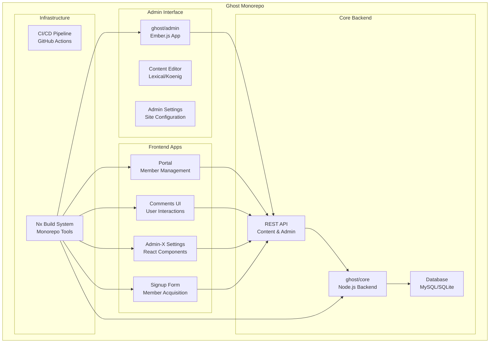
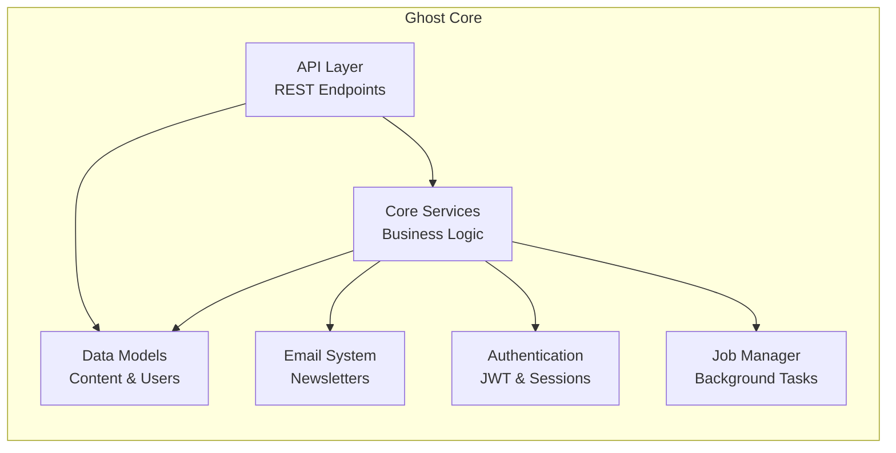
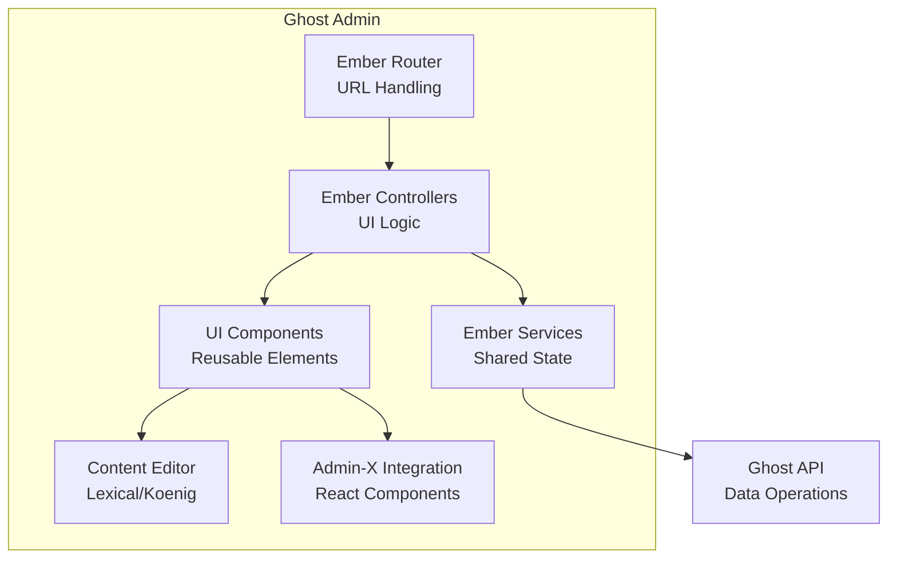
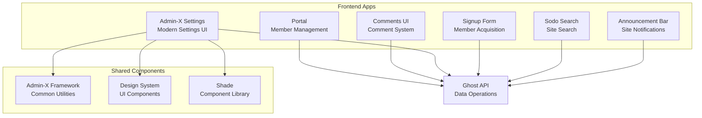
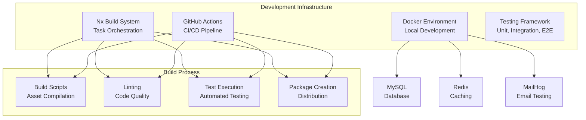
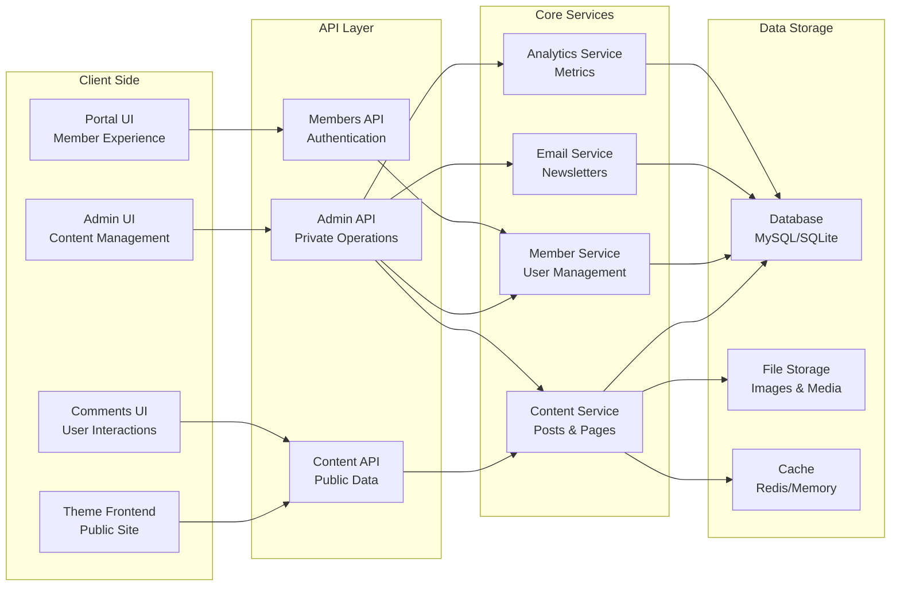

# Overview

Relevant source files

The following files were used as context for generating this wiki page:

- [.docker/Dockerfile](https://github.com/TryGhost/Ghost/blob/0d0e5bd3/.docker/Dockerfile)
- [apps/admin-x-design-system/package.json](https://github.com/TryGhost/Ghost/blob/0d0e5bd3/apps/admin-x-design-system/package.json)
- [apps/admin-x-framework/package.json](https://github.com/TryGhost/Ghost/blob/0d0e5bd3/apps/admin-x-framework/package.json)
- [apps/admin-x-settings/package.json](https://github.com/TryGhost/Ghost/blob/0d0e5bd3/apps/admin-x-settings/package.json)
- [apps/announcement-bar/package.json](https://github.com/TryGhost/Ghost/blob/0d0e5bd3/apps/announcement-bar/package.json)
- [apps/comments-ui/package.json](https://github.com/TryGhost/Ghost/blob/0d0e5bd3/apps/comments-ui/package.json)
- [apps/portal/package.json](https://github.com/TryGhost/Ghost/blob/0d0e5bd3/apps/portal/package.json)
- [apps/posts/package.json](https://github.com/TryGhost/Ghost/blob/0d0e5bd3/apps/posts/package.json)
- [apps/shade/package.json](https://github.com/TryGhost/Ghost/blob/0d0e5bd3/apps/shade/package.json)
- [apps/signup-form/package.json](https://github.com/TryGhost/Ghost/blob/0d0e5bd3/apps/signup-form/package.json)
- [apps/sodo-search/package.json](https://github.com/TryGhost/Ghost/blob/0d0e5bd3/apps/sodo-search/package.json)
- [apps/stats/package.json](https://github.com/TryGhost/Ghost/blob/0d0e5bd3/apps/stats/package.json)
- [compose.yml](https://github.com/TryGhost/Ghost/blob/0d0e5bd3/compose.yml)
- [ghost/admin/package.json](https://github.com/TryGhost/Ghost/blob/0d0e5bd3/ghost/admin/package.json)
- [ghost/core/package.json](https://github.com/TryGhost/Ghost/blob/0d0e5bd3/ghost/core/package.json)
- [package.json](https://github.com/TryGhost/Ghost/blob/0d0e5bd3/package.json)
- [yarn.lock](https://github.com/TryGhost/Ghost/blob/0d0e5bd3/yarn.lock)

This document provides a comprehensive overview of Ghost, a modern professional publishing platform built as a monorepo. It introduces the core architecture, key components, and how they interact to create a complete content management system focused on publishing, membership, and monetization.

For detailed information about specific subsystems, please refer to their dedicated wiki pages:
- For monorepo structure details, see [Monorepo Architecture](#2)
- For admin interface specifics, see [Admin Interface](#3)
- For membership and subscription features, see [Members and Subscriptions](#4)
- For content management capabilities, see [Content Management](#5)

Sources: [package.json:1-97](https://github.com/TryGhost/Ghost/blob/0d0e5bd3/package.json#L1-L97), [ghost/core/package.json:1-326](https://github.com/TryGhost/Ghost/blob/0d0e5bd3/ghost/core/package.json#L1-L326)

## What is Ghost?

Ghost is a professional publishing platform designed for blogs, newsletters, and membership sites. It provides a modern, headless CMS with a focus on performance, simplicity, and elegant content creation. Ghost is built as a Node.js application with an Ember.js admin interface and various React-based frontend applications.

Key features include:
- Content management with a modern editor
- Membership and subscription capabilities
- Newsletter and email functionality
- Analytics and audience insights
- Customizable themes

Sources: [ghost/core/package.json:1-10](https://github.com/TryGhost/Ghost/blob/0d0e5bd3/ghost/core/package.json#L1-L10), [package.json:1-10](https://github.com/TryGhost/Ghost/blob/0d0e5bd3/package.json#L1-L10)

## System Architecture

Sources: [package.json:9-13](https://github.com/TryGhost/Ghost/blob/0d0e5bd3/package.json#L9-L13), [ghost/core/package.json:1-10](https://github.com/TryGhost/Ghost/blob/0d0e5bd3/ghost/core/package.json#L1-L10), [ghost/admin/package.json:1-10](https://github.com/TryGhost/Ghost/blob/0d0e5bd3/ghost/admin/package.json#L1-L10), [apps/portal/package.json:1-10](https://github.com/TryGhost/Ghost/blob/0d0e5bd3/apps/portal/package.json#L1-L10), [apps/comments-ui/package.json:1-10](https://github.com/TryGhost/Ghost/blob/0d0e5bd3/apps/comments-ui/package.json#L1-L10), [apps/admin-x-settings/package.json:1-10](https://github.com/TryGhost/Ghost/blob/0d0e5bd3/apps/admin-x-settings/package.json#L1-L10), [apps/signup-form/package.json:1-10](https://github.com/TryGhost/Ghost/blob/0d0e5bd3/apps/signup-form/package.json#L1-L10)

## Monorepo Structure

Ghost is organized as a monorepo using Yarn workspaces and Nx for build orchestration. This structure allows for better code sharing, dependency management, and development workflow across multiple packages.

```mermaid
graph TD
    subgraph "Monorepo Root"
        Root["package.json<br>Root Configuration"]
        Workspaces["Yarn Workspaces<br>Package Management"]
        NxConfig["Nx Configuration<br>Build Orchestration"]
    end
    
    subgraph "Core Packages"
        GhostCore["ghost/core<br>Main Backend"]
        GhostAdmin["ghost/admin<br>Admin UI"]
        I18n["ghost/i18n<br>Internationalization"]
    end
    
    subgraph "Frontend Apps"
        Portal["apps/portal<br>Member Experience"]
        CommentsUI["apps/comments-ui<br>Comments System"]
        AdminXSettings["apps/admin-x-settings<br>Admin Settings"]
        AdminXFramework["apps/admin-x-framework<br>Shared Components"]
        SignupForm["apps/signup-form<br>Member Signup"]
        SodoSearch["apps/sodo-search<br>Site Search"]
        AnnouncementBar["apps/announcement-bar<br>Site Announcements"]
        Shade["apps/shade<br>Design System"]
        Stats["apps/stats<br>Analytics UI"]
        Posts["apps/posts<br>Post Management"]
    end
    
    Root --> Workspaces
    Root --> NxConfig
    Workspaces --> GhostCore
    Workspaces --> GhostAdmin
    Workspaces --> I18n
    Workspaces --> Portal
    Workspaces --> CommentsUI
    Workspaces --> AdminXSettings
    Workspaces --> AdminXFramework
    Workspaces --> SignupForm
    Workspaces --> SodoSearch
    Workspaces --> AnnouncementBar
    Workspaces --> Shade
    Workspaces --> Stats
    Workspaces --> Posts
    
    NxConfig --> GhostCore
    NxConfig --> GhostAdmin
    NxConfig --> Portal
    NxConfig --> CommentsUI
    NxConfig --> AdminXSettings
```

Sources: [package.json:9-13](https://github.com/TryGhost/Ghost/blob/0d0e5bd3/package.json#L9-L13), [package.json:277-324](https://github.com/TryGhost/Ghost/blob/0d0e5bd3/package.json#L277-L324), [ghost/core/package.json:277-324](https://github.com/TryGhost/Ghost/blob/0d0e5bd3/ghost/core/package.json#L277-L324), [ghost/admin/package.json:182-216](https://github.com/TryGhost/Ghost/blob/0d0e5bd3/ghost/admin/package.json#L182-L216)

## Core Components

### Backend (ghost/core)

The Ghost backend is a Node.js application that provides the core functionality, API endpoints, and database interactions. It handles content management, user authentication, email delivery, and more.

Key components:
- REST API for content and admin operations
- Database models and migrations
- Authentication and authorization
- Email and newsletter system
- Job scheduling and background tasks

Sources: [ghost/core/package.json:68-220](https://github.com/TryGhost/Ghost/blob/0d0e5bd3/ghost/core/package.json#L68-L220)

### Admin Interface (ghost/admin)

The Ghost admin interface is an Ember.js application that provides the content management UI, settings, and analytics dashboards. It communicates with the Ghost API to perform operations.

Key components:
- Content editor (Lexical/Koenig)
- Settings management
- Member management
- Analytics dashboards
- Theme customization

Sources: [ghost/admin/package.json:31-181](https://github.com/TryGhost/Ghost/blob/0d0e5bd3/ghost/admin/package.json#L31-L181)

### Frontend Applications

Ghost includes several standalone frontend applications built with React that provide specific functionality:

1. **Portal** - Member management UI for subscription and account management
2. **Comments UI** - Comment system for posts
3. **Admin-X Settings** - Modern React-based settings interface
4. **Signup Form** - Embeddable signup form for member acquisition
5. **Sodo Search** - Site search functionality
6. **Announcement Bar** - Site-wide announcements

Sources: [apps/portal/package.json:1-101](https://github.com/TryGhost/Ghost/blob/0d0e5bd3/apps/portal/package.json#L1-L101), [apps/comments-ui/package.json:1-85](https://github.com/TryGhost/Ghost/blob/0d0e5bd3/apps/comments-ui/package.json#L1-L85), [apps/admin-x-settings/package.json:1-80](https://github.com/TryGhost/Ghost/blob/0d0e5bd3/apps/admin-x-settings/package.json#L1-L80), [apps/signup-form/package.json:1-73](https://github.com/TryGhost/Ghost/blob/0d0e5bd3/apps/signup-form/package.json#L1-L73), [apps/sodo-search/package.json:1-92](https://github.com/TryGhost/Ghost/blob/0d0e5bd3/apps/sodo-search/package.json#L1-L92), [apps/announcement-bar/package.json:1-87](https://github.com/TryGhost/Ghost/blob/0d0e5bd3/apps/announcement-bar/package.json#L1-L87)

## Development and Deployment Infrastructure

Ghost uses a comprehensive development and deployment infrastructure to ensure code quality and streamline the development process.

Key components:
- Nx build system for monorepo orchestration
- Docker-based development environment
- GitHub Actions for CI/CD
- Testing frameworks for unit, integration, and E2E tests

Sources: [package.json:23-68](https://github.com/TryGhost/Ghost/blob/0d0e5bd3/package.json#L23-L68), [compose.yml:1-212](https://github.com/TryGhost/Ghost/blob/0d0e5bd3/compose.yml#L1-L212), [.docker/Dockerfile:1-88](https://github.com/TryGhost/Ghost/blob/0d0e5bd3/.docker/Dockerfile#L1-L88)

## Data Flow

The following diagram illustrates the data flow between different components of the Ghost platform:

Sources: [ghost/core/package.json:68-220](https://github.com/TryGhost/Ghost/blob/0d0e5bd3/ghost/core/package.json#L68-L220), [ghost/admin/package.json:31-181](https://github.com/TryGhost/Ghost/blob/0d0e5bd3/ghost/admin/package.json#L31-L181), [apps/portal/package.json:19-35](https://github.com/TryGhost/Ghost/blob/0d0e5bd3/apps/portal/package.json#L19-L35), [apps/comments-ui/package.json:45-59](https://github.com/TryGhost/Ghost/blob/0d0e5bd3/apps/comments-ui/package.json#L45-L59)

## Technology Stack

Ghost is built using a modern technology stack:

| Component | Technology |
|-----------|------------|
| Backend | Node.js, Express |
| Database | MySQL, SQLite (optional) |
| Admin UI | Ember.js |
| Frontend Apps | React |
| Build System | Nx, Yarn Workspaces |
| Caching | Redis (optional) |
| Email | SMTP, Mailgun |
| Search | Internal, Elasticsearch (optional) |
| Testing | Mocha, Playwright |
| Containerization | Docker |

Sources: [ghost/core/package.json:68-220](https://github.com/TryGhost/Ghost/blob/0d0e5bd3/ghost/core/package.json#L68-L220), [ghost/admin/package.json:31-181](https://github.com/TryGhost/Ghost/blob/0d0e5bd3/ghost/admin/package.json#L31-L181), [package.json:80-96](https://github.com/TryGhost/Ghost/blob/0d0e5bd3/package.json#L80-L96)

## Conclusion

Ghost is a comprehensive publishing platform built with a modern architecture and technology stack. Its monorepo structure allows for efficient development across multiple packages while maintaining a cohesive codebase. The platform provides a powerful set of features for content creation, membership management, and audience engagement, all accessible through a clean and intuitive user interface.