# Monorepo Architecture

<details>
<summary>Relevant source files</summary>

The following files were used as context for generating this wiki page:

- [.docker/Dockerfile](https://github.com/TryGhost/Ghost/blob/0d0e5bd3/.docker/Dockerfile)
- [.github/actions/restore-cache/action.yml](https://github.com/TryGhost/Ghost/blob/0d0e5bd3/.github/actions/restore-cache/action.yml)
- [.github/scripts/bump-version.js](https://github.com/TryGhost/Ghost/blob/0d0e5bd3/.github/scripts/bump-version.js)
- [.github/scripts/dev.js](https://github.com/TryGhost/Ghost/blob/0d0e5bd3/.github/scripts/dev.js)
- [.github/workflows/ci.yml](https://github.com/TryGhost/Ghost/blob/0d0e5bd3/.github/workflows/ci.yml)
- [apps/admin-x-design-system/package.json](https://github.com/TryGhost/Ghost/blob/0d0e5bd3/apps/admin-x-design-system/package.json)
- [apps/admin-x-framework/package.json](https://github.com/TryGhost/Ghost/blob/0d0e5bd3/apps/admin-x-framework/package.json)
- [apps/admin-x-settings/package.json](https://github.com/TryGhost/Ghost/blob/0d0e5bd3/apps/admin-x-settings/package.json)
- [apps/announcement-bar/package.json](https://github.com/TryGhost/Ghost/blob/0d0e5bd3/apps/announcement-bar/package.json)
- [apps/comments-ui/package.json](https://github.com/TryGhost/Ghost/blob/0d0e5bd3/apps/comments-ui/package.json)
- [apps/portal/package.json](https://github.com/TryGhost/Ghost/blob/0d0e5bd3/apps/portal/package.json)
- [apps/posts/package.json](https://github.com/TryGhost/Ghost/blob/0d0e5bd3/apps/posts/package.json)
- [apps/shade/package.json](https://github.com/TryGhost/Ghost/blob/0d0e5bd3/apps/shade/package.json)
- [apps/signup-form/package.json](https://github.com/TryGhost/Ghost/blob/0d0e5bd3/apps/signup-form/package.json)
- [apps/sodo-search/package.json](https://github.com/TryGhost/Ghost/blob/0d0e5bd3/apps/sodo-search/package.json)
- [apps/stats/package.json](https://github.com/TryGhost/Ghost/blob/0d0e5bd3/apps/stats/package.json)
- [compose.yml](https://github.com/TryGhost/Ghost/blob/0d0e5bd3/compose.yml)
- [ghost/admin/package.json](https://github.com/TryGhost/Ghost/blob/0d0e5bd3/ghost/admin/package.json)
- [ghost/core/package.json](https://github.com/TryGhost/Ghost/blob/0d0e5bd3/ghost/core/package.json)
- [nx.json](https://github.com/TryGhost/Ghost/blob/0d0e5bd3/nx.json)
- [package.json](https://github.com/TryGhost/Ghost/blob/0d0e5bd3/package.json)
- [yarn.lock](https://github.com/TryGhost/Ghost/blob/0d0e5bd3/yarn.lock)

</details>


This document covers Ghost's monorepo structure, build system, and development workflow that orchestrates the entire platform. The monorepo is managed using Yarn workspaces with Nx for build orchestration and dependency management.

## Workspace Structure Overview

Ghost is organized as a monorepo containing multiple packages managed by Yarn workspaces. The workspace structure separates concerns between core Ghost functionality, admin interfaces, and standalone frontend applications.

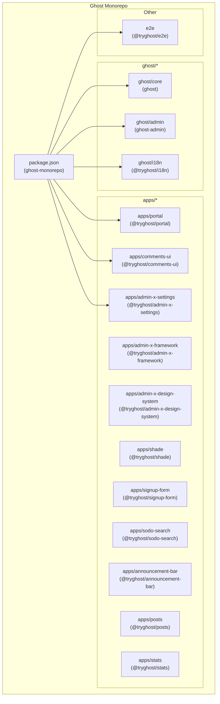

The workspace configuration is defined in the root `package.json`:

| Workspace Pattern | Description | Example Packages |
|-------------------|-------------|------------------|
| `ghost/*` | Core Ghost packages | `ghost/core`, `ghost/admin`, `ghost/i18n` |
| `apps/*` | Frontend applications and design systems | Portal, Comments UI, Admin-X components |
| `e2e` | End-to-end testing package | `@tryghost/e2e` |

Sources:
- [package.json:9-13](https://github.com/TryGhost/Ghost/blob/0d0e5bd3/package.json#L9-L13)
- [ghost/core/package.json:1-4](https://github.com/TryGhost/Ghost/blob/0d0e5bd3/ghost/core/package.json#L1-L4)
- [ghost/admin/package.json:1-4](https://github.com/TryGhost/Ghost/blob/0d0e5bd3/ghost/admin/package.json#L1-L4)
- [apps/portal/package.json:1-4](https://github.com/TryGhost/Ghost/blob/0d0e5bd3/apps/portal/package.json#L1-L4)

## Build System and Orchestration

The monorepo uses Nx for build orchestration, task execution, and dependency management between packages. Nx manages the complex dependency graph and ensures packages are built in the correct order.

### Nx Configuration

The Nx workspace is configured through `nx.json` and individual package configurations:

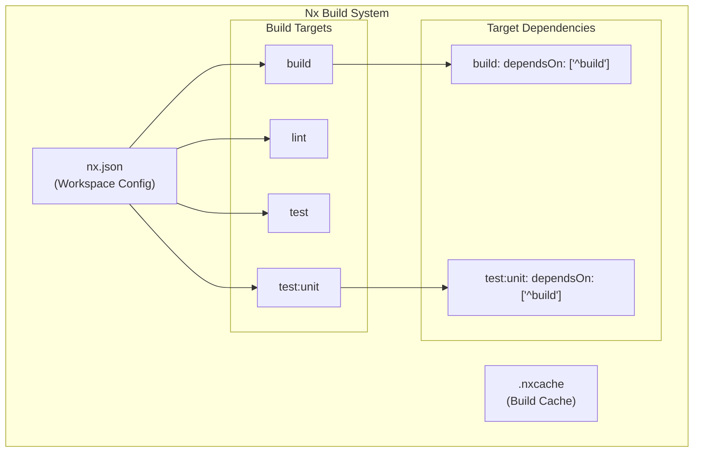

Key Nx configuration elements:

| Configuration | Purpose | File Location |
|---------------|---------|---------------|
| `namedInputs` | Define input patterns for caching | [nx.json:3-5]() |
| `targetDefaults` | Default configuration for build targets | [nx.json:7-34]() |
| `cacheDirectory` | Location for build cache | [nx.json:35]() |
| `parallel` | Number of parallel tasks | [nx.json:6]() |

### Package Dependencies

Individual packages define their Nx target dependencies to ensure proper build order:

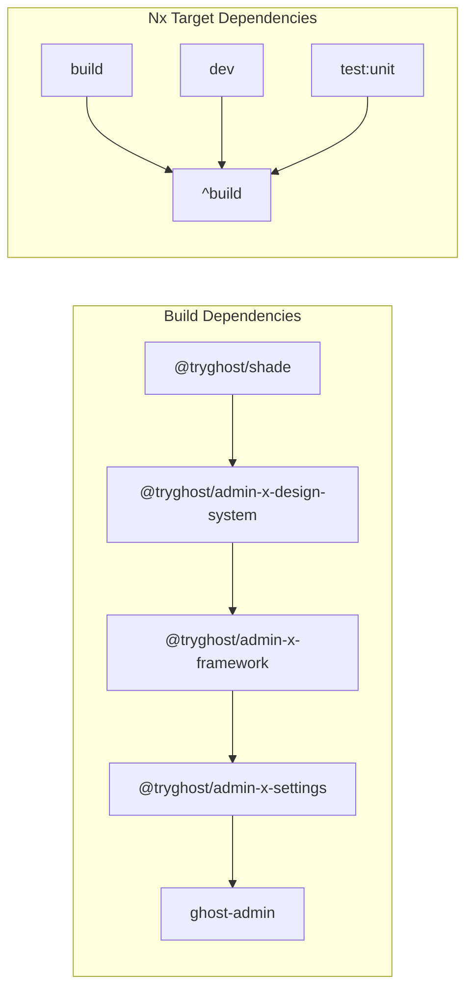

Sources:
- [nx.json:7-34](https://github.com/TryGhost/Ghost/blob/0d0e5bd3/nx.json#L7-L34)
- [apps/admin-x-settings/package.json:67-80](https://github.com/TryGhost/Ghost/blob/0d0e5bd3/apps/admin-x-settings/package.json#L67-L80)
- [apps/admin-x-framework/package.json:106-124](https://github.com/TryGhost/Ghost/blob/0d0e5bd3/apps/admin-x-framework/package.json#L106-L124)
- [ghost/admin/package.json:182-217](https://github.com/TryGhost/Ghost/blob/0d0e5bd3/ghost/admin/package.json#L182-L217)

## Development Workflow

The monorepo provides a sophisticated development workflow that orchestrates multiple applications and services concurrently. The main entry point is the `yarn dev` command, which uses a Node.js script to coordinate development processes.

### Development Script Architecture

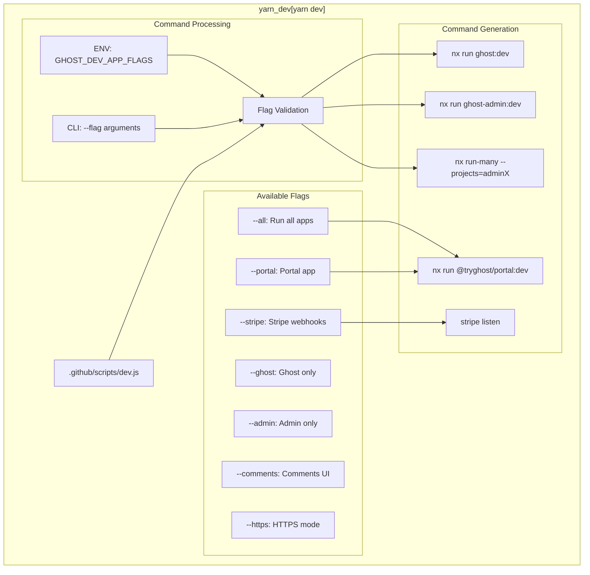

### Development Commands

| Command | Description | Configuration |
|---------|-------------|---------------|
| `yarn dev` | Start full development environment | [.github/scripts/dev.js:79-125]() |
| `yarn dev --ghost` | Ghost core only | [.github/scripts/dev.js:117-118]() |
| `yarn dev --admin` | Admin interface only | [.github/scripts/dev.js:119-120]() |
| `yarn dev --portal` | Include Portal app | [.github/scripts/dev.js:127-147]() |
| `yarn dev --all` | All applications | [.github/scripts/dev.js:26-43]() |

### Concurrency Management

The development script uses the `concurrently` package to run multiple processes:

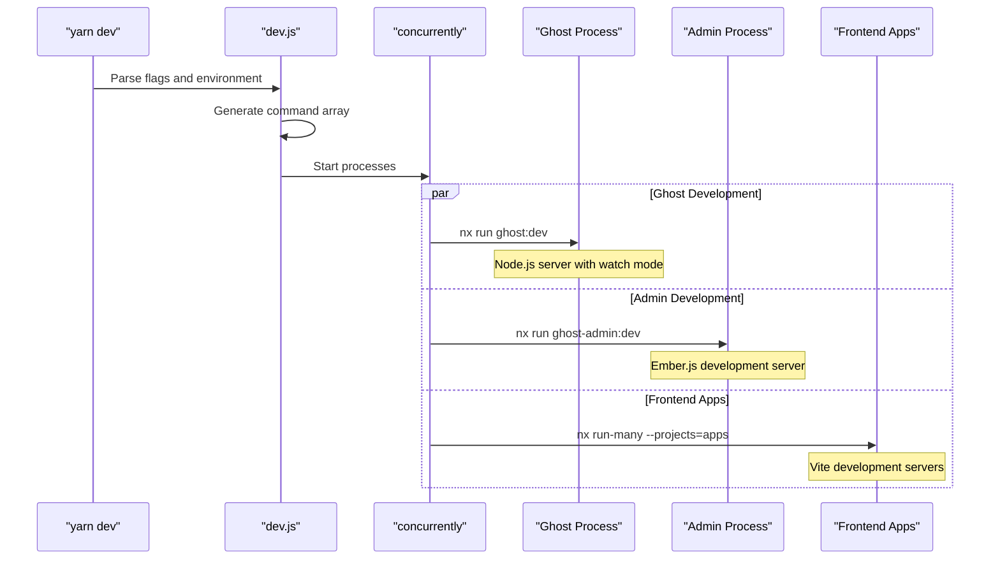

Sources:
- [.github/scripts/dev.js:79-125](https://github.com/TryGhost/Ghost/blob/0d0e5bd3/.github/scripts/dev.js#L79-L125)
- [.github/scripts/dev.js:26-43](https://github.com/TryGhost/Ghost/blob/0d0e5bd3/.github/scripts/dev.js#L26-L43)
- [package.json:28-31](https://github.com/TryGhost/Ghost/blob/0d0e5bd3/package.json#L28-L31)

## Docker Development Environment

Ghost provides a comprehensive Docker-based development environment using Docker Compose. This allows developers to run the complete stack without installing dependencies locally.

### Docker Compose Architecture

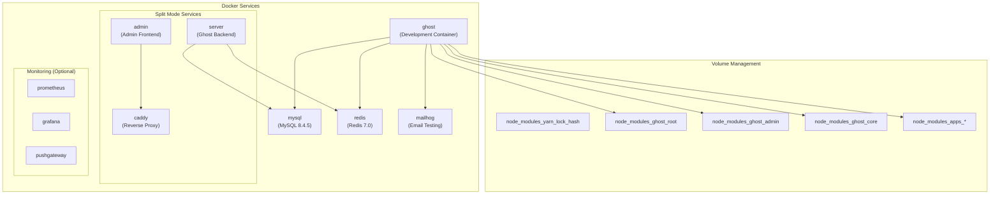

### Docker Profiles and Commands

| Command | Profile | Description |
|---------|---------|-------------|
| `yarn docker:dev` | `ghost` | Full development environment | 
| `docker compose --profile split up` | `split` | Separate server/admin containers |
| `docker compose --profile monitoring up` | `monitoring` | Add monitoring stack |

### Volume Strategy

The Docker setup uses named volumes for `node_modules` directories to optimize performance:

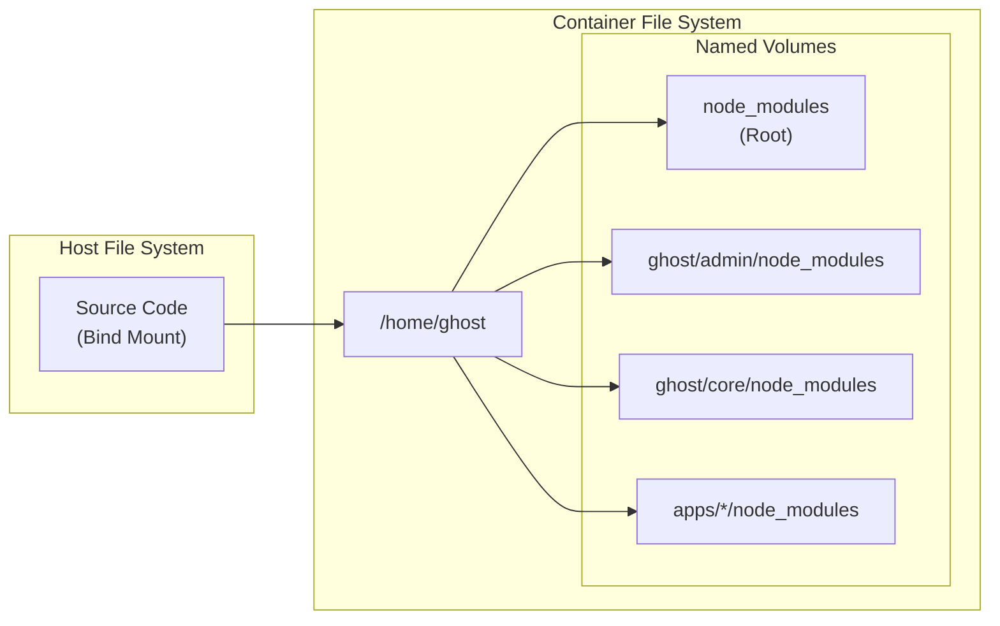

Sources:
- [compose.yml:1-213](https://github.com/TryGhost/Ghost/blob/0d0e5bd3/compose.yml#L1-L213)
- [.docker/Dockerfile:1-88](https://github.com/TryGhost/Ghost/blob/0d0e5bd3/.docker/Dockerfile#L1-L88)
- [package.json:39-53](https://github.com/TryGhost/Ghost/blob/0d0e5bd3/package.json#L39-L53)

## CI/CD Pipeline

The monorepo uses GitHub Actions for continuous integration and deployment. The pipeline is optimized for monorepo workflows with selective building and testing based on changed packages.

### Workflow Architecture

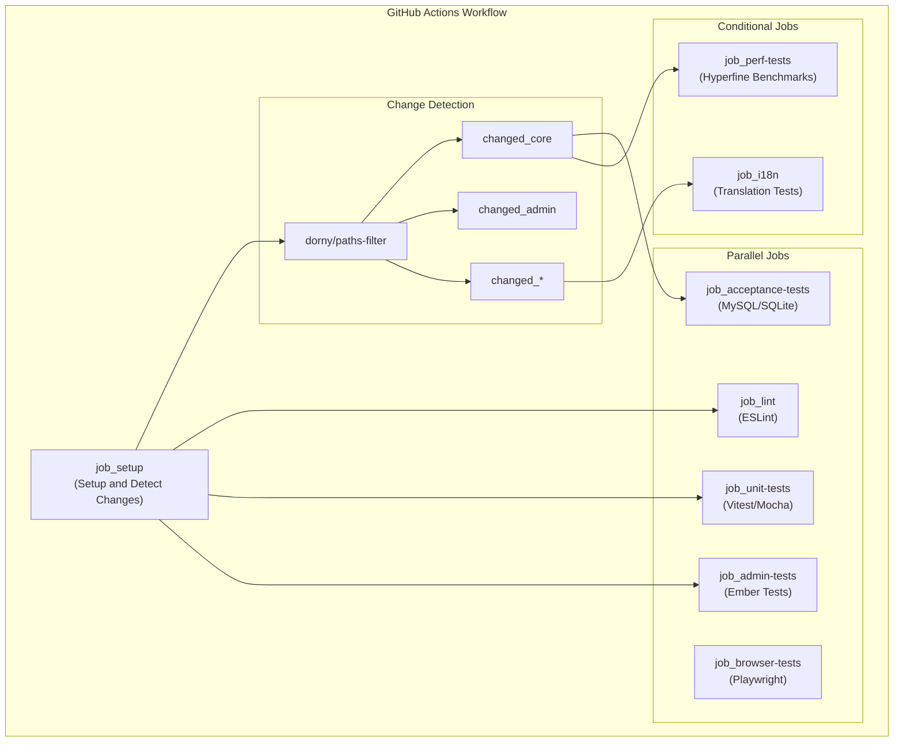

### Dependency Caching Strategy

The CI pipeline uses aggressive caching to speed up builds:

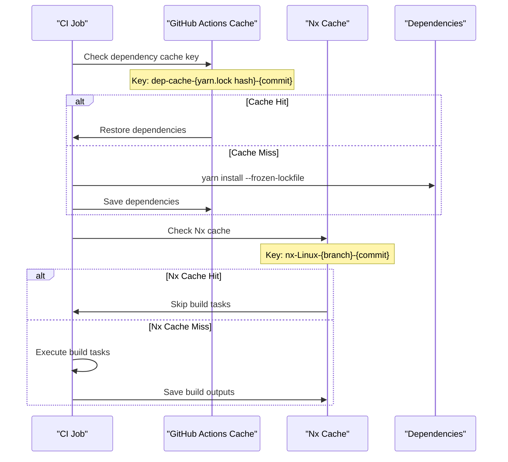

### Test Matrix Configuration

| Job | Node Versions | Databases | Conditions |
|-----|---------------|-----------|------------|
| Unit Tests | 22.13.1 | N/A | Any code changes |
| Acceptance Tests | 22.13.1 | SQLite, MySQL 8 | Core changes |
| Browser Tests | 22.13.1 | MySQL | Development branches or label |
| Admin Tests | 22.13.1 | N/A | Admin changes |

Sources:
- [.github/workflows/ci.yml:27-213](https://github.com/TryGhost/Ghost/blob/0d0e5bd3/.github/workflows/ci.yml#L27-L213)
- [.github/workflows/ci.yml:140-154](https://github.com/TryGhost/Ghost/blob/0d0e5bd3/.github/workflows/ci.yml#L140-L154)
- [.github/actions/restore-cache/action.yml:1-49](https://github.com/TryGhost/Ghost/blob/0d0e5bd3/.github/actions/restore-cache/action.yml#L1-L49)

## Package Management and Dependencies

The monorepo uses Yarn workspaces for dependency management, with sophisticated dependency resolution and shared packages across the workspace.

### Dependency Resolution

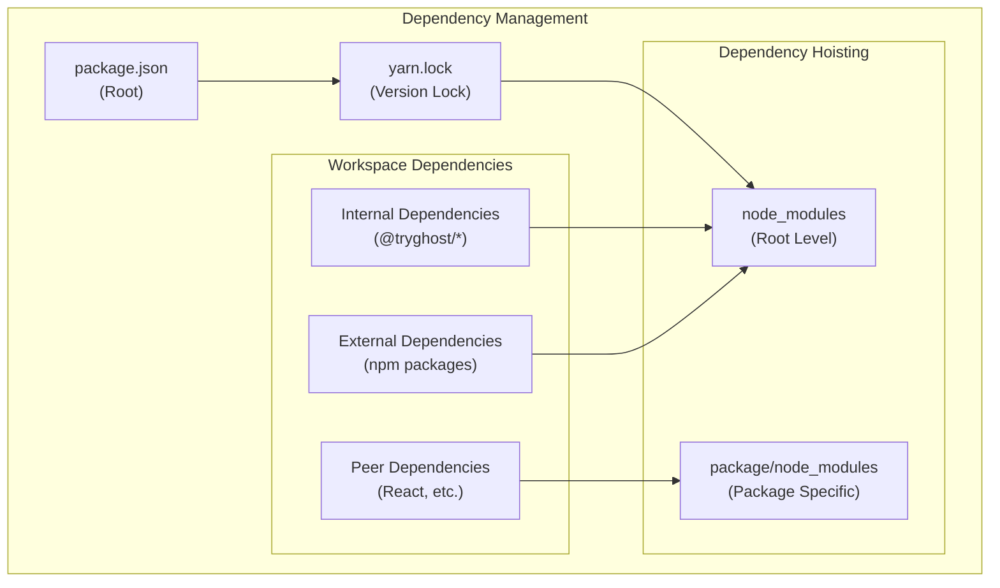

### Internal Package Dependencies

The monorepo has complex internal dependencies between packages:

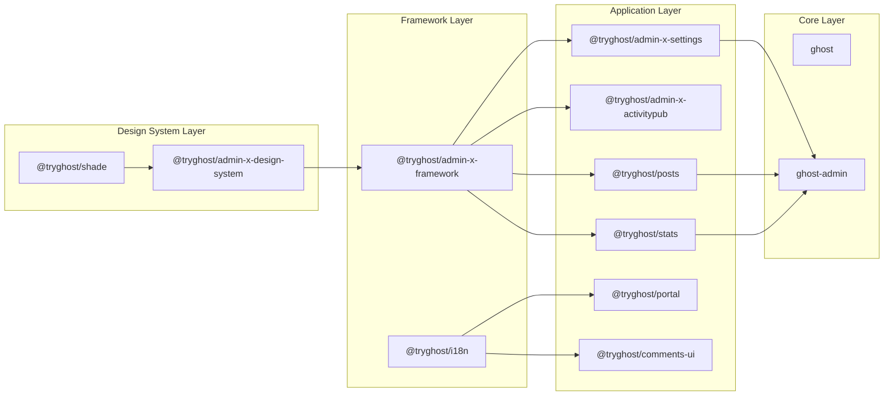

### Version Management

The monorepo uses consistent versioning across related packages:

| Package Type | Version Strategy | Example |
|--------------|------------------|---------|
| Core packages | Semantic versioning | `6.0.1` |
| Internal libraries | Workspace versioning | `0.0.0` (private) |
| Published apps | Independent versioning | `2.51.3` (Portal) |

### Resolution Overrides

Critical dependency versions are enforced through resolutions:

```json
{
  "resolutions": {
    "@tryghost/errors": "^1.3.7",
    "@tryghost/logging": "2.4.23",
    "moment": "2.24.0",
    "moment-timezone": "0.5.45"
  }
}
```

Sources:
- [package.json:70-76](https://github.com/TryGhost/Ghost/blob/0d0e5bd3/package.json#L70-L76)
- [yarn.lock:1-10](https://github.com/TryGhost/Ghost/blob/0d0e5bd3/yarn.lock#L1-L10)
- [ghost/core/package.json:270-276](https://github.com/TryGhost/Ghost/blob/0d0e5bd3/ghost/core/package.json#L270-L276)
- [apps/admin-x-settings/package.json:36-46](https://github.com/TryGhost/Ghost/blob/0d0e5bd3/apps/admin-x-settings/package.json#L36-L46)

## Build Asset Management

The monorepo handles complex asset building and management across multiple frontend applications, each with different build requirements and output formats.

### Build Output Structure

```mermaid
graph TD
    subgraph "Build Outputs"
        subgraph "Ghost Core Assets"
            CoreCSS["ghost/core/core/frontend/public/ghost.min.css"]
            CoreJS["ghost/core/core/frontend/public/ghost.min.js"]
        end
        
        subgraph "Admin Assets"
            AdminDist["ghost/admin/dist/"]
            AdminBuilt["ghost/core/core/built/admin/"]
        end
        
        subgraph "Frontend App Bundles"
            PortalUMD["apps/portal/umd/portal.min.js"]
            CommentsUMD["apps/comments-ui/umd/comments-ui.min.js"]
            SearchUMD["apps/sodo-search/umd/sodo-search.min.js"]
            SignupUMD["apps/signup-form/umd/signup-form.min.js"]
        end
        
        subgraph "Design System Libraries"
            ShadeES["apps/shade/es/"]
            AdminXDesignES["apps/admin-x-design-system/es/"]
            AdminXFrameworkDist["apps/admin-x-framework/dist/"]
        end
    end
    
    subgraph "Build Tools"
        Vite["Vite<br/>(Modern Apps)"]
        Ember["Ember CLI<br/>(Admin)"]
        PostCSS["PostCSS<br/>(Core CSS)"]
        Terser["Terser<br/>(JS Minification)"]
    end
    
    Vite --> PortalUMD
    Vite --> CommentsUMD
    Vite --> SearchUMD
    Vite --> ShadeES
    
    Ember --> AdminDist
    PostCSS --> CoreCSS
    Terser --> CoreJS
```

### Build Dependencies and Ordering

The Nx system ensures packages are built in dependency order:

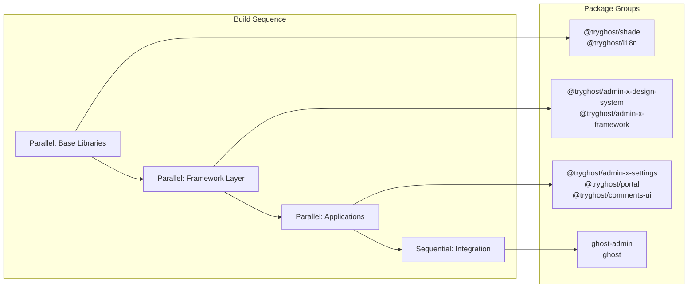

### Asset Distribution

Built assets are distributed through multiple mechanisms:

| Asset Type | Distribution Method | Example |
|------------|---------------------|---------|
| Admin Interface | Copied to core during build | [ghost/admin/package.json:198-217]() |
| Frontend Apps | CDN or local serving | UMD bundles served statically |
| Design System | NPM internal packages | ES modules for internal use |

Sources:
- [ghost/core/package.json:25-28](https://github.com/TryGhost/Ghost/blob/0d0e5bd3/ghost/core/package.json#L25-L28)
- [ghost/admin/package.json:18-26](https://github.com/TryGhost/Ghost/blob/0d0e5bd3/ghost/admin/package.json#L18-L26)
- [apps/portal/package.json:19-31](https://github.com/TryGhost/Ghost/blob/0d0e5bd3/apps/portal/package.json#L19-L31)
- [apps/comments-ui/package.json:17-32](https://github.com/TryGhost/Ghost/blob/0d0e5bd3/apps/comments-ui/package.json#L17-L32)

## Workspace Scripts and Automation

The monorepo provides comprehensive script automation for common development, testing, and maintenance tasks. These scripts coordinate activities across multiple packages in the workspace.

### Root-Level Scripts

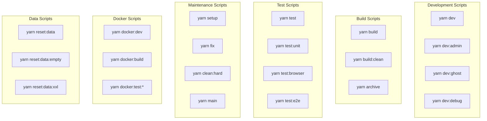

### Script Implementation Patterns

| Script Category | Implementation | Example |
|-----------------|----------------|---------|
| Development | Custom Node.js scripts | [.github/scripts/dev.js]() |
| Build | Nx run-many commands | `nx run-many -t build` |
| Test | Nx affected commands | `nx affected -t test` |
| Docker | Docker Compose commands | `docker compose run ghost` |

### Monorepo Coordination Scripts

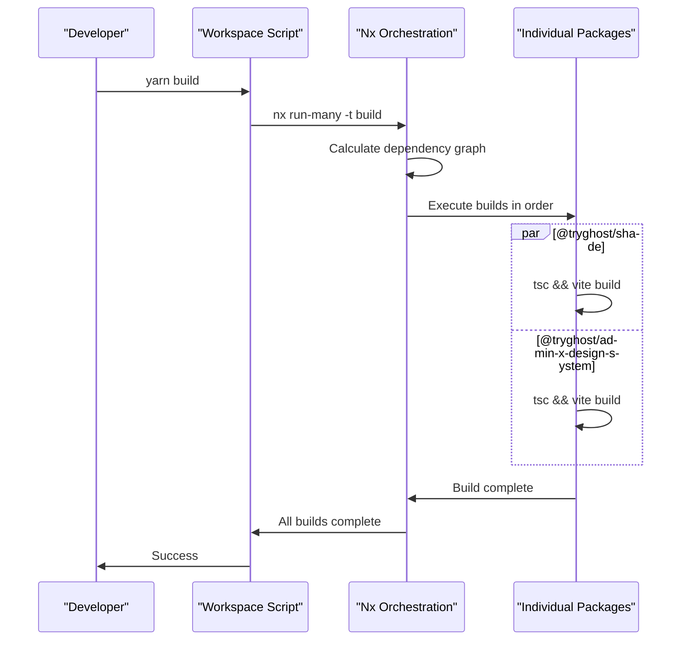

### Environment and Configuration Scripts

The workspace provides scripts for managing different environments and configurations:

| Environment | Script | Purpose |
|-------------|--------|---------|
| Development | `yarn setup` | Initialize workspace and dependencies |
| Docker | `yarn docker:dev` | Start development environment in Docker |
| Testing | `yarn test:browser` | Run browser tests with dependencies |
| Production | `yarn archive` | Build production archives |

Sources:
- [package.json:23-68](https://github.com/TryGhost/Ghost/blob/0d0e5bd3/package.json#L23-L68)
- [.github/scripts/dev.js:1-10](https://github.com/TryGhost/Ghost/blob/0d0e5bd3/.github/scripts/dev.js#L1-L10)
- [.github/scripts/bump-version.js:1-46](https://github.com/TryGhost/Ghost/blob/0d0e5bd3/.github/scripts/bump-version.js#L1-L46)

## Testing Architecture

The monorepo implements a comprehensive testing strategy with different test types optimized for monorepo workflows and coordinated through Nx.

### Test Types and Distribution

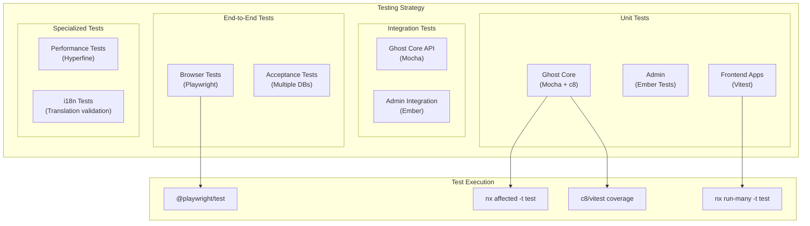

### Test Configuration Matrix

| Package Type | Test Framework | Coverage Tool | Config File |
|--------------|----------------|---------------|-------------|
| Ghost Core | Mocha | c8 | [ghost/core/package.json:30-62]() |
| Admin | Ember Test | Built-in | [ghost/admin/package.json:22-26]() |
| Frontend Apps | Vitest | @vitest/coverage-v8 | `vitest.config.ts` |
| E2E | Playwright | N/A | `playwright.config.ts` |

### CI Test Strategy

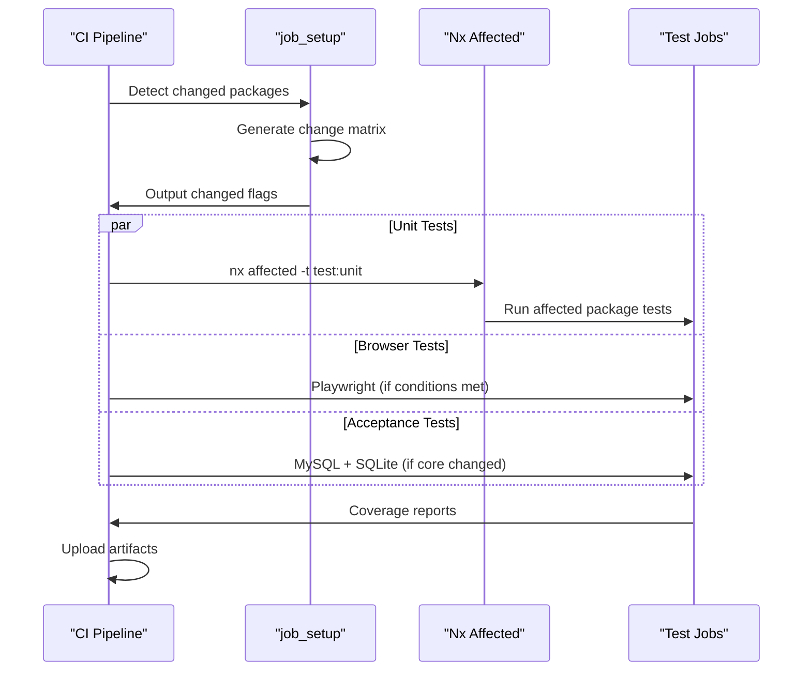

Sources:
- [.github/workflows/ci.yml:438-484](https://github.com/TryGhost/Ghost/blob/0d0e5bd3/.github/workflows/ci.yml#L438-L484)
- [.github/workflows/ci.yml:485-579](https://github.com/TryGhost/Ghost/blob/0d0e5bd3/.github/workflows/ci.yml#L485-L579)
- [ghost/core/package.json:30-50](https://github.com/TryGhost/Ghost/blob/0d0e5bd3/ghost/core/package.json#L30-L50)
- [apps/portal/package.json:24-27](https://github.com/TryGhost/Ghost/blob/0d0e5bd3/apps/portal/package.json#L24-L27)

## Configuration System

Ghost uses a layered configuration system that combines defaults, environment variables, and database-stored settings.

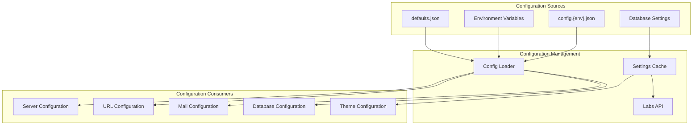

Key aspects of the configuration system:

1. **Defaults**: Base configuration in `defaults.json`
2. **Environment Overrides**: Environment variables can override configuration values
3. **Config Files**: Environment-specific config files (e.g., `config.production.json`)
4. **Settings Service**: Database-stored settings for runtime configuration
5. **Settings Cache**: In-memory cache of settings for performance

Sources:
- [ghost/core/core/shared/config/defaults.json](https://github.com/TryGhost/Ghost/blob/0d0e5bd3/ghost/core/core/shared/config/defaults.json)