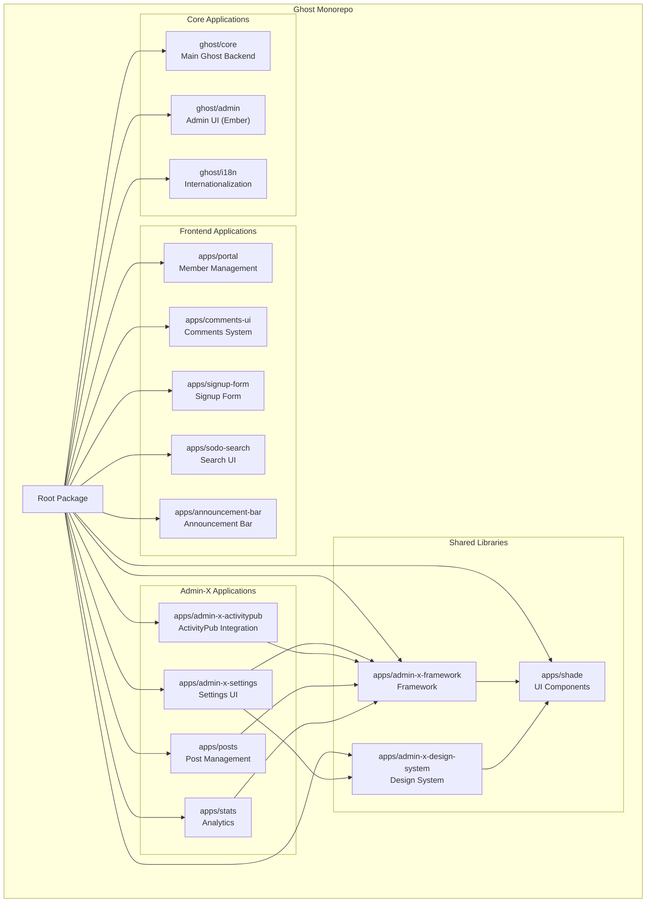
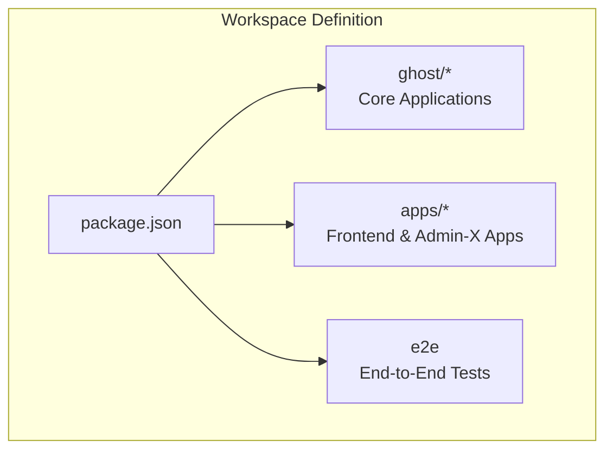
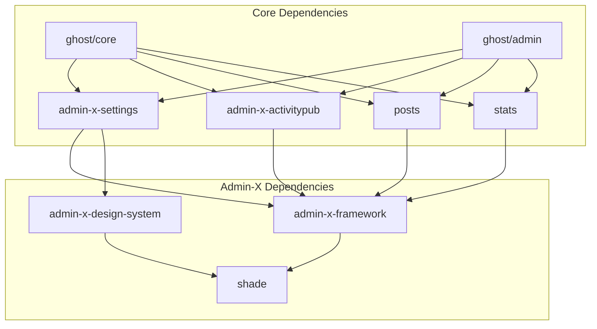
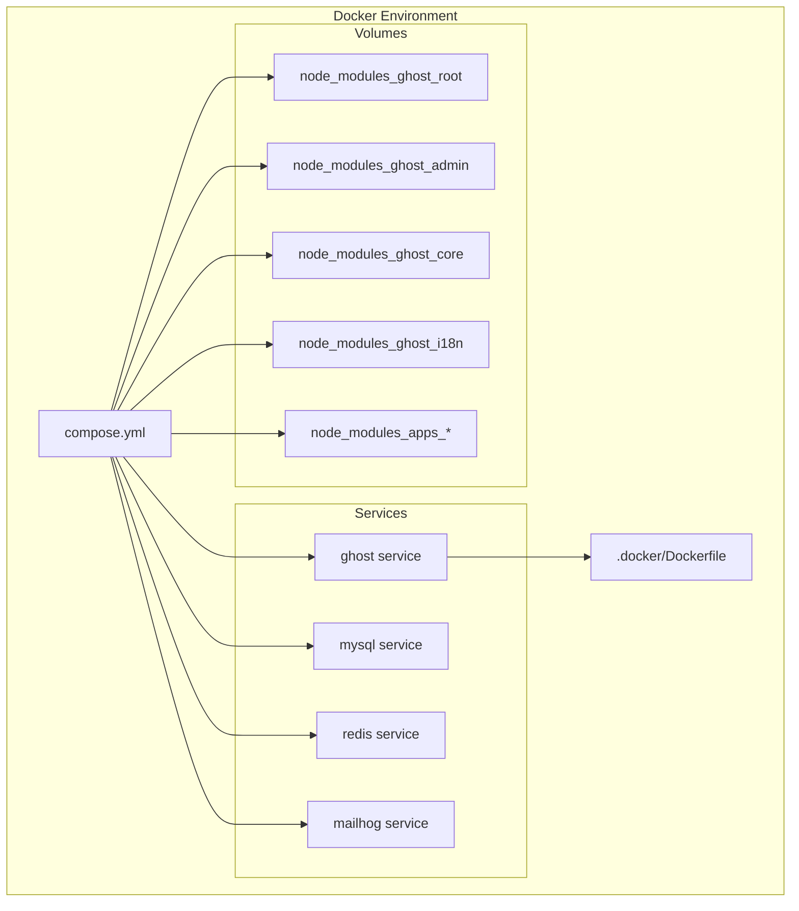

# Workspace Structure

<details>
<summary>Relevant source files</summary>

The following files were used as context for generating this wiki page:

- [.docker/Dockerfile](https://github.com/TryGhost/Ghost/blob/0d0e5bd3/.docker/Dockerfile)
- [apps/admin-x-design-system/package.json](https://github.com/TryGhost/Ghost/blob/0d0e5bd3/apps/admin-x-design-system/package.json)
- [apps/admin-x-framework/package.json](https://github.com/TryGhost/Ghost/blob/0d0e5bd3/apps/admin-x-framework/package.json)
- [apps/admin-x-settings/package.json](https://github.com/TryGhost/Ghost/blob/0d0e5bd3/apps/admin-x-settings/package.json)
- [apps/announcement-bar/package.json](https://github.com/TryGhost/Ghost/blob/0d0e5bd3/apps/announcement-bar/package.json)
- [apps/comments-ui/package.json](https://github.com/TryGhost/Ghost/blob/0d0e5bd3/apps/comments-ui/package.json)
- [apps/portal/package.json](https://github.com/TryGhost/Ghost/blob/0d0e5bd3/apps/portal/package.json)
- [apps/posts/package.json](https://github.com/TryGhost/Ghost/blob/0d0e5bd3/apps/posts/package.json)
- [apps/shade/package.json](https://github.com/TryGhost/Ghost/blob/0d0e5bd3/apps/shade/package.json)
- [apps/signup-form/package.json](https://github.com/TryGhost/Ghost/blob/0d0e5bd3/apps/signup-form/package.json)
- [apps/sodo-search/package.json](https://github.com/TryGhost/Ghost/blob/0d0e5bd3/apps/sodo-search/package.json)
- [apps/stats/package.json](https://github.com/TryGhost/Ghost/blob/0d0e5bd3/apps/stats/package.json)
- [compose.yml](https://github.com/TryGhost/Ghost/blob/0d0e5bd3/compose.yml)
- [ghost/admin/package.json](https://github.com/TryGhost/Ghost/blob/0d0e5bd3/ghost/admin/package.json)
- [ghost/core/package.json](https://github.com/TryGhost/Ghost/blob/0d0e5bd3/ghost/core/package.json)
- [package.json](https://github.com/TryGhost/Ghost/blob/0d0e5bd3/package.json)
- [yarn.lock](https://github.com/TryGhost/Ghost/blob/0d0e5bd3/yarn.lock)

</details>


This document describes the organization of Ghost's monorepo architecture, including the workspace structure, package relationships, and build system integration. It explains how the codebase is organized into workspaces and how dependencies are managed across the monorepo.

For information about the build system and CI/CD pipeline, see [Build System and CI/CD](#2.2).

## Overview of Ghost's Monorepo

Ghost uses a monorepo architecture to manage its codebase, with multiple packages organized into workspaces. This approach allows for better code sharing, dependency management, and development workflow across the platform.



Sources: [package.json:9-13](https://github.com/TryGhost/Ghost/blob/0d0e5bd3/package.json#L9-L13), [ghost/core/package.json:1-5](https://github.com/TryGhost/Ghost/blob/0d0e5bd3/ghost/core/package.json#L1-L5), [ghost/admin/package.json:1-5](https://github.com/TryGhost/Ghost/blob/0d0e5bd3/ghost/admin/package.json#L1-L5), [apps/portal/package.json:1-5](https://github.com/TryGhost/Ghost/blob/0d0e5bd3/apps/portal/package.json#L1-L5), [apps/comments-ui/package.json:1-5](https://github.com/TryGhost/Ghost/blob/0d0e5bd3/apps/comments-ui/package.json#L1-L5), [apps/admin-x-settings/package.json:1-5](https://github.com/TryGhost/Ghost/blob/0d0e5bd3/apps/admin-x-settings/package.json#L1-L5), [apps/admin-x-framework/package.json:1-5](https://github.com/TryGhost/Ghost/blob/0d0e5bd3/apps/admin-x-framework/package.json#L1-L5), [apps/admin-x-design-system/package.json:1-5](https://github.com/TryGhost/Ghost/blob/0d0e5bd3/apps/admin-x-design-system/package.json#L1-L5), [apps/shade/package.json:1-5](https://github.com/TryGhost/Ghost/blob/0d0e5bd3/apps/shade/package.json#L1-L5)

## Workspace Configuration

Ghost's monorepo is managed using Yarn workspaces, which allows for efficient dependency management and cross-package development.

### Workspace Definition

The root `package.json` defines the workspace structure:



Sources: [package.json:9-13](https://github.com/TryGhost/Ghost/blob/0d0e5bd3/package.json#L9-L13)

The workspaces are defined in the root `package.json` file:

```
"workspaces": [
  "ghost/*",
  "e2e",
  "apps/*"
]
```

This configuration tells Yarn to look for packages in the `ghost/` directory, the `e2e` directory, and the `apps/` directory.

Sources: [package.json:9-13](https://github.com/TryGhost/Ghost/blob/0d0e5bd3/package.json#L9-L13)

### Monorepo Metadata

The root `package.json` also contains metadata about the monorepo:

```
"monorepo": {
  "public": false,
  "internalPackages": true,
  "repo": "https://github.com/TryGhost/Ghost",
  "scope": "@tryghost"
}
```

This metadata indicates that:
- The monorepo is not public (`"public": false`)
- It contains internal packages (`"internalPackages": true`)
- The repository URL is `https://github.com/TryGhost/Ghost`
- The npm scope for packages is `@tryghost`

Sources: [package.json:14-19](https://github.com/TryGhost/Ghost/blob/0d0e5bd3/package.json#L14-L19)

## Package Structure

The Ghost monorepo is organized into several key directories, each containing related packages.

### Core Applications

The `ghost/` directory contains the main Ghost applications:

1. **ghost/core**: The main Ghost backend application, built with Node.js
2. **ghost/admin**: The admin interface, built with Ember.js
3. **ghost/i18n**: Internationalization resources

Sources: [ghost/core/package.json](https://github.com/TryGhost/Ghost/blob/0d0e5bd3/ghost/core/package.json), [ghost/admin/package.json](https://github.com/TryGhost/Ghost/blob/0d0e5bd3/ghost/admin/package.json)

### Frontend Applications

The `apps/` directory contains various frontend applications:

1. **apps/portal**: Member management portal
2. **apps/comments-ui**: Comments system
3. **apps/signup-form**: Signup form widget
4. **apps/sodo-search**: Search functionality
5. **apps/announcement-bar**: Announcement bar widget

Sources: [apps/portal/package.json](https://github.com/TryGhost/Ghost/blob/0d0e5bd3/apps/portal/package.json), [apps/comments-ui/package.json](https://github.com/TryGhost/Ghost/blob/0d0e5bd3/apps/comments-ui/package.json), [apps/signup-form/package.json](https://github.com/TryGhost/Ghost/blob/0d0e5bd3/apps/signup-form/package.json), [apps/sodo-search/package.json](https://github.com/TryGhost/Ghost/blob/0d0e5bd3/apps/sodo-search/package.json), [apps/announcement-bar/package.json](https://github.com/TryGhost/Ghost/blob/0d0e5bd3/apps/announcement-bar/package.json)

### Admin-X Applications

The `apps/` directory also contains Admin-X applications, which are modern React-based replacements for parts of the admin interface:

1. **apps/admin-x-settings**: Settings management UI
2. **apps/admin-x-activitypub**: ActivityPub integration
3. **apps/posts**: Post management
4. **apps/stats**: Analytics and statistics

Sources: [apps/admin-x-settings/package.json](https://github.com/TryGhost/Ghost/blob/0d0e5bd3/apps/admin-x-settings/package.json), [apps/posts/package.json](https://github.com/TryGhost/Ghost/blob/0d0e5bd3/apps/posts/package.json), [apps/stats/package.json](https://github.com/TryGhost/Ghost/blob/0d0e5bd3/apps/stats/package.json)

### Shared Libraries

Several packages in the `apps/` directory serve as shared libraries:

1. **apps/admin-x-design-system**: UI components and design system
2. **apps/admin-x-framework**: Framework for Admin-X applications
3. **apps/shade**: UI component library

Sources: [apps/admin-x-design-system/package.json](https://github.com/TryGhost/Ghost/blob/0d0e5bd3/apps/admin-x-design-system/package.json), [apps/admin-x-framework/package.json](https://github.com/TryGhost/Ghost/blob/0d0e5bd3/apps/admin-x-framework/package.json), [apps/shade/package.json](https://github.com/TryGhost/Ghost/blob/0d0e5bd3/apps/shade/package.json)

## Package Dependencies

The packages in the Ghost monorepo have complex dependency relationships. Here's a visualization of the key dependencies:



Sources: [ghost/admin/package.json:182-216](https://github.com/TryGhost/Ghost/blob/0d0e5bd3/ghost/admin/package.json#L182-L216), [apps/admin-x-settings/package.json:67-80](https://github.com/TryGhost/Ghost/blob/0d0e5bd3/apps/admin-x-settings/package.json#L67-L80), [apps/admin-x-framework/package.json:106-124](https://github.com/TryGhost/Ghost/blob/0d0e5bd3/apps/admin-x-framework/package.json#L106-L124), [apps/shade/package.json:116-134](https://github.com/TryGhost/Ghost/blob/0d0e5bd3/apps/shade/package.json#L116-L134)

### Dependency Management with Nx

Ghost uses Nx to manage dependencies between packages. Nx targets are defined in each package's `package.json` file to specify build dependencies.

For example, in `ghost/admin/package.json`:

```json
"nx": {
  "targets": {
    "build": {
      "outputs": [
        "{projectRoot}/dist",
        "{workspaceRoot}/ghost/core/core/built/admin"
      ],
      "dependsOn": [
        "build",
        {
          "projects": [
            "@tryghost/admin-x-settings",
            "@tryghost/admin-x-activitypub",
            "@tryghost/posts",
            "@tryghost/stats"
          ],
          "target": "build"
        }
      ]
    }
  }
}
```

This configuration ensures that when the admin package is built, it first builds the Admin-X packages it depends on.

Sources: [ghost/admin/package.json:182-216](https://github.com/TryGhost/Ghost/blob/0d0e5bd3/ghost/admin/package.json#L182-L216), [ghost/core/package.json:277-324](https://github.com/TryGhost/Ghost/blob/0d0e5bd3/ghost/core/package.json#L277-L324)

Similarly, Admin-X packages define their build dependencies:

```json
"nx": {
  "targets": {
    "build": {
      "dependsOn": [
        "^build"
      ]
    }
  }
}
```

The `^build` syntax tells Nx to build all dependencies before building the current package.

Sources: [apps/admin-x-framework/package.json:106-124](https://github.com/TryGhost/Ghost/blob/0d0e5bd3/apps/admin-x-framework/package.json#L106-L124), [apps/shade/package.json:116-134](https://github.com/TryGhost/Ghost/blob/0d0e5bd3/apps/shade/package.json#L116-L134)

## Docker Development Environment

Ghost provides a Docker-based development environment that mirrors the workspace structure.



Sources: [compose.yml](https://github.com/TryGhost/Ghost/blob/0d0e5bd3/compose.yml), [.docker/Dockerfile](https://github.com/TryGhost/Ghost/blob/0d0e5bd3/.docker/Dockerfile)

The Docker environment is defined in `compose.yml` and includes:

1. **Services**:
   - `ghost`: The main Ghost application
   - `mysql`: MySQL database
   - `redis`: Redis cache
   - `mailhog`: Email testing service

2. **Volumes**:
   - Separate volumes for node_modules in each workspace
   - Mounted source code directories

Sources: [compose.yml:38-191](https://github.com/TryGhost/Ghost/blob/0d0e5bd3/compose.yml#L38-L191)

The Docker setup ensures that each workspace's dependencies are properly isolated while allowing for shared development.

Sources: [compose.yml:192-212](https://github.com/TryGhost/Ghost/blob/0d0e5bd3/compose.yml#L192-L212), [.docker/Dockerfile:48-80](https://github.com/TryGhost/Ghost/blob/0d0e5bd3/.docker/Dockerfile#L48-L80)

## Development Workflow

The monorepo structure supports various development workflows:

### Running the Application

The root `package.json` provides scripts for running the application:

- `yarn dev`: Run the entire Ghost application
- `yarn dev:admin`: Run only the admin interface
- `yarn dev:ghost`: Run only the Ghost backend

Sources: [package.json:28-31](https://github.com/TryGhost/Ghost/blob/0d0e5bd3/package.json#L28-L31)

### Building Packages

Each package has its own build script:

- `yarn build`: Build all packages
- `yarn workspace <package-name> build`: Build a specific package

Sources: [package.json:25](https://github.com/TryGhost/Ghost/blob/0d0e5bd3/package.json#L25), [ghost/core/package.json:25-28](https://github.com/TryGhost/Ghost/blob/0d0e5bd3/ghost/core/package.json#L25-L28), [ghost/admin/package.json:20](https://github.com/TryGhost/Ghost/blob/0d0e5bd3/ghost/admin/package.json#L20)

### Testing

Testing scripts are available at both the root level and within individual packages:

- `yarn test`: Run all tests
- `yarn test:unit`: Run unit tests
- `yarn test:e2e`: Run end-to-end tests
- `yarn test:browser`: Run browser tests

Sources: [package.json:55-58](https://github.com/TryGhost/Ghost/blob/0d0e5bd3/package.json#L55-L58), [ghost/core/package.json:30-50](https://github.com/TryGhost/Ghost/blob/0d0e5bd3/ghost/core/package.json#L30-L50)

## Conclusion

Ghost's monorepo structure provides a well-organized approach to managing the codebase. By dividing the application into workspaces, Ghost achieves better code sharing, dependency management, and development workflow. The use of Yarn workspaces and Nx helps coordinate builds and dependencies across the monorepo.