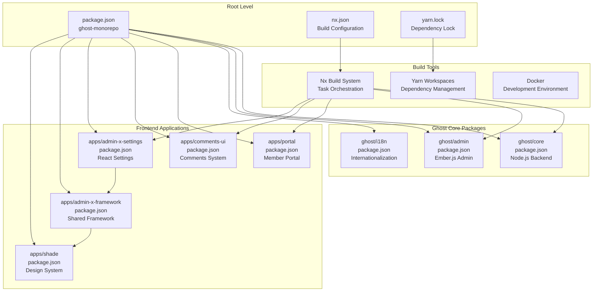
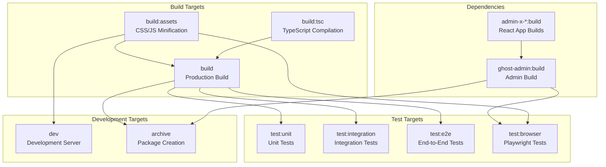
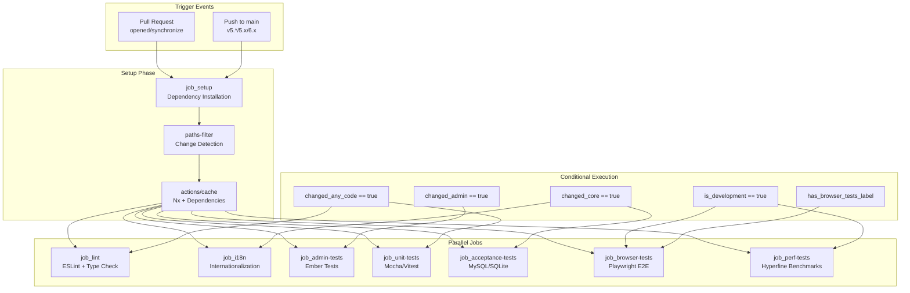
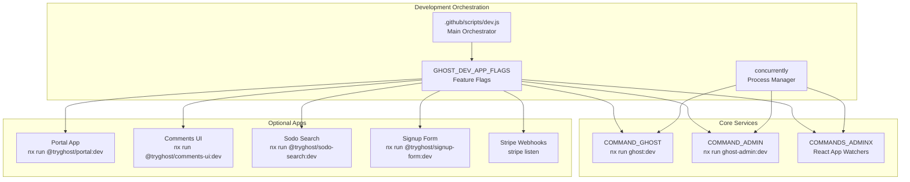
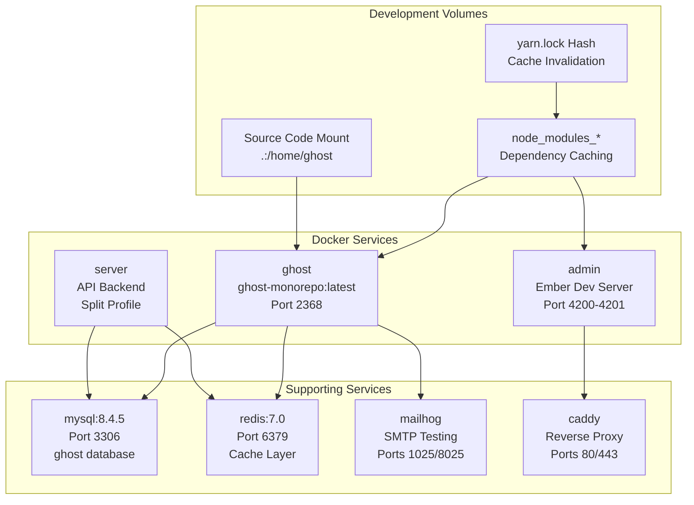
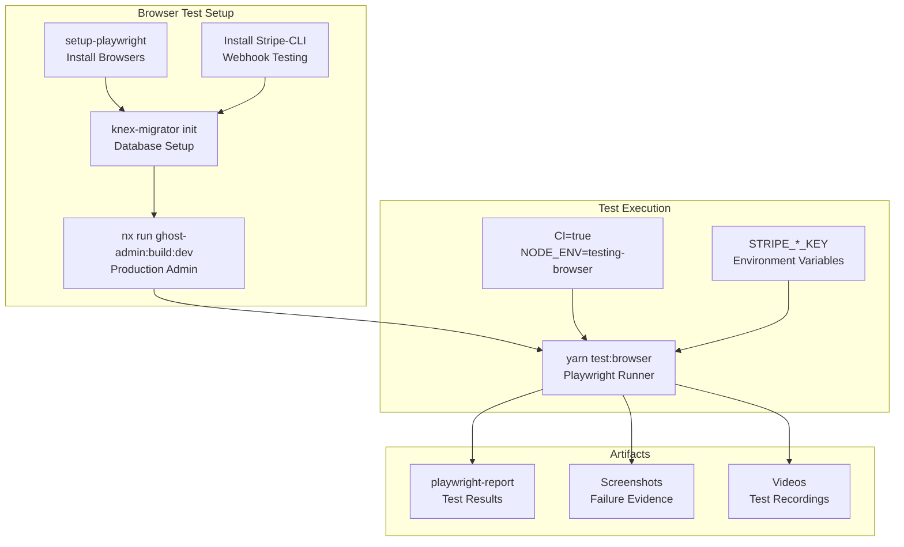

# Build System and CI/CD

<details>
<summary>Relevant source files</summary>

The following files were used as context for generating this wiki page:

- [.docker/Dockerfile](https://github.com/TryGhost/Ghost/blob/0d0e5bd3/.docker/Dockerfile)
- [.github/actions/restore-cache/action.yml](https://github.com/TryGhost/Ghost/blob/0d0e5bd3/.github/actions/restore-cache/action.yml)
- [.github/scripts/bump-version.js](https://github.com/TryGhost/Ghost/blob/0d0e5bd3/.github/scripts/bump-version.js)
- [.github/scripts/dev.js](https://github.com/TryGhost/Ghost/blob/0d0e5bd3/.github/scripts/dev.js)
- [.github/workflows/ci.yml](https://github.com/TryGhost/Ghost/blob/0d0e5bd3/.github/workflows/ci.yml)
- [apps/admin-x-design-system/package.json](https://github.com/TryGhost/Ghost/blob/0d0e5bd3/apps/admin-x-design-system/package.json)
- [apps/admin-x-framework/package.json](https://github.com/TryGhost/Ghost/blob/0d0e5bd3/apps/admin-x-framework/package.json)
- [apps/admin-x-settings/package.json](https://github.com/TryGhost/Ghost/blob/0d0e5bd3/apps/admin-x-settings/package.json)
- [apps/announcement-bar/package.json](https://github.com/TryGhost/Ghost/blob/0d0e5bd3/apps/announcement-bar/package.json)
- [apps/comments-ui/package.json](https://github.com/TryGhost/Ghost/blob/0d0e5bd3/apps/comments-ui/package.json)
- [apps/portal/package.json](https://github.com/TryGhost/Ghost/blob/0d0e5bd3/apps/portal/package.json)
- [apps/posts/package.json](https://github.com/TryGhost/Ghost/blob/0d0e5bd3/apps/posts/package.json)
- [apps/shade/package.json](https://github.com/TryGhost/Ghost/blob/0d0e5bd3/apps/shade/package.json)
- [apps/signup-form/package.json](https://github.com/TryGhost/Ghost/blob/0d0e5bd3/apps/signup-form/package.json)
- [apps/sodo-search/package.json](https://github.com/TryGhost/Ghost/blob/0d0e5bd3/apps/sodo-search/package.json)
- [apps/stats/package.json](https://github.com/TryGhost/Ghost/blob/0d0e5bd3/apps/stats/package.json)
- [compose.yml](https://github.com/TryGhost/Ghost/blob/0d0e5bd3/compose.yml)
- [ghost/admin/package.json](https://github.com/TryGhost/Ghost/blob/0d0e5bd3/ghost/admin/package.json)
- [ghost/core/package.json](https://github.com/TryGhost/Ghost/blob/0d0e5bd3/ghost/core/package.json)
- [nx.json](https://github.com/TryGhost/Ghost/blob/0d0e5bd3/nx.json)
- [package.json](https://github.com/TryGhost/Ghost/blob/0d0e5bd3/package.json)
- [yarn.lock](https://github.com/TryGhost/Ghost/blob/0d0e5bd3/yarn.lock)

</details>


This document covers the build system, task orchestration, and continuous integration/continuous deployment (CI/CD) infrastructure for the Ghost monorepo. The system coordinates builds across multiple packages using Nx, manages dependencies with Yarn workspaces, and automates testing and deployment through GitHub Actions.

For information about the overall monorepo structure and workspace organization, see [Workspace Structure](#2.1). For details about the application boot process and service initialization, see [Boot Process and Configuration](#2.3).

## Architecture Overview

The Ghost monorepo uses a sophisticated build system that combines Yarn workspaces for dependency management with Nx for task orchestration and caching.

### Monorepo Build Architecture



Sources: [package.json:9-13](https://github.com/TryGhost/Ghost/blob/0d0e5bd3/package.json#L9-L13), [nx.json:1-36](https://github.com/TryGhost/Ghost/blob/0d0e5bd3/nx.json#L1-L36), [ghost/core/package.json:277-325](https://github.com/TryGhost/Ghost/blob/0d0e5bd3/ghost/core/package.json#L277-L325), [ghost/admin/package.json:182-217](https://github.com/TryGhost/Ghost/blob/0d0e5bd3/ghost/admin/package.json#L182-L217), [apps/admin-x-settings/package.json:67-80](https://github.com/TryGhost/Ghost/blob/0d0e5bd3/apps/admin-x-settings/package.json#L67-L80)

## Nx Build Orchestration

Nx provides task orchestration, dependency management, and intelligent caching across the monorepo. The system defines target configurations that specify how builds, tests, and other tasks should be executed.

### Task Dependency Graph



Sources: [nx.json:7-33](https://github.com/TryGhost/Ghost/blob/0d0e5bd3/nx.json#L7-L33), [ghost/core/package.json:278-324](https://github.com/TryGhost/Ghost/blob/0d0e5bd3/ghost/core/package.json#L278-L324), [ghost/admin/package.json:198-215](https://github.com/TryGhost/Ghost/blob/0d0e5bd3/ghost/admin/package.json#L198-L215)

### Nx Configuration

The Nx configuration defines caching strategies and target defaults:

| Target | Cache | Inputs | Outputs |
|--------|-------|---------|---------|
| `build` | ✓ | Project files, env vars | `dist/`, `es/`, `types/`, `umd/` |
| `lint` | ✓ | Source files | ESLint cache |
| `test` | ✓ | Test files | Coverage reports |
| `test:unit` | ✓ | Unit test files | Unit coverage |

Sources: [nx.json:7-33](https://github.com/TryGhost/Ghost/blob/0d0e5bd3/nx.json#L7-L33)

## CI/CD Pipeline

The GitHub Actions CI/CD pipeline provides comprehensive testing, building, and deployment automation across multiple environments and Node.js versions.

### GitHub Actions Workflow



Sources: [.github/workflows/ci.yml:1-700](https://github.com/TryGhost/Ghost/blob/0d0e5bd3/.github/workflows/ci.yml#L1-L700)

### Job Configuration Matrix

The CI pipeline supports multiple environments and configurations:

| Job | Matrix | Conditions |
|-----|--------|------------|
| `job_unit-tests` | Node 22.13.1 | `changed_any_code == true` |
| `job_acceptance-tests` | Node 22.13.1, MySQL8/SQLite3 | `changed_core == true` |
| `job_browser-tests` | Latest Ubuntu | Development branches or label |
| `job_perf-tests` | 4-core Ubuntu | `changed_core && is_development` |

Sources: [.github/workflows/ci.yml:438-540](https://github.com/TryGhost/Ghost/blob/0d0e5bd3/.github/workflows/ci.yml#L438-L540)

## Development Workflow

The development environment supports both local and Docker-based workflows with hot reloading and service orchestration.

### Development Script Architecture



Sources: [.github/scripts/dev.js:1-300](https://github.com/TryGhost/Ghost/blob/0d0e5bd3/.github/scripts/dev.js#L1-L300)

### Docker Development Setup

The Docker development environment provides consistent tooling and database setup:



Sources: [compose.yml:1-213](https://github.com/TryGhost/Ghost/blob/0d0e5bd3/compose.yml#L1-L213), [.docker/Dockerfile:1-88](https://github.com/TryGhost/Ghost/blob/0d0e5bd3/.docker/Dockerfile#L1-L88)

## Testing Strategy

The testing infrastructure covers multiple layers from unit tests to full browser automation, with parallel execution and coverage reporting.

### Test Execution Matrix

| Test Type | Runner | Coverage | Database | Parallel |
|-----------|---------|----------|----------|----------|
| Unit Tests | Mocha/Vitest | c8 | None | ✓ |
| Integration | Mocha | c8 | SQLite | Limited |
| E2E | Mocha | c8 | SQLite/MySQL | Limited |
| Browser | Playwright | None | MySQL | Limited |
| Admin | Ember Exam | Ember Coverage | None | ✓ |

Sources: [ghost/core/package.json:30-50](https://github.com/TryGhost/Ghost/blob/0d0e5bd3/ghost/core/package.json#L30-L50), [.github/workflows/ci.yml:272-385](https://github.com/TryGhost/Ghost/blob/0d0e5bd3/.github/workflows/ci.yml#L272-L385)

### Playwright Browser Testing

The browser test setup provides comprehensive E2E testing with Stripe integration:



Sources: [.github/workflows/ci.yml:313-386](https://github.com/TryGhost/Ghost/blob/0d0e5bd3/.github/workflows/ci.yml#L313-L386), [ghost/core/package.json:40-43](https://github.com/TryGhost/Ghost/blob/0d0e5bd3/ghost/core/package.json#L40-L43)

## Caching Strategy

The build system employs multiple layers of caching to optimize build times and reduce redundant work.

### Multi-Level Caching Architecture

| Cache Type | Scope | Key Strategy | Storage |
|------------|-------|--------------|---------|
| Nx Cache | Build Tasks | Content Hash | `.nxcache/` |
| GitHub Actions | Dependencies | `yarn.lock` Hash | GitHub Cache API |
| GitHub Actions | Nx Cache | Branch + Commit | GitHub Cache API |
| Docker | Node Modules | Volume Mounts | Docker Volumes |
| Yarn | Packages | Offline Cache | `~/.yarn/cache` |

Sources: [nx.json:35](https://github.com/TryGhost/Ghost/blob/0d0e5bd3/nx.json#L35), [.github/workflows/ci.yml:155-172](https://github.com/TryGhost/Ghost/blob/0d0e5bd3/.github/workflows/ci.yml#L155-L172), [compose.yml:196-212](https://github.com/TryGhost/Ghost/blob/0d0e5bd3/compose.yml#L196-L212)

### Cache Invalidation Strategy

```mermaid
graph TB
    subgraph "Cache Keys"
        DepCache[dep-cache-{yarn.lock-hash}-{commit}]
        NxCache[nx-Linux-{branch}-{commit}]
        ESLintCache[eslint-cache]
        PlaywrightCache[~/.cache/ms-playwright/]
    end
    
    subgraph "Invalidation Triggers"
        YarnLockChange[yarn.lock Modified]
        SourceChange[Source Code Modified]
        BranchChange[Branch Switch]
        NodeModulesChange[Dependencies Updated]
    end
    
    subgraph "Restoration Strategy"
        ExactMatch[Exact Cache Hit]
        FallbackRestore[Restore Keys Fallback]
        FreshInstall[yarn install --frozen-lockfile]
    end
    
    YarnLockChange --> DepCache
    SourceChange --> NxCache
    BranchChange --> NxCache
    NodeModulesChange --> DepCache
    
    DepCache --> ExactMatch
    ExactMatch --> FallbackRestore
    FallbackRestore --> FreshInstall
```

Sources: [.github/workflows/ci.yml:140-173](https://github.com/TryGhost/Ghost/blob/0d0e5bd3/.github/workflows/ci.yml#L140-L173), [.github/actions/restore-cache/action.yml:1-49](https://github.com/TryGhost/Ghost/blob/0d0e5bd3/.github/actions/restore-cache/action.yml#L1-L49)

## Version Management and Release

The release process includes automated version bumping, Docker image building, and package publishing with semantic versioning support.

### Version Bumping Strategy

The version management system handles different release types through the `bump-version.js` script:

```mermaid
graph TB
    subgraph "Version Types"
        Canary[Canary Release<br/>canary flag]
        Six[Six Release<br/>six flag]
        Production[Production Release<br/>git describe]
    end
    
    subgraph "Version Calculation"
        GetCommit[git rev-parse --short HEAD]
        GetVersion[git describe --long HEAD]
        SemverInc[semver.inc(version, 'minor')]
    end
    
    subgraph "Version Format"
        CanaryFormat[{bumped-version}-pre-g{commit}+moya]
        SixFormat[{bumped-version}-pre-g{commit}+moya]
        ProdFormat[{git-version}+moya]
    end
    
    subgraph "Package Updates"
        CorePackage[ghost/core/package.json]
        AdminPackage[ghost/admin/package.json]
        ActionOutput[@actions/core setOutput]
    end
    
    Canary --> SemverInc
    Six --> SemverInc
    Production --> GetVersion
    
    SemverInc --> GetCommit
    GetVersion --> CanaryFormat
    GetCommit --> CanaryFormat
    GetCommit --> SixFormat
    GetVersion --> ProdFormat
    
    CanaryFormat --> CorePackage
    SixFormat --> CorePackage
    ProdFormat --> CorePackage
    CorePackage --> AdminPackage
    AdminPackage --> ActionOutput
```

Sources: [.github/scripts/bump-version.js:1-46](https://github.com/TryGhost/Ghost/blob/0d0e5bd3/.github/scripts/bump-version.js#L1-L46)