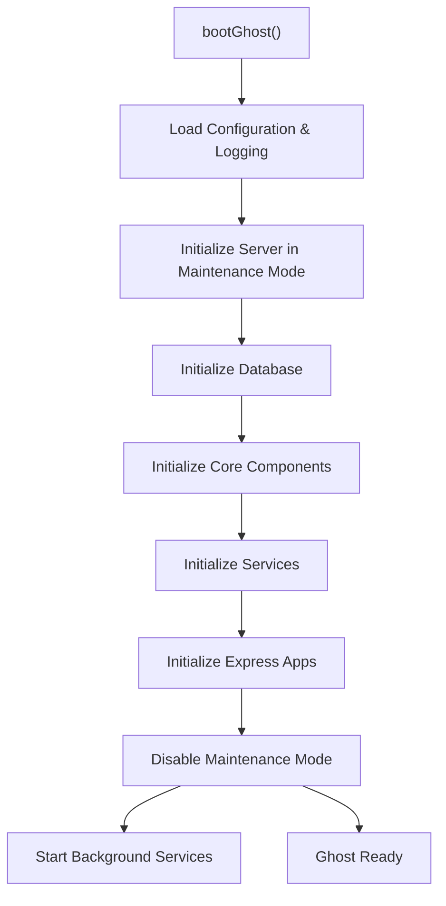
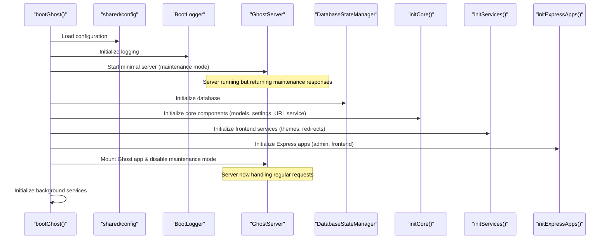
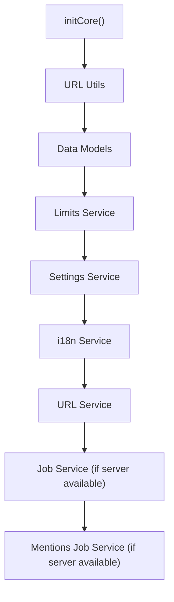
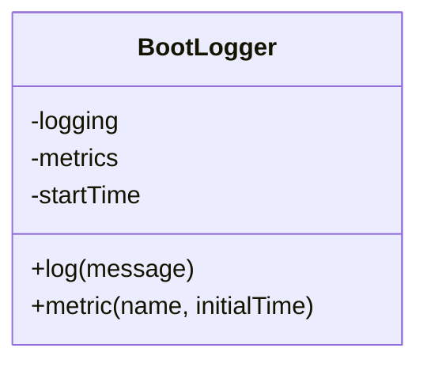
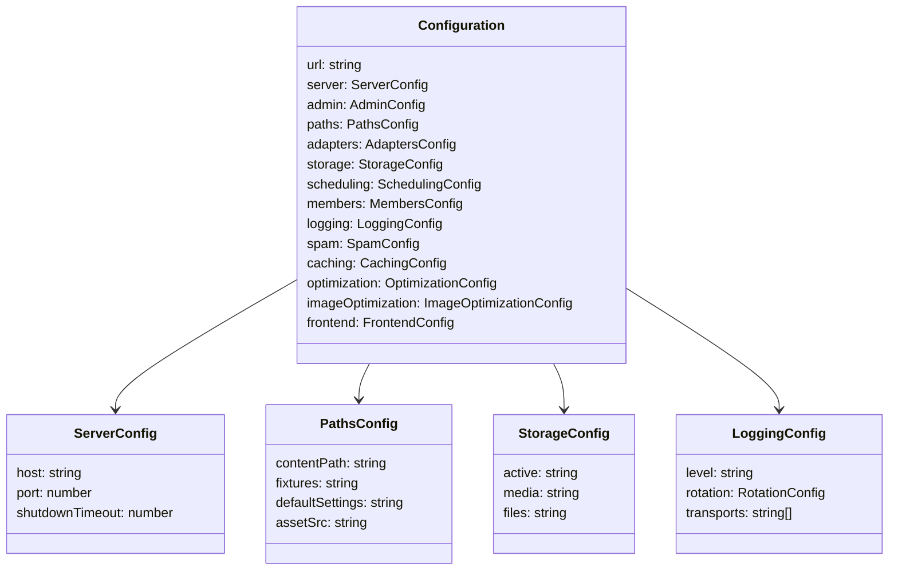
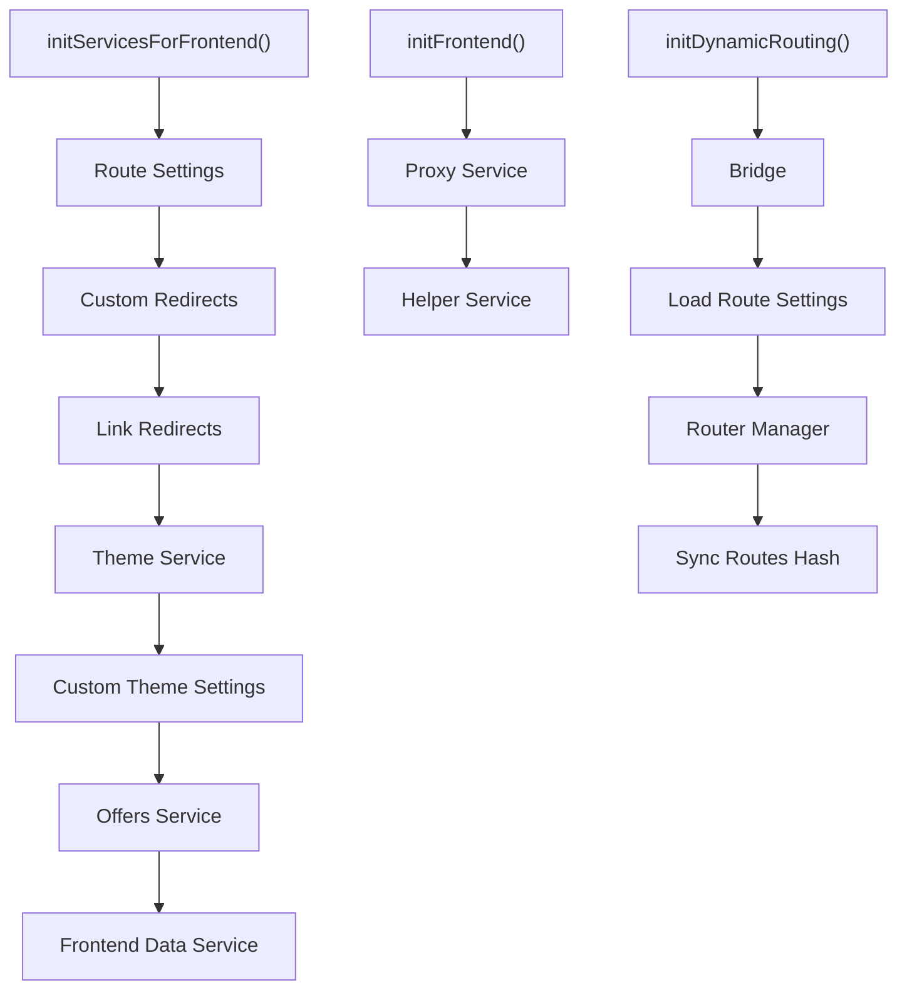

# Boot Process and Configuration

Relevant source files

The following files were used as context for generating this wiki page:

- [apps/admin-x-framework/src/test/acceptance.ts](https://github.com/TryGhost/Ghost/blob/0d0e5bd3/apps/admin-x-framework/src/test/acceptance.ts)
- [apps/admin-x-settings/node-shim.cjs](https://github.com/TryGhost/Ghost/blob/0d0e5bd3/apps/admin-x-settings/node-shim.cjs)
- [apps/admin-x-settings/src/components/settings/site/AnnouncementBarModal.tsx](https://github.com/TryGhost/Ghost/blob/0d0e5bd3/apps/admin-x-settings/src/components/settings/site/AnnouncementBarModal.tsx)
- [apps/admin-x-settings/src/components/settings/site/announcementBar/AnnouncementBarPreview.tsx](https://github.com/TryGhost/Ghost/blob/0d0e5bd3/apps/admin-x-settings/src/components/settings/site/announcementBar/AnnouncementBarPreview.tsx)
- [apps/admin-x-settings/src/components/settings/site/designAndBranding/GlobalSettings.tsx](https://github.com/TryGhost/Ghost/blob/0d0e5bd3/apps/admin-x-settings/src/components/settings/site/designAndBranding/GlobalSettings.tsx)
- [apps/admin-x-settings/src/components/settings/site/designAndBranding/ThemePreview.tsx](https://github.com/TryGhost/Ghost/blob/0d0e5bd3/apps/admin-x-settings/src/components/settings/site/designAndBranding/ThemePreview.tsx)
- [apps/admin-x-settings/src/components/settings/site/designAndBranding/ThemeSettings.tsx](https://github.com/TryGhost/Ghost/blob/0d0e5bd3/apps/admin-x-settings/src/components/settings/site/designAndBranding/ThemeSettings.tsx)
- [apps/admin-x-settings/src/typings.d.ts](https://github.com/TryGhost/Ghost/blob/0d0e5bd3/apps/admin-x-settings/src/typings.d.ts)
- [apps/admin-x-settings/src/utils/IframeBuffering.tsx](https://github.com/TryGhost/Ghost/blob/0d0e5bd3/apps/admin-x-settings/src/utils/IframeBuffering.tsx)
- [apps/admin-x-settings/src/utils/isCustomThemeSettingsVisible.ts](https://github.com/TryGhost/Ghost/blob/0d0e5bd3/apps/admin-x-settings/src/utils/isCustomThemeSettingsVisible.ts)
- [apps/admin-x-settings/test/acceptance/site/announcementbar.test.ts](https://github.com/TryGhost/Ghost/blob/0d0e5bd3/apps/admin-x-settings/test/acceptance/site/announcementbar.test.ts)
- [apps/admin-x-settings/test/acceptance/site/design.test.ts](https://github.com/TryGhost/Ghost/blob/0d0e5bd3/apps/admin-x-settings/test/acceptance/site/design.test.ts)
- [apps/admin-x-settings/test/unit/api/customThemeSettings.ts](https://github.com/TryGhost/Ghost/blob/0d0e5bd3/apps/admin-x-settings/test/unit/api/customThemeSettings.ts)
- [ghost/core/core/boot.js](https://github.com/TryGhost/Ghost/blob/0d0e5bd3/ghost/core/core/boot.js)
- [ghost/core/core/frontend/helpers/body_class.js](https://github.com/TryGhost/Ghost/blob/0d0e5bd3/ghost/core/core/frontend/helpers/body_class.js)
- [ghost/core/core/frontend/helpers/ghost_head.js](https://github.com/TryGhost/Ghost/blob/0d0e5bd3/ghost/core/core/frontend/helpers/ghost_head.js)
- [ghost/core/core/frontend/web/site.js](https://github.com/TryGhost/Ghost/blob/0d0e5bd3/ghost/core/core/frontend/web/site.js)
- [ghost/core/core/shared/config/defaults.json](https://github.com/TryGhost/Ghost/blob/0d0e5bd3/ghost/core/core/shared/config/defaults.json)
- [ghost/core/test/unit/frontend/helpers/__snapshots__/ghost_head.test.js.snap](https://github.com/TryGhost/Ghost/blob/0d0e5bd3/ghost/core/test/unit/frontend/helpers/__snapshots__/ghost_head.test.js.snap)
- [ghost/core/test/unit/frontend/helpers/body_class.test.js](https://github.com/TryGhost/Ghost/blob/0d0e5bd3/ghost/core/test/unit/frontend/helpers/body_class.test.js)
- [ghost/core/test/unit/frontend/helpers/ghost_head.test.js](https://github.com/TryGhost/Ghost/blob/0d0e5bd3/ghost/core/test/unit/frontend/helpers/ghost_head.test.js)

This document explains the initialization and startup sequence of the Ghost platform, detailing how the application bootstraps itself from initial load to a fully operational state. It covers the order of component initialization, service loading, configuration management, and how the system transitions from maintenance mode to serving requests.

## Overview

Ghost's boot process is managed by a centralized boot sequence in the `boot.js` file. This approach consolidates all initialization logic in one location for better maintainability and easier debugging. The process follows a carefully orchestrated sequence that initializes components in the correct order, ensures dependencies are available when needed, and handles errors gracefully.

Sources: [ghost/core/core/boot.js:435-596](https://github.com/TryGhost/Ghost/blob/0d0e5bd3/ghost/core/core/boot.js#L435-L596)

## Boot Sequence Details

The boot process is managed by the `bootGhost` function which handles all aspects of starting the Ghost platform:

Sources: [ghost/core/core/boot.js:435-596](https://github.com/TryGhost/Ghost/blob/0d0e5bd3/ghost/core/core/boot.js#L435-L596), [ghost/core/core/boot.js:66-73](https://github.com/TryGhost/Ghost/blob/0d0e5bd3/ghost/core/core/boot.js#L66-L73), [ghost/core/core/boot.js:83-159](https://github.com/TryGhost/Ghost/blob/0d0e5bd3/ghost/core/core/boot.js#L83-L159)

### 1. Initial Setup and Configuration

The boot process begins by loading fundamental configuration and setting up logging:

1. Load version information from package.json
2. Load configuration using shared config module
3. Initialize logging and metrics
4. Set up error handlers for unhandled rejections
5. Initialize Sentry for error reporting
6. Initialize Prometheus client for metrics collection

Configuration is loaded from several sources including environment variables, config files, and defaults. These are merged to create the final configuration object used throughout the application.

#### Default Configuration

Ghost ships with a comprehensive set of default configuration values in `defaults.json`:

| Configuration Category | Description | Example Settings |
|------------------------|-------------|------------------|
| Server | Basic server settings | Host, port, shutdown timeout |
| Paths | File system locations | Content path, fixtures, assets |
| Storage | Storage adapters | LocalImagesStorage, LocalMediaStorage |
| Logging | Log configuration | Level, rotation, transports |
| Caching | Cache settings | Max age for different resources |
| Members | Member functionality | Email templates, payment processors |
| Spam | Anti-spam settings | Rate limits, blocked domains |
| Frontend Apps | CDN URLs for frontend apps | Portal, comments, search |

Sources: [ghost/core/core/boot.js:449-475](https://github.com/TryGhost/Ghost/blob/0d0e5bd3/ghost/core/core/boot.js#L449-L475), [ghost/core/core/shared/config/defaults.json:1-284](https://github.com/TryGhost/Ghost/blob/0d0e5bd3/ghost/core/core/shared/config/defaults.json#L1-L284)

### 2. Server Initialization

A minimal server instance is created first, running in maintenance mode:

1. Create a minimal root app
2. Initialize a `GhostServer` instance
3. Start the server, which accepts connections but returns maintenance responses

This allows Ghost to respond to requests even before it's fully initialized, providing better user experience during startup.

Sources: [ghost/core/core/boot.js:499-513](https://github.com/TryGhost/Ghost/blob/0d0e5bd3/ghost/core/core/boot.js#L499-L513)

### 3. Database Initialization

The database is initialized before any other major component:

1. Create a `DatabaseStateManager` instance
2. Call `makeReady()` to ensure the database is in a usable state
3. Initialize database information

The `DatabaseStateManager` handles ensuring the database is migrated to the current version and ready for use.

Sources: [ghost/core/core/boot.js:66-73](https://github.com/TryGhost/Ghost/blob/0d0e5bd3/ghost/core/core/boot.js#L66-L73), [ghost/core/core/boot.js:517-522](https://github.com/TryGhost/Ghost/blob/0d0e5bd3/ghost/core/core/boot.js#L517-L522)

### 4. Core Components Initialization

Core components are initialized in a specific order to ensure dependencies are available:

The `initCore()` function organizes this process, ensuring each component is initialized before those that depend on it. The URL service is a critical component that doesn't block the boot process - it continues initialization in the background while the boot sequence proceeds.

Sources: [ghost/core/core/boot.js:83-159](https://github.com/TryGhost/Ghost/blob/0d0e5bd3/ghost/core/core/boot.js#L83-L159), [ghost/core/core/boot.js:524-530](https://github.com/TryGhost/Ghost/blob/0d0e5bd3/ghost/core/core/boot.js#L524-L530)

### 5. Frontend Services Initialization

If the frontend is enabled, various frontend-specific services are initialized:

1. Route settings
2. Custom redirects
3. Link redirects
4. Theme service
5. Custom theme settings
6. Offers service
7. Frontend data service

These services are necessary for rendering the frontend site and handling visitor requests.

Sources: [ghost/core/core/boot.js:161-200](https://github.com/TryGhost/Ghost/blob/0d0e5bd3/ghost/core/core/boot.js#L161-L200), [ghost/core/core/boot.js:535-536](https://github.com/TryGhost/Ghost/blob/0d0e5bd3/ghost/core/core/boot.js#L535-L536)

### 6. Frontend Initialization

The frontend itself is initialized with:

1. Proxy service
2. Helper service for templates

Sources: [ghost/core/core/boot.js:205-215](https://github.com/TryGhost/Ghost/blob/0d0e5bd3/ghost/core/core/boot.js#L205-L215), [ghost/core/core/boot.js:538-539](https://github.com/TryGhost/Ghost/blob/0d0e5bd3/ghost/core/core/boot.js#L538-L539)

### 7. Express Apps Initialization

Express applications are initialized and mounted on the parent app:

1. Initialize parent Express app
2. If backend is enabled, mount backend app (admin and API)
3. If frontend is enabled, mount frontend app (site and members)

The frontend and backend apps can be enabled independently, allowing for different deployment configurations.

Sources: [ghost/core/core/boot.js:226-248](https://github.com/TryGhost/Ghost/blob/0d0e5bd3/ghost/core/core/boot.js#L226-L248), [ghost/core/core/boot.js:540](https://github.com/TryGhost/Ghost/blob/0d0e5bd3/ghost/core/core/boot.js#L540)

### 8. Dynamic Routing Initialization

Dynamic routing is initialized for the frontend:

1. Initialize the bridge
2. Load route settings
3. Start router manager with the loaded settings
4. Sync routes hash with settings

Sources: [ghost/core/core/boot.js:269-286](https://github.com/TryGhost/Ghost/blob/0d0e5bd3/ghost/core/core/boot.js#L269-L286), [ghost/core/core/boot.js:542-543](https://github.com/TryGhost/Ghost/blob/0d0e5bd3/ghost/core/core/boot.js#L542-L543)

### 9. App Service Initialization

The app service for frontend extensions is initialized if the frontend is enabled:

1. Initialize the app service to load Ghost apps

Sources: [ghost/core/core/boot.js:292-296](https://github.com/TryGhost/Ghost/blob/0d0e5bd3/ghost/core/core/boot.js#L292-L296), [ghost/core/core/boot.js:544-545](https://github.com/TryGhost/Ghost/blob/0d0e5bd3/ghost/core/core/boot.js#L544-L545)

### 10. Services Initialization

Many services are initialized in parallel:

1. Identity tokens
2. Stripe integration
3. Members service
4. Tiers service
5. Permissions service
6. Various other services (xmlrpc, slack, webhooks, etc.)

These services provide various functionality like authentication, payments, email delivery, and more.

Sources: [ghost/core/core/boot.js:303-389](https://github.com/TryGhost/Ghost/blob/0d0e5bd3/ghost/core/core/boot.js#L303-L389), [ghost/core/core/boot.js:547](https://github.com/TryGhost/Ghost/blob/0d0e5bd3/ghost/core/core/boot.js#L547)

### 11. Disabling Maintenance Mode

After all components are initialized:

1. Disable maintenance mode on the root app
2. Mount the full Ghost app onto the root app
3. Notify that the server is ready

This makes Ghost fully operational and able to handle all requests.

Sources: [ghost/core/core/boot.js:551-559](https://github.com/TryGhost/Ghost/blob/0d0e5bd3/ghost/core/core/boot.js#L551-L559)

### 12. Background Services Initialization

Finally, background services are initialized:

1. Load inactive themes
2. Initialize ActivityPub
3. Schedule email analytics jobs
4. Schedule update checks
5. Initialize milestones service

These services run in the background and don't block the main application from serving requests.

Sources: [ghost/core/core/boot.js:399-426](https://github.com/TryGhost/Ghost/blob/0d0e5bd3/ghost/core/core/boot.js#L399-L426), [ghost/core/core/boot.js:562](https://github.com/TryGhost/Ghost/blob/0d0e5bd3/ghost/core/core/boot.js#L562)

## Boot Manager and Logging

The `BootLogger` class helps track the boot process and records timing information:

This enables detailed logging of each step in the boot process and collects metrics on boot time performance.

Sources: [ghost/core/core/boot.js:18-41](https://github.com/TryGhost/Ghost/blob/0d0e5bd3/ghost/core/core/boot.js#L18-L41)

## Error Handling

The boot process includes robust error handling:

1. Errors during boot are caught and logged
2. If the server was started, it will be shut down gracefully
3. If the server failed to start, the process will exit with an error code
4. Unhandled rejections are caught and logged to prevent silent failures

This ensures that failures during boot are properly reported and handled.

Sources: [ghost/core/core/boot.js:577-597](https://github.com/TryGhost/Ghost/blob/0d0e5bd3/ghost/core/core/boot.js#L577-L597)

## Configuration System

Configuration is loaded early in the boot process and consists of:

1. Default values from `defaults.json`
2. Environment-specific values
3. Custom configuration file values
4. Environment variables

The resulting configuration object is used throughout the application to control behavior.

### Configuration Structure

Ghost's configuration system is hierarchical and covers all aspects of the application:

The configuration system allows for environment-specific overrides, making it flexible for different deployment scenarios.

Sources: [ghost/core/core/shared/config/defaults.json:1-284](https://github.com/TryGhost/Ghost/blob/0d0e5bd3/ghost/core/core/shared/config/defaults.json#L1-L284), [ghost/core/core/boot.js:458-459](https://github.com/TryGhost/Ghost/blob/0d0e5bd3/ghost/core/core/boot.js#L458-L459)

## Server Shutdown Process

The boot process also registers cleanup tasks for graceful shutdown:

1. Shutdown job service
2. Shutdown mentions job service
3. Shutdown URL service
4. Stop Prometheus client

These cleanup tasks ensure resources are properly released when Ghost is shut down.

Sources: [ghost/core/core/boot.js:129-149](https://github.com/TryGhost/Ghost/blob/0d0e5bd3/ghost/core/core/boot.js#L129-L149), [ghost/core/core/boot.js:507-511](https://github.com/TryGhost/Ghost/blob/0d0e5bd3/ghost/core/core/boot.js#L507-L511)

## Performance Monitoring

Ghost has built-in performance monitoring for the boot process:

1. Boot timing is logged at key points
2. Metrics are collected for the overall boot time
3. In CI environments, a special flag can be set to exit after boot for performance testing

This allows for tracking and optimizing the boot performance over time.

Sources: [ghost/core/core/boot.js:429-567](https://github.com/TryGhost/Ghost/blob/0d0e5bd3/ghost/core/core/boot.js#L429-L567), [.github/workflows/ci.yml:430-432](https://github.com/TryGhost/Ghost/blob/0d0e5bd3/.github/workflows/ci.yml#L430-L432)

## Frontend and Theme Initialization

During boot, Ghost initializes the frontend components and theme system:

The frontend initialization includes:

1. Loading and initializing the active theme
2. Setting up custom theme settings
3. Preparing asset generation for `ghost_head` and other template helpers
4. Setting up theme engine and helpers for template rendering
5. Initializing dynamic routing based on routes.yaml

The `ghost_head` helper is particularly important as it injects necessary scripts, styles, and meta tags into the site's HTML head, including:

- Meta tags for SEO
- Open Graph and Twitter card data
- Structured data (JSON-LD)
- Custom fonts
- Theme accent colors
- Member-related scripts
- Analytics tracking

Sources: [ghost/core/core/frontend/helpers/ghost_head.js:1-403](https://github.com/TryGhost/Ghost/blob/0d0e5bd3/ghost/core/core/frontend/helpers/ghost_head.js#L1-L403), [ghost/core/core/frontend/web/site.js:39-204](https://github.com/TryGhost/Ghost/blob/0d0e5bd3/ghost/core/core/frontend/web/site.js#L39-L204), [ghost/core/core/boot.js:167-206](https://github.com/TryGhost/Ghost/blob/0d0e5bd3/ghost/core/core/boot.js#L167-L206), [ghost/core/core/boot.js:211-221](https://github.com/TryGhost/Ghost/blob/0d0e5bd3/ghost/core/core/boot.js#L211-L221), [ghost/core/core/boot.js:275-292](https://github.com/TryGhost/Ghost/blob/0d0e5bd3/ghost/core/core/boot.js#L275-L292)

## Admin Interface Loading

The admin interface is initialized with:

1. Loading admin client assets
2. Setting up API routes
3. Preparing admin-x settings and components

The admin interface is mounted on a separate route from the main site.

Sources: [ghost/admin/app/components/admin-x/settings.js:1-201](https://github.com/TryGhost/Ghost/blob/0d0e5bd3/ghost/admin/app/components/admin-x/settings.js#L1-L201), [ghost/admin/app/routes/lexical-editor.js:1-29](https://github.com/TryGhost/Ghost/blob/0d0e5bd3/ghost/admin/app/routes/lexical-editor.js#L1-L29), [ghost/admin/lib/asset-delivery/index.js:1-123](https://github.com/TryGhost/Ghost/blob/0d0e5bd3/ghost/admin/lib/asset-delivery/index.js#L1-L123)

## Conclusion

The Ghost boot process is a carefully orchestrated sequence that initializes components in the correct order, ensuring dependencies are available when needed. It starts with a minimal server in maintenance mode, progressively initializes all required components, and then transitions to a fully operational state.