# Admin Interface

<details>
<summary>Relevant source files</summary>

The following files were used as context for generating this wiki page:

- [ghost/admin/app/components/dashboard/charts/recents.hbs](https://github.com/TryGhost/Ghost/blob/0d0e5bd3/ghost/admin/app/components/dashboard/charts/recents.hbs)
- [ghost/admin/app/components/epm-modal-container.js](https://github.com/TryGhost/Ghost/blob/0d0e5bd3/ghost/admin/app/components/epm-modal-container.js)
- [ghost/admin/app/components/gh-member-details.hbs](https://github.com/TryGhost/Ghost/blob/0d0e5bd3/ghost/admin/app/components/gh-member-details.hbs)
- [ghost/admin/app/components/gh-member-details.js](https://github.com/TryGhost/Ghost/blob/0d0e5bd3/ghost/admin/app/components/gh-member-details.js)
- [ghost/admin/app/components/gh-member-settings-form.hbs](https://github.com/TryGhost/Ghost/blob/0d0e5bd3/ghost/admin/app/components/gh-member-settings-form.hbs)
- [ghost/admin/app/components/gh-member-settings-form.js](https://github.com/TryGhost/Ghost/blob/0d0e5bd3/ghost/admin/app/components/gh-member-settings-form.js)
- [ghost/admin/app/components/gh-psm-authors-input.hbs](https://github.com/TryGhost/Ghost/blob/0d0e5bd3/ghost/admin/app/components/gh-psm-authors-input.hbs)
- [ghost/admin/app/components/gh-psm-visibility-input.hbs](https://github.com/TryGhost/Ghost/blob/0d0e5bd3/ghost/admin/app/components/gh-psm-visibility-input.hbs)
- [ghost/admin/app/components/member/activity-feed.hbs](https://github.com/TryGhost/Ghost/blob/0d0e5bd3/ghost/admin/app/components/member/activity-feed.hbs)
- [ghost/admin/app/components/member/subscription-detail-box.hbs](https://github.com/TryGhost/Ghost/blob/0d0e5bd3/ghost/admin/app/components/member/subscription-detail-box.hbs)
- [ghost/admin/app/components/member/subscription-detail-box.js](https://github.com/TryGhost/Ghost/blob/0d0e5bd3/ghost/admin/app/components/member/subscription-detail-box.js)
- [ghost/admin/app/components/members-activity/table-row.hbs](https://github.com/TryGhost/Ghost/blob/0d0e5bd3/ghost/admin/app/components/members-activity/table-row.hbs)
- [ghost/admin/app/components/members-activity/table.hbs](https://github.com/TryGhost/Ghost/blob/0d0e5bd3/ghost/admin/app/components/members-activity/table.hbs)
- [ghost/admin/app/components/modal-member-tier.hbs](https://github.com/TryGhost/Ghost/blob/0d0e5bd3/ghost/admin/app/components/modal-member-tier.hbs)
- [ghost/admin/app/components/modal-member-tier.js](https://github.com/TryGhost/Ghost/blob/0d0e5bd3/ghost/admin/app/components/modal-member-tier.js)
- [ghost/admin/app/components/react-component.hbs](https://github.com/TryGhost/Ghost/blob/0d0e5bd3/ghost/admin/app/components/react-component.hbs)
- [ghost/admin/app/controllers/dashboard.js](https://github.com/TryGhost/Ghost/blob/0d0e5bd3/ghost/admin/app/controllers/dashboard.js)
- [ghost/admin/app/helpers/first-name.js](https://github.com/TryGhost/Ghost/blob/0d0e5bd3/ghost/admin/app/helpers/first-name.js)
- [ghost/admin/app/helpers/parse-member-event.js](https://github.com/TryGhost/Ghost/blob/0d0e5bd3/ghost/admin/app/helpers/parse-member-event.js)
- [ghost/admin/app/services/data-cache.js](https://github.com/TryGhost/Ghost/blob/0d0e5bd3/ghost/admin/app/services/data-cache.js)
- [ghost/admin/app/services/modals.js](https://github.com/TryGhost/Ghost/blob/0d0e5bd3/ghost/admin/app/services/modals.js)
- [ghost/admin/app/styles/components/lists.css](https://github.com/TryGhost/Ghost/blob/0d0e5bd3/ghost/admin/app/styles/components/lists.css)
- [ghost/admin/app/styles/layouts/dashboard.css](https://github.com/TryGhost/Ghost/blob/0d0e5bd3/ghost/admin/app/styles/layouts/dashboard.css)
- [ghost/admin/app/styles/layouts/member-activity.css](https://github.com/TryGhost/Ghost/blob/0d0e5bd3/ghost/admin/app/styles/layouts/member-activity.css)
- [ghost/admin/app/styles/layouts/members.css](https://github.com/TryGhost/Ghost/blob/0d0e5bd3/ghost/admin/app/styles/layouts/members.css)
- [ghost/admin/app/templates/dashboard.hbs](https://github.com/TryGhost/Ghost/blob/0d0e5bd3/ghost/admin/app/templates/dashboard.hbs)
- [ghost/admin/app/templates/members-activity.hbs](https://github.com/TryGhost/Ghost/blob/0d0e5bd3/ghost/admin/app/templates/members-activity.hbs)
- [ghost/admin/app/utils/subscription-data.js](https://github.com/TryGhost/Ghost/blob/0d0e5bd3/ghost/admin/app/utils/subscription-data.js)
- [ghost/admin/ember-cli-build.js](https://github.com/TryGhost/Ghost/blob/0d0e5bd3/ghost/admin/ember-cli-build.js)
- [ghost/admin/tests/acceptance/members/details-test.js](https://github.com/TryGhost/Ghost/blob/0d0e5bd3/ghost/admin/tests/acceptance/members/details-test.js)
- [ghost/admin/tests/unit/utils/subscription-data-test.js](https://github.com/TryGhost/Ghost/blob/0d0e5bd3/ghost/admin/tests/unit/utils/subscription-data-test.js)

</details>


The Ghost Admin Interface is the Ember.js-based management panel that provides content creators and site administrators with tools to manage their Ghost publication. This document covers the architecture, components, and functionality of the admin interface, focusing on its implementation in the Ghost codebase.

For information about the Editor System specifically, see [Editor System](#3.2).

## Overview

The Ghost Admin Interface is a single-page application built with Ember.js that provides a comprehensive set of tools for managing a Ghost site. It includes dashboards, content management, member management, and site configuration capabilities.

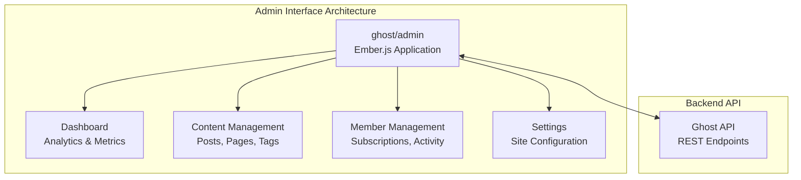

Sources: [ghost/admin/ember-cli-build.js:80-273](https://github.com/TryGhost/Ghost/blob/0d0e5bd3/ghost/admin/ember-cli-build.js#L80-L273), [ghost/admin/app/templates/dashboard.hbs:1-143](https://github.com/TryGhost/Ghost/blob/0d0e5bd3/ghost/admin/app/templates/dashboard.hbs#L1-L143)

## Core Components

The Admin Interface is organized into several key functional areas, each with its own set of components and services.

### Dashboard

The dashboard provides an overview of site performance, recent activity, and key metrics. It includes charts for member growth, subscription revenue, and engagement statistics.

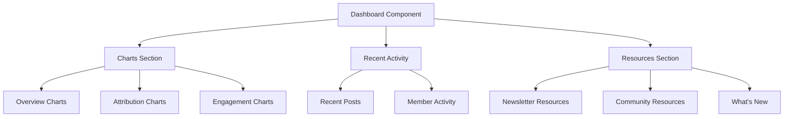

Sources: [ghost/admin/app/templates/dashboard.hbs:1-143](https://github.com/TryGhost/Ghost/blob/0d0e5bd3/ghost/admin/app/templates/dashboard.hbs#L1-L143), [ghost/admin/app/controllers/dashboard.js:1-131](https://github.com/TryGhost/Ghost/blob/0d0e5bd3/ghost/admin/app/controllers/dashboard.js#L1-L131), [ghost/admin/app/components/dashboard/charts/recents.hbs:1-151](https://github.com/TryGhost/Ghost/blob/0d0e5bd3/ghost/admin/app/components/dashboard/charts/recents.hbs#L1-L151)

### Member Management

The member management section allows administrators to view, edit, and manage member accounts, including their subscriptions, activity, and newsletter preferences.

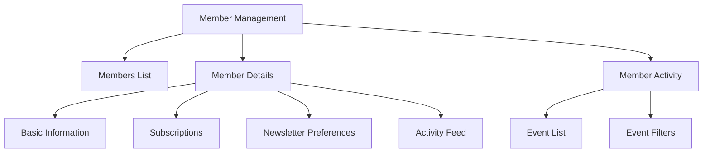

Sources: [ghost/admin/app/components/gh-member-settings-form.hbs:1-297](https://github.com/TryGhost/Ghost/blob/0d0e5bd3/ghost/admin/app/components/gh-member-settings-form.hbs#L1-L297), [ghost/admin/app/components/gh-member-details.hbs:1-115](https://github.com/TryGhost/Ghost/blob/0d0e5bd3/ghost/admin/app/components/gh-member-details.hbs#L1-L115), [ghost/admin/app/templates/members-activity.hbs:1-56](https://github.com/TryGhost/Ghost/blob/0d0e5bd3/ghost/admin/app/templates/members-activity.hbs#L1-L56)

## UI Components and Styling

The Admin Interface uses a consistent set of UI components and styling to maintain a cohesive user experience throughout the application.

### Layout Components

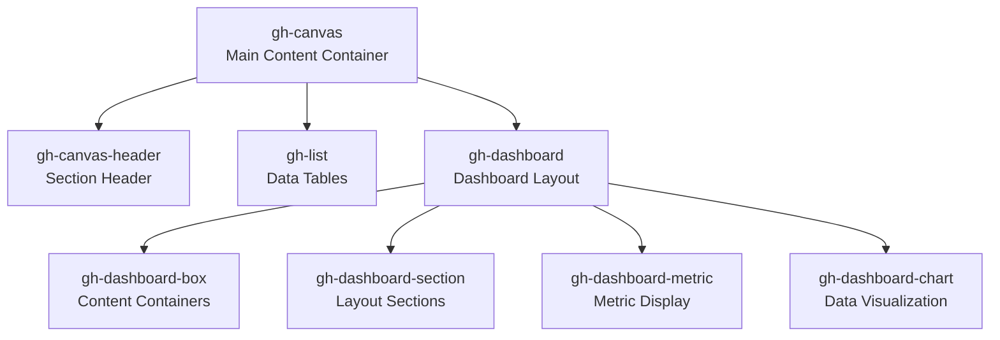

Sources: [ghost/admin/app/styles/layouts/dashboard.css:1-1600](https://github.com/TryGhost/Ghost/blob/0d0e5bd3/ghost/admin/app/styles/layouts/dashboard.css#L1-L1600), [ghost/admin/app/styles/components/lists.css:1-590](https://github.com/TryGhost/Ghost/blob/0d0e5bd3/ghost/admin/app/styles/components/lists.css#L1-L590)

### Key CSS Classes

The admin interface uses a structured CSS approach with specific classes for different UI elements:

| CSS Class | Purpose | Example Usage |
|-----------|---------|---------------|
| `gh-canvas` | Main content container | Wraps entire page content |
| `gh-dashboard-layout` | Dashboard container | Contains dashboard sections |
| `gh-dashboard-section` | Dashboard section | Groups related dashboard components |
| `gh-dashboard-box` | Content container | Holds dashboard widgets |
| `gh-list` | Data table | Displays tabular data |
| `gh-list-data` | Table cell | Individual data cell in a list |
| `gh-member-details` | Member profile | Shows member information |

Sources: [ghost/admin/app/styles/layouts/dashboard.css:11-15](https://github.com/TryGhost/Ghost/blob/0d0e5bd3/ghost/admin/app/styles/layouts/dashboard.css#L11-L15), [ghost/admin/app/styles/layouts/members.css:1-100](https://github.com/TryGhost/Ghost/blob/0d0e5bd3/ghost/admin/app/styles/layouts/members.css#L1-L100), [ghost/admin/app/styles/components/lists.css:14-21](https://github.com/TryGhost/Ghost/blob/0d0e5bd3/ghost/admin/app/styles/components/lists.css#L14-L21)

## Member Activity Tracking

The Admin Interface provides detailed tracking of member activities, including subscriptions, email interactions, and content engagement.

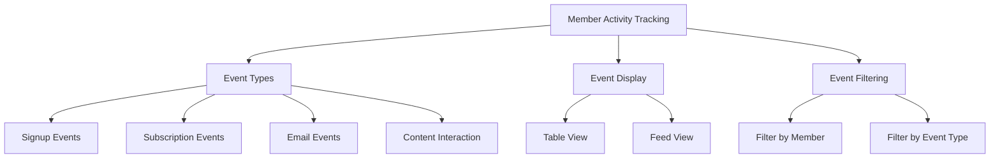

Sources: [ghost/admin/app/helpers/parse-member-event.js:1-386](https://github.com/TryGhost/Ghost/blob/0d0e5bd3/ghost/admin/app/helpers/parse-member-event.js#L1-L386), [ghost/admin/app/components/members-activity/table-row.hbs:1-53](https://github.com/TryGhost/Ghost/blob/0d0e5bd3/ghost/admin/app/components/members-activity/table-row.hbs#L1-L53), [ghost/admin/app/styles/layouts/member-activity.css:1-528](https://github.com/TryGhost/Ghost/blob/0d0e5bd3/ghost/admin/app/styles/layouts/member-activity.css#L1-L528)

### Event Types and Parsing

The system parses various member events to display them in a consistent format:

```javascript
// Event types handled by the system include:
// - login_event: Member logged in
// - payment_event: Member made a payment
// - newsletter_event: Member subscribed/unsubscribed from newsletter
// - subscription_event: Member subscription changes
// - signup_event: New member signup
// - email_opened_event: Member opened an email
// - email_sent_event: Email sent to member
// - comment_event: Member left a comment
// - click_event: Member clicked a link in an email
// - feedback_event: Member provided feedback
```

Sources: [ghost/admin/app/helpers/parse-member-event.js:68-143](https://github.com/TryGhost/Ghost/blob/0d0e5bd3/ghost/admin/app/helpers/parse-member-event.js#L68-L143)

## Dashboard Components

The dashboard provides a comprehensive overview of site performance and recent activity through various specialized components.

### Charts and Metrics

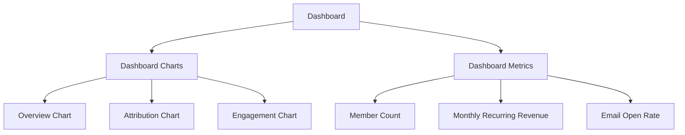

Sources: [ghost/admin/app/templates/dashboard.hbs:92-107](https://github.com/TryGhost/Ghost/blob/0d0e5bd3/ghost/admin/app/templates/dashboard.hbs#L92-L107), [ghost/admin/app/styles/layouts/dashboard.css:420-485](https://github.com/TryGhost/Ghost/blob/0d0e5bd3/ghost/admin/app/styles/layouts/dashboard.css#L420-L485)

### Recent Activity

The dashboard includes a section for recent activity, which can toggle between recent posts and member activity:

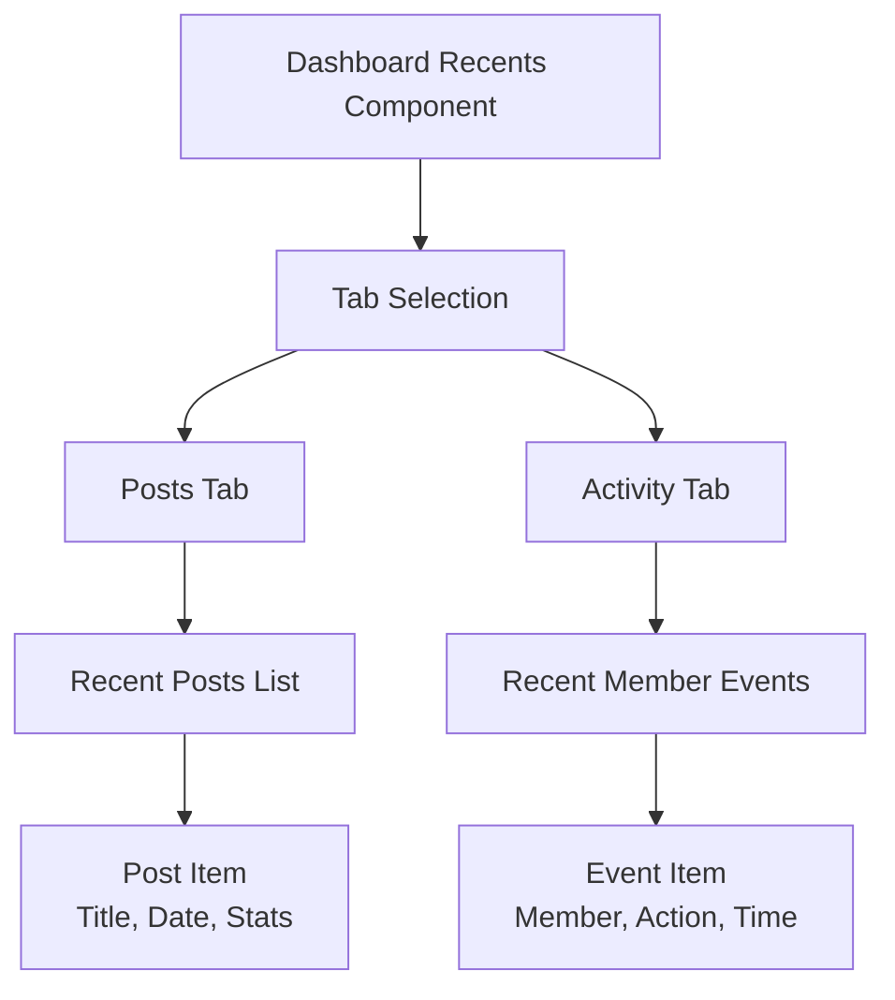

Sources: [ghost/admin/app/components/dashboard/charts/recents.hbs:1-151](https://github.com/TryGhost/Ghost/blob/0d0e5bd3/ghost/admin/app/components/dashboard/charts/recents.hbs#L1-L151)

## Member Details View

The member details view provides comprehensive information about individual members, including their profile, subscriptions, and activity.

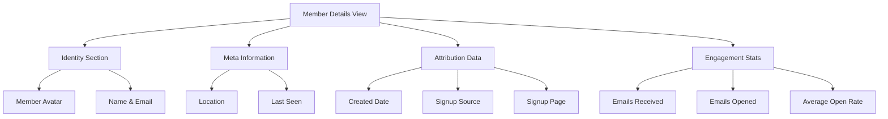

Sources: [ghost/admin/app/components/gh-member-details.hbs:1-115](https://github.com/TryGhost/Ghost/blob/0d0e5bd3/ghost/admin/app/components/gh-member-details.hbs#L1-L115), [ghost/admin/app/components/gh-member-details.js:1-16](https://github.com/TryGhost/Ghost/blob/0d0e5bd3/ghost/admin/app/components/gh-member-details.js#L1-L16)

## Member Settings Form

The member settings form allows administrators to edit member information, manage subscriptions, and view activity:

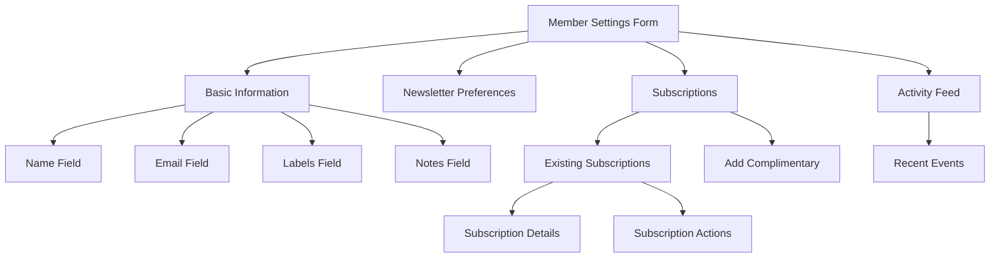

Sources: [ghost/admin/app/components/gh-member-settings-form.hbs:1-297](https://github.com/TryGhost/Ghost/blob/0d0e5bd3/ghost/admin/app/components/gh-member-settings-form.hbs#L1-L297), [ghost/admin/app/components/gh-member-settings-form.js:1-243](https://github.com/TryGhost/Ghost/blob/0d0e5bd3/ghost/admin/app/components/gh-member-settings-form.js#L1-L243)

## Modal System

The Admin Interface uses a modal system for various interactions, including adding complimentary subscriptions to members:

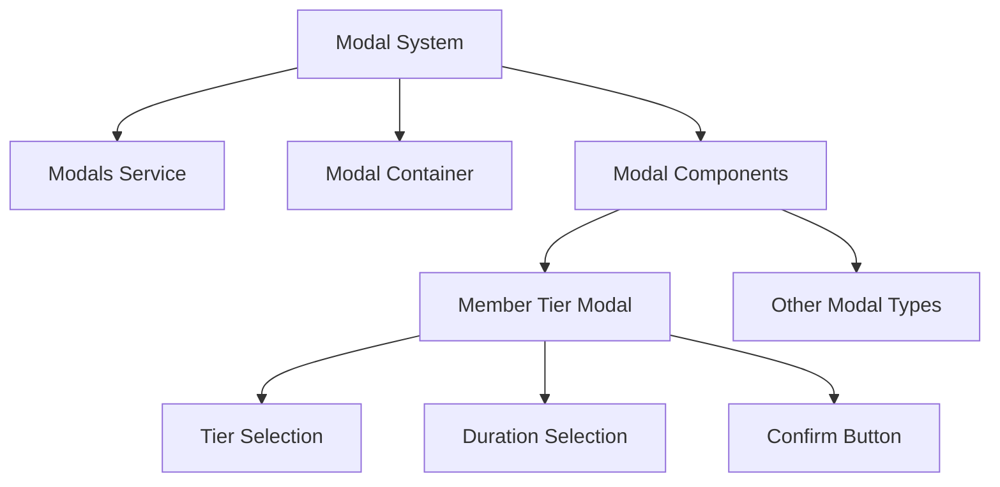

Sources: [ghost/admin/app/services/modals.js:1-81](https://github.com/TryGhost/Ghost/blob/0d0e5bd3/ghost/admin/app/services/modals.js#L1-L81), [ghost/admin/app/components/modal-member-tier.hbs:1-89](https://github.com/TryGhost/Ghost/blob/0d0e5bd3/ghost/admin/app/components/modal-member-tier.hbs#L1-L89), [ghost/admin/app/components/modal-member-tier.js:1-102](https://github.com/TryGhost/Ghost/blob/0d0e5bd3/ghost/admin/app/components/modal-member-tier.js#L1-L102)

## Data Handling and Services

The Admin Interface uses various services to manage data and state:

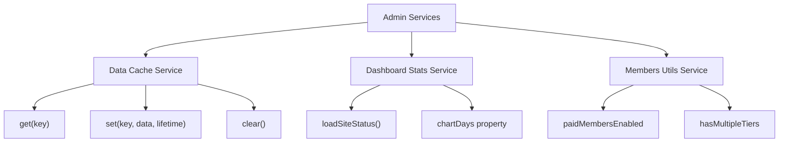

Sources: [ghost/admin/app/services/data-cache.js:1-38](https://github.com/TryGhost/Ghost/blob/0d0e5bd3/ghost/admin/app/services/data-cache.js#L1-L38), [ghost/admin/app/controllers/dashboard.js:1-131](https://github.com/TryGhost/Ghost/blob/0d0e5bd3/ghost/admin/app/controllers/dashboard.js#L1-L131)

## Subscription Data Utilities

The Admin Interface includes utilities for processing and displaying subscription data:

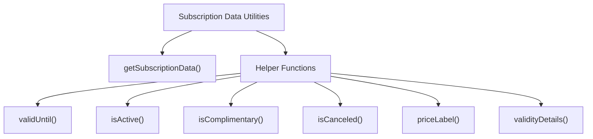

Sources: [ghost/admin/app/utils/subscription-data.js:1-108](https://github.com/TryGhost/Ghost/blob/0d0e5bd3/ghost/admin/app/utils/subscription-data.js#L1-L108)

## Responsive Design

The Admin Interface is designed to be responsive, with specific styles for different screen sizes:

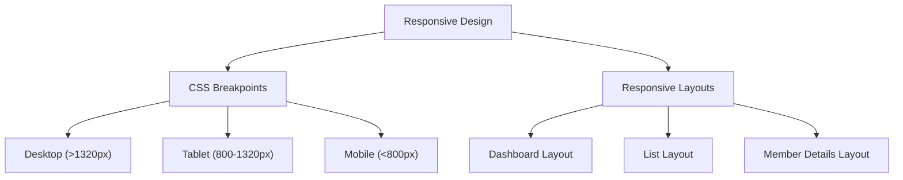

Sources: [ghost/admin/app/styles/layouts/dashboard.css:40-45](https://github.com/TryGhost/Ghost/blob/0d0e5bd3/ghost/admin/app/styles/layouts/dashboard.css#L40-L45), [ghost/admin/app/styles/layouts/dashboard.css:1295-1319](https://github.com/TryGhost/Ghost/blob/0d0e5bd3/ghost/admin/app/styles/layouts/dashboard.css#L1295-L1319), [ghost/admin/app/styles/layouts/members.css:68-73](https://github.com/TryGhost/Ghost/blob/0d0e5bd3/ghost/admin/app/styles/layouts/members.css#L68-L73)

## Build System

The Admin Interface is built using Ember CLI with specific configurations for asset management:

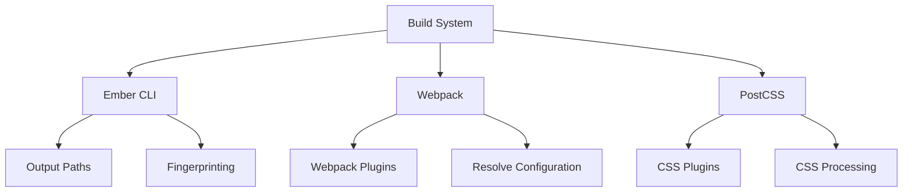

Sources: [ghost/admin/ember-cli-build.js:80-244](https://github.com/TryGhost/Ghost/blob/0d0e5bd3/ghost/admin/ember-cli-build.js#L80-L244)

## Conclusion