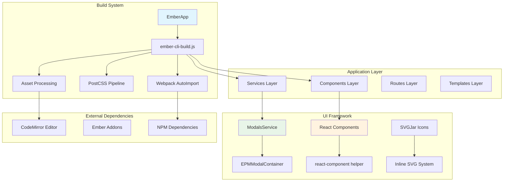
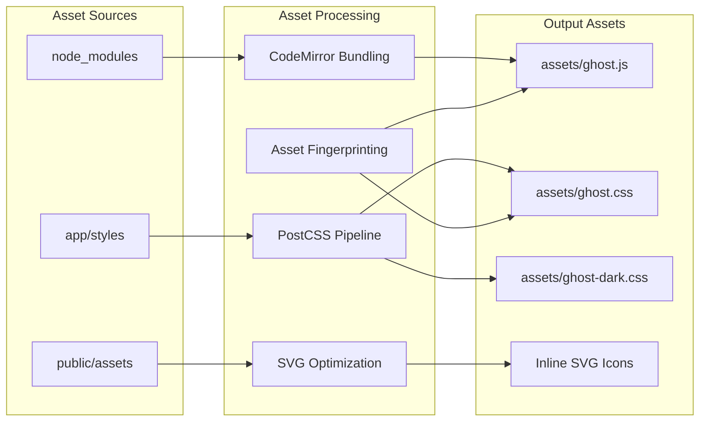
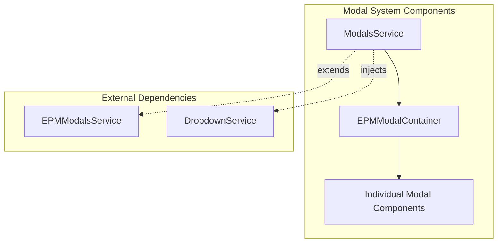
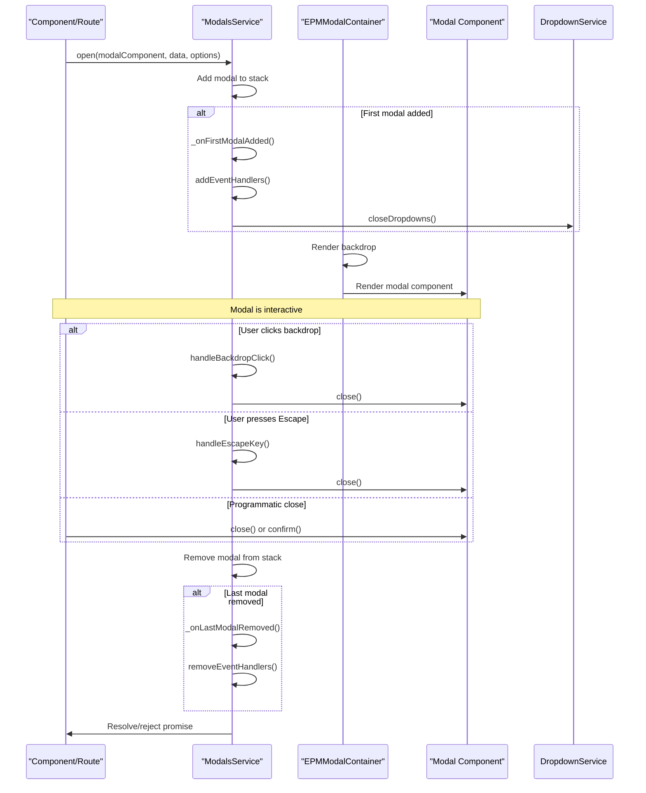

# Ember Application Architecture

<details>
<summary>Relevant source files</summary>

The following files were used as context for generating this wiki page:

- [ghost/admin/app/components/epm-modal-container.js](https://github.com/TryGhost/Ghost/blob/0d0e5bd3/ghost/admin/app/components/epm-modal-container.js)
- [ghost/admin/app/components/react-component.hbs](https://github.com/TryGhost/Ghost/blob/0d0e5bd3/ghost/admin/app/components/react-component.hbs)
- [ghost/admin/app/services/modals.js](https://github.com/TryGhost/Ghost/blob/0d0e5bd3/ghost/admin/app/services/modals.js)
- [ghost/admin/ember-cli-build.js](https://github.com/TryGhost/Ghost/blob/0d0e5bd3/ghost/admin/ember-cli-build.js)

</details>


## Purpose and Scope

The Ghost Admin interface is built as an Ember.js single-page application (SPA) that provides a comprehensive content management system. The application architecture encompasses the build configuration, asset management, component systems, and service layers that work together to create a robust admin interface.

This section covers the core architectural decisions including the Ember CLI build system, modal framework, and overall application structure that enables Ghost's admin functionality.

## Application Architecture Overview

The Ghost Admin Ember application follows a structured architecture with multiple layers:



Sources: [ghost/admin/ember-cli-build.js:1-273](https://github.com/TryGhost/Ghost/blob/0d0e5bd3/ghost/admin/ember-cli-build.js#L1-L273), [ghost/admin/app/services/modals.js:1-80](https://github.com/TryGhost/Ghost/blob/0d0e5bd3/ghost/admin/app/services/modals.js#L1-L80), [ghost/admin/app/components/react-component.hbs:1](https://github.com/TryGhost/Ghost/blob/0d0e5bd3/ghost/admin/app/components/react-component.hbs#L1)

## Build Configuration

### Ember CLI Build System

The Ghost Admin application is built using Ember CLI with extensive customization through `ember-cli-build.js`. The build process handles different environments and asset optimization:

| Environment | Configuration | Purpose |
|-------------|---------------|---------|
| `development` | Source maps enabled, vendor assets included | Local development with debugging |
| `production` | Minification, fingerprinting, CDN support | Optimized production builds |
| `test` | Test-specific imports, no fingerprinting | Automated testing environment |

Sources: [ghost/admin/ember-cli-build.js:10-13](https://github.com/TryGhost/Ghost/blob/0d0e5bd3/ghost/admin/ember-cli-build.js#L10-L13)

### Asset Management

The build system includes sophisticated asset handling:



Sources: [ghost/admin/ember-cli-build.js:98-126](https://github.com/TryGhost/Ghost/blob/0d0e5bd3/ghost/admin/ember-cli-build.js#L98-L126), [ghost/admin/ember-cli-build.js:184-204](https://github.com/TryGhost/Ghost/blob/0d0e5bd3/ghost/admin/ember-cli-build.js#L184-L204)

### PostCSS Configuration

The CSS processing pipeline uses PostCSS with multiple plugins for modern CSS features:

```javascript
postcssOptions: {
    compile: {
        plugins: [
            postcssImport,           // @import resolution
            postcssCustomProperties, // CSS custom properties
            postcssColorModFunction, // color-mod() function
            postcssCustomMedia,      // custom media queries
            autoprefixer,           // vendor prefixes
            cssnano                 // minification
        ]
    }
}
```

Sources: [ghost/admin/ember-cli-build.js:141-181](https://github.com/TryGhost/Ghost/blob/0d0e5bd3/ghost/admin/ember-cli-build.js#L141-L181)

### Webpack Integration

Auto-import functionality is powered by Webpack with specific configurations:

```javascript
autoImport: {
    webpack: {
        resolve: {
            fallback: {
                util: require.resolve('util'),
                path: require.resolve('path-browserify'),
                fs: false
            }
        },
        plugins: [
            new webpack.ProvidePlugin({
                process: 'process/browser'
            })
        ]
    }
}
```

Sources: [ghost/admin/ember-cli-build.js:211-232](https://github.com/TryGhost/Ghost/blob/0d0e5bd3/ghost/admin/ember-cli-build.js#L211-L232)

## Modal System Architecture

The modal system provides a framework for displaying overlay windows throughout the admin interface. It is built on the `ember-promise-modals` library with Ghost-specific enhancements:



### Key Components

1. **ModalsService**: Extends `EPMModalsService` to manage modal stack and handle Ghost-specific interactions like backdrop clicks and escape key handling.

2. **EPMModalContainer**: Renders active modals with backdrops and applies styling options.

3. **Individual Modal Components**: Custom modal implementations rendered by the container.

Sources: [ghost/admin/app/services/modals.js:1-5](https://github.com/TryGhost/Ghost/blob/0d0e5bd3/ghost/admin/app/services/modals.js#L1-L5), [ghost/admin/app/components/epm-modal-container.js:1-3](https://github.com/TryGhost/Ghost/blob/0d0e5bd3/ghost/admin/app/components/epm-modal-container.js#L1-L3)

## Modal Lifecycle

The following diagram illustrates the lifecycle of a modal from opening to closing:



Sources: [ghost/admin/app/services/modals.js:19-78](https://github.com/TryGhost/Ghost/blob/0d0e5bd3/ghost/admin/app/services/modals.js#L19-L78), [ghost/admin/app/components/epm-modal-container.hbs:1-14](https://github.com/TryGhost/Ghost/blob/0d0e5bd3/ghost/admin/app/components/epm-modal-container.hbs#L1-L14)

## Configuration and Styling

### Default Options

The Modal System has default styling applied to all modals:

```javascript
DEFAULT_OPTIONS = {
    className: 'fullscreen-modal-action fullscreen-modal-wide'
};
```

Sources: [ghost/admin/app/services/modals.js:8-10](https://github.com/TryGhost/Ghost/blob/0d0e5bd3/ghost/admin/app/services/modals.js#L8-L10)

These defaults can be overridden when opening a modal or by setting specific modal options.

### Focus Trap Configuration

For accessibility, the modal system uses a focus trap to keep keyboard focus within the active modal:

```javascript
focusTrapOptions = {
    allowOutsideClick: true,
    clickOutsideDeactivates: false,
    escapeDeactivates: false
};
```

Sources: [ghost/admin/app/services/modals.js:14-18](https://github.com/TryGhost/Ghost/blob/0d0e5bd3/ghost/admin/app/services/modals.js#L14-L18)

Ghost customizes the default focus trap behavior to manually handle backdrop clicks and escape key presses, allowing for more flexible interactions.

## Modal Rendering

The container component renders each modal in the stack along with its backdrop:

```html
{{#each this.modals._stack as |modal index|}}
    {{#unless modal._options.omitBackdrop}}
        <div class="epm-backdrop {{if modal._options.backgroundLight "background-light"}} {{if modal.isClosing "epm-out"}}" ... />
    {{/unless}}
    <div class="epm-modal-container {{if modal._options.backgroundBlur "background-blur"}}">
        <EpmModal @modal={{modal}} data-test-epm-modal="{{index}}" />
    </div>
{{/each}}
```

Sources: [ghost/admin/app/components/epm-modal-container.hbs:1-14](https://github.com/TryGhost/Ghost/blob/0d0e5bd3/ghost/admin/app/components/epm-modal-container.hbs#L1-L14)

The template supports various styling options:
- `backgroundLight`: Applies a lighter backdrop
- `backgroundBlur`: Applies a blur effect to the background
- `omitBackdrop`: Removes the backdrop entirely

## Event Handling

### Backdrop Click Handling

The modal system handles backdrop clicks to determine whether a modal should close:

```javascript
handleBackdropClick(event) {
    let shouldClose = true;

    for (const elem of (event.path || event.composedPath())) {
        if (elem.matches?.('.modal-content, .fullscreen-modal-total-overlay, .ember-basic-dropdown-content, a[download], .pintura-editor')) {
            shouldClose = false;
            break;
        }
    }

    if ((this.top.options || this.top._options)?.ignoreBackdropClick) {
        shouldClose = false;
    }

    if (shouldClose) {
        this.top.close();
    }
}
```

Sources: [ghost/admin/app/services/modals.js:56-73](https://github.com/TryGhost/Ghost/blob/0d0e5bd3/ghost/admin/app/services/modals.js#L56-L73)

The method checks if the click was on elements that should not trigger a close, such as modal content or dropdown menus. It also respects the `ignoreBackdropClick` option.

### Escape Key Handling

Similarly, the system handles escape key presses:

```javascript
handleEscapeKey(event) {
    if (event.key === 'Escape') {
        this.top.close();
    }
}
```

Sources: [ghost/admin/app/services/modals.js:75-79](https://github.com/TryGhost/Ghost/blob/0d0e5bd3/ghost/admin/app/services/modals.js#L75-L79)

## Using the Modal System

### Opening a Modal

To open a modal, inject the `modals` service and call its `open` method:

```javascript
import { inject as service } from '@ember/service';

export default class MyComponent extends Component {
    @service modals;
    
    async openMyModal() {
        try {
            const result = await this.modals.open(MyModalComponent, {
                // Data to pass to the modal
                id: 123,
                name: 'Example'
            }, {
                // Optional configuration
                className: 'my-custom-class'
            });
            
            // Handle successful completion
        } catch (error) {
            // Handle cancellation or error
        }
    }
}
```

Sources: [ghost/admin/app/services/modals.js:20-23](https://github.com/TryGhost/Ghost/blob/0d0e5bd3/ghost/admin/app/services/modals.js#L20-L23)

### Available Modal Options

| Option | Type | Description |
|--------|------|-------------|
| `className` | String | Additional CSS classes |
| `backgroundLight` | Boolean | Use a lighter backdrop |
| `backgroundBlur` | Boolean | Apply blur effect to background |
| `omitBackdrop` | Boolean | Don't render a backdrop |
| `ignoreBackdropClick` | Boolean | Prevent closing on backdrop click |

Sources: [ghost/admin/app/components/epm-modal-container.hbs:3-5](https://github.com/TryGhost/Ghost/blob/0d0e5bd3/ghost/admin/app/components/epm-modal-container.hbs#L3-L5), [ghost/admin/app/services/modals.js:66-68](https://github.com/TryGhost/Ghost/blob/0d0e5bd3/ghost/admin/app/services/modals.js#L66-L68)

## Integration with Other Systems

### Dropdown Service Integration

When a modal is opened, the system automatically closes any open dropdowns to prevent UI conflicts:

```javascript
_onFirstModalAdded() {
    super._onFirstModalAdded(...arguments);
    this.addEventHandlers();
    this.dropdown.closeDropdowns();
}
```

Sources: [ghost/admin/app/services/modals.js:25-29](https://github.com/TryGhost/Ghost/blob/0d0e5bd3/ghost/admin/app/services/modals.js#L25-L29)

### React Component Support

The Ghost Admin includes support for rendering React components within modals using the `react-component` helper:

```hbs
<div {{did-insert this.renderComponent}}></div>
```

Sources: [ghost/admin/app/components/react-component.hbs:1](https://github.com/TryGhost/Ghost/blob/0d0e5bd3/ghost/admin/app/components/react-component.hbs#L1)

## Component Integration Systems

### React Component Support

Ghost Admin includes support for embedding React components within Ember templates using a bridge component:

```hbs
<div {{did-insert this.renderComponent}}></div>
```

This enables the admin interface to leverage React-based components alongside the Ember.js architecture, particularly for newer features and shared components.

Sources: [ghost/admin/app/components/react-component.hbs:1](https://github.com/TryGhost/Ghost/blob/0d0e5bd3/ghost/admin/app/components/react-component.hbs#L1)

### SVG Icon System

The build system includes `ember-svg-jar` for efficient SVG icon management:

```javascript
svgJar: {
    strategy: 'inline',
    sourceDirs: ['public/assets/icons'],
    optimizer: {
        plugins: [
            {prefixIds: true},
            {removeDimensions: true},
            {removeXMLNS: true}
        ]
    }
}
```

Sources: [ghost/admin/ember-cli-build.js:184-204](https://github.com/TryGhost/Ghost/blob/0d0e5bd3/ghost/admin/ember-cli-build.js#L184-L204)

### External Library Integration

The build configuration includes specific handling for external dependencies:

| Library | Integration Method | Purpose |
|---------|-------------------|---------|
| CodeMirror | Custom bundling with asset processing | Code editor functionality |
| Google Caja | Direct import | HTML/CSS sanitization |
| Keymaster | Direct import | Keyboard shortcut handling |
| Reframe.js | Direct import | Responsive iframe handling |

Sources: [ghost/admin/ember-cli-build.js:22-63](https://github.com/TryGhost/Ghost/blob/0d0e5bd3/ghost/admin/ember-cli-build.js#L22-L63), [ghost/admin/ember-cli-build.js:256-258](https://github.com/TryGhost/Ghost/blob/0d0e5bd3/ghost/admin/ember-cli-build.js#L256-L258)

## Environment-Specific Configuration

### Development Environment

Development builds include:
- Source maps for debugging
- Vendor assets for testing
- Webpack filesystem caching for faster rebuilds
- Dynamic import support for tests

Sources: [ghost/admin/ember-cli-build.js:220-227](https://github.com/TryGhost/Ghost/blob/0d0e5bd3/ghost/admin/ember-cli-build.js#L220-L227), [ghost/admin/ember-cli-build.js:262-270](https://github.com/TryGhost/Ghost/blob/0d0e5bd3/ghost/admin/ember-cli-build.js#L262-L270)

### Production Environment

Production builds optimize for performance:
- Asset fingerprinting with CDN support
- Minification and compression
- Tree shaking of unused code
- Optimized bundle splitting

Sources: [ghost/admin/ember-cli-build.js:108-125](https://github.com/TryGhost/Ghost/blob/0d0e5bd3/ghost/admin/ember-cli-build.js#L108-L125)

### Build System Configuration

The `ember-promise-modals` package is configured to exclude its default CSS, allowing Ghost to provide custom styling:

```javascript
'ember-promise-modals': {
    excludeCSS: true
}
```

Sources: [ghost/admin/ember-cli-build.js:95-97](https://github.com/TryGhost/Ghost/blob/0d0e5bd3/ghost/admin/ember-cli-build.js#L95-L97)

## Conclusion