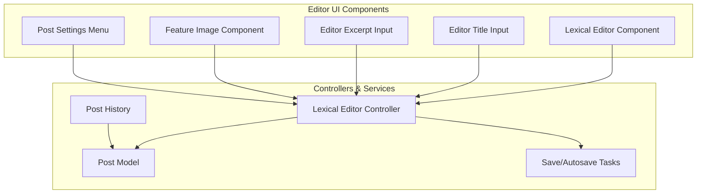
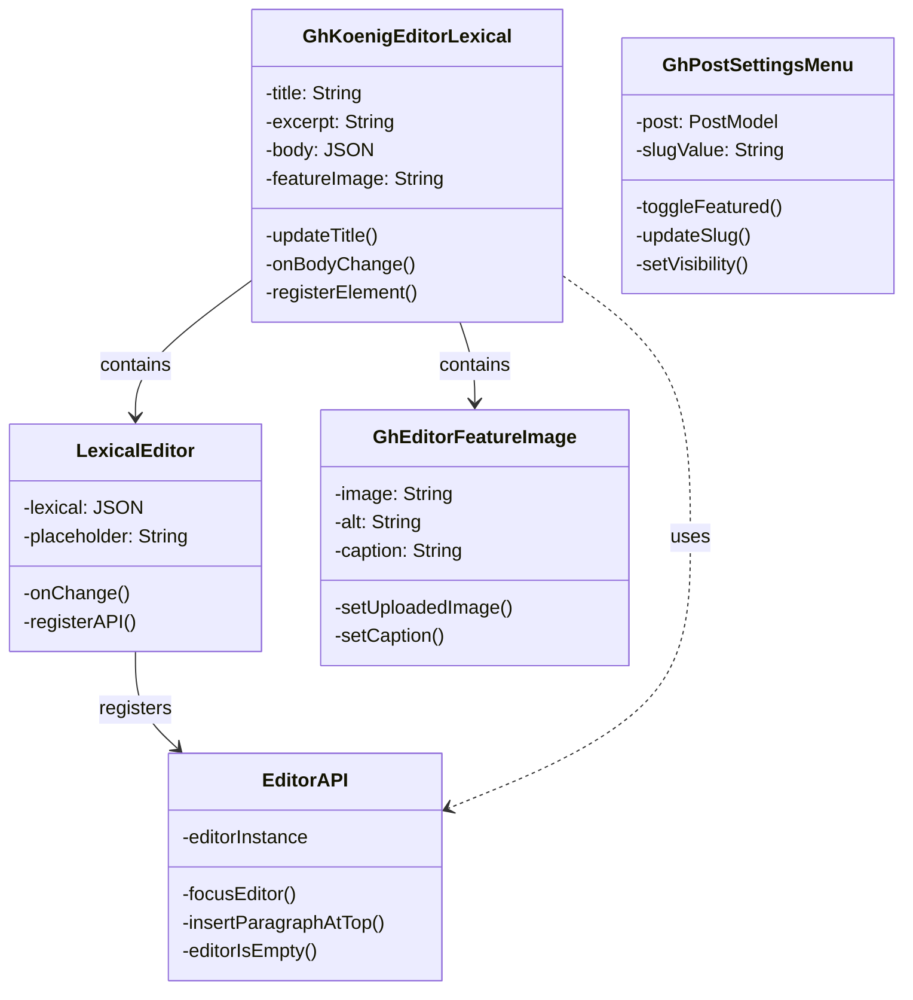
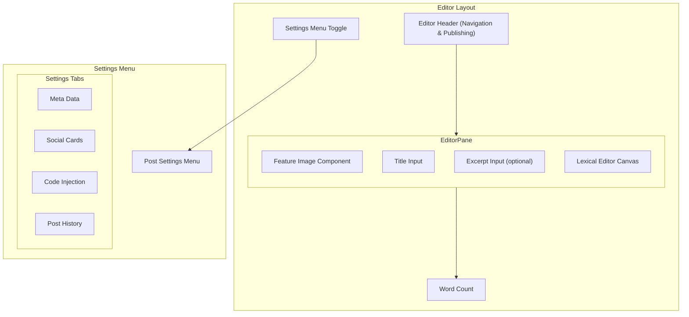
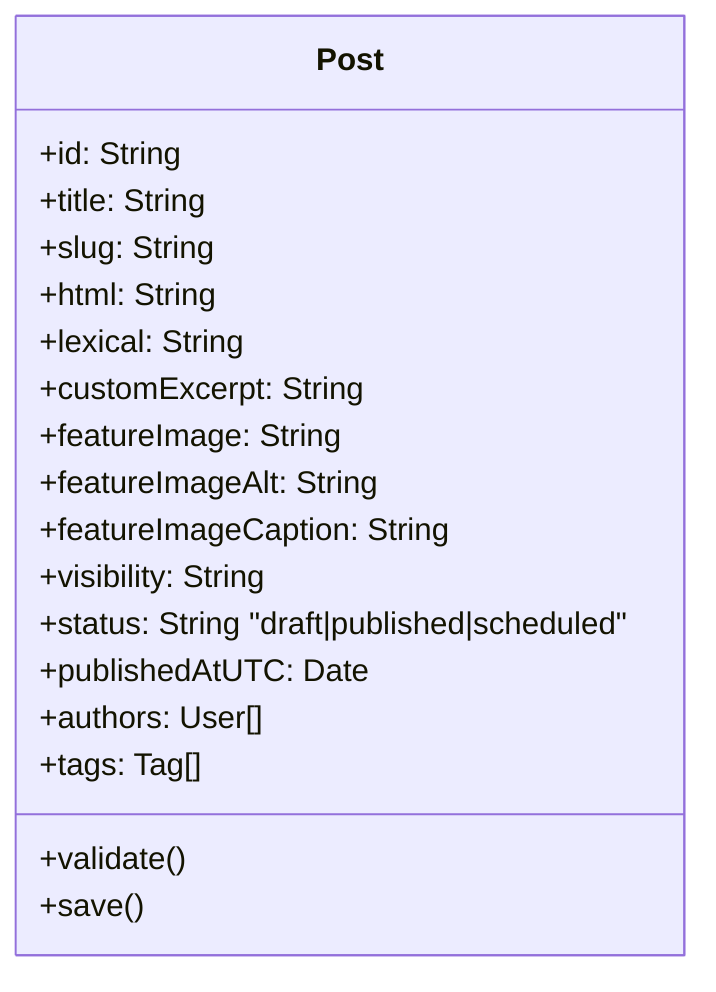
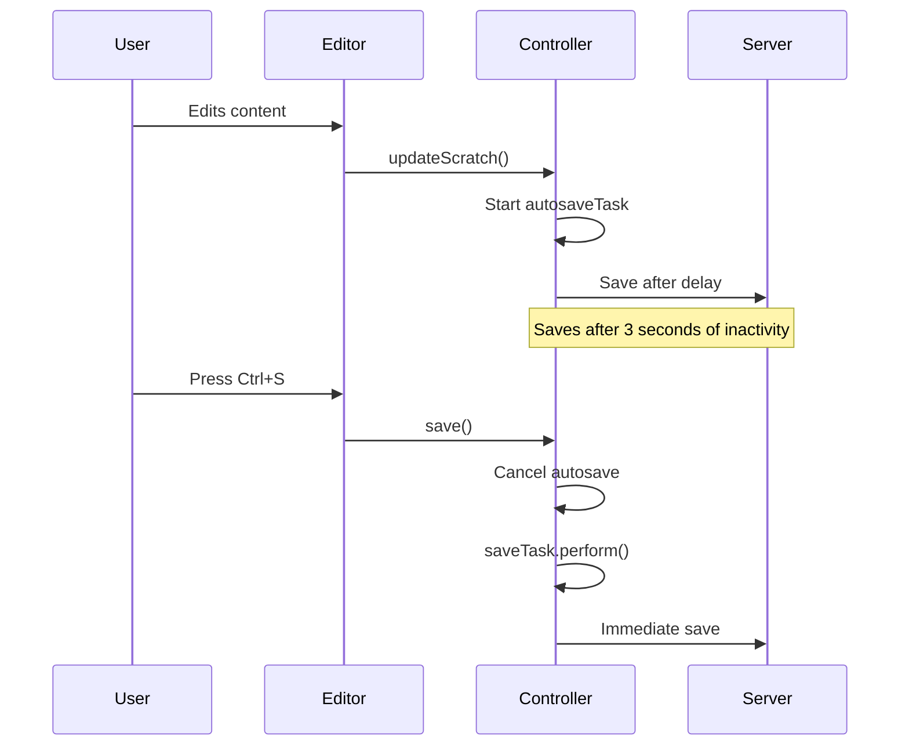
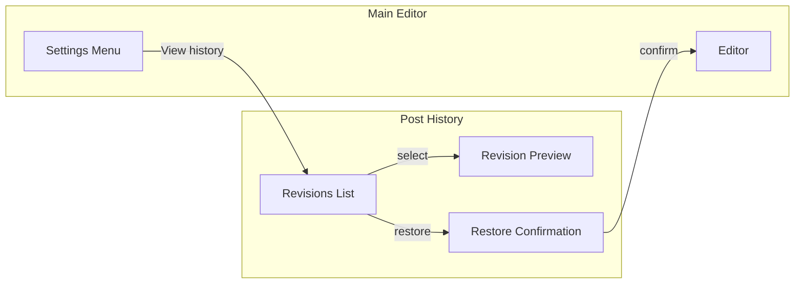

# Editor System

<details>
<summary>Relevant source files</summary>

The following files were used as context for generating this wiki page:

- [ghost/admin/app/adapters/snippet.js](https://github.com/TryGhost/Ghost/blob/0d0e5bd3/ghost/admin/app/adapters/snippet.js)
- [ghost/admin/app/components/editor/modals/update-snippet.hbs](https://github.com/TryGhost/Ghost/blob/0d0e5bd3/ghost/admin/app/components/editor/modals/update-snippet.hbs)
- [ghost/admin/app/components/editor/modals/update-snippet.js](https://github.com/TryGhost/Ghost/blob/0d0e5bd3/ghost/admin/app/components/editor/modals/update-snippet.js)
- [ghost/admin/app/components/gh-editor-feature-image.hbs](https://github.com/TryGhost/Ghost/blob/0d0e5bd3/ghost/admin/app/components/gh-editor-feature-image.hbs)
- [ghost/admin/app/components/gh-editor-feature-image.js](https://github.com/TryGhost/Ghost/blob/0d0e5bd3/ghost/admin/app/components/gh-editor-feature-image.js)
- [ghost/admin/app/components/gh-koenig-editor-lexical.hbs](https://github.com/TryGhost/Ghost/blob/0d0e5bd3/ghost/admin/app/components/gh-koenig-editor-lexical.hbs)
- [ghost/admin/app/components/gh-koenig-editor-lexical.js](https://github.com/TryGhost/Ghost/blob/0d0e5bd3/ghost/admin/app/components/gh-koenig-editor-lexical.js)
- [ghost/admin/app/components/gh-post-settings-menu.hbs](https://github.com/TryGhost/Ghost/blob/0d0e5bd3/ghost/admin/app/components/gh-post-settings-menu.hbs)
- [ghost/admin/app/components/gh-post-settings-menu.js](https://github.com/TryGhost/Ghost/blob/0d0e5bd3/ghost/admin/app/components/gh-post-settings-menu.js)
- [ghost/admin/app/components/gh-uploader.js](https://github.com/TryGhost/Ghost/blob/0d0e5bd3/ghost/admin/app/components/gh-uploader.js)
- [ghost/admin/app/components/icons/eye-open-close.hbs](https://github.com/TryGhost/Ghost/blob/0d0e5bd3/ghost/admin/app/components/icons/eye-open-close.hbs)
- [ghost/admin/app/components/koenig-lexical-editor.js](https://github.com/TryGhost/Ghost/blob/0d0e5bd3/ghost/admin/app/components/koenig-lexical-editor.js)
- [ghost/admin/app/components/modal-post-history.hbs](https://github.com/TryGhost/Ghost/blob/0d0e5bd3/ghost/admin/app/components/modal-post-history.hbs)
- [ghost/admin/app/components/modal-post-history.js](https://github.com/TryGhost/Ghost/blob/0d0e5bd3/ghost/admin/app/components/modal-post-history.js)
- [ghost/admin/app/controllers/lexical-editor.js](https://github.com/TryGhost/Ghost/blob/0d0e5bd3/ghost/admin/app/controllers/lexical-editor.js)
- [ghost/admin/app/models/post.js](https://github.com/TryGhost/Ghost/blob/0d0e5bd3/ghost/admin/app/models/post.js)
- [ghost/admin/app/models/snippet.js](https://github.com/TryGhost/Ghost/blob/0d0e5bd3/ghost/admin/app/models/snippet.js)
- [ghost/admin/app/models/theme.js](https://github.com/TryGhost/Ghost/blob/0d0e5bd3/ghost/admin/app/models/theme.js)
- [ghost/admin/app/serializers/snippet.js](https://github.com/TryGhost/Ghost/blob/0d0e5bd3/ghost/admin/app/serializers/snippet.js)
- [ghost/admin/app/styles/components/koenig.css](https://github.com/TryGhost/Ghost/blob/0d0e5bd3/ghost/admin/app/styles/components/koenig.css)
- [ghost/admin/app/styles/components/settings-menu.css](https://github.com/TryGhost/Ghost/blob/0d0e5bd3/ghost/admin/app/styles/components/settings-menu.css)
- [ghost/admin/app/styles/layouts/editor.css](https://github.com/TryGhost/Ghost/blob/0d0e5bd3/ghost/admin/app/styles/layouts/editor.css)
- [ghost/admin/app/styles/layouts/post-history.css](https://github.com/TryGhost/Ghost/blob/0d0e5bd3/ghost/admin/app/styles/layouts/post-history.css)
- [ghost/admin/app/styles/patterns/navlist.css](https://github.com/TryGhost/Ghost/blob/0d0e5bd3/ghost/admin/app/styles/patterns/navlist.css)
- [ghost/admin/app/templates/lexical-editor.hbs](https://github.com/TryGhost/Ghost/blob/0d0e5bd3/ghost/admin/app/templates/lexical-editor.hbs)
- [ghost/admin/public/assets/icons/audio-upload.svg](https://github.com/TryGhost/Ghost/blob/0d0e5bd3/ghost/admin/public/assets/icons/audio-upload.svg)
- [ghost/admin/public/assets/icons/file-upload.svg](https://github.com/TryGhost/Ghost/blob/0d0e5bd3/ghost/admin/public/assets/icons/file-upload.svg)
- [ghost/admin/public/assets/icons/film-camera.svg](https://github.com/TryGhost/Ghost/blob/0d0e5bd3/ghost/admin/public/assets/icons/film-camera.svg)
- [ghost/admin/tests/acceptance/editor/lexical-test.js](https://github.com/TryGhost/Ghost/blob/0d0e5bd3/ghost/admin/tests/acceptance/editor/lexical-test.js)
- [ghost/admin/tests/unit/controllers/editor-test.js](https://github.com/TryGhost/Ghost/blob/0d0e5bd3/ghost/admin/tests/unit/controllers/editor-test.js)

</details>


This document provides an overview of the Ghost editor system, focusing on the UI components, data flows, and functionality for creating and editing content. The editor system encompasses both the core editing experience and related functionality such as post settings, feature images, and revision history.

For more detailed information about specific editor implementations, see [Lexical Editor](#3.2.1) and [Koenig Editor](#3.2.2).

## Architecture Overview

The editor system in Ghost is based on a component-driven architecture that separates content editing from metadata management and settings. The current editor is built around the Lexical editor framework, which replaced the previous Koenig editor implementation (although the naming "Koenig" is still used in various components).



Sources:
- [ghost/admin/app/controllers/lexical-editor.js:1-721](https://github.com/TryGhost/Ghost/blob/0d0e5bd3/ghost/admin/app/controllers/lexical-editor.js:1-721#L1-L721)
- [ghost/admin/app/templates/lexical-editor.hbs:1-165](https://github.com/TryGhost/Ghost/blob/0d0e5bd3/ghost/admin/app/templates/lexical-editor.hbs:1-165#L1-L165)
- [ghost/admin/app/components/koenig-lexical-editor.js:1-690](https://github.com/TryGhost/Ghost/blob/0d0e5bd3/ghost/admin/app/components/koenig-lexical-editor.js:1-690#L1-L690)

## Editor Components

The editor system consists of several key components that work together to provide the content editing experience:



Sources:
- [ghost/admin/app/components/gh-koenig-editor-lexical.js:1-206](https://github.com/TryGhost/Ghost/blob/0d0e5bd3/ghost/admin/app/components/gh-koenig-editor-lexical.js:1-206#L1-L206)
- [ghost/admin/app/components/gh-koenig-editor-lexical.hbs:1-108](https://github.com/TryGhost/Ghost/blob/0d0e5bd3/ghost/admin/app/components/gh-koenig-editor-lexical.hbs:1-108#L1-L108)
- [ghost/admin/app/components/koenig-lexical-editor.js:139-147](https://github.com/TryGhost/Ghost/blob/0d0e5bd3/ghost/admin/app/components/koenig-lexical-editor.js:139-147#L139-L147)

### Lexical Editor Integration

The core editor is based on the Lexical framework, which is integrated into Ghost through the `KoenigLexicalEditor` component. This component renders a React-based editor inside an Ember application.

Key features of the Lexical editor integration:

- JSON-based content format stored in the `lexical` property of the post model
- Support for custom cards and extensions
- Bidirectional communication between the Ember application and the React editor component via an API object
- Error handling and fallback rendering

The editor uses a wrapper component to handle the React integration:

```javascript
const KoenigEditor = ({editorResource, ...props}) => {
    const {KoenigEditor: _KoenigEditor} = editorResource.read();
    return <_KoenigEditor {...props} />;
};
```

Sources:
- [ghost/admin/app/components/koenig-lexical-editor.js:144-147](https://github.com/TryGhost/Ghost/blob/0d0e5bd3/ghost/admin/app/components/koenig-lexical-editor.js:144-147#L144-L147)
- [ghost/admin/app/components/koenig-lexical-editor.js:652-686](https://github.com/TryGhost/Ghost/blob/0d0e5bd3/ghost/admin/app/components/koenig-lexical-editor.js:652-686#L652-L686)
- [ghost/admin/app/models/post.js:105-107](https://github.com/TryGhost/Ghost/blob/0d0e5bd3/ghost/admin/app/models/post.js:105-107#L105-L107)

## Editor Layout and UI

The editor UI consists of several key elements:

1. **Header** - Contains back button, post status, and publish buttons
2. **Title Input** - Large input for the post title
3. **Excerpt Input** (optional) - Input for custom excerpt
4. **Feature Image** - Component for uploading and managing the post's feature image
5. **Editor Canvas** - The main content editing area
6. **Word Count** - Displays the post's word count
7. **Settings Menu** - Side panel for configuring post settings



Sources:
- [ghost/admin/app/styles/layouts/editor.css:285-297](https://github.com/TryGhost/Ghost/blob/0d0e5bd3/ghost/admin/app/styles/layouts/editor.css:285-297#L285-L297)
- [ghost/admin/app/templates/lexical-editor.hbs:8-110](https://github.com/TryGhost/Ghost/blob/0d0e5bd3/ghost/admin/app/templates/lexical-editor.hbs:8-110#L8-L110)
- [ghost/admin/app/components/gh-koenig-editor-lexical.hbs:1-107](https://github.com/TryGhost/Ghost/blob/0d0e5bd3/ghost/admin/app/components/gh-koenig-editor-lexical.hbs:1-107#L1-L107)

### Feature Image Component

The feature image component allows users to upload, edit, and manage post feature images. It includes:

- Drag and drop support
- Image uploads through file dialog
- Unsplash integration
- Alt text editing
- Caption editing with Lexical editor

The component handles both the UI for image selection and the management of feature image metadata (alt text and caption).

Sources:
- [ghost/admin/app/components/gh-editor-feature-image.hbs:1-121](https://github.com/TryGhost/Ghost/blob/0d0e5bd3/ghost/admin/app/components/gh-editor-feature-image.hbs:1-121#L1-L121)
- [ghost/admin/app/components/gh-editor-feature-image.js:1-106](https://github.com/TryGhost/Ghost/blob/0d0e5bd3/ghost/admin/app/components/gh-editor-feature-image.js:1-106#L1-L106)
- [ghost/admin/app/styles/layouts/editor.css:505-533](https://github.com/TryGhost/Ghost/blob/0d0e5bd3/ghost/admin/app/styles/layouts/editor.css:505-533#L505-L533)

## Post Settings Menu

The post settings menu provides an interface for managing post metadata and settings. It's implemented as a slide-out panel that contains several sections:

1. **Basic Settings** - URL, publish date, tags, visibility, and excerpt
2. **Feature Toggles** - Featured post, show/hide title and feature image
3. **Advanced Tabs** - Code injection, meta data, social cards, and keyboard shortcuts

The post settings menu is toggled using a button in the top-right corner of the editor.

Key functionality includes:

- Post URL/slug editing
- Scheduling or backdating posts
- Tag management
- Content visibility settings (public, members-only, paid-members-only, specific tiers)
- Custom template selection
- Post history access

Sources:
- [ghost/admin/app/components/gh-post-settings-menu.hbs:1-370](https://github.com/TryGhost/Ghost/blob/0d0e5bd3/ghost/admin/app/components/gh-post-settings-menu.hbs:1-370#L1-L370)
- [ghost/admin/app/components/gh-post-settings-menu.js:1-585](https://github.com/TryGhost/Ghost/blob/0d0e5bd3/ghost/admin/app/components/gh-post-settings-menu.js:1-585#L1-L585)
- [ghost/admin/app/styles/components/settings-menu.css:1-480](https://github.com/TryGhost/Ghost/blob/0d0e5bd3/ghost/admin/app/styles/components/settings-menu.css:1-480#L1-L480)

## Data Management

### Post Model

The post model represents the core data structure for posts and pages. It contains all the properties that define a post:



The post model includes various computed properties and observers that help manage the post's state, such as:

- `isPublished`, `isDraft`, `isScheduled` - Status indicators
- `titleScratch`, `lexicalScratch` - Temporary storage for unsaved changes
- `showTitleAndFeatureImage` - Toggle for displaying title and feature image

Sources:
- [ghost/admin/app/models/post.js:69-625](https://github.com/TryGhost/Ghost/blob/0d0e5bd3/ghost/admin/app/models/post.js:69-625#L69-L625)
- [ghost/admin/app/validators/post.js:1-101](https://github.com/TryGhost/Ghost/blob/0d0e5bd3/ghost/admin/app/validators/post.js:1-101#L1-L101)

### Saving and Autosaving

The editor system implements both manual saving and autosaving functionality:



Key features of the saving system:

- Automatic saving after 3 seconds of inactivity (`AUTOSAVE_TIMEOUT`)
- Forced save after 60 seconds of continuous editing (`TIMEDSAVE_TIMEOUT`)
- Manual saving with keyboard shortcuts
- Background saves for draft posts
- Save status indicators
- Validation before saving

Sources:
- [ghost/admin/app/controllers/lexical-editor.js:38-40](https://github.com/TryGhost/Ghost/blob/0d0e5bd3/ghost/admin/app/controllers/lexical-editor.js:38-40#L38-L40)
- [ghost/admin/app/controllers/lexical-editor.js:311-323](https://github.com/TryGhost/Ghost/blob/0d0e5bd3/ghost/admin/app/controllers/lexical-editor.js:311-323#L311-L323)
- [ghost/admin/app/controllers/lexical-editor.js:575-586](https://github.com/TryGhost/Ghost/blob/0d0e5bd3/ghost/admin/app/controllers/lexical-editor.js:575-586#L575-L586)

## Post History and Revisions

The editor system includes functionality for viewing and restoring post revisions. Revisions are automatically created when posts are saved, and users can access the revision history through the post settings menu.

The post history modal displays:
- A list of revisions with dates, times, and authors
- Preview of the selected revision
- Option to restore a previous revision



Sources:
- [ghost/admin/app/components/modal-post-history.js:1-183](https://github.com/TryGhost/Ghost/blob/0d0e5bd3/ghost/admin/app/components/modal-post-history.js:1-183#L1-L183)
- [ghost/admin/app/components/modal-post-history.hbs:1-103](https://github.com/TryGhost/Ghost/blob/0d0e5bd3/ghost/admin/app/components/modal-post-history.hbs:1-103#L1-L103)
- [ghost/admin/app/styles/layouts/post-history.css:1-219](https://github.com/TryGhost/Ghost/blob/0d0e5bd3/ghost/admin/app/styles/layouts/post-history.css:1-219#L1-L219)

## Special Features

### TK Indicators

TK indicators help identify content that needs attention or further work. The editor system checks for "TK" markers in:
- Post title
- Post excerpt
- Post content
- Feature image caption

When TK markers are found, indicators are displayed next to the respective content areas to make them easily visible to the editor.

Sources:
- [ghost/admin/app/controllers/lexical-editor.js:42-146](https://github.com/TryGhost/Ghost/blob/0d0e5bd3/ghost/admin/app/controllers/lexical-editor.js:42-146#L42-L146)
- [ghost/admin/app/controllers/lexical-editor.js:302-308](https://github.com/TryGhost/Ghost/blob/0d0e5bd3/ghost/admin/app/controllers/lexical-editor.js:302-308#L302-L308)
- [ghost/admin/app/components/gh-koenig-editor-lexical.hbs:32-38](https://github.com/TryGhost/Ghost/blob/0d0e5bd3/ghost/admin/app/components/gh-koenig-editor-lexical.hbs:32-38#L32-L38)

### Visibility and Access Controls

The editor provides controls for restricting content access based on membership levels:

1. **Public** - Accessible to everyone
2. **Members only** - Only accessible to members (free or paid)
3. **Paid-members only** - Only accessible to paying members
4. **Specific tier(s)** - Restricted to specific membership tiers

These visibility settings are managed through the post settings menu and stored in the post's `visibility` and `tiers` properties.

Sources:
- [ghost/admin/app/components/gh-psm-visibility-input.js:1-43](https://github.com/TryGhost/Ghost/blob/0d0e5bd3/ghost/admin/app/components/gh-psm-visibility-input.js:1-43#L1-L43)
- [ghost/admin/app/components/gh-psm-visibility-input.hbs:1-11](https://github.com/TryGhost/Ghost/blob/0d0e5bd3/ghost/admin/app/components/gh-psm-visibility-input.hbs:1-11#L1-L11)
- [ghost/admin/app/models/post.js:250-268](https://github.com/TryGhost/Ghost/blob/0d0e5bd3/ghost/admin/app/models/post.js:250-268#L250-L268)

## Editor API

The editor system exposes an API object that allows other components to interact with the editor. This API is registered with the editor controller and provides methods for:

- Focusing the editor
- Inserting content (paragraphs, cards, etc.)
- Checking if the editor is empty
- Parsing and setting editor state

The API is used by various components, including the feature image, post settings menu, and post history.

Sources:
- [ghost/admin/app/controllers/lexical-editor.js:465-472](https://github.com/TryGhost/Ghost/blob/0d0e5bd3/ghost/admin/app/controllers/lexical-editor.js:465-472#L465-L472)