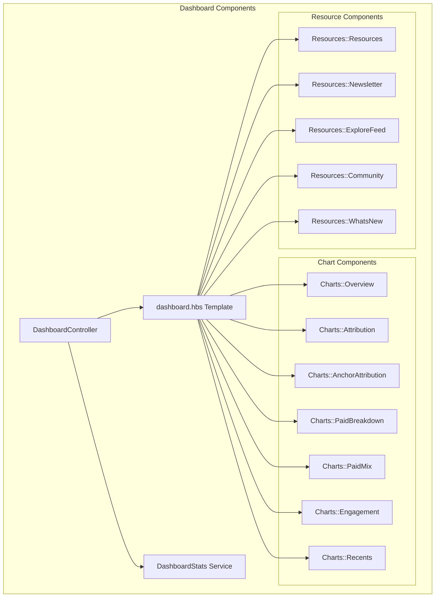
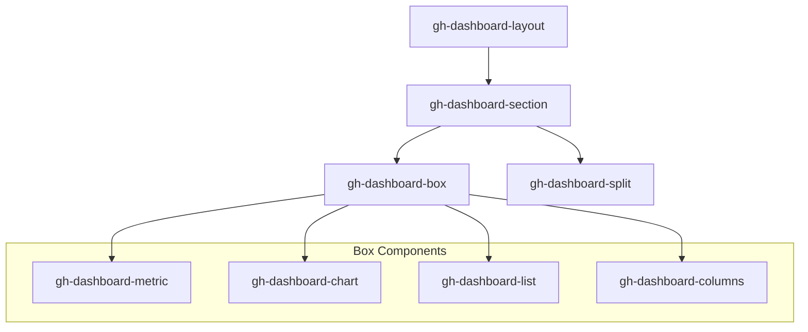
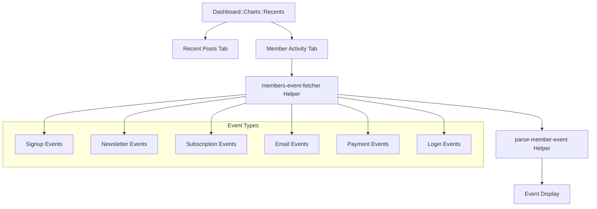
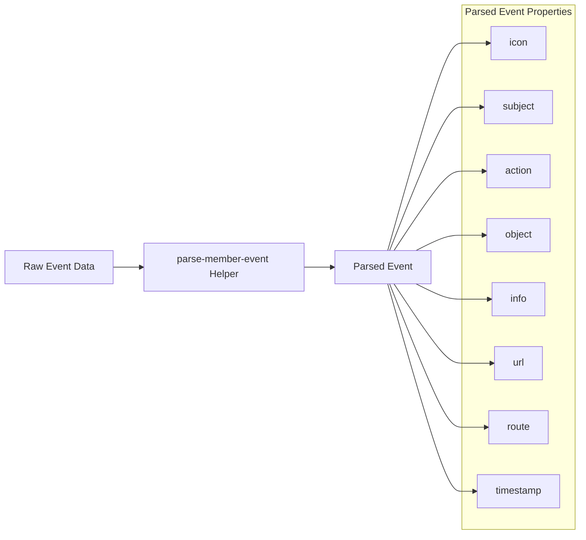
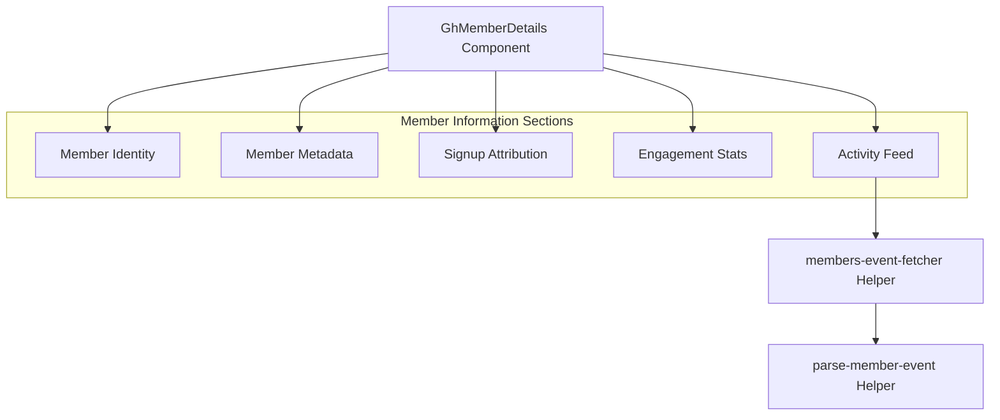
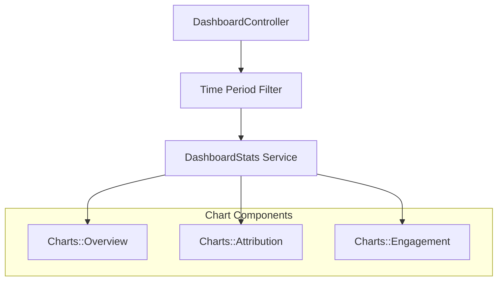
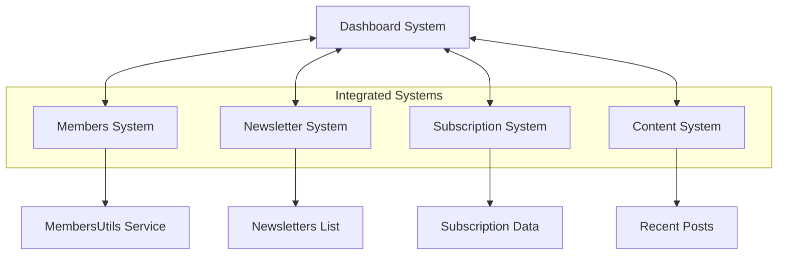

# Dashboard and Analytics

Relevant source files

The following files were used as context for generating this wiki page:

- [ghost/admin/app/components/dashboard/charts/recents.hbs](https://github.com/TryGhost/Ghost/blob/0d0e5bd3/ghost/admin/app/components/dashboard/charts/recents.hbs)
- [ghost/admin/app/components/gh-member-details.hbs](https://github.com/TryGhost/Ghost/blob/0d0e5bd3/ghost/admin/app/components/gh-member-details.hbs)
- [ghost/admin/app/components/gh-member-details.js](https://github.com/TryGhost/Ghost/blob/0d0e5bd3/ghost/admin/app/components/gh-member-details.js)
- [ghost/admin/app/components/gh-member-settings-form.hbs](https://github.com/TryGhost/Ghost/blob/0d0e5bd3/ghost/admin/app/components/gh-member-settings-form.hbs)
- [ghost/admin/app/components/gh-member-settings-form.js](https://github.com/TryGhost/Ghost/blob/0d0e5bd3/ghost/admin/app/components/gh-member-settings-form.js)
- [ghost/admin/app/components/gh-psm-authors-input.hbs](https://github.com/TryGhost/Ghost/blob/0d0e5bd3/ghost/admin/app/components/gh-psm-authors-input.hbs)
- [ghost/admin/app/components/gh-psm-visibility-input.hbs](https://github.com/TryGhost/Ghost/blob/0d0e5bd3/ghost/admin/app/components/gh-psm-visibility-input.hbs)
- [ghost/admin/app/components/member/activity-feed.hbs](https://github.com/TryGhost/Ghost/blob/0d0e5bd3/ghost/admin/app/components/member/activity-feed.hbs)
- [ghost/admin/app/components/member/subscription-detail-box.hbs](https://github.com/TryGhost/Ghost/blob/0d0e5bd3/ghost/admin/app/components/member/subscription-detail-box.hbs)
- [ghost/admin/app/components/member/subscription-detail-box.js](https://github.com/TryGhost/Ghost/blob/0d0e5bd3/ghost/admin/app/components/member/subscription-detail-box.js)
- [ghost/admin/app/components/members-activity/table-row.hbs](https://github.com/TryGhost/Ghost/blob/0d0e5bd3/ghost/admin/app/components/members-activity/table-row.hbs)
- [ghost/admin/app/components/members-activity/table.hbs](https://github.com/TryGhost/Ghost/blob/0d0e5bd3/ghost/admin/app/components/members-activity/table.hbs)
- [ghost/admin/app/components/modal-member-tier.hbs](https://github.com/TryGhost/Ghost/blob/0d0e5bd3/ghost/admin/app/components/modal-member-tier.hbs)
- [ghost/admin/app/components/modal-member-tier.js](https://github.com/TryGhost/Ghost/blob/0d0e5bd3/ghost/admin/app/components/modal-member-tier.js)
- [ghost/admin/app/controllers/dashboard.js](https://github.com/TryGhost/Ghost/blob/0d0e5bd3/ghost/admin/app/controllers/dashboard.js)
- [ghost/admin/app/helpers/first-name.js](https://github.com/TryGhost/Ghost/blob/0d0e5bd3/ghost/admin/app/helpers/first-name.js)
- [ghost/admin/app/helpers/parse-member-event.js](https://github.com/TryGhost/Ghost/blob/0d0e5bd3/ghost/admin/app/helpers/parse-member-event.js)
- [ghost/admin/app/services/data-cache.js](https://github.com/TryGhost/Ghost/blob/0d0e5bd3/ghost/admin/app/services/data-cache.js)
- [ghost/admin/app/styles/components/lists.css](https://github.com/TryGhost/Ghost/blob/0d0e5bd3/ghost/admin/app/styles/components/lists.css)
- [ghost/admin/app/styles/layouts/dashboard.css](https://github.com/TryGhost/Ghost/blob/0d0e5bd3/ghost/admin/app/styles/layouts/dashboard.css)
- [ghost/admin/app/styles/layouts/member-activity.css](https://github.com/TryGhost/Ghost/blob/0d0e5bd3/ghost/admin/app/styles/layouts/member-activity.css)
- [ghost/admin/app/styles/layouts/members.css](https://github.com/TryGhost/Ghost/blob/0d0e5bd3/ghost/admin/app/styles/layouts/members.css)
- [ghost/admin/app/templates/dashboard.hbs](https://github.com/TryGhost/Ghost/blob/0d0e5bd3/ghost/admin/app/templates/dashboard.hbs)
- [ghost/admin/app/templates/members-activity.hbs](https://github.com/TryGhost/Ghost/blob/0d0e5bd3/ghost/admin/app/templates/members-activity.hbs)
- [ghost/admin/app/utils/subscription-data.js](https://github.com/TryGhost/Ghost/blob/0d0e5bd3/ghost/admin/app/utils/subscription-data.js)
- [ghost/admin/tests/acceptance/members/details-test.js](https://github.com/TryGhost/Ghost/blob/0d0e5bd3/ghost/admin/tests/acceptance/members/details-test.js)
- [ghost/admin/tests/unit/utils/subscription-data-test.js](https://github.com/TryGhost/Ghost/blob/0d0e5bd3/ghost/admin/tests/unit/utils/subscription-data-test.js)

This document covers the Ghost admin dashboard and analytics features, which provide site owners with key metrics, member activity tracking, and content performance insights. For information about content analytics specifically, see [Content Analytics](#3.5).

## Overview

The Dashboard in Ghost serves as a central hub for monitoring site performance, member activity, and content engagement. It provides a comprehensive view of key metrics including member growth, subscription revenue, newsletter engagement, and recent activity.

The dashboard is designed to be modular, with different components displayed based on the site's configuration (e.g., whether members, paid subscriptions, or newsletters are enabled).

Sources:
- [ghost/admin/app/templates/dashboard.hbs:1-143](https://github.com/TryGhost/Ghost/blob/0d0e5bd3/ghost/admin/app/templates/dashboard.hbs:1-143#L1-L143)
- [ghost/admin/app/controllers/dashboard.js:1-131](https://github.com/TryGhost/Ghost/blob/0d0e5bd3/ghost/admin/app/controllers/dashboard.js:1-131#L1-L131)

## Dashboard Architecture

Sources:
- [ghost/admin/app/templates/dashboard.hbs:83-134](https://github.com/TryGhost/Ghost/blob/0d0e5bd3/ghost/admin/app/templates/dashboard.hbs:83-134#L83-L134)
- [ghost/admin/app/controllers/dashboard.js:19-25](https://github.com/TryGhost/Ghost/blob/0d0e5bd3/ghost/admin/app/controllers/dashboard.js:19-25#L19-L25)

## Dashboard Layout and Styling

The dashboard uses a responsive grid layout with various box components for different metrics and data visualizations. The layout is controlled by CSS classes that define the positioning, spacing, and appearance of dashboard elements.

Key layout components include:
- `.gh-dashboard-layout`: Main container for the dashboard
- `.gh-dashboard-section`: Sections within the dashboard
- `.gh-dashboard-box`: Individual content boxes
- `.gh-dashboard-split`: Two-column layout for side-by-side components

Sources:
- [ghost/admin/app/styles/layouts/dashboard.css:11-15](https://github.com/TryGhost/Ghost/blob/0d0e5bd3/ghost/admin/app/styles/layouts/dashboard.css:11-15#L11-L15)
- [ghost/admin/app/styles/layouts/dashboard.css:30-45](https://github.com/TryGhost/Ghost/blob/0d0e5bd3/ghost/admin/app/styles/layouts/dashboard.css:30-45#L30-L45)
- [ghost/admin/app/styles/layouts/dashboard.css:78-91](https://github.com/TryGhost/Ghost/blob/0d0e5bd3/ghost/admin/app/styles/layouts/dashboard.css:78-91#L78-L91)

## Dashboard Components

### Charts and Metrics

The dashboard displays various charts and metrics depending on the site's configuration:

1. **Overview Charts**: Shows member growth and revenue metrics when paid memberships are enabled
2. **Attribution Charts**: Displays member acquisition sources and referrers
3. **Engagement Charts**: Shows newsletter open rates and engagement metrics
4. **Paid Breakdown**: Displays revenue breakdown by subscription type
5. **Recent Activity**: Shows recent posts and member activity

Each chart component is responsible for fetching and displaying its own data, with time period filtering controlled by the main dashboard controller.

Sources:
- [ghost/admin/app/templates/dashboard.hbs:92-96](https://github.com/TryGhost/Ghost/blob/0d0e5bd3/ghost/admin/app/templates/dashboard.hbs:92-96#L92-L96)
- [ghost/admin/app/templates/dashboard.hbs:106-110](https://github.com/TryGhost/Ghost/blob/0d0e5bd3/ghost/admin/app/templates/dashboard.hbs:106-110#L106-L110)
- [ghost/admin/app/components/dashboard/charts/recents.hbs:1-150](https://github.com/TryGhost/Ghost/blob/0d0e5bd3/ghost/admin/app/components/dashboard/charts/recents.hbs:1-150#L1-L150)

### Recent Activity Tracking

The Recent Activity section shows both recent posts and member activity in a tabbed interface. The member activity tab displays events such as subscriptions, newsletter interactions, and payments.

Sources:
- [ghost/admin/app/components/dashboard/charts/recents.hbs:4-14](https://github.com/TryGhost/Ghost/blob/0d0e5bd3/ghost/admin/app/components/dashboard/charts/recents.hbs:4-14#L4-L14)
- [ghost/admin/app/components/dashboard/charts/recents.hbs:76-92](https://github.com/TryGhost/Ghost/blob/0d0e5bd3/ghost/admin/app/components/dashboard/charts/recents.hbs:76-92#L76-L92)
- [ghost/admin/app/helpers/parse-member-event.js:25-64](https://github.com/TryGhost/Ghost/blob/0d0e5bd3/ghost/admin/app/helpers/parse-member-event.js:25-64#L25-L64)

## Member Activity System

The member activity system tracks and displays various events related to members, including:

1. **Signup events**: When a new member joins
2. **Newsletter events**: Subscriptions and unsubscriptions to newsletters
3. **Email events**: Email opens, clicks, and deliveries
4. **Subscription events**: Paid subscription creations, updates, and cancellations
5. **Login events**: Member logins
6. **Payment events**: One-time payments and donations

### Event Parsing and Display

Member events are processed through the `parse-member-event` helper, which transforms raw event data into a standardized format for display. This includes:

- Determining the appropriate icon for the event
- Generating a human-readable action description
- Extracting relevant metadata (e.g., subscription amounts, email details)
- Creating links to related content when applicable

Sources:
- [ghost/admin/app/helpers/parse-member-event.js:25-64](https://github.com/TryGhost/Ghost/blob/0d0e5bd3/ghost/admin/app/helpers/parse-member-event.js:25-64#L25-L64)
- [ghost/admin/app/helpers/parse-member-event.js:68-144](https://github.com/TryGhost/Ghost/blob/0d0e5bd3/ghost/admin/app/helpers/parse-member-event.js:68-144#L68-L144)
- [ghost/admin/app/helpers/parse-member-event.js:146-247](https://github.com/TryGhost/Ghost/blob/0d0e5bd3/ghost/admin/app/helpers/parse-member-event.js:146-247#L146-L247)

### Activity Feed Components

The activity feed is displayed in multiple places:

1. **Dashboard Recent Activity**: Shows the most recent member events
2. **Member Details Activity Feed**: Shows activity for a specific member
3. **Members Activity Page**: Dedicated page for viewing and filtering all member activity

Each implementation uses the same underlying components and helpers to fetch, parse, and display member events.

Sources:
- [ghost/admin/app/components/dashboard/charts/recents.hbs:69-147](https://github.com/TryGhost/Ghost/blob/0d0e5bd3/ghost/admin/app/components/dashboard/charts/recents.hbs:69-147#L69-L147)
- [ghost/admin/app/components/member/activity-feed.hbs:1-71](https://github.com/TryGhost/Ghost/blob/0d0e5bd3/ghost/admin/app/components/member/activity-feed.hbs:1-71#L1-L71)
- [ghost/admin/app/templates/members-activity.hbs:1-56](https://github.com/TryGhost/Ghost/blob/0d0e5bd3/ghost/admin/app/templates/members-activity.hbs:1-56#L1-L56)

## Member Details and Analytics

The member details view provides comprehensive information about individual members, including:

1. **Basic Information**: Name, email, location, and last seen date
2. **Signup Information**: Creation date, source, and attribution
3. **Engagement Metrics**: Email open rates and activity statistics
4. **Subscription Details**: Current and past subscription information
5. **Activity Feed**: Recent member events

Sources:
- [ghost/admin/app/components/gh-member-details.hbs:1-115](https://github.com/TryGhost/Ghost/blob/0d0e5bd3/ghost/admin/app/components/gh-member-details.hbs:1-115#L1-L115)
- [ghost/admin/app/components/gh-member-settings-form.hbs:1-297](https://github.com/TryGhost/Ghost/blob/0d0e5bd3/ghost/admin/app/components/gh-member-settings-form.hbs:1-297#L1-L297)
- [ghost/admin/app/components/member/activity-feed.hbs:1-71](https://github.com/TryGhost/Ghost/blob/0d0e5bd3/ghost/admin/app/components/member/activity-feed.hbs:1-71#L1-L71)

### Subscription Analytics

For members with paid subscriptions, the dashboard and member details views display subscription-related information:

1. **Subscription Status**: Active, canceled, or expiring
2. **Payment Details**: Amount, currency, and renewal date
3. **Tier Information**: Associated membership tier
4. **Subscription History**: Past subscriptions and changes

The system uses helper functions to process and format subscription data for display.

Sources:
- [ghost/admin/app/components/gh-member-settings-form.hbs:82-279](https://github.com/TryGhost/Ghost/blob/0d0e5bd3/ghost/admin/app/components/gh-member-settings-form.hbs:82-279#L82-L279)
- [ghost/admin/app/utils/subscription-data.js:1-117](https://github.com/TryGhost/Ghost/blob/0d0e5bd3/ghost/admin/app/utils/subscription-data.js:1-117#L1-L117)
- [ghost/admin/app/components/member/subscription-detail-box.hbs:1-54](https://github.com/TryGhost/Ghost/blob/0d0e5bd3/ghost/admin/app/components/member/subscription-detail-box.hbs:1-54#L1-L54)

## Time Period Filtering

The dashboard supports filtering data by different time periods:

- 7 days
- 30 days
- 90 days

This filtering is controlled by the `DashboardController` and affects all chart components that display time-based data. The selected time period is stored in the `dashboardStats` service to ensure consistency across components.

Sources:
- [ghost/admin/app/controllers/dashboard.js:8-17](https://github.com/TryGhost/Ghost/blob/0d0e5bd3/ghost/admin/app/controllers/dashboard.js:8-17#L8-L17)
- [ghost/admin/app/controllers/dashboard.js:90-106](https://github.com/TryGhost/Ghost/blob/0d0e5bd3/ghost/admin/app/controllers/dashboard.js:90-106#L90-L106)
- [ghost/admin/app/templates/dashboard.hbs:65-78](https://github.com/TryGhost/Ghost/blob/0d0e5bd3/ghost/admin/app/templates/dashboard.hbs:65-78#L65-L78)

## Data Caching

The dashboard uses a data caching service to improve performance by storing fetched data temporarily. This prevents unnecessary API calls when navigating between different sections of the admin interface.

The `DataCacheService` provides methods for:
- Setting data with a specified lifetime
- Retrieving cached data
- Clearing the cache

Sources:
- [ghost/admin/app/services/data-cache.js:1-38](https://github.com/TryGhost/Ghost/blob/0d0e5bd3/ghost/admin/app/services/data-cache.js:1-38#L1-L38)

## Responsive Design

The dashboard is designed to be responsive, with different layouts for various screen sizes:

- **Large screens**: Multi-column layout with side-by-side components
- **Medium screens**: Adjusted column widths and chart sizes
- **Small screens**: Single-column layout with stacked components

Media queries in the CSS handle these layout changes, ensuring the dashboard is usable on devices of all sizes.

Sources:
- [ghost/admin/app/styles/layouts/dashboard.css:40-45](https://github.com/TryGhost/Ghost/blob/0d0e5bd3/ghost/admin/app/styles/layouts/dashboard.css:40-45#L40-L45)
- [ghost/admin/app/styles/layouts/dashboard.css:213-243](https://github.com/TryGhost/Ghost/blob/0d0e5bd3/ghost/admin/app/styles/layouts/dashboard.css:213-243#L213-L243)
- [ghost/admin/app/styles/layouts/dashboard.css:1295-1319](https://github.com/TryGhost/Ghost/blob/0d0e5bd3/ghost/admin/app/styles/layouts/dashboard.css:1295-1319#L1295-L1319)

## Integration with Other Systems

The dashboard integrates with several other Ghost systems:

1. **Members System**: Displays member counts, growth, and activity
2. **Newsletter System**: Shows newsletter engagement metrics
3. **Subscription System**: Presents revenue and subscription data
4. **Content System**: Displays recent posts and content performance

This integration provides a comprehensive overview of the site's performance across all key areas.

Sources:
- [ghost/admin/app/controllers/dashboard.js:19-25](https://github.com/TryGhost/Ghost/blob/0d0e5bd3/ghost/admin/app/controllers/dashboard.js:19-25#L19-L25)
- [ghost/admin/app/templates/dashboard.hbs:91-115](https://github.com/TryGhost/Ghost/blob/0d0e5bd3/ghost/admin/app/templates/dashboard.hbs:91-115#L91-L115)
- [ghost/admin/app/components/gh-member-settings-form.js:8-14](https://github.com/TryGhost/Ghost/blob/0d0e5bd3/ghost/admin/app/components/gh-member-settings-form.js:8-14#L8-L14)

## Table Structures and List Components

The dashboard uses several table and list components to display data in an organized manner:

1. **Dashboard List**: Used for recent posts and member activity
2. **Members List**: Displays member information in the members section
3. **Activity List**: Shows detailed member activity with filtering options

These components share common styling but have specific adaptations for their particular data types.

| Component | Purpose | Key Features |
|-----------|---------|--------------|
| gh-dashboard-list | General-purpose list for dashboard | Header, body, and footer sections |
| gh-list-scrolling | Horizontally scrollable list | Sticky headers and responsive behavior |
| gh-members-list | Member-specific list | Avatar display and member metadata |
| gh-dashboard-recents | Recent activity display | Tabbed interface for posts and activity |

Sources:
- [ghost/admin/app/styles/layouts/dashboard.css:685-700](https://github.com/TryGhost/Ghost/blob/0d0e5bd3/ghost/admin/app/styles/layouts/dashboard.css:685-700#L685-L700)
- [ghost/admin/app/styles/components/lists.css:14-21](https://github.com/TryGhost/Ghost/blob/0d0e5bd3/ghost/admin/app/styles/components/lists.css:14-21#L14-L21)
- [ghost/admin/app/styles/layouts/members.css:56-66](https://github.com/TryGhost/Ghost/blob/0d0e5bd3/ghost/admin/app/styles/layouts/members.css:56-66#L56-L66)
- [ghost/admin/app/styles/layouts/member-activity.css:1-17](https://github.com/TryGhost/Ghost/blob/0d0e5bd3/ghost/admin/app/styles/layouts/member-activity.css:1-17#L1-L17)

## Conditional Feature Display

The dashboard adapts its display based on the site's configuration and enabled features:

- Shows paid membership metrics only when paid tiers are enabled
- Displays newsletter engagement only when newsletters are active
- Hides member-related components when members are disabled

This conditional rendering ensures that the dashboard remains relevant and focused on the features that are actually in use.

Sources:
- [ghost/admin/app/templates/dashboard.hbs:91-115](https://github.com/TryGhost/Ghost/blob/0d0e5bd3/ghost/admin/app/templates/dashboard.hbs:91-115#L91-L115)