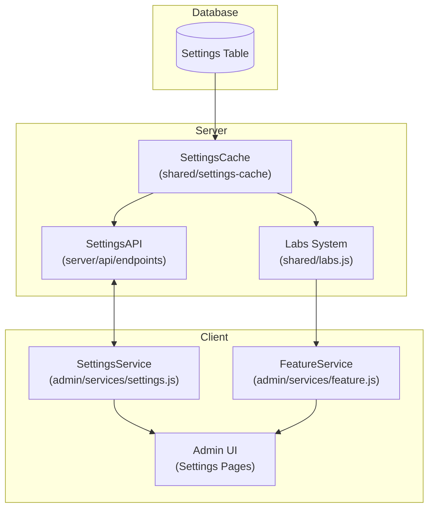
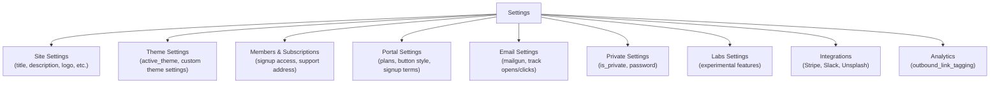
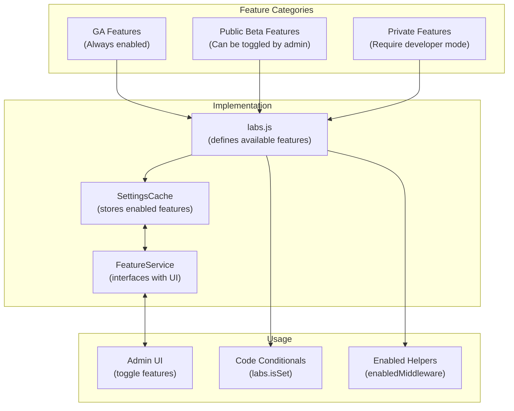
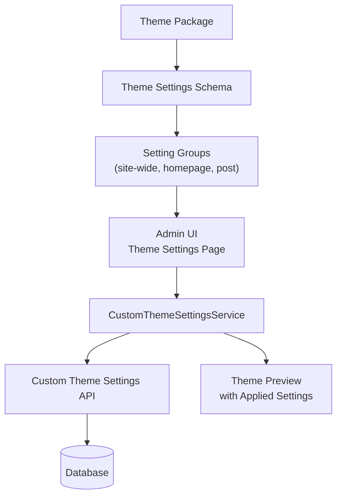

# Settings and Feature Flags

<details>
<summary>Relevant source files</summary>

The following files were used as context for generating this wiki page:

- [apps/admin-x-settings/src/components/settings/advanced/labs/PrivateFeatures.tsx](https://github.com/TryGhost/Ghost/blob/0d0e5bd3/apps/admin-x-settings/src/components/settings/advanced/labs/PrivateFeatures.tsx)
- [ghost/admin/app/services/feature.js](https://github.com/TryGhost/Ghost/blob/0d0e5bd3/ghost/admin/app/services/feature.js)
- [ghost/core/core/server/api/endpoints/utils/serializers/input/settings.js](https://github.com/TryGhost/Ghost/blob/0d0e5bd3/ghost/core/core/server/api/endpoints/utils/serializers/input/settings.js)
- [ghost/core/core/server/api/endpoints/utils/serializers/output/mappers/settings.js](https://github.com/TryGhost/Ghost/blob/0d0e5bd3/ghost/core/core/server/api/endpoints/utils/serializers/output/mappers/settings.js)
- [ghost/core/core/server/data/migrations/versions/5.130/2025-07-11-14-14-54-add-explore-settings.js](https://github.com/TryGhost/Ghost/blob/0d0e5bd3/ghost/core/core/server/data/migrations/versions/5.130/2025-07-11-14-14-54-add-explore-settings.js)
- [ghost/core/core/server/data/migrations/versions/6.0/2025-06-25-15-03-29-remove-amp-from-settings.js](https://github.com/TryGhost/Ghost/blob/0d0e5bd3/ghost/core/core/server/data/migrations/versions/6.0/2025-06-25-15-03-29-remove-amp-from-settings.js)
- [ghost/core/core/server/data/schema/default-settings/default-settings.json](https://github.com/TryGhost/Ghost/blob/0d0e5bd3/ghost/core/core/server/data/schema/default-settings/default-settings.json)
- [ghost/core/core/server/data/tinybird/ARCHITECTURE.md](https://github.com/TryGhost/Ghost/blob/0d0e5bd3/ghost/core/core/server/data/tinybird/ARCHITECTURE.md)
- [ghost/core/core/server/data/tinybird/DOCS.md](https://github.com/TryGhost/Ghost/blob/0d0e5bd3/ghost/core/core/server/data/tinybird/DOCS.md)
- [ghost/core/core/server/services/settings-helpers/SettingsHelpers.js](https://github.com/TryGhost/Ghost/blob/0d0e5bd3/ghost/core/core/server/services/settings-helpers/SettingsHelpers.js)
- [ghost/core/core/server/services/settings/settings-service.js](https://github.com/TryGhost/Ghost/blob/0d0e5bd3/ghost/core/core/server/services/settings/settings-service.js)
- [ghost/core/core/shared/labs.js](https://github.com/TryGhost/Ghost/blob/0d0e5bd3/ghost/core/core/shared/labs.js)
- [ghost/core/core/shared/settings-cache/index.js](https://github.com/TryGhost/Ghost/blob/0d0e5bd3/ghost/core/core/shared/settings-cache/index.js)
- [ghost/core/test/e2e-api/admin/__snapshots__/config.test.js.snap](https://github.com/TryGhost/Ghost/blob/0d0e5bd3/ghost/core/test/e2e-api/admin/__snapshots__/config.test.js.snap)
- [ghost/core/test/e2e-api/admin/__snapshots__/settings.test.js.snap](https://github.com/TryGhost/Ghost/blob/0d0e5bd3/ghost/core/test/e2e-api/admin/__snapshots__/settings.test.js.snap)
- [ghost/core/test/e2e-api/admin/settings.test.js](https://github.com/TryGhost/Ghost/blob/0d0e5bd3/ghost/core/test/e2e-api/admin/settings.test.js)
- [ghost/core/test/legacy/models/model_settings.test.js](https://github.com/TryGhost/Ghost/blob/0d0e5bd3/ghost/core/test/legacy/models/model_settings.test.js)
- [ghost/core/test/unit/server/data/exporter/index.test.js](https://github.com/TryGhost/Ghost/blob/0d0e5bd3/ghost/core/test/unit/server/data/exporter/index.test.js)
- [ghost/core/test/unit/server/services/settings-helpers/settings-helpers.test.js](https://github.com/TryGhost/Ghost/blob/0d0e5bd3/ghost/core/test/unit/server/services/settings-helpers/settings-helpers.test.js)
- [ghost/core/test/unit/shared/settings-cache.test.js](https://github.com/TryGhost/Ghost/blob/0d0e5bd3/ghost/core/test/unit/shared/settings-cache.test.js)
- [ghost/core/test/utils/fixtures/default-settings-browser.json](https://github.com/TryGhost/Ghost/blob/0d0e5bd3/ghost/core/test/utils/fixtures/default-settings-browser.json)
- [ghost/core/test/utils/fixtures/default-settings.json](https://github.com/TryGhost/Ghost/blob/0d0e5bd3/ghost/core/test/utils/fixtures/default-settings.json)

</details>


Ghost provides a comprehensive settings and feature flags system that allows site administrators to customize their publication and enable experimental features. This document outlines how settings and feature flags are structured, stored, accessed, and managed throughout the Ghost platform.

## Settings Architecture Overview

The settings system in Ghost is built around a centralized approach where settings are stored in the database, cached for performance, and exposed through APIs. The system supports various types of settings including site-wide settings, theme-specific settings, and feature flags (labs).



Sources:
- [ghost/admin/app/services/feature.js](https://github.com/TryGhost/Ghost/blob/0d0e5bd3/ghost/admin/app/services/feature.js)
- [ghost/core/core/shared/settings-cache/index.js](https://github.com/TryGhost/Ghost/blob/0d0e5bd3/ghost/core/core/shared/settings-cache/index.js)
- [ghost/core/core/shared/labs.js](https://github.com/TryGhost/Ghost/blob/0d0e5bd3/ghost/core/core/shared/labs.js)
- [ghost/core/core/server/api/endpoints/utils/serializers/input/settings.js](https://github.com/TryGhost/Ghost/blob/0d0e5bd3/ghost/core/core/server/api/endpoints/utils/serializers/input/settings.js)

## Settings Categories

Ghost settings are organized into logical categories to manage different aspects of the platform. These categories are used both in the database structure and in the admin UI organization.



Sources:
- [ghost/admin/app/models/setting.js](https://github.com/TryGhost/Ghost/blob/0d0e5bd3/ghost/admin/app/models/setting.js)
- [ghost/core/core/server/data/schema/default-settings/default-settings.json](https://github.com/TryGhost/Ghost/blob/0d0e5bd3/ghost/core/core/server/data/schema/default-settings/default-settings.json)
- [ghost/admin/mirage/fixtures/settings.js](https://github.com/TryGhost/Ghost/blob/0d0e5bd3/ghost/admin/mirage/fixtures/settings.js)

## Setting Storage and Retrieval

Settings are stored in the database and accessed through a caching layer to improve performance.

### Settings Model

The settings model defines the structure and validation rules for all settings. It includes properties like:

- Basic site information (title, description, logo, etc.)
- Theme configuration (active theme, custom theme settings)
- Members settings (signup access, payment configuration)
- Email and newsletter configuration
- Social media integration
- Analytics and tracking options
- Experimental features and labs

Sources:
- [ghost/admin/app/models/setting.js](https://github.com/TryGhost/Ghost/blob/0d0e5bd3/ghost/admin/app/models/setting.js)
- [ghost/core/core/server/data/schema/default-settings/default-settings.json](https://github.com/TryGhost/Ghost/blob/0d0e5bd3/ghost/core/core/server/data/schema/default-settings/default-settings.json)

### Settings Cache

The settings cache provides an efficient way to access settings without hitting the database for every request. It's used throughout the Ghost codebase to retrieve setting values.

```javascript
// Example of how settings are accessed via the cache
const settingsCache = require('../shared/settings-cache');
const activeTheme = settingsCache.get('active_theme');
```

Sources:
- [ghost/core/core/shared/settings-cache/index.js](https://github.com/TryGhost/Ghost/blob/0d0e5bd3/ghost/core/core/shared/settings-cache/index.js)

### Settings Service (Admin)

In the admin client, the settings service provides methods to load, get, set, and save settings. It communicates with the API and maintains a reference to the settings model.

Sources:
- [ghost/admin/app/services/settings.js](https://github.com/TryGhost/Ghost/blob/0d0e5bd3/ghost/admin/app/services/settings.js)

## Feature Flags System

Ghost includes a feature flag system to manage experimental features and gradually roll out new functionality. This is implemented through the Labs system and Feature service.



### Feature Categories

Features in Ghost are categorized into three levels:

1. **Generally Available (GA) Features**: Always enabled, considered stable and ready for production use
2. **Public Beta Features**: Optional features that can be enabled/disabled in the admin interface
3. **Private Features**: Experimental features that require developer experiments to be enabled

Sources:
- [ghost/core/core/shared/labs.js:22-50](https://github.com/TryGhost/Ghost/blob/0d0e5bd3/ghost/core/core/shared/labs.js#L22-L50)
- [ghost/admin/app/services/feature.js:51-72](https://github.com/TryGhost/Ghost/blob/0d0e5bd3/ghost/admin/app/services/feature.js#L51-L72)

### Labs Module

The Labs module defines the available features and provides methods to check if a feature is enabled. It's the central place where feature flags are defined and managed.

```javascript
// Features that are always enabled (GA)
const GA_FEATURES = [
    'audienceFeedback',
    'i18n',
    'themeErrorsNotification',
    'announcementBar',
    'customFonts',
    'contentVisibility',
    'explore'
];

// Public beta features that can be toggled by users
const PUBLIC_BETA_FEATURES = [
    'superEditors',
    'editorExcerpt',
    'additionalPaymentMethods'
];

// Private features only visible with developer experiments enabled
const PRIVATE_FEATURES = [
    'stripeAutomaticTax',
    'webmentions',
    'importMemberTier',
    'urlCache',
    'lexicalIndicators',
    'contentVisibilityAlpha',
    'emailCustomization'
];
```

The Labs module provides several key methods:

- `isSet(flag)`: Checks if a feature flag is enabled
- `getAll()`: Returns all feature flags and their states
- `enabledHelper()`: Helper for conditional template rendering
- `enabledMiddleware()`: Express middleware to restrict routes based on feature flags

Sources:
- [ghost/core/core/shared/labs.js:22-50](https://github.com/TryGhost/Ghost/blob/0d0e5bd3/ghost/core/core/shared/labs.js#L22-L50)
- [ghost/core/core/shared/labs.js:80-140](https://github.com/TryGhost/Ghost/blob/0d0e5bd3/ghost/core/core/shared/labs.js#L80-L140)

### Feature Service

The Feature service provides an interface for the admin UI to check and update feature flags. It works with the settings service to persist changes to the database.

```javascript
// Feature service in the admin UI
@feature('webmentions') webmentions;
@feature('stripeAutomaticTax') stripeAutomaticTax;
@feature('emailCustomization') emailCustomization;
@feature('lexicalIndicators') lexicalIndicators;
@feature('editorExcerpt') editorExcerpt;
```

The Feature service also handles user-specific settings like night mode (dark theme) which are stored in the user's preferences rather than global settings.

Sources:
- [ghost/admin/app/services/feature.js:9-39](https://github.com/TryGhost/Ghost/blob/0d0e5bd3/ghost/admin/app/services/feature.js#L9-L39)
- [ghost/admin/app/services/feature.js:62-72](https://github.com/TryGhost/Ghost/blob/0d0e5bd3/ghost/admin/app/services/feature.js#L62-L72)

## Theme Settings

Ghost provides a special type of settings for themes, allowing theme developers to define custom settings that administrators can modify.

### Custom Theme Settings

Custom theme settings enable themes to have configurable options that can be adjusted through the admin interface. These settings are theme-specific and stored separately from core Ghost settings.



Sources:
- [ghost/admin/app/services/custom-theme-settings.js](https://github.com/TryGhost/Ghost/blob/0d0e5bd3/ghost/admin/app/services/custom-theme-settings.js)
- [ghost/admin/app/models/custom-theme-setting.js](https://github.com/TryGhost/Ghost/blob/0d0e5bd3/ghost/admin/app/models/custom-theme-setting.js)

## Admin Interface for Settings

The admin interface provides a user-friendly way to manage Ghost settings. Settings are organized into different sections in the admin UI.

### Settings Pages

The admin interface includes various settings pages for different categories of settings:

- General Settings
- Design & Theme Settings
- Navigation
- Site-wide Code Injection
- Membership & Subscription Settings
- Portal Configuration
- Email Newsletter Settings
- Integration Settings
- Labs/Experimental Features

Sources:
- [ghost/admin/app/services/settings.js:58](https://github.com/TryGhost/Ghost/blob/0d0e5bd3/ghost/admin/app/services/settings.js#L58)

## Settings API and Storage

Ghost provides API endpoints for managing settings programmatically and stores settings in the database.

### Settings Database Schema

Settings are stored in the database with the following structure:

| Field | Description |
|-------|-------------|
| `key` | Unique identifier for the setting |
| `value` | The setting's value (stored as string) |
| `type` | Data type (string, boolean, number, array, object) |
| `group` | Logical grouping (site, theme, members, etc.) |
| `flags` | Special flags like PUBLIC, RO (read-only) |

Settings are defined in the default settings schema, which specifies default values, validation rules, and metadata for each setting.

Sources:
- [ghost/core/core/server/data/schema/default-settings/default-settings.json](https://github.com/TryGhost/Ghost/blob/0d0e5bd3/ghost/core/core/server/data/schema/default-settings/default-settings.json)
- [ghost/core/test/utils/fixtures/default-settings.json](https://github.com/TryGhost/Ghost/blob/0d0e5bd3/ghost/core/test/utils/fixtures/default-settings.json)

### Settings Cache

For performance reasons, settings are cached in memory using the SettingsCache module. This provides fast access to settings without database queries for each request.

```javascript
// How settings are accessed via the cache
const settingsCache = require('../shared/settings-cache');
const activeTheme = settingsCache.get('active_theme');
```

The cache is initialized at startup and updated whenever settings change. It also handles JSON parsing for settings stored as strings but representing objects or arrays.

Sources:
- [ghost/core/core/shared/settings-cache/index.js](https://github.com/TryGhost/Ghost/blob/0d0e5bd3/ghost/core/core/shared/settings-cache/index.js)
- [ghost/core/test/unit/shared/settings-cache.test.js](https://github.com/TryGhost/Ghost/blob/0d0e5bd3/ghost/core/test/unit/shared/settings-cache.test.js)

### Admin API

The Admin API allows authenticated users to retrieve and update settings. It provides endpoints for:

- `GET /settings/`: Browse all settings
- `GET /settings/?group=theme`: Browse settings by group
- `PUT /settings/`: Edit settings
- `DELETE /settings/stripe/connect/`: Disconnect Stripe integration

Example API response for settings:

```json
{
  "settings": [
    {
      "key": "title",
      "value": "Ghost"
    },
    {
      "key": "description",
      "value": "Thoughts, stories and ideas"
    },
    {
      "key": "logo",
      "value": ""
    }
    // ... more settings
  ]
}
```

The API includes validation to ensure settings meet required formats and constraints.

Sources:
- [ghost/core/test/e2e-api/admin/__snapshots__/settings.test.js.snap:1-375](https://github.com/TryGhost/Ghost/blob/0d0e5bd3/ghost/core/test/e2e-api/admin/__snapshots__/settings.test.js.snap#L1-L375)
- [ghost/core/test/e2e-api/admin/settings.test.js:64-101](https://github.com/TryGhost/Ghost/blob/0d0e5bd3/ghost/core/test/e2e-api/admin/settings.test.js#L64-L101)
- [ghost/core/core/server/api/endpoints/utils/serializers/input/settings.js:7-82](https://github.com/TryGhost/Ghost/blob/0d0e5bd3/ghost/core/core/server/api/endpoints/utils/serializers/input/settings.js#L7-L82)

## Labs Settings Management

The Labs settings are a special type of setting that controls feature flags. They are stored in the database as a JSON string in the `labs` setting.

### Labs Setting Structure

The labs setting is stored as a JSON object with feature names as keys and boolean values:

```json
{
  "webmentions": true,
  "stripeAutomaticTax": false,
  "editorExcerpt": true
}
```

When retrieved from the database, this JSON string is parsed and used to determine which features are enabled.

### Editing Labs Settings

When editing labs settings through the API, the system filters the input to ensure only allowed features can be modified:

```javascript
// Filter labs to allowlist
if (setting.key === 'labs') {
    const inputLabsValue = JSON.parse(setting.value);
    const filteredLabsValue = {};

    for (const flag in inputLabsValue) {
        if (WRITABLE_KEYS_ALLOWLIST.includes(flag)) {
            filteredLabsValue[flag] = inputLabsValue[flag];
        }
    }

    setting.value = JSON.stringify(filteredLabsValue);
}
```

This ensures that only features defined in the `WRITABLE_KEYS_ALLOWLIST` can be modified through the API.

Sources:
- [ghost/core/core/server/api/endpoints/utils/serializers/input/settings.js:116-127](https://github.com/TryGhost/Ghost/blob/0d0e5bd3/ghost/core/core/server/api/endpoints/utils/serializers/input/settings.js#L116-L127)
- [ghost/core/core/shared/labs.js:52-53](https://github.com/TryGhost/Ghost/blob/0d0e5bd3/ghost/core/core/shared/labs.js#L52-L53)

## Editable Settings

Not all settings can be modified through the admin interface. Ghost maintains a list of settings that can be edited:

```javascript
const EDITABLE_SETTINGS = [
    'title',
    'description',
    'logo',
    'cover_image',
    'icon',
    'locale',
    'timezone',
    'codeinjection_head',
    'codeinjection_foot',
    'facebook',
    'twitter',
    'navigation',
    'secondary_navigation',
    'meta_title',
    'meta_description',
    'og_image',
    'og_title',
    'og_description',
    'twitter_image',
    'twitter_title',
    'twitter_description',
    'is_private',
    'password',
    'labs',
    // ... and many more
];
```

Settings not in this list are considered read-only or are managed internally by Ghost.

Sources:
- [ghost/core/core/server/api/endpoints/utils/serializers/input/settings.js:7-81](https://github.com/TryGhost/Ghost/blob/0d0e5bd3/ghost/core/core/server/api/endpoints/utils/serializers/input/settings.js#L7-L81)

## Settings Validation

Ghost validates settings before saving them to ensure they meet the required format and constraints. Validation rules are defined in the settings schema.

Sources:
- [ghost/core/core/server/data/schema/default-settings/default-settings.json](https://github.com/TryGhost/Ghost/blob/0d0e5bd3/ghost/core/core/server/data/schema/default-settings/default-settings.json)
- [ghost/core/test/e2e-api/admin/settings.test.js:289-344](https://github.com/TryGhost/Ghost/blob/0d0e5bd3/ghost/core/test/e2e-api/admin/settings.test.js#L289-L344)

## Configuration vs. Settings

It's important to distinguish between settings (which are stored in the database and can be changed through the admin interface) and configuration (which is defined in environment variables or configuration files and typically requires server restart to change).

The `config` module is injected into various services and components to provide access to configuration values that are not stored in the database.

Sources:
- [ghost/admin/app/services/feature.js:48-49](https://github.com/TryGhost/Ghost/blob/0d0e5bd3/ghost/admin/app/services/feature.js#L48-L49)
- [ghost/admin/app/services/theme-management.js:20](https://github.com/TryGhost/Ghost/blob/0d0e5bd3/ghost/admin/app/services/theme-management.js#L20)
- [ghost/admin/app/services/members-utils.js:10](https://github.com/TryGhost/Ghost/blob/0d0e5bd3/ghost/admin/app/services/members-utils.js#L10)

## Conclusion