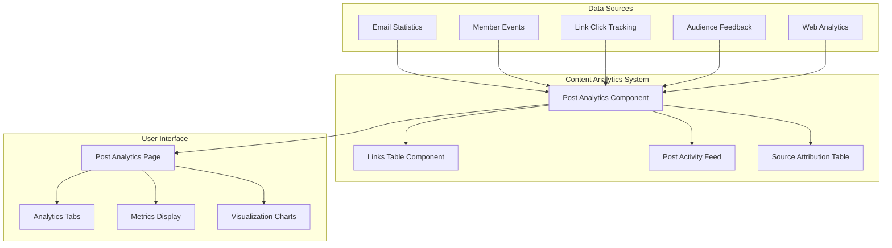
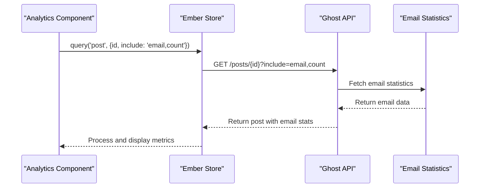
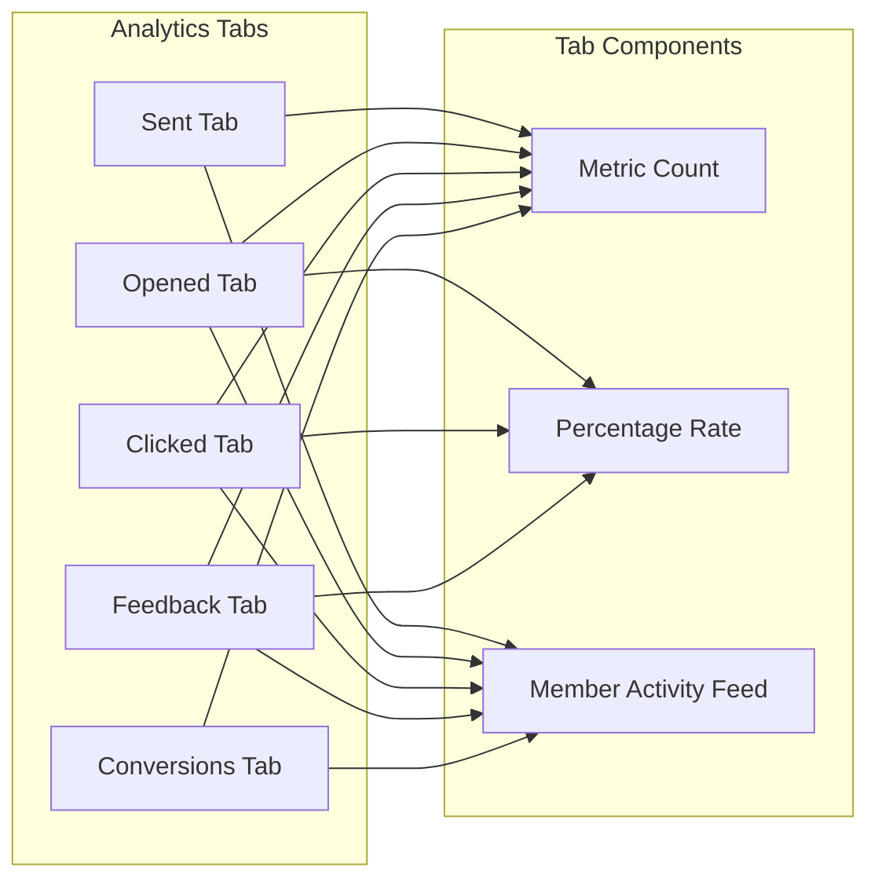

# Content Analytics

Relevant source files

The following files were used as context for generating this wiki page:

- [ghost/admin/app/components/dashboard/charts/attribution.hbs](https://github.com/TryGhost/Ghost/blob/0d0e5bd3/ghost/admin/app/components/dashboard/charts/attribution.hbs)
- [ghost/admin/app/components/dashboard/charts/attribution.js](https://github.com/TryGhost/Ghost/blob/0d0e5bd3/ghost/admin/app/components/dashboard/charts/attribution.js)
- [ghost/admin/app/components/dashboard/resources/newsletter.hbs](https://github.com/TryGhost/Ghost/blob/0d0e5bd3/ghost/admin/app/components/dashboard/resources/newsletter.hbs)
- [ghost/admin/app/components/dashboard/resources/resources.hbs](https://github.com/TryGhost/Ghost/blob/0d0e5bd3/ghost/admin/app/components/dashboard/resources/resources.hbs)
- [ghost/admin/app/components/editor/modals/publish-flow.js](https://github.com/TryGhost/Ghost/blob/0d0e5bd3/ghost/admin/app/components/editor/modals/publish-flow.js)
- [ghost/admin/app/components/member-attribution/modals/all-sources.hbs](https://github.com/TryGhost/Ghost/blob/0d0e5bd3/ghost/admin/app/components/member-attribution/modals/all-sources.hbs)
- [ghost/admin/app/components/member-attribution/modals/all-sources.js](https://github.com/TryGhost/Ghost/blob/0d0e5bd3/ghost/admin/app/components/member-attribution/modals/all-sources.js)
- [ghost/admin/app/components/member-attribution/source-attribution-chart.hbs](https://github.com/TryGhost/Ghost/blob/0d0e5bd3/ghost/admin/app/components/member-attribution/source-attribution-chart.hbs)
- [ghost/admin/app/components/member-attribution/source-attribution-chart.js](https://github.com/TryGhost/Ghost/blob/0d0e5bd3/ghost/admin/app/components/member-attribution/source-attribution-chart.js)
- [ghost/admin/app/components/member-attribution/source-attribution-table.hbs](https://github.com/TryGhost/Ghost/blob/0d0e5bd3/ghost/admin/app/components/member-attribution/source-attribution-table.hbs)
- [ghost/admin/app/components/member-attribution/source-attribution-table.js](https://github.com/TryGhost/Ghost/blob/0d0e5bd3/ghost/admin/app/components/member-attribution/source-attribution-table.js)
- [ghost/admin/app/components/members/filters/email-sent.js](https://github.com/TryGhost/Ghost/blob/0d0e5bd3/ghost/admin/app/components/members/filters/email-sent.js)
- [ghost/admin/app/components/members/filters/index.js](https://github.com/TryGhost/Ghost/blob/0d0e5bd3/ghost/admin/app/components/members/filters/index.js)
- [ghost/admin/app/components/posts-list/list-item.hbs](https://github.com/TryGhost/Ghost/blob/0d0e5bd3/ghost/admin/app/components/posts-list/list-item.hbs)
- [ghost/admin/app/components/posts/analytics.hbs](https://github.com/TryGhost/Ghost/blob/0d0e5bd3/ghost/admin/app/components/posts/analytics.hbs)
- [ghost/admin/app/components/posts/analytics.js](https://github.com/TryGhost/Ghost/blob/0d0e5bd3/ghost/admin/app/components/posts/analytics.js)
- [ghost/admin/app/components/posts/feedback-events-chart.hbs](https://github.com/TryGhost/Ghost/blob/0d0e5bd3/ghost/admin/app/components/posts/feedback-events-chart.hbs)
- [ghost/admin/app/components/posts/feedback-events-chart.js](https://github.com/TryGhost/Ghost/blob/0d0e5bd3/ghost/admin/app/components/posts/feedback-events-chart.js)
- [ghost/admin/app/components/posts/links-table.hbs](https://github.com/TryGhost/Ghost/blob/0d0e5bd3/ghost/admin/app/components/posts/links-table.hbs)
- [ghost/admin/app/components/posts/links-table.js](https://github.com/TryGhost/Ghost/blob/0d0e5bd3/ghost/admin/app/components/posts/links-table.js)
- [ghost/admin/app/components/posts/old-analytics.hbs](https://github.com/TryGhost/Ghost/blob/0d0e5bd3/ghost/admin/app/components/posts/old-analytics.hbs)
- [ghost/admin/app/components/posts/old-analytics.js](https://github.com/TryGhost/Ghost/blob/0d0e5bd3/ghost/admin/app/components/posts/old-analytics.js)
- [ghost/admin/app/components/posts/post-activity-feed.hbs](https://github.com/TryGhost/Ghost/blob/0d0e5bd3/ghost/admin/app/components/posts/post-activity-feed.hbs)
- [ghost/admin/app/components/posts/post-activity-feed/link.hbs](https://github.com/TryGhost/Ghost/blob/0d0e5bd3/ghost/admin/app/components/posts/post-activity-feed/link.hbs)
- [ghost/admin/app/controllers/posts/analytics.js](https://github.com/TryGhost/Ghost/blob/0d0e5bd3/ghost/admin/app/controllers/posts/analytics.js)
- [ghost/admin/app/routes/posts-x.js](https://github.com/TryGhost/Ghost/blob/0d0e5bd3/ghost/admin/app/routes/posts-x.js)
- [ghost/admin/app/routes/posts/analytics.js](https://github.com/TryGhost/Ghost/blob/0d0e5bd3/ghost/admin/app/routes/posts/analytics.js)
- [ghost/admin/app/services/utils.js](https://github.com/TryGhost/Ghost/blob/0d0e5bd3/ghost/admin/app/services/utils.js)
- [ghost/admin/app/styles/layouts/content.css](https://github.com/TryGhost/Ghost/blob/0d0e5bd3/ghost/admin/app/styles/layouts/content.css)
- [ghost/admin/app/templates/posts-x.hbs](https://github.com/TryGhost/Ghost/blob/0d0e5bd3/ghost/admin/app/templates/posts-x.hbs)
- [ghost/admin/app/templates/posts/analytics.hbs](https://github.com/TryGhost/Ghost/blob/0d0e5bd3/ghost/admin/app/templates/posts/analytics.hbs)
- [ghost/admin/public/assets/icons/stats.svg](https://github.com/TryGhost/Ghost/blob/0d0e5bd3/ghost/admin/public/assets/icons/stats.svg)
- [ghost/admin/public/assets/img/marketing/analytics-1.jpg](https://github.com/TryGhost/Ghost/blob/0d0e5bd3/ghost/admin/public/assets/img/marketing/analytics-1.jpg)
- [ghost/admin/public/assets/img/marketing/analytics-2.jpg](https://github.com/TryGhost/Ghost/blob/0d0e5bd3/ghost/admin/public/assets/img/marketing/analytics-2.jpg)
- [ghost/admin/tests/integration/components/posts/post-activity-feed/footer-links-test.js](https://github.com/TryGhost/Ghost/blob/0d0e5bd3/ghost/admin/tests/integration/components/posts/post-activity-feed/footer-links-test.js)
- [ghost/admin/tests/unit/components/posts/analytics-test.js](https://github.com/TryGhost/Ghost/blob/0d0e5bd3/ghost/admin/tests/unit/components/posts/analytics-test.js)
- [ghost/admin/tests/unit/services/utils-test.js](https://github.com/TryGhost/Ghost/blob/0d0e5bd3/ghost/admin/tests/unit/services/utils-test.js)

Content Analytics in Ghost provides detailed insights into post performance, tracking metrics such as email engagement, member conversions, and link interactions. This system allows content creators to understand how their content performs and how it contributes to audience growth.

For information about general analytics and dashboard metrics, see [Dashboard and Analytics](#3.3).

## Overview

The Content Analytics system provides post-specific analytics for published content, focusing on:

1. Email engagement metrics (sends, opens, clicks)
2. Member attribution (signups and paid conversions)
3. Link tracking and management
4. Audience feedback

The analytics interface is accessible through a dedicated page for each post, showing comprehensive performance data in a tabbed interface.

Sources: [ghost/admin/app/components/posts/analytics.hbs:1-269](https://github.com/TryGhost/Ghost/blob/0d0e5bd3/ghost/admin/app/components/posts/analytics.hbs#L1-L269), [ghost/admin/app/templates/posts/analytics.hbs:1-6](https://github.com/TryGhost/Ghost/blob/0d0e5bd3/ghost/admin/app/templates/posts/analytics.hbs#L1-L6)

## Architecture

The Content Analytics system integrates with several other Ghost subsystems to collect and display performance data.

Sources: [ghost/admin/app/components/posts/analytics.js:1-429](https://github.com/TryGhost/Ghost/blob/0d0e5bd3/ghost/admin/app/components/posts/analytics.js#L1-L429). [ghost/admin/app/routes/posts/analytics.js:1-58](https://github.com/TryGhost/Ghost/blob/0d0e5bd3/ghost/admin/app/routes/posts/analytics.js#L1-L58)

## Data Collection and Processing

### Email Engagement Metrics

The system tracks three primary email engagement metrics:

1. **Sent** - Number of emails successfully delivered to subscribers
2. **Opened** - Number of recipients who opened the email
3. **Clicked** - Number of recipients who clicked links within the email

These metrics are fetched from the Ghost API and processed to calculate engagement rates (open rate and click rate as percentages).

Sources: [ghost/admin/app/components/posts/analytics.js:272-379](https://github.com/TryGhost/Ghost/blob/0d0e5bd3/ghost/admin/app/components/posts/analytics.js#L272-L379). [ghost/admin/app/routes/posts/analytics.js:9-31](https://github.com/TryGhost/Ghost/blob/0d0e5bd3/ghost/admin/app/routes/posts/analytics.js#L9-L31)

### Member Attribution

The system tracks how posts contribute to member growth through:

1. **Signups** - Free members who signed up after reading the post
2. **Conversions** - Members who upgraded to paid subscriptions after reading the post

Attribution data is fetched from the referrers API endpoint and displayed in a source attribution table.

Sources: [ghost/admin/app/components/member-attribution/source-attribution-table.hbs:1-89](https://github.com/TryGhost/Ghost/blob/0d0e5bd3/ghost/admin/app/components/member-attribution/source-attribution-table.hbs#L1-L89). [ghost/admin/app/components/posts/analytics.js:167-172](https://github.com/TryGhost/Ghost/blob/0d0e5bd3/ghost/admin/app/components/posts/analytics.js#L167-L172), [ghost/admin/app/components/posts/analytics.js:242-252](https://github.com/TryGhost/Ghost/blob/0d0e5bd3/ghost/admin/app/components/posts/analytics.js#L242-L252)

### Link Tracking

The system tracks clicks on links within email newsletters and allows for link management:

1. **Click Tracking** - Records the number of clicks on each link
2. **Link Editing** - Allows updating of link URLs after sending (useful for fixing broken links)

Link data is fetched from the links API endpoint and processed to combine duplicate links and calculate total clicks.

Sources: [ghost/admin/app/components/posts/links-table.hbs:1-145](https://github.com/TryGhost/Ghost/blob/0d0e5bd3/ghost/admin/app/components/posts/links-table.hbs#L1-L145). [ghost/admin/app/components/posts/analytics.js:193-237](https://github.com/TryGhost/Ghost/blob/0d0e5bd3/ghost/admin/app/components/posts/analytics.js#L193-L237), [ghost/admin/app/components/posts/links-table.js:1-113](https://github.com/TryGhost/Ghost/blob/0d0e5bd3/ghost/admin/app/components/posts/links-table.js#L1-L113)

## User Interface Components

### Analytics Page Structure

The analytics page is structured with:

1. **Header** - Post title, publication date, and action buttons
2. **Tabs** - Navigation between different metric views
3. **Data Visualizations** - Charts and tables showing performance data
4. **Activity Feeds** - Lists of member interactions with the post

Sources: [ghost/admin/app/components/posts/analytics.hbs:1-92](https://github.com/TryGhost/Ghost/blob/0d0e5bd3/ghost/admin/app/components/posts/analytics.hbs#L1-L92). [ghost/admin/app/styles/layouts/content.css:876-1016](https://github.com/TryGhost/Ghost/blob/0d0e5bd3/ghost/admin/app/styles/layouts/content.css#L876-L1016)

### Metrics Tabs

The analytics interface uses a tabbed layout to organize different metrics:

1. **Sent** - Email delivery statistics and recipient list
2. **Opened** - Email open statistics and list of members who opened
3. **Clicked** - Link click statistics and list of members who clicked
4. **Feedback** - Audience feedback statistics (if enabled)
5. **Conversions** - Member signup and conversion statistics

Each tab displays a count, percentage (where applicable), and an activity feed showing individual member actions.

Sources: [ghost/admin/app/components/posts/analytics.hbs:95-185](https://github.com/TryGhost/Ghost/blob/0d0e5bd3/ghost/admin/app/components/posts/analytics.hbs#L95-L185). [ghost/admin/app/styles/layouts/content.css:95-166](https://github.com/TryGhost/Ghost/blob/0d0e5bd3/ghost/admin/app/styles/layouts/content.css#L95-L166)

### Links Table

The Links Table component displays tracked links from email newsletters and provides functionality to:

1. View the number of clicks per link
2. Edit link URLs (to fix broken links after sending)
3. Paginate through links when there are many

The component handles link editing, validation, and updating through the API.

Sources: [ghost/admin/app/components/posts/links-table.hbs:1-145](https://github.com/TryGhost/Ghost/blob/0d0e5bd3/ghost/admin/app/components/posts/links-table.hbs#L1-L145). [ghost/admin/app/components/posts/links-table.js:1-113](https://github.com/TryGhost/Ghost/blob/0d0e5bd3/ghost/admin/app/components/posts/links-table.js#L1-L113), [ghost/admin/app/styles/layouts/content.css:1201-1346](https://github.com/TryGhost/Ghost/blob/0d0e5bd3/ghost/admin/app/styles/layouts/content.css#L1201-L1346)

### Source Attribution

The Source Attribution component displays where member signups and conversions originated from:

1. **Source List** - Shows top referral sources (e.g., Direct, Twitter, Facebook)
2. **Metrics** - Displays free signups and paid conversions per source
3. **Sorting** - Allows sorting by different metrics

For posts with many sources, the component provides a "View All Sources" modal.

Sources: [ghost/admin/app/components/member-attribution/source-attribution-table.hbs:1-89](https://github.com/TryGhost/Ghost/blob/0d0e5bd3/ghost/admin/app/components/member-attribution/source-attribution-table.hbs#L1-L89). [ghost/admin/app/components/member-attribution/source-attribution-table.js:1-72](https://github.com/TryGhost/Ghost/blob/0d0e5bd3/ghost/admin/app/components/member-attribution/source-attribution-table.js#L1-L72), [ghost/admin/app/components/member-attribution/modals/all-sources.hbs:1-59](https://github.com/TryGhost/Ghost/blob/0d0e5bd3/ghost/admin/app/components/member-attribution/modals/all-sources.hbs#L1-L59)

### Activity Feed

The Post Activity Feed component displays individual member interactions with the post:

1. **Member Information** - Avatar and name of the member
2. **Action** - Type of interaction (opened, clicked, signed up, etc.)
3. **Timestamp** - When the interaction occurred
4. **Pagination** - Navigation through multiple pages of events

The feed is filtered based on the selected tab (sent, opened, clicked, etc.).

Sources: [ghost/admin/app/components/posts/post-activity-feed.hbs:1-245](https://github.com/TryGhost/Ghost/blob/0d0e5bd3/ghost/admin/app/components/posts/post-activity-feed.hbs#L1-L245). [ghost/admin/app/styles/layouts/content.css:1515-1532](https://github.com/TryGhost/Ghost/blob/0d0e5bd3/ghost/admin/app/styles/layouts/content.css#L1515-L1532)

## Data Visualization

### Metrics Display

Metrics are displayed with:

1. **Numeric Values** - Raw counts of interactions
2. **Percentages** - Calculated rates (open rate, click rate)
3. **Animations** - Visual feedback when metrics update

The system uses animation effects to highlight changes in metrics when data is refreshed.

Sources: [ghost/admin/app/components/posts/analytics.js:381-412](https://github.com/TryGhost/Ghost/blob/0d0e5bd3/ghost/admin/app/components/posts/analytics.js#L381-L412). [ghost/admin/app/styles/layouts/content.css:873-886](https://github.com/TryGhost/Ghost/blob/0d0e5bd3/ghost/admin/app/styles/layouts/content.css#L873-L886)

### Charts

For certain metrics like audience feedback, the system provides visual charts:

1. **Doughnut Charts** - Show proportional distribution of feedback
2. **Interactive Elements** - Tooltips and hover states for additional information

Charts are implemented using the EmberChart component with customized options.

Sources: [ghost/admin/app/components/posts/feedback-events-chart.hbs:1-34](https://github.com/TryGhost/Ghost/blob/0d0e5bd3/ghost/admin/app/components/posts/feedback-events-chart.hbs#L1-L34). [ghost/admin/app/components/posts/feedback-events-chart.js:1-98](https://github.com/TryGhost/Ghost/blob/0d0e5bd3/ghost/admin/app/components/posts/feedback-events-chart.js#L1-L98), [ghost/admin/app/components/member-attribution/source-attribution-chart.js:1-167](https://github.com/TryGhost/Ghost/blob/0d0e5bd3/ghost/admin/app/components/member-attribution/source-attribution-chart.js#L1-L167)

## Integration Points

### Post List Integration

The Content Analytics system integrates with the post list view by:

1. **Analytics Button** - Displaying an analytics icon for published posts
2. **Preview Metrics** - Showing abbreviated metrics in the post list
3. **Direct Link** - Providing a direct link to the full analytics page

This allows quick access to key metrics without leaving the post list.

Sources: [ghost/admin/app/components/posts-list/list-item.hbs:262-267](https://github.com/TryGhost/Ghost/blob/0d0e5bd3/ghost/admin/app/components/posts-list/list-item.hbs#L262-L267). [ghost/admin/app/styles/layouts/content.css:459-461](https://github.com/TryGhost/Ghost/blob/0d0e5bd3/ghost/admin/app/styles/layouts/content.css#L459-L461)

### Member Management Integration

The system integrates with the member management system by:

1. **Filtered Views** - Providing links to filtered member lists based on interactions
2. **Attribution Data** - Showing which posts contributed to member acquisition
3. **Event Tracking** - Recording member interactions with posts

This creates a bidirectional relationship between content and member data.

Sources: [ghost/admin/app/components/posts/post-activity-feed.hbs:109-127](https://github.com/TryGhost/Ghost/blob/0d0e5bd3/ghost/admin/app/components/posts/post-activity-feed.hbs#L109-L127). [ghost/admin/app/components/members/filters/email-sent.js:1-16](https://github.com/TryGhost/Ghost/blob/0d0e5bd3/ghost/admin/app/components/members/filters/email-sent.js#L1-L16)

### Publishing Flow Integration

The Content Analytics system integrates with the publishing workflow by:

1. **Post-Publish Redirect** - Optionally redirecting to analytics after publishing
2. **Success Modal** - Showing initial analytics in the post-publish success modal

This provides immediate feedback on post performance after publishing.

Sources: [ghost/admin/app/components/editor/modals/publish-flow.js:74-93](https://github.com/TryGhost/Ghost/blob/0d0e5bd3/ghost/admin/app/components/editor/modals/publish-flow.js#L74-L93). [ghost/admin/app/components/posts/analytics.js:55-76](https://github.com/TryGhost/Ghost/blob/0d0e5bd3/ghost/admin/app/components/posts/analytics.js#L55-L76)

## Technical Implementation

### Data Fetching

The system fetches data through several API endpoints:

1. `/posts/{id}` - Basic post data with included relationships
2. `/stats/referrers/posts/{id}` - Source attribution data
3. `/links/?filter=post_id:{id}` - Link tracking data
4. Member events API - Activity data for the post

Data is fetched using Ember's store service and custom AJAX requests.

Sources: [ghost/admin/app/components/posts/analytics.js:272-345](https://github.com/TryGhost/Ghost/blob/0d0e5bd3/ghost/admin/app/components/posts/analytics.js#L272-L345). [ghost/admin/app/routes/posts/analytics.js:9-31](https://github.com/TryGhost/Ghost/blob/0d0e5bd3/ghost/admin/app/routes/posts/analytics.js#L9-L31)

### State Management

The component manages several pieces of state:

1. **Metrics Data** - Current and previous values for animations
2. **UI State** - Active tabs, editing state, pagination
3. **Loading States** - Tracking when data is being fetched

State is managed using Ember's tracked properties and task system.

Sources: [ghost/admin/app/components/posts/analytics.js:36-53](https://github.com/TryGhost/Ghost/blob/0d0e5bd3/ghost/admin/app/components/posts/analytics.js#L36-L53). [ghost/admin/app/components/posts/analytics.js:272-379](https://github.com/TryGhost/Ghost/blob/0d0e5bd3/ghost/admin/app/components/posts/analytics.js#L272-L379)

### Link Management

The link management system provides functionality to:

1. **Parse Links** - Clean tracking parameters from URLs for display
2. **Edit Links** - Update link destinations after sending
3. **Validate Links** - Ensure edited links are valid URLs

This is implemented through the Utils service and the LinksTable component.

Sources: [ghost/admin/app/components/posts/links-table.js:14-58](https://github.com/TryGhost/Ghost/blob/0d0e5bd3/ghost/admin/app/components/posts/links-table.js#L14-L58). [ghost/admin/app/services/utils.js:41-62](https://github.com/TryGhost/Ghost/blob/0d0e5bd3/ghost/admin/app/services/utils.js#L41-L62)

## Responsive Design

The Content Analytics interface adapts to different screen sizes:

1. **Desktop View** - Full tabbed interface with detailed metrics
2. **Tablet View** - Simplified layout with adjusted column widths
3. **Mobile View** - Stacked layout with essential metrics only

CSS media queries handle the responsive adjustments.

Sources: [ghost/admin/app/styles/layouts/content.css:651-795](https://github.com/TryGhost/Ghost/blob/0d0e5bd3/ghost/admin/app/styles/layouts/content.css#L651-L795). [ghost/admin/app/styles/layouts/content.css:909-916](https://github.com/TryGhost/Ghost/blob/0d0e5bd3/ghost/admin/app/styles/layouts/content.css#L909-L916)

## Feature Flags

The Content Analytics system uses feature flags to conditionally enable features:

1. **audienceFeedback** - Controls the display of feedback metrics
2. **memberAttribution** - Controls the display of source attribution
3. **webAnalytics** - Controls the display of web traffic metrics

These flags allow for gradual feature rollout and testing.

Sources: [ghost/admin/app/components/posts/analytics.hbs:1](https://github.com/TryGhost/Ghost/blob/0d0e5bd3/ghost/admin/app/components/posts/analytics.hbs#L1). [ghost/admin/app/components/posts/analytics.js:29](https://github.com/TryGhost/Ghost/blob/0d0e5bd3/ghost/admin/app/components/posts/analytics.js#L29), [ghost/admin/app/templates/posts/analytics.hbs:1-6](https://github.com/TryGhost/Ghost/blob/0d0e5bd3/ghost/admin/app/templates/posts/analytics.hbs#L1-L6)

## Conclusion