# Members and Subscriptions

Relevant source files

The following files were used as context for generating this wiki page:

- [ghost/core/core/server/api/endpoints/newsletters.js](https://github.com/TryGhost/Ghost/blob/0d0e5bd3/ghost/core/core/server/api/endpoints/newsletters.js)
- [ghost/core/core/server/api/endpoints/utils/serializers/output/mappers/newsletters.js](https://github.com/TryGhost/Ghost/blob/0d0e5bd3/ghost/core/core/server/api/endpoints/utils/serializers/output/mappers/newsletters.js)
- [ghost/core/core/server/api/endpoints/utils/serializers/output/members.js](https://github.com/TryGhost/Ghost/blob/0d0e5bd3/ghost/core/core/server/api/endpoints/utils/serializers/output/members.js)
- [ghost/core/core/server/data/schema/schema.js](https://github.com/TryGhost/Ghost/blob/0d0e5bd3/ghost/core/core/server/data/schema/schema.js)
- [ghost/core/core/server/models/base/plugins/overrides.js](https://github.com/TryGhost/Ghost/blob/0d0e5bd3/ghost/core/core/server/models/base/plugins/overrides.js)
- [ghost/core/core/server/models/newsletter.js](https://github.com/TryGhost/Ghost/blob/0d0e5bd3/ghost/core/core/server/models/newsletter.js)
- [ghost/core/core/server/services/members/RequestIntegrityTokenProvider.js](https://github.com/TryGhost/Ghost/blob/0d0e5bd3/ghost/core/core/server/services/members/RequestIntegrityTokenProvider.js)
- [ghost/core/core/server/services/members/middleware.js](https://github.com/TryGhost/Ghost/blob/0d0e5bd3/ghost/core/core/server/services/members/middleware.js)
- [ghost/core/core/server/services/members/utils.js](https://github.com/TryGhost/Ghost/blob/0d0e5bd3/ghost/core/core/server/services/members/utils.js)
- [ghost/core/core/server/web/members/app.js](https://github.com/TryGhost/Ghost/blob/0d0e5bd3/ghost/core/core/server/web/members/app.js)
- [ghost/core/test/e2e-api/admin/__snapshots__/members-newsletters.test.js.snap](https://github.com/TryGhost/Ghost/blob/0d0e5bd3/ghost/core/test/e2e-api/admin/__snapshots__/members-newsletters.test.js.snap)
- [ghost/core/test/e2e-api/admin/__snapshots__/members.test.js.snap](https://github.com/TryGhost/Ghost/blob/0d0e5bd3/ghost/core/test/e2e-api/admin/__snapshots__/members.test.js.snap)
- [ghost/core/test/e2e-api/admin/__snapshots__/newsletters.test.js.snap](https://github.com/TryGhost/Ghost/blob/0d0e5bd3/ghost/core/test/e2e-api/admin/__snapshots__/newsletters.test.js.snap)
- [ghost/core/test/e2e-api/admin/members.test.js](https://github.com/TryGhost/Ghost/blob/0d0e5bd3/ghost/core/test/e2e-api/admin/members.test.js)
- [ghost/core/test/e2e-api/admin/newsletters.test.js](https://github.com/TryGhost/Ghost/blob/0d0e5bd3/ghost/core/test/e2e-api/admin/newsletters.test.js)
- [ghost/core/test/e2e-api/members/__snapshots__/create-stripe-checkout-session.test.js.snap](https://github.com/TryGhost/Ghost/blob/0d0e5bd3/ghost/core/test/e2e-api/members/__snapshots__/create-stripe-checkout-session.test.js.snap)
- [ghost/core/test/e2e-api/members/__snapshots__/middleware.test.js.snap](https://github.com/TryGhost/Ghost/blob/0d0e5bd3/ghost/core/test/e2e-api/members/__snapshots__/middleware.test.js.snap)
- [ghost/core/test/e2e-api/members/__snapshots__/webhooks.test.js.snap](https://github.com/TryGhost/Ghost/blob/0d0e5bd3/ghost/core/test/e2e-api/members/__snapshots__/webhooks.test.js.snap)
- [ghost/core/test/e2e-api/members/create-stripe-checkout-session.test.js](https://github.com/TryGhost/Ghost/blob/0d0e5bd3/ghost/core/test/e2e-api/members/create-stripe-checkout-session.test.js)
- [ghost/core/test/e2e-api/members/middleware.test.js](https://github.com/TryGhost/Ghost/blob/0d0e5bd3/ghost/core/test/e2e-api/members/middleware.test.js)
- [ghost/core/test/e2e-api/members/signin.test.js](https://github.com/TryGhost/Ghost/blob/0d0e5bd3/ghost/core/test/e2e-api/members/signin.test.js)
- [ghost/core/test/e2e-api/members/webhooks.test.js](https://github.com/TryGhost/Ghost/blob/0d0e5bd3/ghost/core/test/e2e-api/members/webhooks.test.js)
- [ghost/core/test/e2e-frontend/members.test.js](https://github.com/TryGhost/Ghost/blob/0d0e5bd3/ghost/core/test/e2e-frontend/members.test.js)
- [ghost/core/test/e2e-webhooks/__snapshots__/members.test.js.snap](https://github.com/TryGhost/Ghost/blob/0d0e5bd3/ghost/core/test/e2e-webhooks/__snapshots__/members.test.js.snap)
- [ghost/core/test/e2e-webhooks/members.test.js](https://github.com/TryGhost/Ghost/blob/0d0e5bd3/ghost/core/test/e2e-webhooks/members.test.js)
- [ghost/core/test/unit/server/data/schema/integrity.test.js](https://github.com/TryGhost/Ghost/blob/0d0e5bd3/ghost/core/test/unit/server/data/schema/integrity.test.js)
- [ghost/core/test/unit/server/services/members/RequestIntegrityTokenProvider.test.js](https://github.com/TryGhost/Ghost/blob/0d0e5bd3/ghost/core/test/unit/server/services/members/RequestIntegrityTokenProvider.test.js)
- [ghost/core/test/unit/server/services/members/utils.test.js](https://github.com/TryGhost/Ghost/blob/0d0e5bd3/ghost/core/test/unit/server/services/members/utils.test.js)

## Purpose and Scope

This document provides a technical overview of Ghost's Members and Subscriptions system, which enables content creators to monetize their content through paid subscriptions and manage their audience. This system handles member authentication, subscription management, payment processing, and member data management.

For information about the admin interface for managing members, see [Member Management UI](#4.2). For details on newsletter subscription preferences, see [Newsletter Management](#6.2).

## System Overview

The Members and Subscriptions system is a core component of Ghost that allows publishers to create tiered membership offerings. It consists of several interconnected modules that work together to provide a complete subscription management solution.

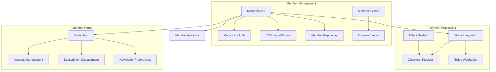

Sources: [ghost/core/core/server/services/members/service.js](https://github.com/TryGhost/Ghost/blob/0d0e5bd3/ghost/core/core/server/services/members/service.js), [ghost/core/core/server/services/members/middleware.js](https://github.com/TryGhost/Ghost/blob/0d0e5bd3/ghost/core/core/server/services/members/middleware.js), [ghost/core/core/server/web/members/app.js](https://github.com/TryGhost/Ghost/blob/0d0e5bd3/ghost/core/core/server/web/members/app.js)

## Core Components

### Members API

The Members API is the central component that handles all member-related operations. It provides endpoints for creating, reading, updating, and deleting member records, as well as managing subscriptions and authentication. The API is exposed through both admin and member-facing routes.

Key endpoints include:
- Member CRUD operations
- Subscription management
- Newsletter preferences
- Authentication (magic links)
- Bulk operations (import/export)

Sources: [ghost/core/core/server/api/endpoints/members.js](https://github.com/TryGhost/Ghost/blob/0d0e5bd3/ghost/core/core/server/api/endpoints/members.js), [ghost/core/core/server/web/members/app.js:22-128](https://github.com/TryGhost/Ghost/blob/0d0e5bd3/ghost/core/core/server/web/members/app.js#L22-L128)

### Member Repository

The Member Repository is responsible for data persistence and retrieval of member information. It interfaces with the database to store member data, subscription details, and related information. The system uses Bookshelf.js models to interact with the database.

Key models include:
- `Member` - Core member data
- `MemberStripeCustomer` - Stripe customer associations
- `Subscription` - Subscription details
- `MemberProduct` - Product/tier associations

Sources: [ghost/core/core/server/models/member.js](https://github.com/TryGhost/Ghost/blob/0d0e5bd3/ghost/core/core/server/models/member.js), [ghost/core/core/server/data/schema/schema.js:417-443](https://github.com/TryGhost/Ghost/blob/0d0e5bd3/ghost/core/core/server/data/schema/schema.js#L417-L443)

### Member Events System

The Member Events system uses the domain events pattern to propagate member-related events throughout the application, enabling loose coupling between components. Events are tracked in dedicated tables for analytics and audit purposes.

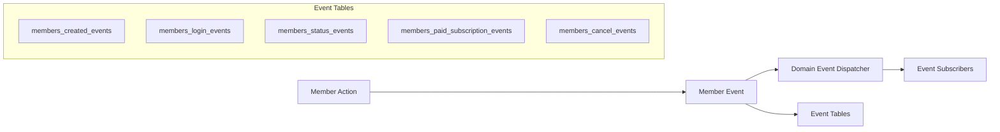

Sources: [ghost/core/core/server/data/schema/schema.js:524-616](https://github.com/TryGhost/Ghost/blob/0d0e5bd3/ghost/core/core/server/data/schema/schema.js#L524-L616), [ghost/core/test/e2e-api/members/webhooks.test.js:36-40](https://github.com/TryGhost/Ghost/blob/0d0e5bd3/ghost/core/test/e2e-api/members/webhooks.test.js#L36-L40)

## Authentication System

### Magic Link Authentication

Ghost uses a passwordless authentication system called Magic Link for member login. This approach eliminates the need for password management while providing a secure authentication method. The system generates a unique token that is sent via email and validates it when the member clicks the link.

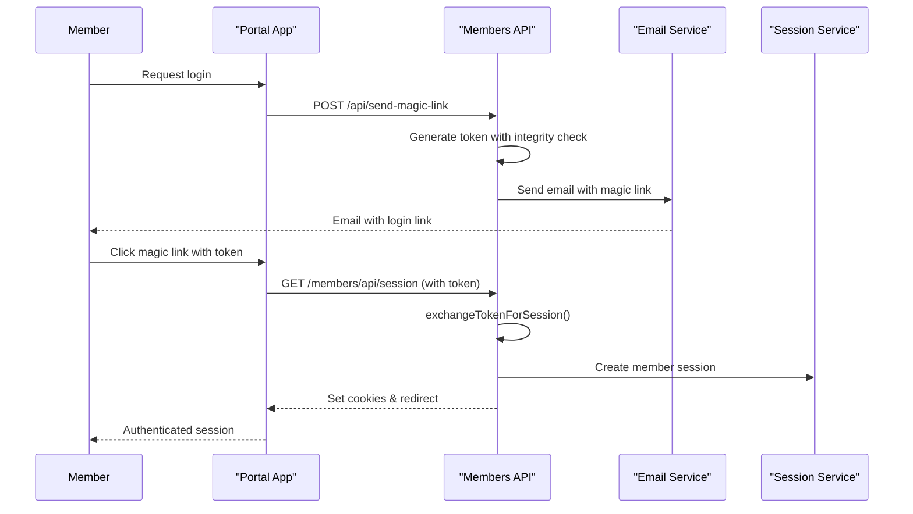

The authentication flow is handled by middleware functions that validate tokens and create sessions. The system also includes rate limiting to prevent abuse.

Sources: [ghost/core/core/server/services/members/middleware.js:327-424](https://github.com/TryGhost/Ghost/blob/0d0e5bd3/ghost/core/core/server/services/members/middleware.js#L327-L424), [ghost/core/core/server/web/members/app.js:74-86](https://github.com/TryGhost/Ghost/blob/0d0e5bd3/ghost/core/core/server/web/members/app.js#L74-L86), [ghost/core/test/e2e-frontend/members.test.js:42-65](https://github.com/TryGhost/Ghost/blob/0d0e5bd3/ghost/core/test/e2e-frontend/members.test.js#L42-L65)

## Member Management Features

### CSV Import and Export

The system provides functionality for bulk importing and exporting member data via CSV files, making it easy to migrate members from other platforms or create backups. The import process includes validation, data transformation, and error handling.

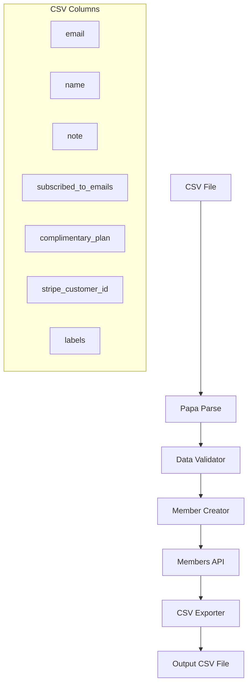

The CSV export includes detailed member information including subscription status, newsletter preferences, and attribution data. The import process can handle large datasets through batched processing.

Sources: [ghost/core/core/server/api/endpoints/utils/serializers/output/members.js:28-37](https://github.com/TryGhost/Ghost/blob/0d0e5bd3/ghost/core/core/server/api/endpoints/utils/serializers/output/members.js#L28-L37), [ghost/core/test/e2e-api/admin/members.test.js:14-37](https://github.com/TryGhost/Ghost/blob/0d0e5bd3/ghost/core/test/e2e-api/admin/members.test.js#L14-L37)

### Member Portal

The Member Portal is a frontend application that provides members with self-service account management capabilities. It allows members to:

1. Manage their profile information
2. Handle their subscription (upgrade, downgrade, cancel)
3. Update their payment method
4. Customize newsletter preferences

The portal is designed to be embedded into the Ghost site, providing a seamless experience for members. It communicates with the Members API through dedicated endpoints.

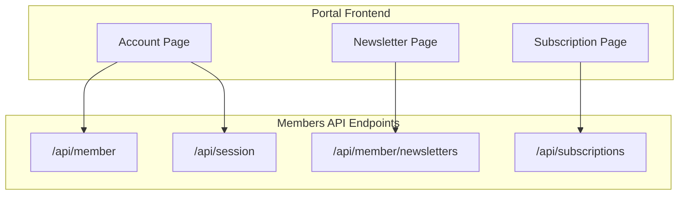

Sources: [ghost/core/core/server/services/members/middleware.js:214-226](https://github.com/TryGhost/Ghost/blob/0d0e5bd3/ghost/core/core/server/services/members/middleware.js#L214-L226), [ghost/core/core/server/web/members/app.js:54-63](https://github.com/TryGhost/Ghost/blob/0d0e5bd3/ghost/core/core/server/web/members/app.js#L54-L63)

## Subscription and Payment System

### Offers System

The Offers system allows site owners to create promotional offers for subscriptions, including discounts and time-limited deals. Offers are stored in the database and can be applied to checkout sessions.

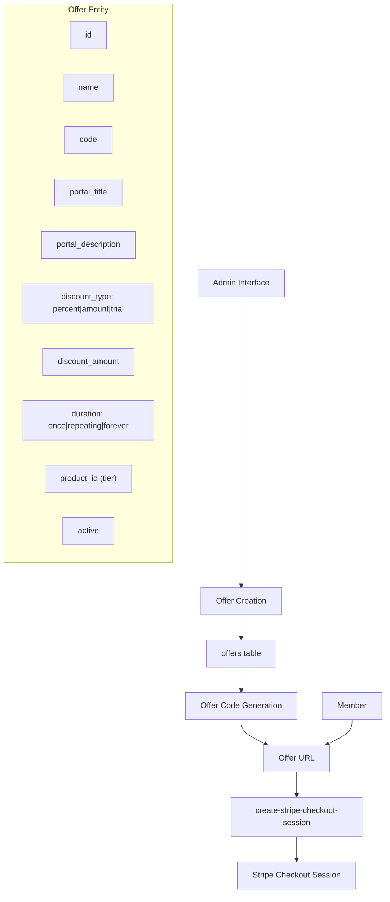

The offers table stores detailed information about each offer, including discount type, amount, and duration. Offers can be applied to specific tiers and have unique codes for tracking.

Sources: [ghost/core/core/server/data/schema/schema.js:479-497](https://github.com/TryGhost/Ghost/blob/0d0e5bd3/ghost/core/core/server/data/schema/schema.js#L479-L497), [ghost/core/test/e2e-api/members/create-stripe-checkout-session.test.js:33-46](https://github.com/TryGhost/Ghost/blob/0d0e5bd3/ghost/core/test/e2e-api/members/create-stripe-checkout-session.test.js#L33-L46)

### Stripe Integration

Ghost integrates with Stripe for payment processing. The integration handles:

1. Creating and managing subscription plans in Stripe
2. Processing one-time and recurring payments
3. Handling payment webhooks for subscription lifecycle events
4. Managing payment failures and retries

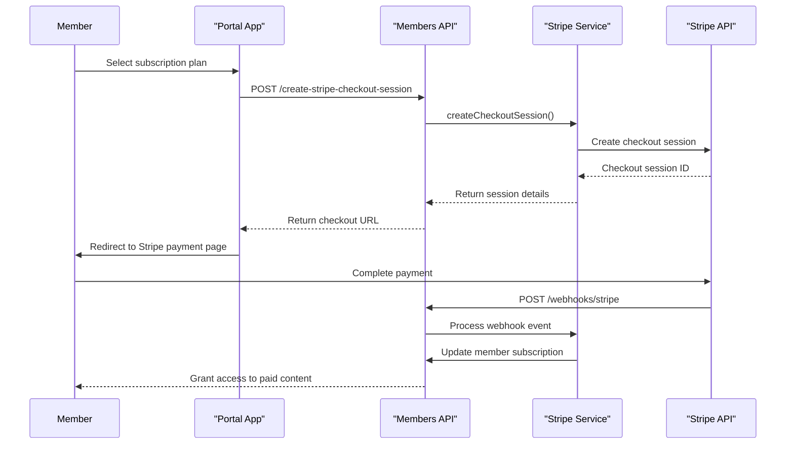

The Stripe integration includes webhook handlers for various subscription events, including creation, updates, and cancellations. The system tracks subscription status and updates member access accordingly.

Sources: [ghost/core/core/server/web/members/app.js:38](https://github.com/TryGhost/Ghost/blob/0d0e5bd3/ghost/core/core/server/web/members/app.js#L38), [ghost/core/test/e2e-api/members/webhooks.test.js:156-201](https://github.com/TryGhost/Ghost/blob/0d0e5bd3/ghost/core/test/e2e-api/members/webhooks.test.js#L156-L201)

## Data Model

### Member Entity

The core Member entity contains the following key attributes:

| Attribute | Description | Schema Field |
|-----------|-------------|-------------|
| id | Unique identifier | `id` |
| uuid | UUID for public identification | `uuid` |
| email | Primary email address | `email` |
| name | Member's name | `name` |
| status | Current status (free, paid, comped) | `status` |
| subscribed | Email subscription status | `subscribed` |
| email_disabled | Whether emails are disabled | `email_disabled` |
| created_at | Creation timestamp | `created_at` |
| updated_at | Last update timestamp | `updated_at` |
| expertise | Member's expertise (for comments) | `expertise` |
| note | Admin notes about the member | `note` |
| geolocation | Location data | `geolocation` |
| newsletters | Newsletters the member is subscribed to | Relation |
| subscriptions | Subscription details | Relation |
| products | Products/tiers the member has access to | Relation |
| labels | Labels assigned to the member | Relation |

Sources: [ghost/core/core/server/data/schema/schema.js:417-443](https://github.com/TryGhost/Ghost/blob/0d0e5bd3/ghost/core/core/server/data/schema/schema.js#L417-L443), [ghost/core/test/e2e-api/admin/__snapshots__/members.test.js.snap:3-54](https://github.com/TryGhost/Ghost/blob/0d0e5bd3/ghost/core/test/e2e-api/admin/__snapshots__/members.test.js.snap#L3-L54)

### Subscription Entity

Each subscription linked to a member includes:

| Attribute | Description | Schema Field |
|-----------|-------------|-------------|
| id | Unique identifier | `id` |
| type | Subscription type (free, comped, paid) | `type` |
| status | Current status (active, expired, canceled) | `status` |
| member_id | Associated member ID | `member_id` |
| tier_id | Associated tier/product ID | `tier_id` |
| cadence | Billing interval (month, year) | `cadence` |
| currency | Currency code | `currency` |
| amount | Amount in cents/lowest currency unit | `amount` |
| payment_provider | Payment service (e.g., 'stripe') | `payment_provider` |
| payment_subscription_url | URL to manage subscription | `payment_subscription_url` |
| created_at | Creation timestamp | `created_at` |
| updated_at | Last update timestamp | `updated_at` |

Sources: [ghost/core/core/server/data/schema/schema.js:639-666](https://github.com/TryGhost/Ghost/blob/0d0e5bd3/ghost/core/core/server/data/schema/schema.js#L639-L666), [ghost/core/test/e2e-api/members/webhooks.test.js:298-306](https://github.com/TryGhost/Ghost/blob/0d0e5bd3/ghost/core/test/e2e-api/members/webhooks.test.js#L298-L306)

### Newsletter Entity

Newsletters that members can subscribe to:

| Attribute | Description | Schema Field |
|-----------|-------------|-------------|
| id | Unique identifier | `id` |
| uuid | UUID for public identification | `uuid` |
| name | Newsletter name | `name` |
| description | Newsletter description | `description` |
| slug | URL-friendly identifier | `slug` |
| status | Status (active, archived) | `status` |
| visibility | Who can see it (public, members) | `visibility` |
| subscribe_on_signup | Auto-subscribe new members | `subscribe_on_signup` |
| sort_order | Display order | `sort_order` |
| sender_name | From name for emails | `sender_name` |
| sender_email | From email address | `sender_email` |
| sender_reply_to | Reply-to setting | `sender_reply_to` |

Sources: [ghost/core/core/server/data/schema/schema.js:12-59](https://github.com/TryGhost/Ghost/blob/0d0e5bd3/ghost/core/core/server/data/schema/schema.js#L12-L59), [ghost/core/core/server/models/newsletter.js:6-41](https://github.com/TryGhost/Ghost/blob/0d0e5bd3/ghost/core/core/server/models/newsletter.js#L6-L41)

## System Integration

The Members and Subscriptions system integrates with several other Ghost systems:

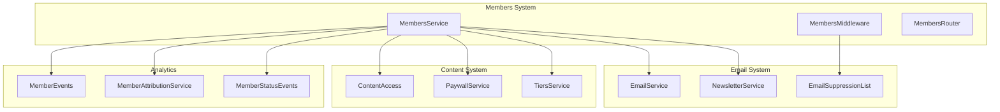

The Members system is tightly integrated with other Ghost services:

1. **Email System**: Members can subscribe to newsletters and receive email communications
2. **Content System**: Member status determines access to premium content
3. **Analytics**: Member actions are tracked for analytics and reporting
4. **Tiers**: Members can subscribe to different product tiers with varying benefits

Sources: [ghost/core/core/server/services/members/middleware.js:228-248](https://github.com/TryGhost/Ghost/blob/0d0e5bd3/ghost/core/core/server/services/members/middleware.js#L228-L248), [ghost/core/core/server/web/members/app.js:1-19](https://github.com/TryGhost/Ghost/blob/0d0e5bd3/ghost/core/core/server/web/members/app.js#L1-L19), [ghost/core/test/e2e-api/admin/members.test.js:17-19](https://github.com/TryGhost/Ghost/blob/0d0e5bd3/ghost/core/test/e2e-api/admin/members.test.js#L17-L19)

## Security Considerations

The Members and Subscriptions system implements several security measures:

1. **Passwordless Authentication** - Eliminates password-related vulnerabilities through magic links
2. **Request Integrity Tokens** - Prevents CSRF attacks on member endpoints
3. **PCI Compliance** - Delegated to Stripe for payment processing
4. **API Rate Limiting** - Prevents abuse of authentication and member-related endpoints
5. **HMAC Validation** - Used for secure newsletter management links
6. **Access Cookies** - Secure, HTTP-only cookies for member authentication

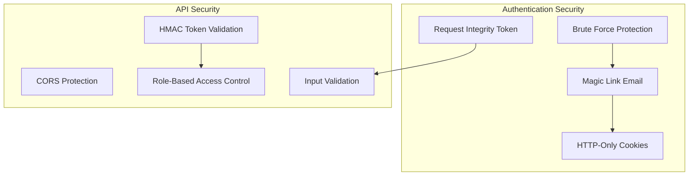

Sources: [ghost/core/core/server/services/members/middleware.js:40-77](https://github.com/TryGhost/Ghost/blob/0d0e5bd3/ghost/core/core/server/services/members/middleware.js#L40-L77), [ghost/core/core/server/services/members/middleware.js:171-196](https://github.com/TryGhost/Ghost/blob/0d0e5bd3/ghost/core/core/server/services/members/middleware.js#L171-L196), [ghost/core/core/server/web/members/app.js:80-84](https://github.com/TryGhost/Ghost/blob/0d0e5bd3/ghost/core/core/server/web/members/app.js#L80-L84)

## Common Workflows

### Member Signup Flow

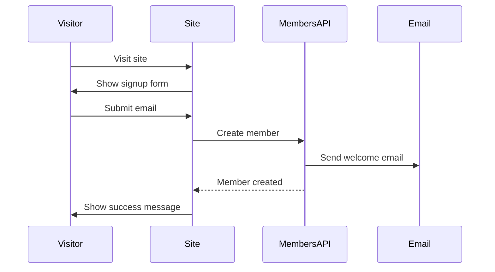

### Subscription Purchase Flow

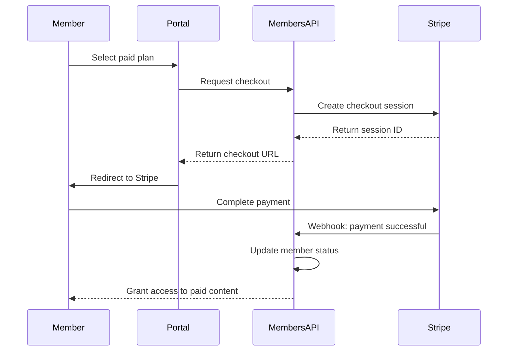