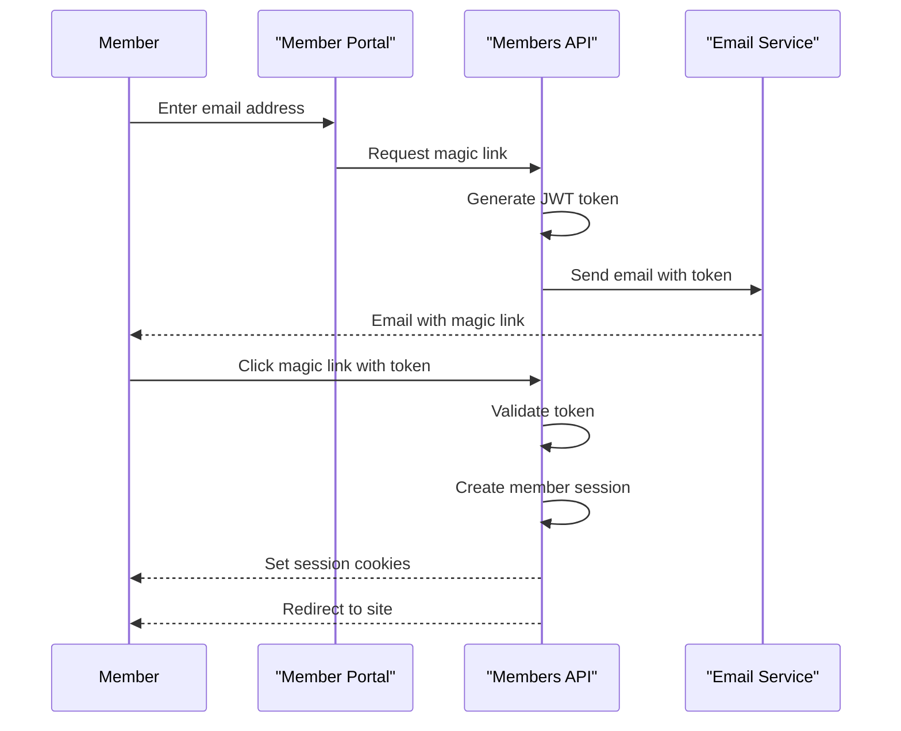
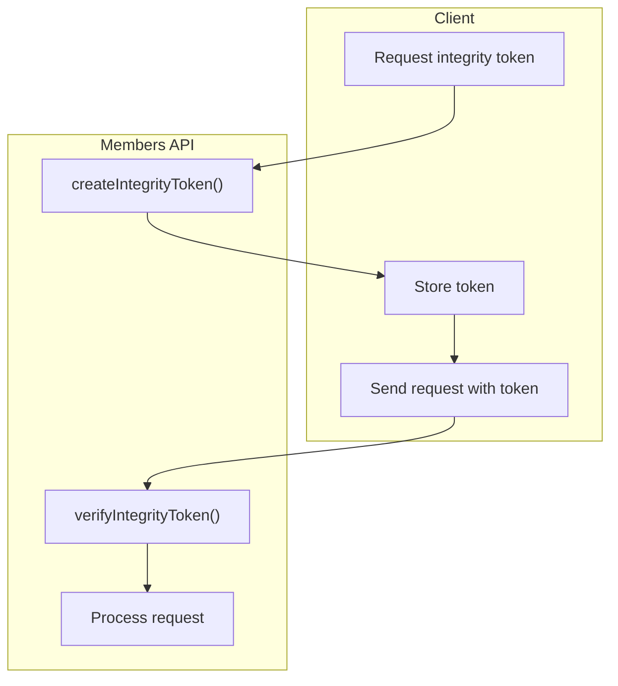
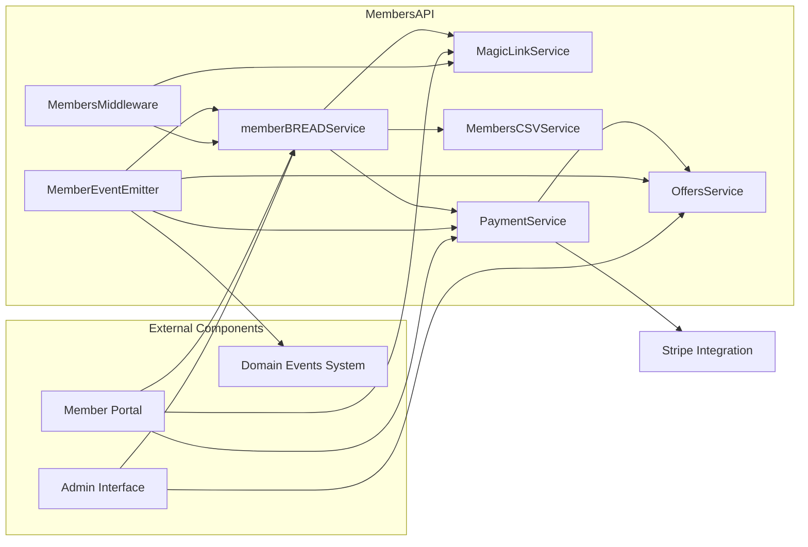
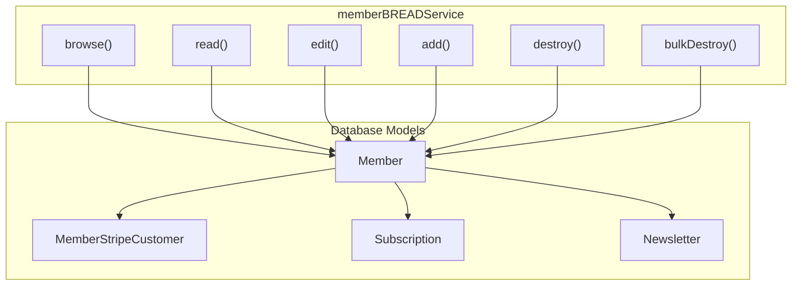
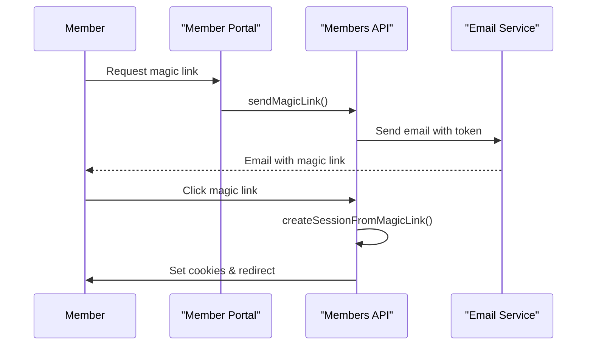
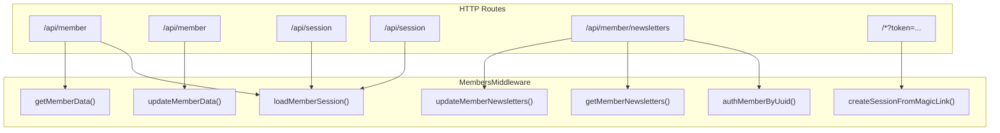
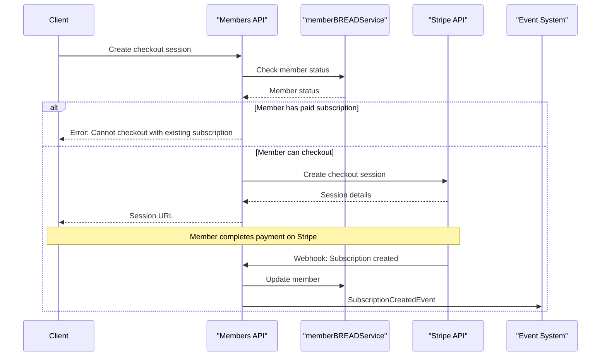
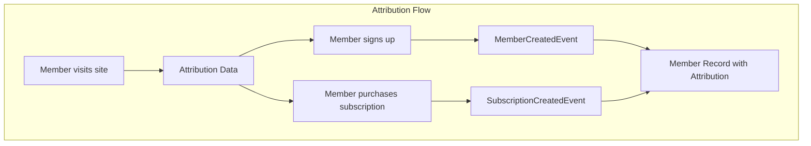
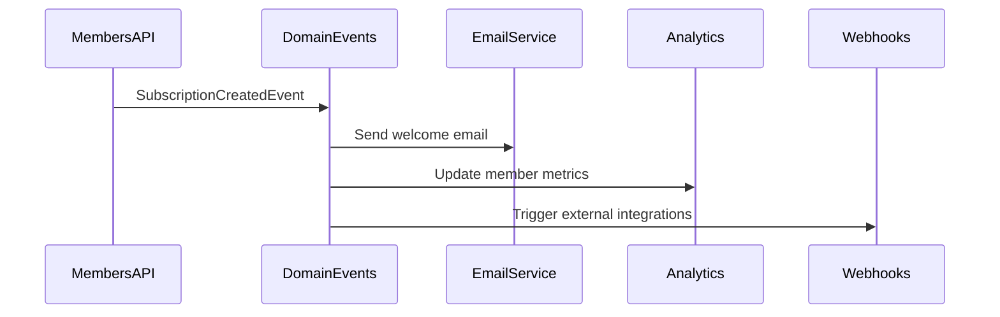

## Data Model

The Members API relies on several database tables to store member information, subscriptions, and related data.

### Core Member Schema

```mermaid
erDiagram
    members {
        string id PK
        string uuid
        string email
        string name
        string status
        string expertise
        boolean email_disabled
        datetime created_at
        datetime updated_at
    }
    
    newsletters {
        string id PK
        string name
        string description
        string status
        boolean subscribe_on_signup
    }
    
    members_newsletters {
        string id PK
        string member_id FK
        string newsletter_id FK
    }
    
    members_stripe_customers {
        string id PK
        string member_id FK
        string customer_id
    }
    
    subscriptions {
        string id PK
        string member_id FK
        string tier_id FK
        string status
        string payment_provider
    }
    
    members -- members_newsletters : has
    newsletters -- members_newsletters : has
    members -- members_stripe_customers : has
    members -- subscriptions : has
```

Sources:
- [ghost/core/core/server/data/schema/schema.js:417-443](https://github.com/TryGhost/Ghost/blob/0d0e5bd3/ghost/core/core/server/data/schema/schema.js#L417-L443)
- [ghost/core/core/server/data/schema/schema.js:630-638](https://github.com/TryGhost/Ghost/blob/0d0e5bd3/ghost/core/core/server/data/schema/schema.js#L630-L638)
- [ghost/core/core/server/data/schema/schema.js:639-662](https://github.com/TryGhost/Ghost/blob/0d0e5bd3/ghost/core/core/server/data/schema/schema.js#L639-L662)

### Member Events Schema

```mermaid
erDiagram
    members {
        string id PK
    }
    
    members_created_events {
        string id PK
        string member_id FK
        string attribution_id
        string attribution_type
        string attribution_url
        string source
    }
    
    members_login_events {
        string id PK
        string member_id FK
        datetime created_at
    }
    
    members_status_events {
        string id PK
        string member_id FK
        string from_status
        string to_status
    }
    
    members_payment_events {
        string id PK
        string member_id FK
        integer amount
        string currency
    }
    
    members_paid_subscription_events {
        string id PK
        string member_id FK
        string type
        string from_plan
        string to_plan
        integer mrr_delta
    }
    
    members -- members_created_events : has
    members -- members_login_events : has
    members -- members_status_events : has
    members -- members_payment_events : has
    members -- members_paid_subscription_events : has
```

Sources:
- [ghost/core/core/server/data/schema/schema.js:524-616](https://github.com/TryGhost/Ghost/blob/0d0e5bd3/ghost/core/core/server/data/schema/schema.js#L524-L616)

## Authentication and Security

The Members API implements several security mechanisms to protect member data and prevent unauthorized access.

### Magic Link Authentication

Instead of traditional password-based authentication, Ghost uses magic links sent via email. This approach eliminates password management concerns and provides a secure, user-friendly authentication experience.



Sources:
- [ghost/core/core/server/services/members/middleware.js:327-424](https://github.com/TryGhost/Ghost/blob/0d0e5bd3/ghost/core/core/server/services/members/middleware.js#L327-L424)

### Request Integrity Protection

The Members API includes a request integrity token system to protect against CSRF attacks and ensure that requests come from legitimate sources.



Sources:
- [ghost/core/core/server/services/members/middleware.js:160-196](https://github.com/TryGhost/Ghost/blob/0d0e5bd3/ghost/core/core/server/services/members/middleware.js#L160-L196)
- [ghost/core/core/server/services/members/RequestIntegrityTokenProvider.js:1-40](https://github.com/TryGhost/Ghost/blob/0d0e5bd3/ghost/core/core/server/services/members/RequestIntegrityTokenProvider.js#L1-L40)

### Rate Limiting

The Members API implements rate limiting to prevent brute force attacks and abuse. This is particularly important for authentication endpoints to prevent user enumeration attacks.

Sources:
- [ghost/core/core/server/web/members/app.js:76-84](https://github.com/TryGhost/Ghost/blob/0d0e5bd3/ghost/core/core/server/web/members/app.js#L76-L84)
# Members API

<details>
<summary>Relevant source files</summary>

The following files were used as context for generating this wiki page:

- [ghost/core/core/server/api/endpoints/newsletters.js](https://github.com/TryGhost/Ghost/blob/0d0e5bd3/ghost/core/core/server/api/endpoints/newsletters.js)
- [ghost/core/core/server/api/endpoints/utils/serializers/output/mappers/newsletters.js](https://github.com/TryGhost/Ghost/blob/0d0e5bd3/ghost/core/core/server/api/endpoints/utils/serializers/output/mappers/newsletters.js)
- [ghost/core/core/server/api/endpoints/utils/serializers/output/members.js](https://github.com/TryGhost/Ghost/blob/0d0e5bd3/ghost/core/core/server/api/endpoints/utils/serializers/output/members.js)
- [ghost/core/core/server/data/schema/schema.js](https://github.com/TryGhost/Ghost/blob/0d0e5bd3/ghost/core/core/server/data/schema/schema.js)
- [ghost/core/core/server/models/base/plugins/overrides.js](https://github.com/TryGhost/Ghost/blob/0d0e5bd3/ghost/core/core/server/models/base/plugins/overrides.js)
- [ghost/core/core/server/models/newsletter.js](https://github.com/TryGhost/Ghost/blob/0d0e5bd3/ghost/core/core/server/models/newsletter.js)
- [ghost/core/core/server/services/members/RequestIntegrityTokenProvider.js](https://github.com/TryGhost/Ghost/blob/0d0e5bd3/ghost/core/core/server/services/members/RequestIntegrityTokenProvider.js)
- [ghost/core/core/server/services/members/middleware.js](https://github.com/TryGhost/Ghost/blob/0d0e5bd3/ghost/core/core/server/services/members/middleware.js)
- [ghost/core/core/server/services/members/utils.js](https://github.com/TryGhost/Ghost/blob/0d0e5bd3/ghost/core/core/server/services/members/utils.js)
- [ghost/core/core/server/web/members/app.js](https://github.com/TryGhost/Ghost/blob/0d0e5bd3/ghost/core/core/server/web/members/app.js)
- [ghost/core/test/e2e-api/admin/__snapshots__/members-newsletters.test.js.snap](https://github.com/TryGhost/Ghost/blob/0d0e5bd3/ghost/core/test/e2e-api/admin/__snapshots__/members-newsletters.test.js.snap)
- [ghost/core/test/e2e-api/admin/__snapshots__/members.test.js.snap](https://github.com/TryGhost/Ghost/blob/0d0e5bd3/ghost/core/test/e2e-api/admin/__snapshots__/members.test.js.snap)
- [ghost/core/test/e2e-api/admin/__snapshots__/newsletters.test.js.snap](https://github.com/TryGhost/Ghost/blob/0d0e5bd3/ghost/core/test/e2e-api/admin/__snapshots__/newsletters.test.js.snap)
- [ghost/core/test/e2e-api/admin/members.test.js](https://github.com/TryGhost/Ghost/blob/0d0e5bd3/ghost/core/test/e2e-api/admin/members.test.js)
- [ghost/core/test/e2e-api/admin/newsletters.test.js](https://github.com/TryGhost/Ghost/blob/0d0e5bd3/ghost/core/test/e2e-api/admin/newsletters.test.js)
- [ghost/core/test/e2e-api/members/__snapshots__/create-stripe-checkout-session.test.js.snap](https://github.com/TryGhost/Ghost/blob/0d0e5bd3/ghost/core/test/e2e-api/members/__snapshots__/create-stripe-checkout-session.test.js.snap)
- [ghost/core/test/e2e-api/members/__snapshots__/middleware.test.js.snap](https://github.com/TryGhost/Ghost/blob/0d0e5bd3/ghost/core/test/e2e-api/members/__snapshots__/middleware.test.js.snap)
- [ghost/core/test/e2e-api/members/__snapshots__/webhooks.test.js.snap](https://github.com/TryGhost/Ghost/blob/0d0e5bd3/ghost/core/test/e2e-api/members/__snapshots__/webhooks.test.js.snap)
- [ghost/core/test/e2e-api/members/create-stripe-checkout-session.test.js](https://github.com/TryGhost/Ghost/blob/0d0e5bd3/ghost/core/test/e2e-api/members/create-stripe-checkout-session.test.js)
- [ghost/core/test/e2e-api/members/middleware.test.js](https://github.com/TryGhost/Ghost/blob/0d0e5bd3/ghost/core/test/e2e-api/members/middleware.test.js)
- [ghost/core/test/e2e-api/members/signin.test.js](https://github.com/TryGhost/Ghost/blob/0d0e5bd3/ghost/core/test/e2e-api/members/signin.test.js)
- [ghost/core/test/e2e-api/members/webhooks.test.js](https://github.com/TryGhost/Ghost/blob/0d0e5bd3/ghost/core/test/e2e-api/members/webhooks.test.js)
- [ghost/core/test/e2e-frontend/members.test.js](https://github.com/TryGhost/Ghost/blob/0d0e5bd3/ghost/core/test/e2e-frontend/members.test.js)
- [ghost/core/test/e2e-webhooks/__snapshots__/members.test.js.snap](https://github.com/TryGhost/Ghost/blob/0d0e5bd3/ghost/core/test/e2e-webhooks/__snapshots__/members.test.js.snap)
- [ghost/core/test/e2e-webhooks/members.test.js](https://github.com/TryGhost/Ghost/blob/0d0e5bd3/ghost/core/test/e2e-webhooks/members.test.js)
- [ghost/core/test/unit/server/data/schema/integrity.test.js](https://github.com/TryGhost/Ghost/blob/0d0e5bd3/ghost/core/test/unit/server/data/schema/integrity.test.js)
- [ghost/core/test/unit/server/services/members/RequestIntegrityTokenProvider.test.js](https://github.com/TryGhost/Ghost/blob/0d0e5bd3/ghost/core/test/unit/server/services/members/RequestIntegrityTokenProvider.test.js)
- [ghost/core/test/unit/server/services/members/utils.test.js](https://github.com/TryGhost/Ghost/blob/0d0e5bd3/ghost/core/test/unit/server/services/members/utils.test.js)

</details>


## Purpose and Scope

The Members API is a core service within the Ghost platform that manages all aspects of membership functionality. It provides interfaces for member authentication, subscription management, payment processing, and tracking member activity. This page documents the architecture and functionality of the Members API system.

For information about the member-facing portal interface, see [Member Management UI](#4.2). For details about payment processing implementation, see [Payment Processing](#4.3).

## System Architecture

### Overview

```mermaid
graph TD
    subgraph "Ghost Platform"
        Core["Ghost Core"]
        Admin["Admin Interface"]
        Portal["Member Portal"]
        
        subgraph "MembersAPI"
            MagicLink["MagicLinkService"]
            MemberBREAD["memberBREADService"]
            CSVImport["MembersCSVImporter"]
            CSVExport["MembersCSVExporter"]
            PaymentProcessing["PaymentService"]
            OffersSystem["OffersService"]
            EventEmitter["MemberEventEmitter"]
            Middleware["MembersMiddleware"]
        end
    end
    
    Core --- "MembersAPI"
    Admin --- "MembersAPI"
    Portal --- "MembersAPI"
    
    "MembersAPI" --- DB["Ghost Database"]
    PaymentProcessing --- StripeAPI["Stripe API"]
    EventEmitter --- Analytics["Analytics Service"]
    Middleware --- Auth["Authentication"]
```

Sources: 
- [ghost/core/core/server/services/members/middleware.js:1-429](https://github.com/TryGhost/Ghost/blob/0d0e5bd3/ghost/core/core/server/services/members/middleware.js#L1-L429)
- [ghost/core/core/server/web/members/app.js:1-139](https://github.com/TryGhost/Ghost/blob/0d0e5bd3/ghost/core/core/server/web/members/app.js#L1-L139)

### Component Relationships



Sources:
- [ghost/core/core/server/services/members/middleware.js:1-429](https://github.com/TryGhost/Ghost/blob/0d0e5bd3/ghost/core/core/server/services/members/middleware.js#L1-L429)
- [ghost/core/core/server/web/members/app.js:22-139](https://github.com/TryGhost/Ghost/blob/0d0e5bd3/ghost/core/core/server/web/members/app.js#L22-L139)

## Core Components

### Member BREAD Service

The Member BREAD (Browse, Read, Edit, Add, Delete) Service is the central data manager for all member-related information. It provides an interface for creating, retrieving, updating, and deleting member records. This component handles persistent storage of member data and provides methods for querying members based on various criteria.



Sources:
- [ghost/core/core/server/data/schema/schema.js:417-443](https://github.com/TryGhost/Ghost/blob/0d0e5bd3/ghost/core/core/server/data/schema/schema.js#L417-L443)
- [ghost/core/core/server/models/newsletter.js:1-121](https://github.com/TryGhost/Ghost/blob/0d0e5bd3/ghost/core/core/server/models/newsletter.js#L1-L121)

### Magic Link Authentication

Magic Link provides passwordless authentication for members. It generates time-limited JSON Web Tokens (JWT) that are sent via email to members, allowing them to sign in securely without a password. The system includes middleware for handling magic link tokens and creating member sessions.



Sources:
- [ghost/core/core/server/services/members/middleware.js:327-424](https://github.com/TryGhost/Ghost/blob/0d0e5bd3/ghost/core/core/server/services/members/middleware.js#L327-L424)

### CSV Import/Export

The CSV Import/Export functionality allows administrators to bulk manage members. The import feature enables adding new members from a CSV file, while the export feature allows downloading member data in CSV format. This component utilizes the `papaparse` library for CSV parsing and formatting.

### Members Middleware

The Members Middleware provides HTTP request handling for member-related operations. It includes functions for:

1. Loading member sessions
2. Authenticating members
3. Managing member data
4. Handling newsletter subscriptions
5. Processing magic links



Sources:
- [ghost/core/core/server/services/members/middleware.js:1-429](https://github.com/TryGhost/Ghost/blob/0d0e5bd3/ghost/core/core/server/services/members/middleware.js#L1-L429)
- [ghost/core/core/server/web/members/app.js:22-139](https://github.com/TryGhost/Ghost/blob/0d0e5bd3/ghost/core/core/server/web/members/app.js#L22-L139)

### Payment Processing

The Payment Processing component integrates with Stripe to handle subscription payments. It provides interfaces for:

1. Creating checkout sessions
2. Managing subscription lifecycle (creation, cancellation, updates)
3. Handling webhooks from Stripe
4. Processing offer redemptions



Sources:
- [ghost/core/test/e2e-api/members/create-stripe-checkout-session.test.js:33-526](https://github.com/TryGhost/Ghost/blob/0d0e5bd3/ghost/core/test/e2e-api/members/create-stripe-checkout-session.test.js#L33-L526)
- [ghost/core/test/e2e-api/members/webhooks.test.js:1-166](https://github.com/TryGhost/Ghost/blob/0d0e5bd3/ghost/core/test/e2e-api/members/webhooks.test.js#L1-L166)

## Event System

The Members API implements an event-driven architecture to track member activities and propagate changes throughout the system. Events are emitted when members interact with the site or their subscription status changes.

### Member Events

```mermaid
graph TD
    subgraph "Member Event Types"
        MemberCreated["MemberCreatedEvent"]
        MemberEntryView["MemberEntryViewEvent"]
        MemberSubscribe["MemberSubscribeEvent"]
        MemberUnsubscribe["MemberUnsubscribeEvent"]
        MemberSignup["MemberSignupEvent"]
        MemberPaidConversion["MemberPaidConversionEvent"]
        MemberPaidCancellation["MemberPaidCancellationEvent"]
        MemberPageView["MemberPageViewEvent"]
        MemberComment["MemberCommentEvent"]
        MemberLinkClick["MemberLinkClickEvent"]
    end
    
    subgraph "Subscription Events"
        SubscriptionCreated["SubscriptionCreatedEvent"]
        SubscriptionActivated["SubscriptionActivatedEvent"] 
        SubscriptionCancelled["SubscriptionCancelledEvent"]
        OfferRedemption["OfferRedemptionEvent"]
    end
    
    subgraph "Database Events"
        MembersCreatedEvents["members_created_events"]
        MembersCancelEvents["members_cancel_events"]
        MembersLoginEvents["members_login_events"]
        MembersStatusEvents["members_status_events"]
        MembersPaymentEvents["members_payment_events"]
        MembersPaidSubscriptionEvents["members_paid_subscription_events"]
    end
    
    subgraph "Event Handlers"
        Analytics["Analytics Service"]
        EmailService["Email Service"]
        DomainEvents["Domain Events System"]
    end
    
    "Member Event Types" --> DomainEvents
    "Subscription Events" --> DomainEvents
    DomainEvents --> Analytics
    DomainEvents --> EmailService
    DomainEvents --> "Database Events"
```

Sources:
- [ghost/core/core/server/data/schema/schema.js:524-616](https://github.com/TryGhost/Ghost/blob/0d0e5bd3/ghost/core/core/server/data/schema/schema.js#L524-L616)
- [ghost/core/test/e2e-api/members/webhooks.test.js:36-40](https://github.com/TryGhost/Ghost/blob/0d0e5bd3/ghost/core/test/e2e-api/members/webhooks.test.js#L36-L40)
- [ghost/core/test/e2e-webhooks/members.test.js:1-138](https://github.com/TryGhost/Ghost/blob/0d0e5bd3/ghost/core/test/e2e-webhooks/members.test.js#L1-L138)

## API Endpoints

The Members API exposes multiple endpoints for interacting with member data and managing subscriptions. Below are some of the key endpoints:

### Member Data Endpoints

| Endpoint | Method | Description |
|----------|--------|-------------|
| `/api/member` | GET | Get current member data |
| `/api/member` | PUT | Update member data |
| `/api/member/newsletters` | GET | Get member newsletter subscriptions |
| `/api/member/newsletters` | PUT | Update member newsletter subscriptions |
| `/api/member/email` | POST | Update member email address |
| `/api/member/suppression` | DELETE | Remove email from suppression list |
| `/api/session` | GET | Get identity token for current session |
| `/api/session` | DELETE | End current session (logout) |

Sources:
- [ghost/core/core/server/web/members/app.js:44-71](https://github.com/TryGhost/Ghost/blob/0d0e5bd3/ghost/core/core/server/web/members/app.js#L44-L71)
- [ghost/core/core/server/services/members/middleware.js:214-325](https://github.com/TryGhost/Ghost/blob/0d0e5bd3/ghost/core/core/server/services/members/middleware.js#L214-L325)

### Authentication Endpoints

| Endpoint | Method | Description |
|----------|--------|-------------|
| `/api/send-magic-link` | POST | Send login link via email |
| `/*?token=...` | GET | Magic link token handler (any URL with token param) |
| `/api/integrity-token` | GET | Get CSRF protection token |

Sources:
- [ghost/core/core/server/web/members/app.js:76-84](https://github.com/TryGhost/Ghost/blob/0d0e5bd3/ghost/core/core/server/web/members/app.js#L76-L84)
- [ghost/core/core/server/services/members/middleware.js:149-196](https://github.com/TryGhost/Ghost/blob/0d0e5bd3/ghost/core/core/server/services/members/middleware.js#L149-L196)

### Payment Endpoints

| Endpoint | Method | Description |
|----------|--------|-------------|
| `/api/create-stripe-checkout-session` | POST | Create checkout for new subscription |
| `/api/create-stripe-update-session` | POST | Create session to update payment method |
| `/api/create-stripe-setup-session` | POST | Create session to set up payment method |
| `/webhooks/stripe` | POST | Webhook handler for Stripe events |

Sources:
- [ghost/core/core/server/web/members/app.js:85-95](https://github.com/TryGhost/Ghost/blob/0d0e5bd3/ghost/core/core/server/web/members/app.js#L85-L95)
- [ghost/core/core/server/web/members/app.js:38](https://github.com/TryGhost/Ghost/blob/0d0e5bd3/ghost/core/core/server/web/members/app.js#L38)

### Create Stripe Checkout Session

This endpoint creates a Stripe checkout session for members to purchase a subscription.

**Path:** `/api/create-stripe-checkout-session/`

**Method:** POST

**Request Body:**
- `customerEmail` (optional): Email of the member
- `tierId`: ID of the tier to subscribe to
- `cadence`: Billing interval (month/year)
- `offerId` (optional): ID of an offer to apply
- `metadata` (optional): Additional metadata like attribution information

**Response:**
- Success: `{ url: "https://checkout.stripe.com/..." }`
- Error: Error details with appropriate status code

**Validation:**
- Prevents members with existing paid subscriptions from creating new checkout sessions
- Validates tier existence and availability
- Validates offer if provided

Sources:
- [ghost/core/test/e2e-api/members/create-stripe-checkout-session.test.js:33-526](https://github.com/TryGhost/Ghost/blob/0d0e5bd3/ghost/core/test/e2e-api/members/create-stripe-checkout-session.test.js#L33-L526)
- [ghost/core/test/e2e-api/members/__snapshots__/create-stripe-checkout-session.test.js.snap:1-178](https://github.com/TryGhost/Ghost/blob/0d0e5bd3/ghost/core/test/e2e-api/members/__snapshots__/create-stripe-checkout-session.test.js.snap#L1-L178)

## Member Attribution

The Members API includes functionality to track where members come from (attribution). This information is collected when members sign up or make purchases.

### Attribution Types

| Type | Description | Data Captured |
|------|-------------|---------------|
| URL | Generic page visit attribution | Attribution URL, Visit timestamp |
| Post | Attribution to specific content | Post ID, Post URL, Visit timestamp |
| Tag | Attribution to specific tag | Tag ID, Tag URL, Visit timestamp |
| Author | Attribution to specific author | Author ID, Author URL, Visit timestamp |
| Page | Attribution to specific page | Page ID, Page URL, Visit timestamp |



When creating checkout sessions, the attribution data is passed to Stripe as metadata, allowing for comprehensive conversion tracking. The attribution data is also stored in the member record and can be viewed in the member details in the admin interface.

Sources:
- [ghost/core/test/e2e-api/members/create-stripe-checkout-session.test.js:283-526](https://github.com/TryGhost/Ghost/blob/0d0e5bd3/ghost/core/test/e2e-api/members/create-stripe-checkout-session.test.js#L283-L526)
- [ghost/core/test/e2e-api/admin/members.test.js:229-482](https://github.com/TryGhost/Ghost/blob/0d0e5bd3/ghost/core/test/e2e-api/admin/members.test.js#L229-L482)
- [ghost/core/test/e2e-api/admin/__snapshots__/members.test.js.snap:3-346](https://github.com/TryGhost/Ghost/blob/0d0e5bd3/ghost/core/test/e2e-api/admin/__snapshots__/members.test.js.snap#L3-L346)

## Integration with Other Systems

### Domain Events

The Members API emits domain events when significant actions occur, such as:

1. Member creation
2. Subscription creation/cancellation
3. Offer redemption

These events are consumed by other systems for tasks like sending emails, updating analytics, and triggering webhooks.



Sources:
- [ghost/domain-events/package.json:1-28](https://github.com/TryGhost/Ghost/blob/0d0e5bd3/ghost/domain-events/package.json#L1-L28)
- [ghost/member-events/package.json:1-26](https://github.com/TryGhost/Ghost/blob/0d0e5bd3/ghost/member-events/package.json#L1-L26)
- [ghost/member-events/lib/SubscriptionCreatedEvent.js:1-32](https://github.com/TryGhost/Ghost/blob/0d0e5bd3/ghost/member-events/lib/SubscriptionCreatedEvent.js#L1-L32)

### Member Portal

The Members API provides the backend functionality for the Member Portal, which allows members to:

1. Manage their profile information
2. Control subscription settings
3. Update payment methods
4. Access members-only content

For more information on the Member Portal interface, see [Portal](#4.2).

### Admin Interface

The Members API is used by the Admin Interface to:

1. View and manage member data
2. Create and apply offers
3. Access analytics on member activity and revenue