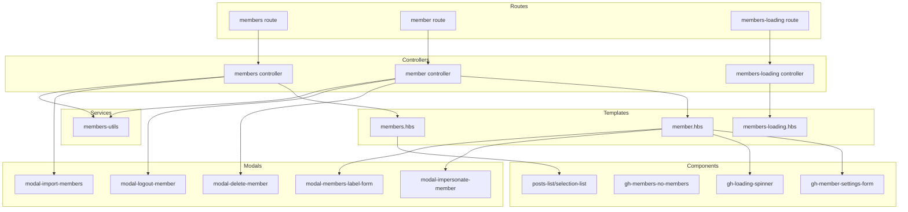
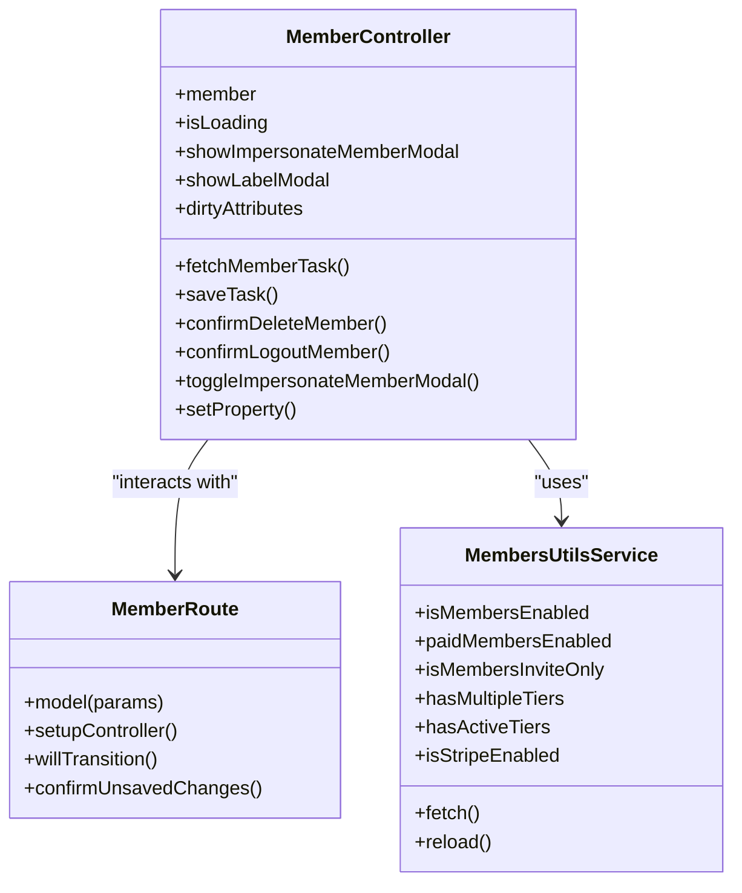
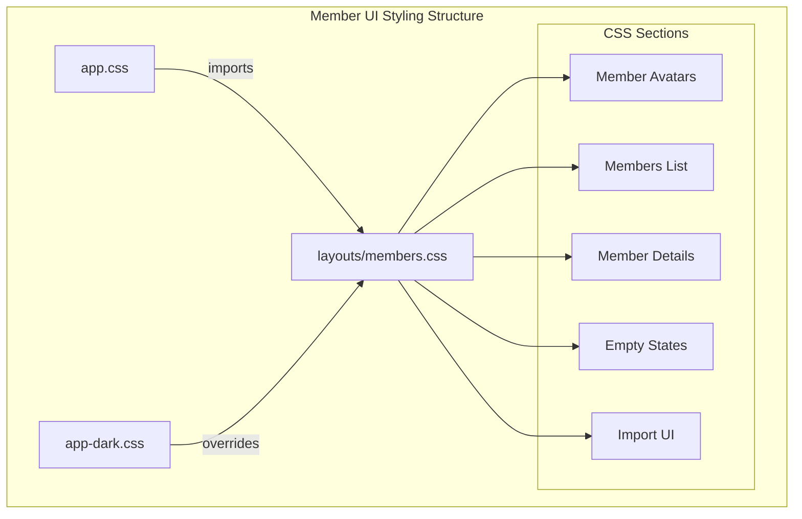
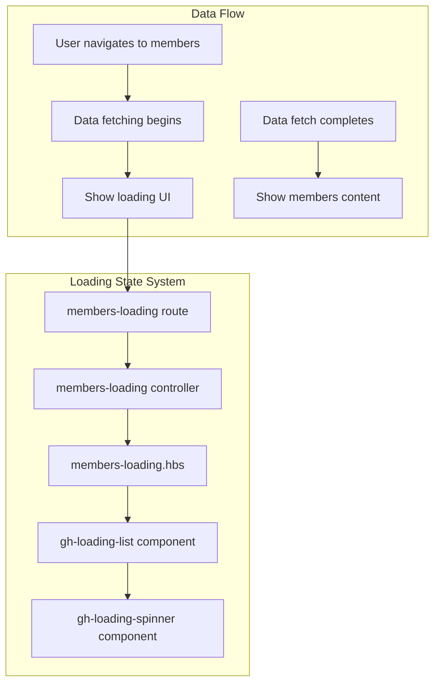
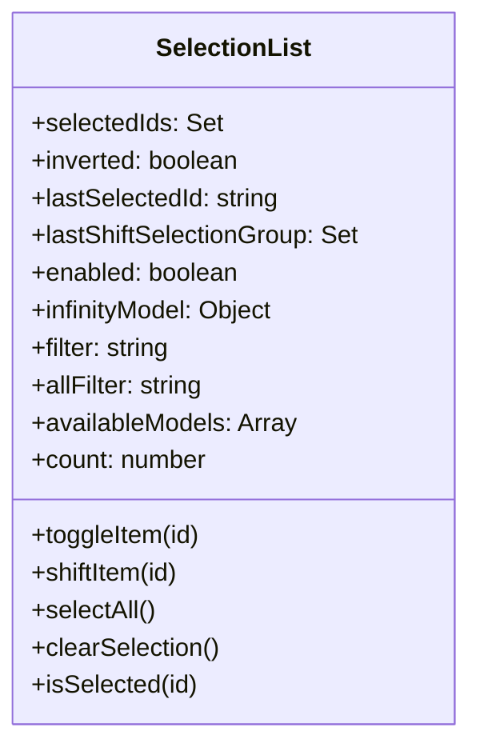
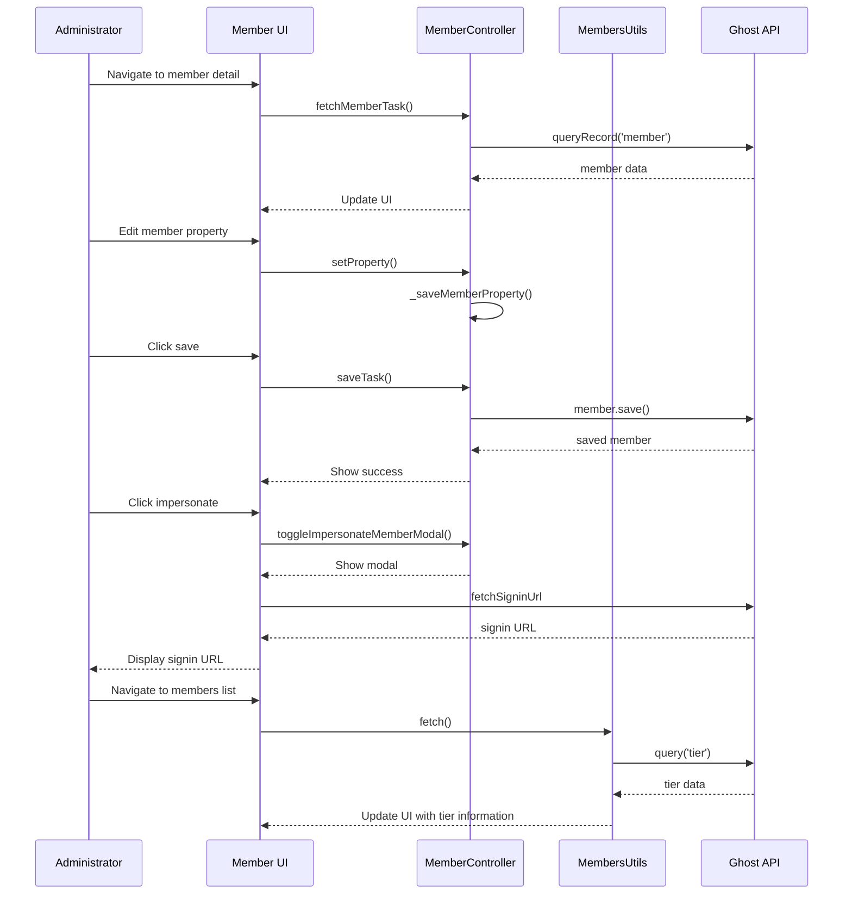
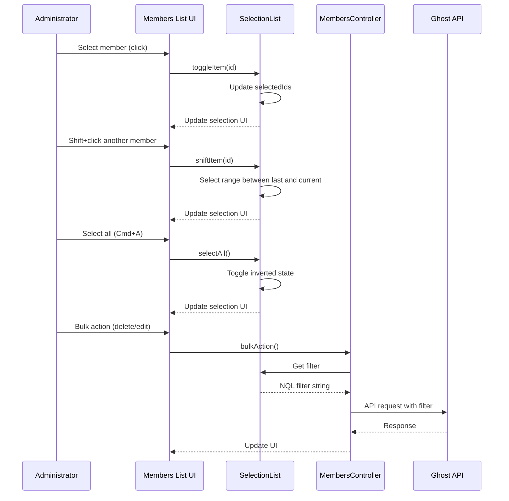
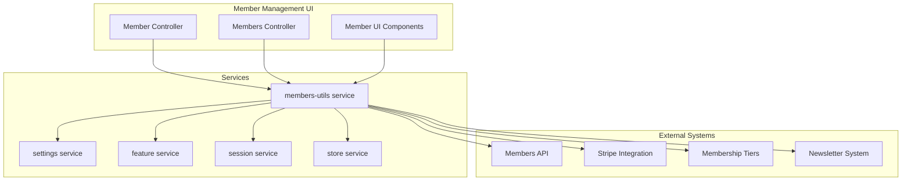

# Member Management UI

<details>
<summary>Relevant source files</summary>

The following files were used as context for generating this wiki page:

- [ghost/admin/.lint-todo](https://github.com/TryGhost/Ghost/blob/0d0e5bd3/ghost/admin/.lint-todo)
- [ghost/admin/app/components/gh-billing-update-button.js](https://github.com/TryGhost/Ghost/blob/0d0e5bd3/ghost/admin/app/components/gh-billing-update-button.js)
- [ghost/admin/app/components/gh-blog-url.js](https://github.com/TryGhost/Ghost/blob/0d0e5bd3/ghost/admin/app/components/gh-blog-url.js)
- [ghost/admin/app/components/gh-url-preview.js](https://github.com/TryGhost/Ghost/blob/0d0e5bd3/ghost/admin/app/components/gh-url-preview.js)
- [ghost/admin/app/components/posts-list/selection-list.js](https://github.com/TryGhost/Ghost/blob/0d0e5bd3/ghost/admin/app/components/posts-list/selection-list.js)
- [ghost/admin/app/controllers/pages-loading.js](https://github.com/TryGhost/Ghost/blob/0d0e5bd3/ghost/admin/app/controllers/pages-loading.js)
- [ghost/admin/app/controllers/pages.js](https://github.com/TryGhost/Ghost/blob/0d0e5bd3/ghost/admin/app/controllers/pages.js)
- [ghost/admin/app/controllers/posts-loading.js](https://github.com/TryGhost/Ghost/blob/0d0e5bd3/ghost/admin/app/controllers/posts-loading.js)
- [ghost/admin/app/helpers/gh-count-down-characters.js](https://github.com/TryGhost/Ghost/blob/0d0e5bd3/ghost/admin/app/helpers/gh-count-down-characters.js)
- [ghost/admin/app/helpers/gh-count-down-html-characters.js](https://github.com/TryGhost/Ghost/blob/0d0e5bd3/ghost/admin/app/helpers/gh-count-down-html-characters.js)
- [ghost/admin/app/services/members-utils.js](https://github.com/TryGhost/Ghost/blob/0d0e5bd3/ghost/admin/app/services/members-utils.js)
- [ghost/admin/app/templates/pages-loading.hbs](https://github.com/TryGhost/Ghost/blob/0d0e5bd3/ghost/admin/app/templates/pages-loading.hbs)
- [ghost/admin/app/templates/posts-loading.hbs](https://github.com/TryGhost/Ghost/blob/0d0e5bd3/ghost/admin/app/templates/posts-loading.hbs)

</details>


The Member Management UI is the administrative interface within Ghost's admin panel for managing and interacting with members (subscribers or readers). This interface provides functionality for viewing, creating, editing, and deleting members, as well as managing their labels, newsletter subscriptions, and payment information.

## Architecture Overview

The Member Management UI is built around a controller-route-template pattern following Ember.js conventions, with several supplementary components providing additional functionality. The system allows administrators to manage individual members as well as perform bulk operations.



Sources:
- [ghost/admin/app/controllers/member.js](https://github.com/TryGhost/Ghost/blob/0d0e5bd3/ghost/admin/app/controllers/member.js)
- [ghost/admin/app/routes/member.js](https://github.com/TryGhost/Ghost/blob/0d0e5bd3/ghost/admin/app/routes/member.js)
- [ghost/admin/app/templates/member.hbs](https://github.com/TryGhost/Ghost/blob/0d0e5bd3/ghost/admin/app/templates/member.hbs)
- [ghost/admin/app/components/gh-loading-spinner.js](https://github.com/TryGhost/Ghost/blob/0d0e5bd3/ghost/admin/app/components/gh-loading-spinner.js)
- [ghost/admin/app/services/members-utils.js](https://github.com/TryGhost/Ghost/blob/0d0e5bd3/ghost/admin/app/services/members-utils.js)
- [ghost/admin/app/templates/members-loading.hbs](https://github.com/TryGhost/Ghost/blob/0d0e5bd3/ghost/admin/app/templates/members-loading.hbs)
- [ghost/admin/app/controllers/members-loading.js](https://github.com/TryGhost/Ghost/blob/0d0e5bd3/ghost/admin/app/controllers/members-loading.js)
- [ghost/admin/app/components/posts-list/selection-list.js](https://github.com/TryGhost/Ghost/blob/0d0e5bd3/ghost/admin/app/components/posts-list/selection-list.js)

## Individual Member View

The individual member view provides a detailed interface for viewing and editing a single member's information. It is implemented through the member route, controller, and template.

### Member Controller

The `MemberController` manages the following functionality:
- Fetching and saving member data
- Handling member property changes
- Managing member labels
- Confirming member deletion
- Confirming member logout
- Member impersonation

The controller maintains state for:
- Member data and changes (`dirtyAttributes`)
- Loading state
- Modal visibility states



Sources:
- [ghost/admin/app/controllers/member.js](https://github.com/TryGhost/Ghost/blob/0d0e5bd3/ghost/admin/app/controllers/member.js)
- [ghost/admin/app/routes/member.js](https://github.com/TryGhost/Ghost/blob/0d0e5bd3/ghost/admin/app/routes/member.js)
- [ghost/admin/app/services/members-utils.js](https://github.com/TryGhost/Ghost/blob/0d0e5bd3/ghost/admin/app/services/members-utils.js)

### Member Template

The member template (`member.hbs`) provides the UI structure for the individual member view, consisting of:

1. A header section with:
   - Breadcrumb navigation
   - Member name/title
   - Action buttons (save, impersonate, logout, delete)

2. A form section containing the `gh-member-settings-form` component which handles:
   - Basic member information (name, email)
   - Member notes
   - Label management
   - Newsletter subscriptions
   - Subscription status

3. Modal components for specific actions:
   - Impersonate member
   - Label management

Sources:
- [ghost/admin/app/templates/member.hbs](https://github.com/TryGhost/Ghost/blob/0d0e5bd3/ghost/admin/app/templates/member.hbs)
- [ghost/admin/app/styles/layouts/members.css:676-1059](https://github.com/TryGhost/Ghost/blob/0d0e5bd3/ghost/admin/app/styles/layouts/members.css#L676-L1059)

## Member UI Styling

The Member UI uses a dedicated CSS file for styling that handles:

1. Member avatar styling:
   - Gravatar integration
   - Member initials display
   - Avatar sizing and positioning

2. Member detail layout:
   - Information sections
   - Metadata display
   - Stats and activity visualizations

3. Responsive design:
   - Mobile adaptations
   - Tablet/desktop layouts



Sources:
- [ghost/admin/app/styles/layouts/members.css](https://github.com/TryGhost/Ghost/blob/0d0e5bd3/ghost/admin/app/styles/layouts/members.css)
- [ghost/admin/app/styles/app.css:61](https://github.com/TryGhost/Ghost/blob/0d0e5bd3/ghost/admin/app/styles/app.css#L61)
- [ghost/admin/app/styles/app-dark.css:982-1070](https://github.com/TryGhost/Ghost/blob/0d0e5bd3/ghost/admin/app/styles/app-dark.css#L982-L1070)

## Member Management UI Components

### Loading States

The Member Management UI implements dedicated loading states to provide visual feedback during data fetching operations. This is handled through:

1. **Loading Routes and Controllers**: Dedicated loading routes (`members-loading`) that display while data is being fetched
2. **Loading Components**: The `gh-loading-spinner` component that provides visual feedback



The loading controllers maintain references to their parent controllers to access filter states and other UI configuration:

```javascript
// Example from members-loading controller
@controller('members') postsController;

get availableTypes() {
    return this.postsController.availableTypes;
}
```

### Empty State

The `gh-members-no-members` component provides a helpful interface when no members exist in the system. It includes:
- Explanatory text
- "Add yourself" functionality
- Visual cues for getting started

### Selection System

The `posts-list/selection-list` component provides functionality for selecting multiple members for bulk operations. Key features include:

- Tracking selected items with a Set of IDs
- Support for shift-click to select ranges
- Inverted selection mode for "select all except"
- Generation of NQL filters for API requests



### Modals

Several modal components provide specialized interfaces:

1. `modal-impersonate-member`: Generates a magic sign-in link to impersonate a member
2. `modal-members-label-form`: Interface for creating, editing, and deleting labels
3. `modal-delete-member`: Confirmation for member deletion
4. `modal-logout-member`: Confirmation for signing out a member from all devices
5. `modal-import-members`: Interface for importing members from CSV files

Sources:
- [ghost/admin/app/components/gh-members-no-members.js](https://github.com/TryGhost/Ghost/blob/0d0e5bd3/ghost/admin/app/components/gh-members-no-members.js)
- [ghost/admin/app/components/gh-loading-spinner.js](https://github.com/TryGhost/Ghost/blob/0d0e5bd3/ghost/admin/app/components/gh-loading-spinner.js)
- [ghost/admin/app/components/gh-loading-spinner.hbs](https://github.com/TryGhost/Ghost/blob/0d0e5bd3/ghost/admin/app/components/gh-loading-spinner.hbs)
- [ghost/admin/app/components/modal-impersonate-member.js](https://github.com/TryGhost/Ghost/blob/0d0e5bd3/ghost/admin/app/components/modal-impersonate-member.js)
- [ghost/admin/app/components/modal-members-label-form.js](https://github.com/TryGhost/Ghost/blob/0d0e5bd3/ghost/admin/app/components/modal-members-label-form.js)
- [ghost/admin/app/components/posts-list/selection-list.js](https://github.com/TryGhost/Ghost/blob/0d0e5bd3/ghost/admin/app/components/posts-list/selection-list.js)
- [ghost/admin/app/templates/posts-loading.hbs](https://github.com/TryGhost/Ghost/blob/0d0e5bd3/ghost/admin/app/templates/posts-loading.hbs)
- [ghost/admin/app/templates/pages-loading.hbs](https://github.com/TryGhost/Ghost/blob/0d0e5bd3/ghost/admin/app/templates/pages-loading.hbs)
- [ghost/admin/app/controllers/posts-loading.js](https://github.com/TryGhost/Ghost/blob/0d0e5bd3/ghost/admin/app/controllers/posts-loading.js)
- [ghost/admin/app/controllers/pages-loading.js](https://github.com/TryGhost/Ghost/blob/0d0e5bd3/ghost/admin/app/controllers/pages-loading.js)
- [ghost/admin/app/components/modal-import-members.hbs](https://github.com/TryGhost/Ghost/blob/0d0e5bd3/ghost/admin/app/components/modal-import-members.hbs)

## Member Management UI Interaction Patterns

The following diagram illustrates the typical interaction patterns when using the Member Management UI:



The Member Management UI also implements bulk selection and operations:



Sources:
- [ghost/admin/app/controllers/member.js](https://github.com/TryGhost/Ghost/blob/0d0e5bd3/ghost/admin/app/controllers/member.js)
- [ghost/admin/app/services/members-utils.js](https://github.com/TryGhost/Ghost/blob/0d0e5bd3/ghost/admin/app/services/members-utils.js)
- [ghost/admin/app/components/posts-list/selection-list.js](https://github.com/TryGhost/Ghost/blob/0d0e5bd3/ghost/admin/app/components/posts-list/selection-list.js)

## Integration with Other Ghost Systems

The Member Management UI integrates with several other Ghost systems through the `members-utils` service, which provides a centralized way to access member-related functionality:



The `members-utils` service provides key functionality:

1. **Membership Status Checks**:
   - `isMembersEnabled`: Whether the members feature is enabled
   - `paidMembersEnabled`: Whether paid memberships are enabled
   - `isMembersInviteOnly`: Whether membership is invite-only

2. **Tier Management**:
   - `hasMultipleTiers`: Whether multiple payment tiers are configured
   - `hasActiveTiers`: Whether any active payment tiers exist
   - `fetch()`: Loads tier information
   - `reload()`: Refreshes tier information

3. **Stripe Integration**:
   - `isStripeEnabled`: Whether Stripe is properly configured
   - Checks for direct keys or connect keys

4. **Plan Helpers**:
   - `isFreeChecked`: Whether free plans are enabled
   - `isMonthlyChecked`: Whether monthly plans are enabled
   - `isYearlyChecked`: Whether yearly plans are enabled

Sources:
- [ghost/admin/app/services/members-utils.js](https://github.com/TryGhost/Ghost/blob/0d0e5bd3/ghost/admin/app/services/members-utils.js)
- [ghost/admin/app/controllers/member.js](https://github.com/TryGhost/Ghost/blob/0d0e5bd3/ghost/admin/app/controllers/member.js)
- [ghost/admin/app/styles/layouts/members.css](https://github.com/TryGhost/Ghost/blob/0d0e5bd3/ghost/admin/app/styles/layouts/members.css)

## Utility Components and Helpers

The Member Management UI utilizes several utility components and helpers to enhance functionality:

### URL Preview

The `gh-url-preview` component generates and displays preview URLs for member-related pages:

```javascript
// Example usage
<GhUrlPreview @prefix="member" @slug={{member.slug}} @tagName="p" @classNames="description" />
```

The component strips the scheme from the blog URL and constructs a preview URL based on the provided prefix and slug.

### Character Counting

Two helper functions assist with character counting in member forms:

1. `gh-count-down-characters`: Counts characters in plain text fields
2. `gh-count-down-html-characters`: Counts characters in HTML content, stripping tags first

```javascript
// HTML character counting process
content = content.replace(/<[^>]*>?/gm, '');
content = content.replace(/&nbsp;/g, ' ');
content = content.replace(/&amp;/g, '&');
content = content.replace(/&quot;/g, '"');
content = content.replace(/&lt;/g, '<');
content = content.replace(/&gt;/g, '>');
```

These helpers provide visual feedback on character limits in forms, changing color when limits are approached or exceeded.

### Billing Integration

The `gh-billing-update-button` component provides integration with Ghost's billing system:

```javascript
// Opens the billing window when clicked
@action
openBilling() {
    this.billing.openBillingWindow(this.router.currentURL, '/pro/billing/plans');
}
```

## Responsive Design

The Member Management UI implements responsive design to adapt to different screen sizes:

1. **Desktop**: Full layout with all columns visible
2. **Tablet**: Simplified layout with some columns hidden
3. **Mobile**: Highly simplified layout with essential information only

Media queries in the CSS handle these adaptations, ensuring the UI remains usable across devices.

| Screen Size | Adaptations |
|-------------|-------------|
| > 1200px | Full layout with all details |
| 800px - 1200px | Simplified header, collapsed member details |
| < 800px | Mobile optimized view, stacked layout, hidden secondary information |

Sources:
- [ghost/admin/app/styles/layouts/members.css](https://github.com/TryGhost/Ghost/blob/0d0e5bd3/ghost/admin/app/styles/layouts/members.css)
- [ghost/admin/app/styles/layouts/main.css](https://github.com/TryGhost/Ghost/blob/0d0e5bd3/ghost/admin/app/styles/layouts/main.css)
- [ghost/admin/app/components/gh-url-preview.js](https://github.com/TryGhost/Ghost/blob/0d0e5bd3/ghost/admin/app/components/gh-url-preview.js)
- [ghost/admin/app/helpers/gh-count-down-characters.js](https://github.com/TryGhost/Ghost/blob/0d0e5bd3/ghost/admin/app/helpers/gh-count-down-characters.js)
- [ghost/admin/app/helpers/gh-count-down-html-characters.js](https://github.com/TryGhost/Ghost/blob/0d0e5bd3/ghost/admin/app/helpers/gh-count-down-html-characters.js)
- [ghost/admin/app/components/gh-billing-update-button.js](https://github.com/TryGhost/Ghost/blob/0d0e5bd3/ghost/admin/app/components/gh-billing-update-button.js)
- [ghost/admin/app/components/gh-blog-url.js](https://github.com/TryGhost/Ghost/blob/0d0e5bd3/ghost/admin/app/components/gh-blog-url.js)

## Summary