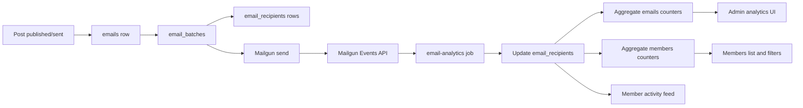

# Email Analytics Knowledge Base

Ghost's current email analytics pipeline is a polling and aggregation system:

## Docs

- [Backend Job](./backend-job.md) explains scheduling, Mailgun fetching, event processing, side effects, cursors, and aggregation.
- [Data Model And Queries](./data-model-and-queries.md) maps the tables, indexes, and SQL-shaped queries used by the pipeline.
- [Admin UI Consumers](./admin-ui.md) maps site-wide analytics, post analytics, posts list metrics, members filters, and the member event feed.
- [Email Recipients Use Cases](./email-recipients-use-cases.md) focuses specifically on every current use of `email_recipients`.
- [Standalone Service Proposal](./standalone-service-proposal.md) maps a possible OLAP-backed analytics service that ingests Mailgun webhooks directly.

## Code Map

| Area | Primary code |
| --- | --- |
| Job registration | [`jobs/index.js`](../../ghost/core/core/server/services/email-analytics/jobs/index.js) |
| Worker shim | [`jobs/fetch-latest/index.js`](../../ghost/core/core/server/services/email-analytics/jobs/fetch-latest/index.js) |
| Main-thread wrapper | [`email-analytics-service-wrapper.js`](../../ghost/core/core/server/services/email-analytics/email-analytics-service-wrapper.js) |
| Fetch orchestration | [`email-analytics-service.js`](../../ghost/core/core/server/services/email-analytics/email-analytics-service.js) |
| Mailgun event fetcher | [`email-analytics-provider-mailgun.js`](../../ghost/core/core/server/services/email-analytics/email-analytics-provider-mailgun.js), [`mailgun-client.js`](../../ghost/core/core/server/services/lib/mailgun-client.js) |
| Event processing | [`email-event-processor.js`](../../ghost/core/core/server/services/email-service/email-event-processor.js) |
| Event storage | [`email-event-storage.js`](../../ghost/core/core/server/services/email-service/email-event-storage.js) |
| Aggregate queries | [`lib/queries.js`](../../ghost/core/core/server/services/email-analytics/lib/queries.js) |
| Batch email sending | [`batch-sending-service.js`](../../ghost/core/core/server/services/email-service/batch-sending-service.js) |
| Stats API backend | [`stats.js`](../../ghost/core/core/server/api/endpoints/stats.js), [`posts-stats-service.js`](../../ghost/core/core/server/services/stats/posts-stats-service.js) |
| Stats API frontend hooks | [`apps/admin-x-framework/src/api/stats.ts`](../../apps/admin-x-framework/src/api/stats.ts) |
| React post analytics | [`apps/posts/src/views/PostAnalytics`](../../apps/posts/src/views/PostAnalytics) |
| React site analytics | [`apps/stats/src/views/Stats`](../../apps/stats/src/views/Stats) |
| Legacy posts list | [`ghost/admin/app/components/posts-list`](../../ghost/admin/app/components/posts-list) |
| Member event feed | [`event-repository.js`](../../ghost/core/core/server/services/members/members-api/repositories/event-repository.js), [`members-event-fetcher.js`](../../ghost/admin/app/helpers/members-event-fetcher.js) |

## Key Takeaways

- `email_recipients` is the per-recipient source of truth for sends, deliveries, opens, and permanent failures.
- `emails` stores per-newsletter aggregate counters that most post/newsletter analytics UI reads.
- `members` stores per-member aggregate email counters used by member list columns, sorting, and filters.
- Click analytics do not use `email_recipients` for click storage; clicks are stored in `members_click_events` via `redirects`.
- The largest table pressure points are recipient lookups, batched timestamp updates, per-email counts, per-member aggregation, and event-feed queries over `email_recipients`.
