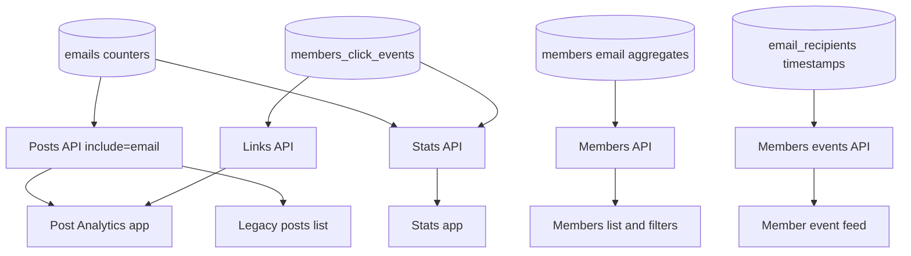

# Admin UI Consumers

## UI Data Flow

## Surface Map

| Surface | Frontend code | Backend/API | Data used |
| --- | --- | --- | --- |
| Site-wide Overview latest post card | [`useLatestPostStats`](../../apps/stats/src/hooks/use-latest-post-stats.ts), [`latest-post.tsx`](../../apps/stats/src/views/Stats/Overview/components/latest-post.tsx) | `GET /posts?include=authors,email,count.clicks`, `GET /stats/posts/:id/stats` | `emails.email_count`, `emails.opened_count`, `members_click_events`, member attribution, Tinybird visitors |
| Site-wide Overview top posts card | [`overview.tsx`](../../apps/stats/src/views/Stats/Overview/overview.tsx), [`top-posts.tsx`](../../apps/stats/src/views/Stats/Overview/components/top-posts.tsx) | `GET /stats/top-posts-views` | `emails.email_count`, `emails.opened_count`, click counts, Tinybird visitors |
| Site-wide Newsletters page | [`use-newsletter-stats-with-range.ts`](../../apps/stats/src/hooks/use-newsletter-stats-with-range.ts), [`newsletters.tsx`](../../apps/stats/src/views/Stats/Newsletters/newsletters.tsx) | `GET /stats/newsletter-basic-stats`, `GET /stats/newsletter-click-stats`, `GET /stats/subscriber-count` | `emails.email_count`, `emails.opened_count`, `members_click_events`, `members_subscribe_events`, newsletter counts |
| Post Analytics Overview newsletter section | [`newsletter-overview.tsx`](../../apps/posts/src/views/PostAnalytics/Overview/components/newsletter-overview.tsx) | `GET /posts?include=email,count.clicks`, `GET /links?filter=post_id` | `emails.email_count`, `emails.opened_count`, top links/click counts |
| Post Analytics Newsletter tab | [`use-post-newsletter-stats.ts`](../../apps/posts/src/hooks/use-post-newsletter-stats.ts), [`newsletter.tsx`](../../apps/posts/src/views/PostAnalytics/Newsletter/newsletter.tsx) | Posts API, newsletter basic/click stats endpoints, Links API | Current post email counters, average newsletter open/click rates, top clicked links, feedback counts |
| Legacy Ember posts list metrics | [`post.js`](../../ghost/admin/app/models/post.js), [`email.js`](../../ghost/admin/app/models/email.js), [`posts-list/list-item.hbs`](../../ghost/admin/app/components/posts-list/list-item.hbs) | Posts API with `email` and `count.clicks` | Computed open/click rates from `emails` and `members_click_events` |
| Members list columns and filters | [`members.tsx`](../../apps/posts/src/views/members/members.tsx), [`use-member-filter-fields.ts`](../../apps/posts/src/views/members/use-member-filter-fields.ts), [`member-fields.ts`](../../apps/posts/src/views/members/member-fields.ts) | Members API | `members.email_count`, `members.email_opened_count`, `members.email_open_rate`, filters through email relations |
| Member event feed and Members Activity | [`members-event-fetcher.js`](../../ghost/admin/app/helpers/members-event-fetcher.js), [`parse-member-event.js`](../../ghost/admin/app/helpers/parse-member-event.js) | `GET /members/events` | `email_recipients.processed_at`, `delivered_at`, `opened_at`, `failed_at`, `email_spam_complaint_events`, `members_click_events` |
| Posts export | [`posts-exporter.js`](../../ghost/core/core/server/services/posts/posts-exporter.js) | Server export service | `emails.email_count`, `emails.opened_count`, `count.clicks`, feedback counts |

## Site-Wide Stats App

The React Stats app uses `apps/admin-x-framework/src/api/stats.ts` as the API hook layer. Relevant endpoints are registered in [`routes.js`](../../ghost/core/core/server/web/api/endpoints/admin/routes.js#L159-L175):

- `GET /stats/posts/:id/stats`
- `GET /stats/top-posts-views`
- `GET /stats/newsletter-stats`
- `GET /stats/newsletter-basic-stats`
- `GET /stats/newsletter-click-stats`
- `GET /stats/subscriber-count`

The Newsletters page intentionally splits newsletter stats into two requests:

1. Basic stats from `posts LEFT JOIN emails` for fast sent/open rate rows.
2. Click stats from `redirects` and `members_click_events` for the post IDs returned by the first request.

That split happens in [`useNewsletterStatsWithRangeSplit`](../../apps/stats/src/hooks/use-newsletter-stats-with-range.ts#L199-L276). The backend implementation is [`getNewsletterBasicStats`](../../ghost/core/core/server/services/stats/posts-stats-service.js#L779-L875) and [`getNewsletterClickStats`](../../ghost/core/core/server/services/stats/posts-stats-service.js#L885-L924).

## Post Analytics App

The Post Analytics provider fetches the post with `email`, `count.clicks`, feedback counts, authors, tags, tiers, and newsletter in [`post-analytics-context.tsx`](../../apps/posts/src/providers/post-analytics-context.tsx#L81-L87). The `email` relation gives the post-level aggregate counters from `emails`.

The Newsletter tab then combines:

- Current newsletter metrics from `post.email.email_count`, `post.email.opened_count`, and `post.count.clicks`.
- Average newsletter metrics from `GET /stats/newsletter-basic-stats` plus `GET /stats/newsletter-click-stats`.
- Top clicked links from `GET /links?filter=post_id:'...'`.

The tab links back to members using filters such as `emails.post_id:<postId>`, `opened_emails.post_id:<postId>`, and `clicked_links.post_id:<postId>` in [`newsletter.tsx`](../../apps/posts/src/views/PostAnalytics/Newsletter/newsletter.tsx#L470-L480).

## Members List And Filters

Members filtering exposes email analytics in the Email filter group:

- `email_count`
- `email_opened_count`
- `email_open_rate` when open tracking is enabled
- `emails.post_id`
- `opened_emails.post_id` when open tracking is enabled
- `clicked_links.post_id` when click tracking is enabled
- `newsletter_feedback`

The filter UI is built in [`use-member-filter-fields.ts`](../../apps/posts/src/views/members/use-member-filter-fields.ts#L413-L448). Backend filter expansion maps `opened_emails.post_id` to `emails.post_id` and requires `email_recipients.opened_at >= 0` in [`member.js`](../../ghost/core/core/server/models/member.js#L91-L99).

The `members.email_*` aggregate columns are serialized by [`members.js`](../../ghost/core/core/server/api/endpoints/utils/serializers/output/members.js#L160-L178). The open rate column has a custom null-safe order clause in [`member.js`](../../ghost/core/core/server/models/member.js#L421-L427).

## Member Event Feed

The member activity feed calls `GET /members/events` from [`members-event-fetcher.js`](../../ghost/admin/app/helpers/members-event-fetcher.js#L103-L117). The API endpoint delegates to `membersService.api.events.getEventTimeline` in [`members.js`](../../ghost/core/core/server/api/endpoints/members.js#L500-L512).

The backend event repository reads email activity directly from `email_recipients`:

- sent events use `processed_at`
- delivered events use `delivered_at`
- opened events use `opened_at`
- failed events use `failed_at`

Those implementations are in [`event-repository.js`](../../ghost/core/core/server/services/members/members-api/repositories/event-repository.js#L749-L954). Spam complaints come from `email_spam_complaint_events`; clicks come from `members_click_events`.

The site-wide activity controller hides email events when no member is selected because they flood the list and pagination cannot handle them well. See [`members-activity.js`](../../ghost/admin/app/controllers/members-activity.js#L22-L35).
