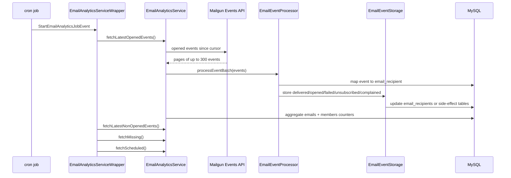

# Backend Job

## High-Level Flow

## Scheduling

The recurring job is registered in [`jobs/index.js`](../../ghost/core/core/server/services/email-analytics/jobs/index.js). It only schedules when:

- `emailAnalytics.enabled` is true.
- `backgroundJobs.emailAnalytics` is true.
- the process is not running tests.
- there is at least one non-failed email created in the last 30 days, unless the caller passes `skipEmailCheck`.

The schedule is randomized to run every 5 minutes with random second/minute offsets to avoid synchronized Mailgun API spikes. When a new newsletter email is created, [`EmailService.createEmail`](../../ghost/core/core/server/services/email-service/email-service.js#L145-L189) calls `scheduleRecurringJobs(true)` so analytics starts after the first send.

The actual scheduled job file, [`jobs/fetch-latest/index.js`](../../ghost/core/core/server/services/email-analytics/jobs/fetch-latest/index.js), does not process analytics inside the worker. It posts a `StartEmailAnalyticsJobEvent`; [`email-analytics-service-wrapper.js`](../../ghost/core/core/server/services/email-analytics/email-analytics-service-wrapper.js#L66-L70) listens for that event on the main thread and starts the real fetch.

## Fetch Order

[`EmailAnalyticsServiceWrapper.startFetch`](../../ghost/core/core/server/services/email-analytics/email-analytics-service-wrapper.js#L171-L224) runs four passes in priority order:

| Pass | Method | Events | Cursor | Window |
| --- | --- | --- | --- | --- |
| Latest opens | `fetchLatestOpenedEvents` | `opened` | `email-analytics-latest-opened` | last opened cursor to now minus 1 minute |
| Latest non-opens | `fetchLatestNonOpenedEvents` | `delivered`, `failed`, `unsubscribed`, `complained` | `email-analytics-latest-others` | last non-open cursor to now minus 1 minute |
| Missing | `fetchMissing` | all supported events | `email-analytics-missing` | last missing cursor to min(latest job start, now minus 30 minutes) |
| Scheduled backfill | `fetchScheduled` | all supported events | `email-analytics-scheduled` | manually configured begin/end |

Opened events are prioritized because opens are directly visible in user-facing analytics. The wrapper uses `maxEvents` budgets around 10,000 and immediately restarts if a run consumes too many events or if scheduled backfill has more work.

## Mailgun Fetching

[`EmailAnalyticsProviderMailgun`](../../ghost/core/core/server/services/email-analytics/email-analytics-provider-mailgun.js) builds the Mailgun query:

- `limit: 300`
- `event: delivered OR opened OR failed OR unsubscribed OR complained` unless narrowed by the caller
- `tags: bulk-email` plus any configured bulk email tag
- `ascending: yes`
- `begin` and `end` timestamps in seconds

[`MailgunClient.fetchEvents`](../../ghost/core/core/server/services/lib/mailgun-client.js#L164-L184) fetches events for the primary Mailgun domain and, when configured, a fallback domain for domain warming. Each page is normalized by [`normalizeEvent`](../../ghost/core/core/server/services/lib/mailgun-client.js#L304-L328) into the shape used by the analytics service.

The fetch loop filters out events newer than the job start time and stops when there are no more events or the `maxEvents` budget has been reached after passing the begin timestamp.

## Event Processing

[`EmailAnalyticsService.processEventBatch`](../../ghost/core/core/server/services/email-analytics/email-analytics-service.js#L537-L576) has two modes:

| Mode | Config | Behavior |
| --- | --- | --- |
| Sequential | `emailAnalytics.batchProcessing: false` | Process each event with individual recipient lookup and immediate row updates. This is the default in [`defaults.json`](../../ghost/core/core/shared/config/defaults.json#L226-L235). |
| Batched | `emailAnalytics.batchProcessing: true` | Preload recipient lookups for the batch, process events from cache, then flush timestamp updates in bulk. |

Recipient lookup happens in [`EmailEventProcessor`](../../ghost/core/core/server/services/email-service/email-event-processor.js):

- If Mailgun provides `user-variables.email-id`, use it as `email_id`.
- Otherwise map Mailgun `provider_id` to `email_id` through `email_batches`.
- Match the recipient by `email_recipients.member_email` and `email_recipients.email_id`.

Event handling side effects:

| Mailgun event | Code path | Database effect |
| --- | --- | --- |
| `delivered` | [`handleDelivered`](../../ghost/core/core/server/services/email-service/email-event-processor.js#L70-L86) | set `email_recipients.delivered_at` if null |
| `opened` | [`handleOpened`](../../ghost/core/core/server/services/email-service/email-event-processor.js#L93-L108) | set `email_recipients.opened_at` if null, dispatches `EmailOpenedEvent` |
| permanent `failed` | [`handlePermanentFailed`](../../ghost/core/core/server/services/email-service/email-event-processor.js#L139-L157) | set `email_recipients.failed_at` if null and upsert `email_recipient_failures` |
| temporary `failed` | [`handleTemporaryFailed`](../../ghost/core/core/server/services/email-service/email-event-processor.js#L115-L132) | upsert `email_recipient_failures`; does not set `failed_at` |
| `unsubscribed` | [`handleUnsubscribed`](../../ghost/core/core/server/services/email-service/email-event-storage.js#L178-L189) | remove the member from the newsletter and remove Mailgun unsubscribe suppression |
| `complained` | [`handleComplained`](../../ghost/core/core/server/services/email-service/email-event-storage.js#L191-L205) | insert `email_spam_complaint_events` and remove Mailgun complaint suppression |

## Storage And Aggregation

Timestamp updates live in [`email-event-storage.js`](../../ghost/core/core/server/services/email-service/email-event-storage.js). Sequential mode updates one row at a time with `WHERE id = ? AND <timestamp> IS NULL`. Batched mode collects recipient IDs and timestamps, then runs `UPDATE email_recipients SET <timestamp> = CASE id ... WHERE id IN (...) AND <timestamp> IS NULL`.

After events are processed, [`EmailAnalyticsService.aggregateStats`](../../ghost/core/core/server/services/email-analytics/email-analytics-service.js#L677-L710) updates aggregate counters:

- Per-email counters in `emails`: `delivered_count`, `failed_count`, and sometimes `opened_count`.
- Per-member counters in `members`: `email_count`, `email_opened_count`, and `email_open_rate`.

Aggregation is triggered at the end of each fetch and also mid-run after 5 minutes or more than 5,000 pending members. In batch mode, member aggregation chunks 100 member IDs at a time.

## Cursors And Recovery

Cursors are stored in the `jobs` table by [`lib/queries.js`](../../ghost/core/core/server/services/email-analytics/lib/queries.js):

- `started_at` records the begin timestamp for a job.
- `finished_at` records the last processed event timestamp.
- `metadata` stores manual scheduled backfill windows.

If no job cursor exists, Ghost falls back to `MAX(opened_at)`, `MAX(delivered_at)`, and/or `MAX(failed_at)` from `email_recipients`, then creates the job row. That fallback is important for first run but expensive on large tables.

Manual backfill is exposed by the Admin API:

- `GET /emails/:id/analytics` returns in-memory status from [`emails.analyticsStatus`](../../ghost/core/core/server/api/endpoints/emails.js#L139-L148).
- `PUT /emails/:id/analytics` schedules a backfill from email creation to a default max of 7 days or 1 hour ago from [`emails.scheduleAnalytics`](../../ghost/core/core/server/api/endpoints/emails.js#L151-L177).
