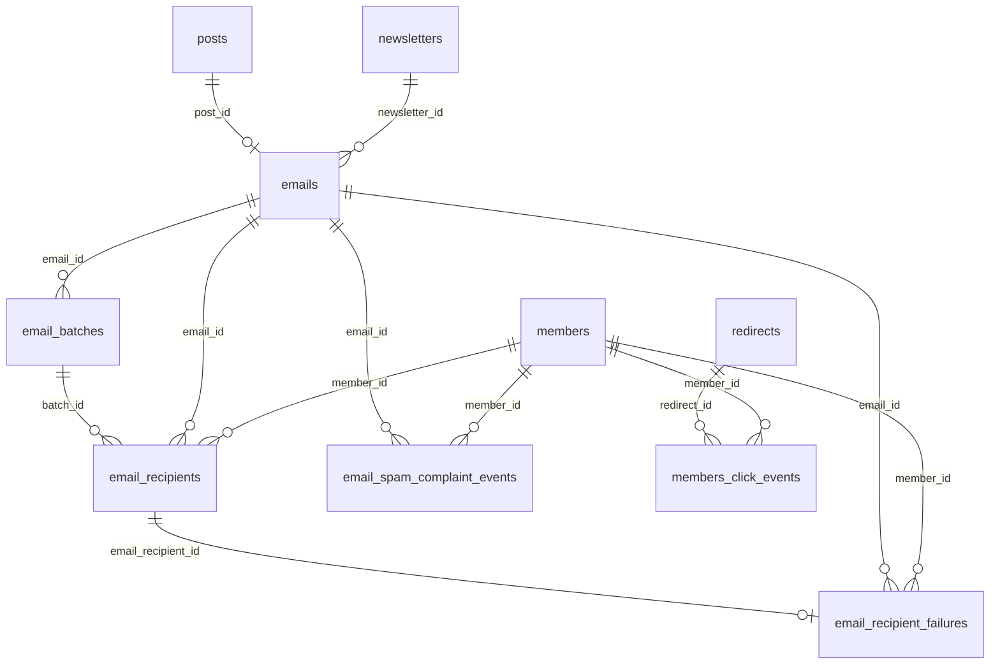

# Data Model And Queries

## Relationship Map

## Core Tables

| Table | Purpose | Relevant columns/indexes |
| --- | --- | --- |
| `emails` | One row per newsletter email attached to a post. Stores aggregate counts. | `post_id` unique, `newsletter_id`, `email_count`, `delivered_count`, `opened_count`, `failed_count`, `track_opens`, `track_clicks`. See [`schema.js`](../../ghost/core/core/server/data/schema/schema.js#L828-L870). |
| `email_batches` | One Mailgun submission batch per up-to-1,000 recipients. Stores Mailgun provider ID. | `email_id`, `provider_id`, `status`, `fallback_sending_domain`, `member_segment`. See [`schema.js`](../../ghost/core/core/server/data/schema/schema.js#L872-L889). |
| `email_recipients` | One row per member recipient per email. Source of truth for send/delivery/open/failure timestamps. | `email_id`, `member_id`, `batch_id`, `processed_at`, `delivered_at`, `opened_at`, `failed_at`, `member_uuid`, `member_email`, `member_name`; indexes: `member_id`, `(email_id, member_email)`, `(email_id, delivered_at)`, `(email_id, opened_at)`, `(email_id, failed_at)`. See [`schema.js`](../../ghost/core/core/server/data/schema/schema.js#L891-L908). |
| `email_recipient_failures` | Stores failure details for bounced recipients. | `email_id`, `member_id`, `email_recipient_id`, `severity`, `failed_at`, Mailgun error fields. See [`schema.js`](../../ghost/core/core/server/data/schema/schema.js#L910-L927). |
| `email_spam_complaint_events` | Stores spam complaint events. | Used by analytics processing and member activity feed. See [`EmailSpamComplaintEvent`](../../ghost/core/core/server/models/email-spam-complaint-event.js). |
| `members` | Stores member-level aggregate email stats. | `email_count`, `email_opened_count`, indexed `email_open_rate`. See [`schema.js`](../../ghost/core/core/server/data/schema/schema.js#L419-L445). |
| `jobs` | Stores email analytics job cursors and scheduled backfill metadata. | `name`, `started_at`, `finished_at`, `metadata`, `status`. Used by [`lib/queries.js`](../../ghost/core/core/server/services/email-analytics/lib/queries.js). |
| `redirects` + `members_click_events` | Stores click tracking, separate from `email_recipients`. | Newsletter click rates divide distinct member clicks by `emails.email_count`. Existing link tracking docs: [`link-redirection/README.md`](../../ghost/core/core/server/services/link-redirection/README.md). |

## Query Inventory

These are SQL-shaped summaries of the important queries. Links point to the implementation.

### Job startup and cursors

| Use | Query shape | Code |
| --- | --- | --- |
| Decide whether to register recurring job | `SELECT COUNT(id) FROM emails WHERE created_at > now - 30 days AND status <> 'failed'` | [`jobs/index.js`](../../ghost/core/core/server/services/email-analytics/jobs/index.js#L17-L25) |
| First-run cursor fallback | `SELECT MAX(opened_at/delivered_at/failed_at) FROM email_recipients` | [`getLastEventTimestamp`](../../ghost/core/core/server/services/email-analytics/lib/queries.js#L40-L78) |
| Persist cursor | `UPDATE jobs SET started_at/finished_at = ?, status = ? WHERE name = ?` | [`setJobTimestamp`](../../ghost/core/core/server/services/email-analytics/lib/queries.js#L109-L128) |
| Persist scheduled backfill | `UPDATE jobs SET metadata = ? WHERE name = 'email-analytics-scheduled'` | [`setJobMetadata`](../../ghost/core/core/server/services/email-analytics/lib/queries.js#L153-L171) |

### Event-to-recipient lookup

| Mode | Query shape | Code |
| --- | --- | --- |
| Resolve Mailgun provider IDs | `SELECT provider_id, email_id FROM email_batches WHERE provider_id IN (...)` | [`batchGetRecipients`](../../ghost/core/core/server/services/email-service/email-event-processor.js#L295-L310) |
| Batched recipient lookup | `SELECT id, member_id, email_id, member_email FROM email_recipients WHERE (member_email = ? AND email_id = ?) OR ...` | [`batchGetRecipients`](../../ghost/core/core/server/services/email-service/email-event-processor.js#L328-L343) |
| Sequential provider ID lookup | `SELECT email_id FROM email_batches WHERE provider_id = ? LIMIT 1` | [`getEmailId`](../../ghost/core/core/server/services/email-service/email-event-processor.js#L265-L281) |
| Sequential recipient lookup | `SELECT id, member_id FROM email_recipients WHERE member_email = ? AND email_id = ? LIMIT 1` | [`getRecipient`](../../ghost/core/core/server/services/email-service/email-event-processor.js#L230-L244) |

### Event storage

| Event | Query shape | Code |
| --- | --- | --- |
| Delivered, sequential | `UPDATE email_recipients SET delivered_at = ? WHERE id = ? AND delivered_at IS NULL` | [`handleDelivered`](../../ghost/core/core/server/services/email-service/email-event-storage.js#L36-L60) |
| Opened, sequential | `UPDATE email_recipients SET opened_at = ? WHERE id = ? AND opened_at IS NULL` | [`handleOpened`](../../ghost/core/core/server/services/email-service/email-event-storage.js#L62-L86) |
| Permanent failed, sequential | `UPDATE email_recipients SET failed_at = ? WHERE id = ? AND failed_at IS NULL` | [`handlePermanentFailed`](../../ghost/core/core/server/services/email-service/email-event-storage.js#L88-L112) |
| Delivered/opened/failed, batched | `UPDATE email_recipients SET <timestamp> = CASE id ... END WHERE id IN (...) AND <timestamp> IS NULL` | [`flushBatchedUpdates`](../../ghost/core/core/server/services/email-service/email-event-storage.js#L240-L352) |
| Failure details | transactionally find-or-insert/update `email_recipient_failures` by `email_recipient_id` | [`saveFailure`](../../ghost/core/core/server/services/email-service/email-event-storage.js#L118-L176) |
| Spam complaints | `INSERT INTO email_spam_complaint_events (...)` | [`handleComplained`](../../ghost/core/core/server/services/email-service/email-event-storage.js#L191-L205) |

### Aggregation

| Aggregate | Query shape | Code |
| --- | --- | --- |
| Per-email delivered count | `SELECT COUNT(id) FROM email_recipients WHERE email_id = ? AND delivered_at IS NOT NULL` | [`aggregateEmailStats`](../../ghost/core/core/server/services/email-analytics/lib/queries.js#L207-L222) |
| Per-email failed count | `SELECT COUNT(id) FROM email_recipients WHERE email_id = ? AND failed_at IS NOT NULL` | [`aggregateEmailStats`](../../ghost/core/core/server/services/email-analytics/lib/queries.js#L207-L222) |
| Per-email opened count | `SELECT COUNT(id) FROM email_recipients WHERE email_id = ? AND opened_at IS NOT NULL` | [`aggregateEmailStats`](../../ghost/core/core/server/services/email-analytics/lib/queries.js#L216-L221) |
| Per-member tracked count | `COUNT(email_recipients.id) LEFT JOIN emails WHERE member_id = ? AND emails.track_opens = true` | [`aggregateMemberStats`](../../ghost/core/core/server/services/email-analytics/lib/queries.js#L224-L247) |
| Per-member totals | `COUNT(*)` and opened count from `email_recipients WHERE member_id = ?` | [`aggregateMemberStats`](../../ghost/core/core/server/services/email-analytics/lib/queries.js#L232-L246) |
| Batched member aggregate | `SELECT member_id, COUNT(*), SUM(opened_at IS NOT NULL), SUM(emails.track_opens = 1) FROM email_recipients LEFT JOIN emails WHERE member_id IN (...) GROUP BY member_id` | [`aggregateMemberStatsBatch`](../../ghost/core/core/server/services/email-analytics/lib/queries.js#L249-L331) |
| Batched member update | `UPDATE members SET email_count = CASE id ..., email_opened_count = CASE id ..., email_open_rate = CASE id ... WHERE id IN (...)` | [`aggregateMemberStatsBatch`](../../ghost/core/core/server/services/email-analytics/lib/queries.js#L280-L331) |

### Admin analytics reads

| Endpoint/use | Query shape | Code |
| --- | --- | --- |
| Newsletter basic stats | `posts LEFT JOIN emails WHERE posts.newsletter_id = ?` selecting `emails.email_count`, `emails.opened_count`, calculated open rate | [`getNewsletterBasicStats`](../../ghost/core/core/server/services/stats/posts-stats-service.js#L779-L875) |
| Newsletter click stats | `redirects LEFT JOIN members_click_events LEFT JOIN posts LEFT JOIN emails WHERE post_id IN (...) GROUP BY redirects.post_id` | [`getNewsletterClickStats`](../../ghost/core/core/server/services/stats/posts-stats-service.js#L885-L924) |
| Full newsletter stats | Basic stats plus click-count subquery | [`getNewsletterStats`](../../ghost/core/core/server/services/stats/posts-stats-service.js#L693-L765) |
| Single post stats | `posts LEFT JOIN emails WHERE posts.id = ?` then member attribution and Tinybird visitors | [`getPostStats`](../../ghost/core/core/server/services/stats/posts-stats-service.js#L1116-L1180) |
| Top posts by views | Tinybird views plus `posts LEFT JOIN emails`, then click/member attribution enrichments | [`getTopPostsViews`](../../ghost/core/core/server/services/stats/posts-stats-service.js#L1191-L1388) |
| Member email events | `EmailRecipient.findPage` over `processed_at`, `delivered_at`, `opened_at`, or `failed_at` with `member` and `email` relations | [`event-repository.js`](../../ghost/core/core/server/services/members/members-api/repositories/event-repository.js#L749-L954) |

## Performance Notes

- The current schema optimizes per-email counts with `(email_id, delivered_at/opened_at/failed_at)` indexes.
- The schema also optimizes event lookup by `(email_id, member_email)`.
- Non-email-id timestamp indexes on `email_recipients` were intentionally dropped in [`2024-03-25-16-51-29-drop-email-recipients-non-email-id-indexes.js`](../../ghost/core/core/server/data/migrations/versions/5.82/2024-03-25-16-51-29-drop-email-recipients-non-email-id-indexes.js).
- Member aggregation depends on the `member_id` index and historical recipient volume. For large customers, this is a key pressure point because aggregation is across all historical rows for each touched member.
- The site-wide member activity page hides email events when no member is selected because those events flood the feed and the API cannot paginate them correctly. See [`members-activity.js`](../../ghost/admin/app/controllers/members-activity.js#L22-L35).
