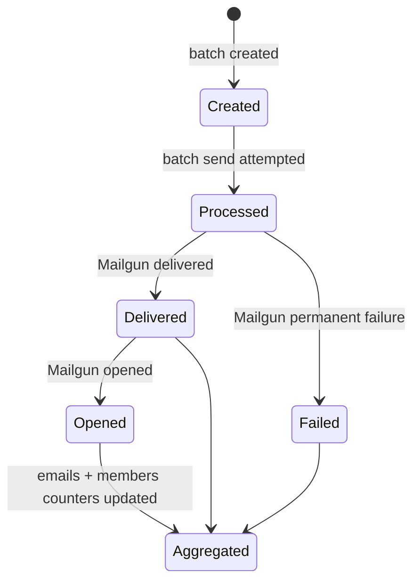
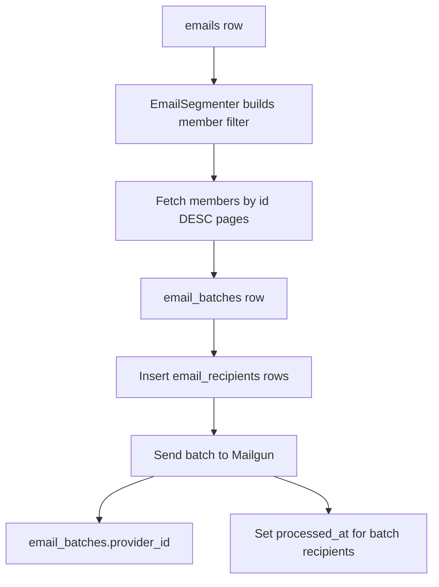
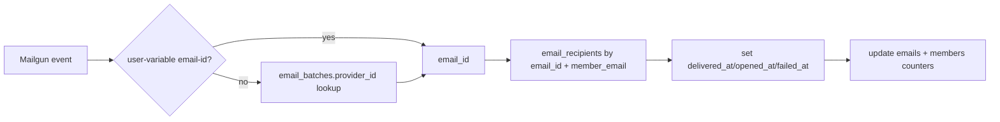

# `email_recipients` Use Cases

## Lifecycle

`email_recipients` rows are created before sending to Mailgun. Analytics events later mutate timestamp columns on those same rows.

## Use-Case Map

| Use case | How `email_recipients` is used | Code |
| --- | --- | --- |
| Batch email sending manifest | One row per selected member recipient, including a snapshot of `member_uuid`, `member_email`, and `member_name`. | [`createBatch`](../../ghost/core/core/server/services/email-service/batch-sending-service.js#L382-L426) |
| Batch retry / send payload | Batch send reloads recipients by `batch_id`, with member relations, and transforms them into `MemberLike` objects. | [`getBatchMembers`](../../ghost/core/core/server/services/email-service/batch-sending-service.js#L603-L635) |
| Send attempt marker | After each batch attempt, all rows for the batch get `processed_at`, even if the batch failed. | [`sendBatch`](../../ghost/core/core/server/services/email-service/batch-sending-service.js#L590-L598) |
| Mailgun event correlation | Mailgun events are mapped back to a row by `email_id` plus `member_email`; `email_id` can come directly from Mailgun variables or indirectly through `email_batches.provider_id`. | [`EmailEventProcessor`](../../ghost/core/core/server/services/email-service/email-event-processor.js#L208-L244) |
| Delivered/opened/failed source of truth | `delivered_at`, `opened_at`, and `failed_at` are set on the row, once, with out-of-order protection. | [`EmailEventStorage`](../../ghost/core/core/server/services/email-service/email-event-storage.js#L36-L112) |
| Per-email aggregates | Counts rows per `email_id` where delivery/open/failure timestamps are non-null, then writes `emails.delivered_count`, `emails.opened_count`, `emails.failed_count`. | [`aggregateEmailStats`](../../ghost/core/core/server/services/email-analytics/lib/queries.js#L207-L222) |
| Per-member aggregates | Counts all rows and opened rows for touched members, then writes `members.email_count`, `members.email_opened_count`, `members.email_open_rate`. | [`aggregateMemberStatsBatch`](../../ghost/core/core/server/services/email-analytics/lib/queries.js#L249-L331) |
| Member filters | Members can be filtered by having received/opened a specific email/post through model filter relations over `email_recipients`. | [`member.js`](../../ghost/core/core/server/models/member.js#L91-L99), [`use-member-filter-fields.ts`](../../apps/posts/src/views/members/use-member-filter-fields.ts#L413-L448) |
| Member event feed | Email sent/delivered/opened/failed feed events are synthesized from `processed_at`, `delivered_at`, `opened_at`, and `failed_at`. | [`event-repository.js`](../../ghost/core/core/server/services/members/members-api/repositories/event-repository.js#L749-L954) |
| Email batch counts | `EmailBatch` exposes `count.recipients` by counting rows for a batch. | [`email-batch.js`](../../ghost/core/core/server/models/email-batch.js#L157-L168) |
| Failure records | `email_recipient_failures.email_recipient_id` references the recipient row. | [`email-event-storage.js`](../../ghost/core/core/server/services/email-service/email-event-storage.js#L118-L176) |
| Import/export and seed data | Backup exports can include the table; seed/import generators create realistic rows and timestamps. | [`table-lists.js`](../../ghost/core/core/server/data/exporter/table-lists.js#L1-L64), [`email-recipients-importer.js`](../../ghost/core/core/server/data/seeders/importers/email-recipients-importer.js) |
| Post deletion cleanup | Bulk post deletion deletes related `email_recipients` rows by email ID. | [`posts-service.js`](../../ghost/core/core/server/services/posts/posts-service.js#L267-L283) |
| Member deletion retention | Member deletion does not delete recipient records, preserving analytics and historical records. | [`member.js`](../../ghost/core/core/server/models/member.js#L176-L190) |

## What It Is Not Used For

- Click storage: clicks are stored in `members_click_events`, joined through `redirects`; see [`link-redirection/README.md`](../../ghost/core/core/server/services/link-redirection/README.md).
- Subscriber counts: newsletter subscriber stats use `members_newsletters` and `members_subscribe_events`; see [`getNewsletterSubscriberStats`](../../ghost/core/core/server/services/stats/posts-stats-service.js#L928-L1013).
- Automated welcome emails: those use `automated_email_recipients` / welcome-email tables, not `email_recipients`.
- Mailgun failure details: details live in `email_recipient_failures`; `email_recipients.failed_at` is only the aggregate timestamp marker for permanent failures.

## Sending Path Details

During batch creation, [`EmailSegmenter`](../../ghost/core/core/server/services/email-service/email-segmenter.js) builds a members filter from:

- newsletter subscription: `newsletters.id:'<newsletterId>'`
- global email enabled state: `email_disabled:0`
- post recipient filter: e.g. paid/free/custom segment
- newsletter visibility rules
- optional content segment

[`BatchSendingService.createBatches`](../../ghost/core/core/server/services/email-service/batch-sending-service.js#L237-L340) pages members by descending ID and creates batches at the provider max recipient count. `MailgunEmailProvider.getMaximumRecipients` delegates to [`MailgunClient.getBatchSize`](../../ghost/core/core/server/services/lib/mailgun-client.js#L390-L397), which defaults to 1,000.

## Analytics Path Details

For each Mailgun event, Ghost must find the recipient row:

This makes `(email_id, member_email)` the critical lookup index. Current schema defines that composite index in [`schema.js`](../../ghost/core/core/server/data/schema/schema.js#L903-L908).

## Scaling-Relevant Hot Paths

| Hot path | Why it matters at 500M+ rows |
| --- | --- |
| First-run cursor fallback with `MAX(opened_at/delivered_at/failed_at)` | These queries scan/index-walk across the whole recipient history when `jobs` cursor rows are missing. |
| Batched recipient lookup with many OR clauses | Each Mailgun page can create many `(member_email, email_id)` predicates. The composite index helps, but query construction and planning still scale with batch size. |
| Per-email aggregate counts | Counts over a 500k-recipient email are bounded by `email_id` but still count many index entries for each event type. |
| Per-member aggregate counts | Touched members are re-aggregated across all historical recipient rows for those member IDs. This gets more expensive as member history grows. |
| Member activity feed | Email events are synthesized from timestamp columns in `email_recipients`; site-wide email events are hidden because volume breaks useful pagination. |
