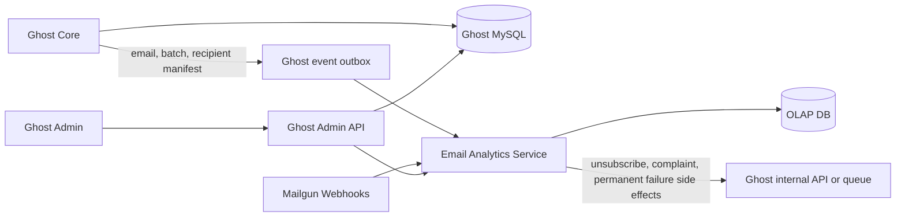

# Standalone Email Analytics Service Proposal

## Goal

Move high-volume email analytics workloads out of Ghost's primary MySQL database and into a standalone analytics service backed by an OLAP database. The service should ingest Mailgun webhooks directly instead of polling Mailgun's Events API, then expose fast analytical reads for Ghost Admin.

The boundary should be:

> Ghost owns email intent, identity, sending, permissions, and product state. The email analytics service owns observed email events, analytical projections, and analytical query APIs.

## Ownership Boundary

| Domain | Owner | Notes |
| --- | --- | --- |
| Posts, newsletters, members, tiers, labels, subscriptions | Ghost DB | Product source of truth and authorization boundary. |
| Email creation, audience selection, send status, retry state | Ghost DB | Ghost decides who should receive an email and whether a batch should be retried. |
| Mailgun webhook ingestion | Email analytics service | High-volume append workload; should not run through Ghost's request lifecycle. |
| Raw and normalized delivery/open/failure events | Email analytics service | Analytics source of truth. Store in OLAP with idempotency keys. |
| Per-email, per-post, per-newsletter aggregates | Email analytics service | Replaces expensive counts over `email_recipients`. |
| Per-member email aggregates | Email analytics service, optionally cached in Ghost | Needed for filters, sorting, and member profile stats. |
| Member unsubscribe and complaint mutations | Ghost DB | These are product/compliance state changes and must remain Ghost-owned. |
| Admin authentication and public Admin API contract | Ghost | Ghost should proxy service reads so Admin does not need separate auth or tenant logic. |

## What Stays In Ghost's DB

Ghost should keep operational command-side data:

| Table/data | Why it stays |
| --- | --- |
| `posts`, `newsletters`, `members`, `members_newsletters` | Product state, permissions, and subscription state. |
| `emails` | Email identity, post/newsletter relationship, tracking flags, send status. Aggregate columns can remain temporarily as compatibility caches. |
| `email_batches` | Sending provider metadata, batch status, retry state, and `provider_id`. |
| `email_recipients` | Initially needed for current send/retry compatibility. Long term, this should become a retention-limited operational recipient manifest, not the permanent analytics table. |
| `members.email_count`, `members.email_opened_count`, `members.email_open_rate` | Compatibility cache during migration. Long term, these can be read from the analytics service or maintained by service-fed sync. |
| Unsubscribe and complaint state | Mailgun webhook events can trigger this, but Ghost should apply the mutation. |
| Admin API auth and permission checks | Keeps one security boundary for Admin. |

The current hot table, [`email_recipients`](../../ghost/core/core/server/data/schema/schema.js#L891-L908), should stop being the long-term analytics source of truth. It can remain an operational send manifest until batch sending no longer depends on it.

## What Lives In The Analytics Service

The service should own query-side analytics data:

| Data | Purpose |
| --- | --- |
| Raw webhook events | Debugging, replay, and provider audit. Retain for a short period if payloads contain PII. |
| Normalized email events | Append-only facts for `sent`, `delivered`, `opened`, `failed`, `unsubscribed`, and `complained`. |
| Recipient analytics state | Latest known state per `site_id + email_id + member_id/member_uuid`, replacing the analytics role of `email_recipients`. |
| Email/post/newsletter rollups | Fast reads for Stats, Post Analytics, posts list metrics, exports, and dashboards. |
| Member email rollups | Fast reads for member email counts, opened counts, open rate, and last email activity. |
| Email activity feed projection | Fast member event feed reads without querying `email_recipients` timestamp columns. |
| Failure analytics | Replaces analytics reads over `email_recipient_failures`; Ghost can still receive side effects. |
| Complaint analytics | Stores analytical complaint event facts while Ghost owns the resulting product mutation. |

Click analytics currently live in `members_click_events` and are combined with email counters in the Stats API. A complete analytics split should eventually move or mirror click events too; otherwise newsletter analytics still span Ghost MySQL and the analytics service.

## Proposed Service Data Model

The exact OLAP engine can vary, but the service needs these logical datasets:

| Dataset | Grain | Example columns |
| --- | --- | --- |
| `email_event_facts` | One normalized event | `site_id`, `email_id`, `batch_id`, `recipient_id`, `member_id`, `member_uuid`, `event_type`, `occurred_at`, `provider`, `provider_event_id`, `severity`, `reason`, `message_id`. |
| `recipient_email_state` | One recipient per email | `site_id`, `email_id`, `member_id`, `member_uuid`, `sent_at`, `delivered_at`, `opened_at`, `failed_at`, `unsubscribed_at`, `complained_at`, `last_event_at`. |
| `email_rollups` | One email | `site_id`, `email_id`, `sent_count`, `delivered_count`, `opened_count`, `failed_count`, `complained_count`, `last_event_at`. |
| `newsletter_rollups_daily` | Newsletter per day | `site_id`, `newsletter_id`, `date`, sent/open/failure/click metrics. |
| `member_email_rollups` | One member | `site_id`, `member_id`, `email_count`, `email_opened_count`, `email_open_rate`, `last_sent_at`, `last_opened_at`. |
| `member_email_timeline` | One member event | `site_id`, `member_id`, `email_id`, `event_type`, `occurred_at`, display metadata IDs. |

The service should prefer append-only facts plus materialized projections. Rebuildable projections are important because webhook schemas, dedupe logic, and product definitions will change.

## Ingestion Design

### Ghost to service: recipient manifest

Ghost should emit a manifest when it creates/sends batches. This can be implemented with an outbox table or queue published from the batch sending path in [`batch-sending-service.js`](../../ghost/core/core/server/services/email-service/batch-sending-service.js).

Manifest events should include:

- `site_id`
- `email_id`
- `post_id`
- `newsletter_id`
- `batch_id`
- `provider_id` when available
- `member_id`
- `member_uuid`
- `recipient_id` if Ghost keeps `email_recipients`
- recipient email hash, not plain email, unless needed for a bounded migration period
- `track_opens` and `track_clicks`
- send timestamp and batch status

Ghost should also include stable identifiers in Mailgun recipient variables:

- `site_id`
- `email_id`
- `batch_id`
- `member_id` or `member_uuid`
- optionally `recipient_id`

This avoids the current fallback where analytics maps Mailgun events to recipients by `email_id + member_email` in [`EmailEventProcessor`](../../ghost/core/core/server/services/email-service/email-event-processor.js#L208-L244).

### Mailgun to service: webhooks

Mailgun should call the analytics service directly for delivery, open, failure, unsubscribe, and complaint events.

The service should:

- validate Mailgun signatures before writing anything.
- generate or read an idempotency key from provider event metadata.
- persist the raw webhook event first.
- normalize the event into `email_event_facts`.
- update recipient state and rollups asynchronously.
- publish product side effects back to Ghost for unsubscribe, complaint, and permanent failure handling.

Webhook ingestion should be durable before acknowledgement. If the OLAP database is not suitable as the first durable write, use an ingestion log or queue in front of OLAP.

## Read API Boundary

Ghost Admin should continue calling Ghost Admin APIs. Ghost can then compose product data from MySQL with analytics data from the service.

| Admin surface | Current source | Proposed source |
| --- | --- | --- |
| Site-wide Overview latest/top posts | `emails`, `members_click_events`, Tinybird | Ghost gets post metadata; analytics service returns email/click rollups. |
| Site-wide Newsletters page | Stats API queries over `posts`, `emails`, clicks | Analytics service returns newsletter/post rollups; Ghost hydrates names and permissions. |
| Post Analytics Overview and Newsletter tab | Posts API `email` relation plus Stats/Links APIs | Ghost returns post metadata; service returns current/average email metrics and top links. |
| Legacy posts list metrics | Posts API `email` relation and `count.clicks` | Ghost can read service counters or use service-fed compatibility columns. |
| Members list email columns | `members.email_*` columns | Service-backed values, with optional Ghost cache during migration. |
| Members list email filters | Model filters over `email_recipients` | Service returns matching member IDs; Ghost hydrates and applies product permissions. |
| Member event feed | `email_recipients` timestamp queries | Service returns email timeline events; Ghost merges with non-email member events if needed. |

Member filters are the hardest boundary. For example, filters like `opened_emails.post_id:<postId>` currently expand through Ghost model relations over `email_recipients`. At scale, the analytics service should own those filter indexes and return stable member IDs for Ghost to hydrate.

## Product Side Effects

Some Mailgun events are analytics facts and product commands:

| Event | Analytics service action | Ghost action |
| --- | --- | --- |
| `delivered` | Record fact, update recipient state and rollups. | None required. |
| `opened` | Record fact, update recipient state and rollups. | None required unless future automation depends on opens. |
| permanent `failed` | Record fact and failure detail. | Optionally update member deliverability state or suppression-related records. |
| `unsubscribed` | Record fact. | Remove the member from the newsletter and clear Mailgun unsubscribe suppression if needed. |
| `complained` | Record fact. | Insert complaint record, remove from newsletter, clear Mailgun complaint suppression if needed. |

Ghost should apply product mutations through an internal authenticated API or queue consumer, not by giving the analytics service direct write access to Ghost's MySQL database.

## Migration Plan

1. Add stable Mailgun variables for `site_id`, `email_id`, `batch_id`, and member identity.
2. Add a Ghost outbox event for email metadata, batch creation, and recipient manifest creation.
3. Build the webhook ingestion path and normalized event fact table.
4. Mirror current analytics while leaving the polling job active.
5. Backfill recent historical data from Mailgun polling and/or existing `email_recipients`.
6. Compare service rollups against current `emails` and `members` aggregate columns.
7. Switch Stats and Post Analytics read APIs to service-backed reads.
8. Switch posts list metrics to service-backed reads or service-fed compatibility columns.
9. Move member event feed email events to service-backed reads.
10. Move member email filters to service-backed member ID search.
11. Disable Mailgun Events API polling.
12. Reduce `email_recipients` retention or split it into a smaller operational send-manifest table.

## Compatibility Strategy

The lowest-risk migration is to keep existing Ghost Admin API response shapes stable while changing the backend source.

During migration:

- Keep `emails.email_count`, `emails.opened_count`, `emails.delivered_count`, and `emails.failed_count` as compatibility caches.
- Keep `members.email_count`, `members.email_opened_count`, and `members.email_open_rate` until all filters/sorts read from the service.
- Let the analytics service write aggregate snapshots back to Ghost only through a controlled internal API or queue.
- Make the service the source of truth for new analytical queries before deleting old aggregation code.

## Failure Modes And Design Requirements

| Risk | Requirement |
| --- | --- |
| Duplicate webhooks | Idempotency by provider event ID plus event type and recipient identity. |
| Out-of-order webhooks | Recipient state updates must be monotonic and preserve earliest relevant timestamps. |
| Service outage | Mailgun should retry webhooks; Ghost sending should not block on analytics reads or writes. |
| Ghost outbox lag | Analytics should expose freshness metadata per site/email. |
| PII exposure | Prefer member IDs, UUIDs, and email hashes in analytics storage; avoid long-lived raw email payloads. |
| Tenant isolation | Every dataset and API call must be scoped by `site_id`; Ghost should enforce Admin authorization before proxying. |
| Backfill correctness | Projections must be rebuildable from normalized facts and historical imports. |
| Divergent definitions | Metric definitions should live in the service and be versioned, not duplicated across Ghost and Admin. |

## Open Questions

- Should click analytics move in the first version, or should the service initially combine email rollups with Ghost-hosted click data?
- How long does Ghost need to retain `email_recipients` rows for retry/debugging after a send completes?
- Should member email aggregates be read live from the service, cached back into Ghost, or both?
- What is the required freshness SLA for Admin analytics after Mailgun receives an event?
- What is the retention policy for raw webhook payloads, normalized facts, and recipient-level state?
- Should unsubscribe/complaint product side effects be synchronous with webhook ingestion, or eventually consistent through a queue?
