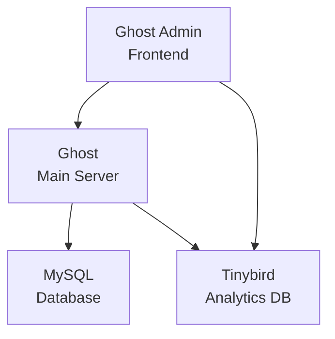

# Ghost Traffic Analytics Data Model Explainer

This document explains the comprehensive data architecture behind Ghost's traffic analytics features, 
covering both the MySQL database schema and Tinybird event streams, their relationships, and how they work together 
to provide real-time analytics.

## Table of Contents

1. [Overview](#overview)
2. [MySQL Schema (Ghost Database)](#mysql-schema-ghost-database)
3. [Tinybird Event Schema](#tinybird-event-schema)
4. [Data Flow & Relationships](#data-flow--relationships)
5. [API Endpoints](#api-endpoints)
6. [Mock Data Considerations](#mock-data-considerations)

## Overview
 Ghost's traffic analytics system has two data sources: MySQL and Tinybird

# Ghost Analytics Architecture



- **MySQL Database**: Stores content, members, newsletters, and member attribution events
- **Tinybird**: Real-time analytics database that processes page views and visitor sessions
- **Cross-system Integration**: UUID-based relationships between Ghost entities and Tinybird events

The system tracks:
- **Web Traffic**: Page views, sessions, referrers, device info (via Tinybird)
- **Member Growth**: Signups, conversions, attribution to content (via MySQL)
- **Newsletter Performance**: Sends, opens, clicks, revenue attribution (via MySQL + Tinybird)
- **Content Performance**: Views, member conversions, revenue impact (hybrid)

## MySQL Schema (Ghost Database)

### Core Content Tables

#### `posts`
Primary content table storing all posts and pages.

**Key fields for analytics:**
- `id` (string, 24 chars) - Primary key, used in attribution events
- `uuid` (string, 36 chars) - UUID for Tinybird correlation
- `title` - Content title
- `slug` - URL slug
- `type` - 'post' or 'page'
- `status` - 'published', 'draft', 'scheduled', 'sent'
- `published_at` - Publication timestamp
- `newsletter_id` - Associated newsletter (if sent via email)

#### `posts_meta`
Extended metadata for posts.

**Relevant fields:**
- `post_id` - Foreign key to posts.id
- `meta_title`, `meta_description` - SEO metadata
- `email_subject` - Newsletter subject line
- `email_only` - Whether post is email-exclusive

### Member & Subscription Tables

#### `members`
Core member accounts.

**Key fields:**
- `id` (string, 24 chars) - Primary key
- `uuid` (string, 36 chars) - UUID for Tinybird correlation  
- `email` - Member email address
- `status` - 'free', 'paid', 'comped'
- `created_at` - Signup timestamp

#### `newsletters`
Newsletters are series of emails. Sites can have multiple different newsletters, each with its own name & branding. Sites may have a "Daily newsletter" and a "Weekly roundup" newsletter, for example.

**Key fields:**
- `id` (string, 24 chars) - Primary key
- `name` - Newsletter name
- `status` - 'active', 'archived'

#### `products` (tiers)
Subscription tiers/products that members can sign up for with Stripe

**Key fields:**
- `id` (string, 24 chars) - Primary key
- `name` - Tier name
- `type` - 'free', 'paid'
- `monthly_price`, `yearly_price` - Pricing

### Attribution & Event Tables

#### `members_created_events`
Tracks member signups and their attribution.

**Key fields:**
- `id` - Primary key
- `member_id` - Foreign key to members.id
- `created_at` - Signup timestamp
- `attribution_id` - ID of attributed resource (post.id, etc.)
- `attribution_type` - 'post', 'page', 'url', 'tag', 'author'
- `attribution_url` - Full URL that drove signup
- `referrer_source` - Domain that referred the member
- `referrer_medium` - Marketing medium
- `referrer_url` - Full referrer URL
- `source` - 'member', 'import', 'system', 'api', 'admin'

#### `members_subscription_created_events`
Tracks paid subscription starts and their attribution.

**Key fields:**
- `id` - Primary key
- `member_id` - Foreign key to members.id
- `subscription_id` - Associated subscription
- `created_at` - Conversion timestamp
- `attribution_id` - ID of attributed resource
- `attribution_type` - 'post', 'page', 'url', 'tag', 'author'
- `attribution_url` - URL that drove conversion
- `referrer_source` - Domain that drove conversion
- `referrer_medium` - Marketing medium
- `referrer_url` - Full referrer URL

#### `members_paid_subscription_events`
Tracks MRR changes from subscription events.

**Key fields:**
- `member_id` - Foreign key to members.id
- `subscription_id` - Associated subscription
- `mrr_delta` - Monthly recurring revenue change
- `created_at` - Event timestamp

### Email & Newsletter Tables

#### `emails`
When a post is sent as an email, a row is added to this table

**Key fields:**
- `id` - Primary key
- `post_id` - Associated post (unique)
- `newsletter_id` - Associated newsletter
- `status` - 'pending', 'submitted', 'failed'
- `email_count` - Total recipients
- `delivered_count` - Successfully delivered
- `opened_count` - Total opens
- `failed_count` - Failed deliveries
- `submitted_at` - Send timestamp

#### `email_recipients`
A row for every member who received a particular email. Tracks which members received each email, and when it was delivered, opened, failed, etc.

**Key fields:**
- `email_id` - Foreign key to emails.id
- `member_id` - Foreign key to members.id
- `member_email` - Recipient email
- `delivered_at` - Delivery timestamp
- `opened_at` - Open timestamp
- `failed_at` - Failure timestamp

#### `redirects`
All links in an email are replaced with tracking links to Ghost so we can track clicks in emails

**Key fields:**
- `id` - Primary key
- `from` - Short redirect URL
- `to` - Destination URL
- `post_id` - Associated post (if applicable)

#### `members_click_events`
Email click tracking - each time a member clicks a link in an email

**Key fields:**
- `member_id` - Foreign key to members.id
- `redirect_id` - Foreign key to redirects.id
- `created_at` - Click timestamp

### Newsletter Subscription Tables

#### `members_newsletters`
Many-to-many relationship for newsletter subscriptions. Sites can have multiple newsletters, members can be subscribed to 0 or more newsletters

**Key fields:**
- `member_id` - Foreign key to members.id
- `newsletter_id` - Foreign key to newsletters.id

#### `members_subscribe_events`
Newsletter subscription/unsubscription events. Members can choose to subscribe/unsubscribe to any of a site's newsletters at any time

**Key fields:**
- `member_id` - Foreign key to members.id
- `newsletter_id` - Foreign key to newsletters.id
- `subscribed` - true/false for subscribe/unsubscribe
- `created_at` - Event timestamp
- `source` - Event source

## Tinybird Event Schema

### Analytics Events Datasource

#### `analytics_events`

Raw page view events streamed from the frontend. You can find the schema in `datasources` folder.
Fields with specific data in the schema:

```sql
`action` LowCardinality(String)  -- Usually 'page_hit'
`site_uuid` LowCardinality(String) -- Extracted from payload
```

**Payload Structure:**
```json
{
  "site_uuid": "string",
  "member_uuid": "string|undefined",  // member.uuid in MySQL
  "member_status": "free|paid|comped|undefined", // member.status in MySQL
  "post_uuid": "string|undefined", // post.uuid in MySQL
  "post_type": "post|page|empty", //post.type in MySQL
  "user-agent": "string",
  "locale": "string",
  "location": "string", // Country code
  "referrer": "string", // used for member attribution
  "pathname": "string",
  "href": "string", // Full URL
}
```

### Materialized View: _mv_hits

#### `_mv_hits`

Schema for hits can be also found in `datasources` folder.
Explanation of some of the important fields.

```sql
`location` String      -- Country code
`source` String        -- Referrer domain
`pathname` String      -- URL path
`href` String          -- Full URL
`device` String        -- Device type
`os` String           -- Operating system
`browser` String      -- Browser name
```

### Tinybird Endpoints (Pipes)

Endpoints which can be found in `endpoints` folder.

- `api_active_visitors` - Real-time visitor counts
- `api_kpis` - Site-wide KPI metrics
- `api_post_visitor_counts` - Visitor counts by post UUID
- `api_top_browsers` - Top browsers by visits
- `api_top_devices` - Top devices by visits
- `api_top_locations` - Top countries by visits
- `api_top_os` - Top operating systems by visits
- `api_top_pages` - Top pages by visits
- `api_top_sources` - Top referrer sources by visits

## Data Flow & Relationships

### 1. Page View Tracking

```
Frontend → Tinybird analytics_events → _mv_hits materialized view
```

**Key Relationships:**
- `payload.site_uuid` identifies the Ghost site
- `payload.post_uuid` correlates to `posts.uuid` in MySQL
- `payload.member_uuid` correlates to `members.uuid` in MySQL

### 2. Member Attribution Flow

```
Member Signup → members_created_events (with attribution_*)
Member Conversion → members_subscription_created_events (with attribution_*)
```

**Attribution Logic:**
- `attribution_id` contains `posts.id` when attributed to specific content
- `attribution_type` categorizes the attribution source
- `attribution_url` stores the full URL that drove the action
- `referrer_source` tracks the referring domain

### 3. Newsletter Performance Flow

```
Post Creation → Email Send (emails table) → Individual Recipients (email_recipients)
Click Tracking → redirects → members_click_events
```

### 4. Cross-System Data Correlation

**Post Performance Analysis:**
1. Get page views from Tinybird using `posts.uuid`
2. Get member attribution from MySQL using `posts.id`
3. Get email performance from MySQL using `posts.id`
4. Combine for comprehensive post analytics

**Member Journey Tracking:**
1. Tinybird tracks anonymous page views
2. MySQL tracks member signup with attribution
3. MySQL tracks paid conversion with attribution

### Core Stats Endpoints

```javascript
// Member growth
GET /stats/member_count
GET /stats/mrr
GET /stats/subscriptions

// Content performance  
GET /stats/top-posts          // Attribution-based rankings
GET /stats/top-posts-views    // View-based rankings (Tinybird)
GET /stats/top-content        // Combined content performance

// Post-specific analytics
GET /stats/posts/:id/stats    // Individual post performance
GET /stats/posts/:id/growth   // Member attribution for post
GET /stats/posts/:id/top-referrers // Referrer breakdown for post

// Newsletter analytics
GET /stats/newsletter-stats        // Full newsletter performance
GET /stats/newsletter-basic-stats  // Basic stats (faster)
GET /stats/newsletter-click-stats  // Click-through data
GET /stats/subscriber-count        // Subscriber growth

// Traffic sources
GET /stats/referrers           // Historical referrer data
GET /stats/top-sources-growth  // Source performance over time

// Batch endpoints
POST /stats/posts-visitor-counts   // Bulk visitor counts (Tinybird)
POST /stats/posts-member-counts    // Bulk member attribution (MySQL)
```

### Request/Response Patterns

Most endpoints support:
- `date_from` / `date_to` - Date range filtering
- `limit` - Result count limiting  
- `order` - Sort field and direction
- `newsletter_id` - Newsletter-specific filtering
- `timezone` 

Response format:
```json
{
  "data": [...],
  "meta": {
    "totals": {...}
  }
}
```

## Mock Data Considerations

### Data Volume & Relationships

For realistic testing, mock data should maintain proper ratios:

**Content:**
- ~100-500 posts across 6-month period
- ~10-20 pages (about, contact, etc.)
- 1-3 newsletters

**Members:**
- ~1000-5000 total members
- ~70% free, ~25% paid, ~5% comped
- ~50-100 new signups per month
- ~10-20% conversion rate from free to paid

**Page Views (Tinybird):**
- ~10-50 views per post (varies widely)
- ~100-500 daily total page views
- ~60% direct/type-in, ~25% search, ~10% social, ~5% other referrers

**Email Performance:**
- ~50-80% delivery rate
- ~20-40% open rate
- ~2-5% click rate
- Newsletter sends 1-4x per month

### Key Constraints

**UUID Relationships:**
- `posts.uuid` must match Tinybird `post_uuid` values
- `members.uuid` must match Tinybird `member_uuid` values
- UUIDs should be valid v4 format

**Attribution Data:**
- `attribution_id` must reference valid `posts.id`
- `attribution_url` should be realistic Ghost URLs
- `referrer_source` should be realistic domains

**Temporal Consistency:**
- Member created events before subscription events
- Posts published before attribution events
- Email sends after post publication
- Page views distributed realistically over time

### Performance Considerations

**Indexes:**
- Date-based queries need temporal indexing
- Attribution queries need member_id + attribution_id indexes
- Cross-table joins need proper foreign key indexes

**Query Patterns:**
- Most analytics queries filter by date ranges
- Post-specific queries join on post IDs/UUIDs
- Member attribution queries are complex with multiple CTEs

This data model enables comprehensive traffic analytics while maintaining performance through strategic use of both MySQL and Tinybird for their respective strengths.
