# Link Redirects


## Usage


## Develop

This is a monorepo package.

Follow the instructions for the top-level repo.
1. `git clone` this repo & `cd` into it as usual
2. Run `yarn` to install top-level dependencies.


## Test

- `yarn lint` run just eslint
- `yarn test` run lint and tests

## Overview of how Ghost handles LinkRedirects
### Summary
When a publisher sends an email newsletter with email click analytics enabled, Ghost will replace all the links in the email's content with a link of the form `https://{site_url}/r/{redirect hash}?m={member UUID}`. When a member clicks on a link in their email, Ghost receives the request, redirects the user to the original link's URL, then updates some analytics data in the database.

### The details
The following deep-dive covers the link redirect flow from when the member clicks on a link in an email.

First, we lookup the redirect by the `/r/{hash}` value in the URL:
```
select `redirects`.* from `redirects` where `redirects`.`from` = ? limit ? undefined
```

If the redirect exists, the `LinkRedirectsService` emits a `RedirectEvent`, and then responds to the HTTP request with a 302. 

The `LinkClickTrackingService` subscribes to the `RedirectEvent` and kicks off the analytics inserts/updates. First we grab the `uuid` from the `?m={uuid}` parameter and lookup the member by `uuid`:
```
select `members`.* from `members` where `members`.`uuid` = ? limit ? undefined
```

Then we insert a row into the `members_click_events` table to record the click:
```
insert into `members_click_events` (`created_at`, `id`, `member_id`, `redirect_id`) values (?, ?, ?, ?) undefined
```

Then we query for the row we just inserted:
```
select `members_click_events`.* from `members_click_events` where `members_click_events`.`id` = ? limit ? undefined
```

At this point, we emit a `MemberLinkClickEvent` with the member ID and `lastSeenAt` timestamp. 

The `LastSeenAtUpdater` subscribes to the `MemberLinkClickEvent`. First, it checks if the `lastSeenAt` value has already been updated in the current day. 

If it has, we stop here. 

If it hasn't, we continue to update the member. First, we select the member by ID:
```
select `members`.* from `members` where `members`.`id` = ? limit ? undefined
```

Then we start a transaction and get a lock on the member for updating:
```
BEGIN; trx34
select `members`.* from `members` where `members`.`id` = ? limit ? for update trx34
```

Since we're editing the member, we will eventually need to emit a `member.edited` webhook with the standard includes (labels and newsletters) so we also query them here:
```
select `labels`.*, `members_labels`.`member_id` as `_pivot_member_id`, `members_labels`.`label_id` as `_pivot_label_id`, `members_labels`.`sort_order` as `_pivot_sort_order` from `labels` inner join `members_labels` on `members_labels`.`label_id` = `labels`.`id` where `members_labels`.`member_id` in (?) order by `sort_order` ASC for update trx34
```

Then we query the member's newsletters:
```
select `newsletters`.*, `members_newsletters`.`member_id` as `_pivot_member_id`, `members_newsletters`.`newsletter_id` as `_pivot_newsletter_id` from `newsletters` inner join `members_newsletters` on `members_newsletters`.`newsletter_id` = `newsletters`.`id` where `members_newsletters`.`member_id` in (?) order by `newsletters`.`sort_order` ASC for update trx34
```

Then we update the member:
```
update `members` set `uuid` = ?, `transient_id` = ?, `email` = ?, `status` = ?, `name` = ?, `expertise` = ?, `note` = ?, `geolocation` = ?, `enable_comment_notifications` = ?, `email_count` = ?, `email_opened_count` = ?, `email_open_rate` = ?, `email_disabled` = ?, `last_seen_at` = ?, `last_commented_at` = ?, `created_at` = ?, `created_by` = ?, `updated_at` = ?, `updated_by` = ? where `id` = ? trx34
```

Then we select the member by ID again to get the freshly updated values from the DB:
```
select `members`.* from `members` where `members`.`id` = ? limit ? trx34
```

Then we commit the transaction:
```
COMMIT; trx34
```

Finally, we query for any member.edited webhooks and fire the `member.edited` event:
```
select `webhooks`.* from `webhooks` where `event` = ? trx34
```


### Sequence Diagram

```mermaid
sequenceDiagram
    actor Member
    participant Ghost
    participant Ghost Async
    participant DB
    rect rgba(0,100,0, 0.1)
    Member ->>Ghost: Clicks link in email
    Ghost ->> DB: Query: lookup redirect
    DB ->> Ghost: Redirect record
    Note right of DB: Serve the redirect
    Ghost -->> Ghost Async: Emit RedirectEvent
    Ghost ->> Member: 302 Redirect
    end
    rect rgba(100,0,0,0.1)
    Ghost Async ->> DB: Lookup Member by `uuid` from URL param
    DB ->> Ghost Async: `member` record
    Ghost Async ->> DB: Insert `member_click_event`
    Note right of DB: Insert click event
    DB ->> Ghost Async: 👌
    Ghost Async ->> DB: Select `member_click_event`
    DB ->> Ghost Async: `member_click_event` record
    end
    rect rgba(0,0,100, 0.1)
    Ghost Async ->> DB: Select `member` by id
    DB ->> Ghost Async: `member` record
    Ghost Async ->> DB: Begin transaction 
    activate DB
    DB ->> Ghost Async: 👌
    Ghost Async ->> DB: Select `member` for update
    DB ->> Ghost Async: `member` record
    Ghost Async ->> DB: Select member labels for update
    Note right of DB: Update member `lastSeenAt`
    DB ->> Ghost Async: Member's labels
    Ghost Async ->> DB: Select member newsletters for update
    DB ->> Ghost Async: Member's newsletters
    Ghost Async ->> DB: Update member's `lastSeenAt` timestamp
    DB ->> Ghost Async: 👌
    Ghost Async ->> DB: Select `member` by ID
    DB ->> Ghost Async: `member` record
    Ghost Async ->> DB: Commit transaction
    DB ->> Ghost Async: 👌
    deactivate DB
    end
    rect rgba(100,100,0,0.1)
    Ghost Async ->> DB: Select `webhooks`
    Note right of DB: Send `member.edited` webhook 
    DB ->> Ghost Async: `webhook` records
    create participant Webhook Recipient
    Ghost Async ->> Webhook Recipient: `member.edited` webhook
    end
```
