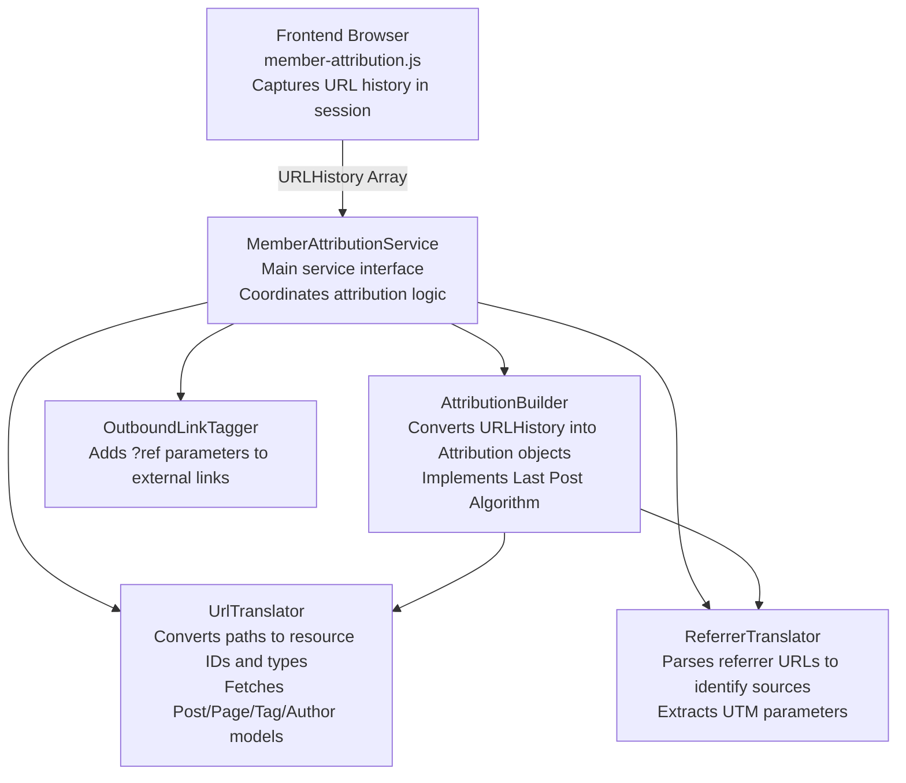

# Member Attribution Service

The Member Attribution Service tracks how members discover and sign up to a Ghost site. It captures attribution data (source pages, referrer information, UTM parameters) and associates it with member signup and subscription events.

## Features

### Core Attribution Tracking
- **Page Attribution**: Tracks which pages (posts, pages, authors, tags) visitors viewed before becoming members
- **Referrer Attribution**: Identifies external sources (search engines, social media, direct links) that brought visitors to the site
- **UTM Parameter Tracking**: Captures UTM campaign parameters (source, medium, campaign, term, content) for marketing attribution
- **Last Post Algorithm**: Prioritizes the last post viewed in the visitor's journey as the primary attribution source

### Attribution Sources
- **Content Attribution**: Posts, pages, authors, and tags visited by members
- **External Referrers**: Tracks referrer sources like Google, Facebook, Twitter, etc. using `@tryghost/referrer-parser`
- **Manual Creation**: Tracks members created via Admin UI, API, or import tools
- **Integration Attribution**: Associates members created via integrations with the integration name
- **Newsletter Links**: Adds attribution tracking to outbound links in newsletters with `?ref=` parameters

### Settings
- **Member Source Tracking**: Can be enabled/disabled via `members_track_sources` setting
- **Outbound Link Tagging**: Can be enabled/disabled via `outbound_link_tagging` setting

## Architecture

### Component Overview

### Components

#### 1. **MemberAttributionService** (`member-attribution-service.js`)
Main service interface that coordinates all attribution logic.

#### 2. **AttributionBuilder** (`attribution-builder.js`)
Converts URL history into attribution resources using the "Last Post Algorithm™️".

**Key Classes:**
- `Attribution`: Represents attribution data with methods to fetch and enrich resources
- `AttributionBuilder`: Factory for creating `Attribution` instances

#### 3. **UrlHistory** (`url-history.js`)
Validated container for URL history arrays from the frontend.

#### 4. **UrlTranslator** (`url-translator.js`)
Translates between URLs and Ghost resources.

#### 5. **ReferrerTranslator** (`referrer-translator.js`)
Parses referrer information into source and medium classifications.

#### 6. **OutboundLinkTagger** (`outbound-link-tagger.js`)
Adds `?ref=` parameters to external links in newsletters.

#### 7. **Frontend Script** (`member-attribution.js`)
Browser-side script that captures visitor journey in sessionStorage.

## Attribution Types

The service supports these attribution types:

| Type     | Description                              | Has ID | Resource Model |
|----------|------------------------------------------|--------|----------------|
| `post`   | Blog post                                | ✓      | Post           |
| `page`   | Static page                              | ✓      | Post           |
| `author` | Author page                              | ✓      | User           |
| `tag`    | Tag page                                 | ✓      | Tag            |
| `url`    | Generic URL (no specific resource)       | ✗      | None           |
| `null`   | No attribution (tracking disabled/empty) | ✗      | None           |

## Internal Context Sources

When members are created through Ghost's internal systems:

| Context      | referrerSource        | referrerMedium  |
|--------------|-----------------------|-----------------|
| `import`     | Imported              | Member Importer |
| `admin`      | Created manually      | Ghost Admin     |
| `api`        | Created via API       | Admin API       |
| `integration`| Integration: {name}   | Admin API       |

## Testing

Tests are located in:
- `test/unit/server/services/member-attribution/attribution.test.js`
- `test/unit/server/services/member-attribution/history.test.js`
- `test/unit/server/services/member-attribution/service.test.js`
- `test/unit/server/services/member-attribution/url-translator.test.js`
- `test/unit/server/services/member-attribution/referrer-translator.test.js`
- `test/unit/server/services/member-attribution/outbound-link-tagger.test.js`
- `test/e2e-server/services/member-attribution.test.js`
