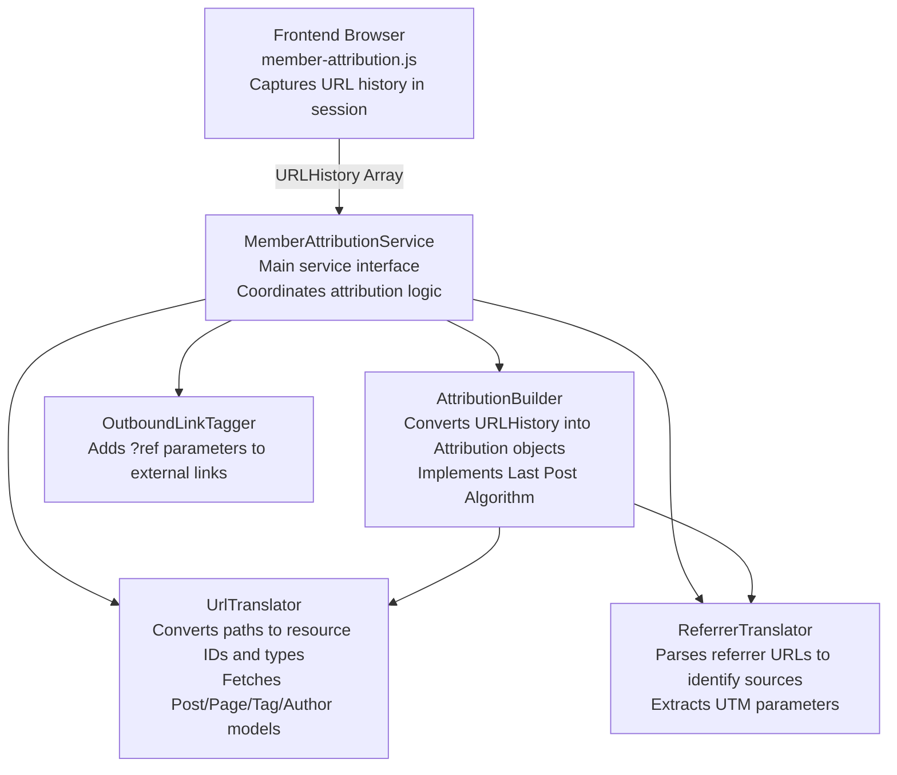
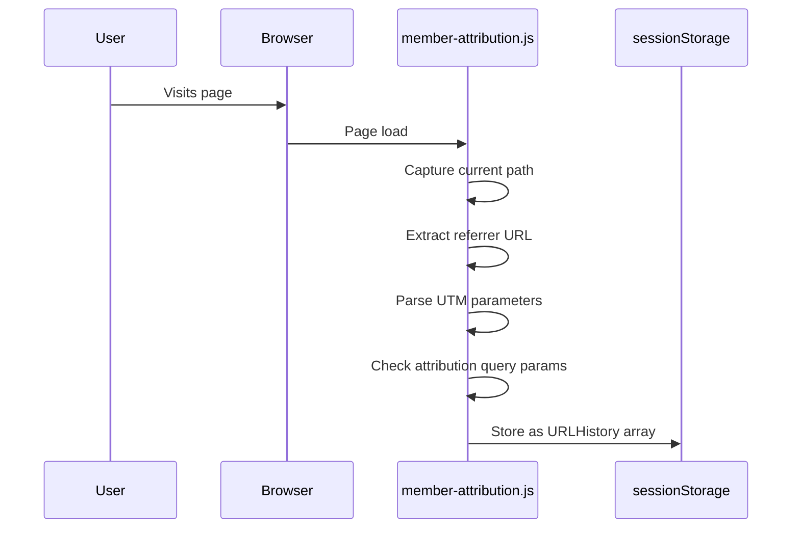
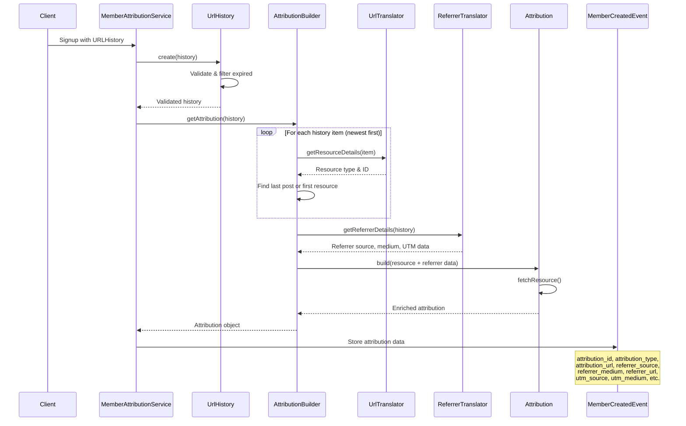
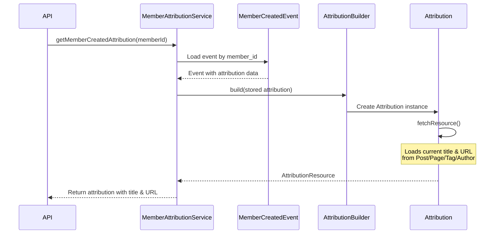
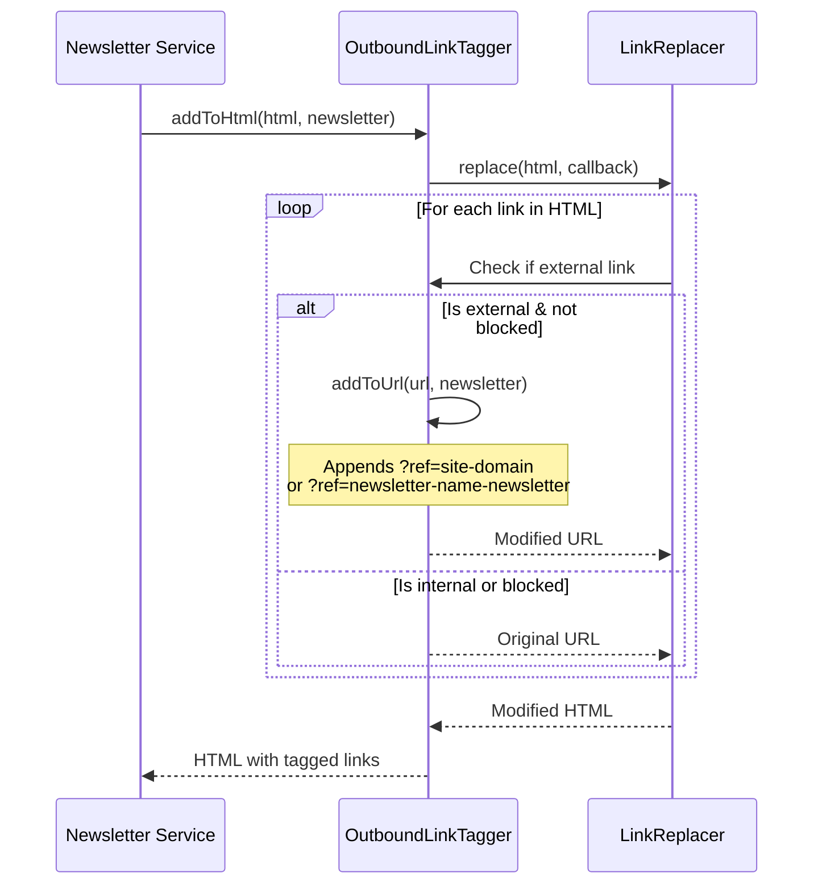

# Member Attribution Service

The Member Attribution Service tracks how members discover and sign up to a Ghost site. It captures attribution data (source pages, referrer information, UTM parameters) and associates it with member signup and subscription events.

## Features

### Core Attribution Tracking
- **Page Attribution**: Tracks which pages (posts, pages, authors, tags) visitors viewed before becoming members
- **Referrer Attribution**: Identifies external sources (search engines, social media, direct links) that brought visitors to the site
- **UTM Parameter Tracking**: Captures UTM campaign parameters (source, medium, campaign, term, content) for marketing attribution
- **Last Post Algorithm**: Prioritizes the last post viewed in the visitor's journey as the primary attribution source

### Attribution Sources
- **Content Attribution**: Posts, pages, authors, and tags visited by members
- **External Referrers**: Tracks referrer sources like Google, Facebook, Twitter, etc. using `@tryghost/referrer-parser`
- **Manual Creation**: Tracks members created via Admin UI, API, or import tools
- **Integration Attribution**: Associates members created via integrations with the integration name
- **Newsletter Links**: Adds attribution tracking to outbound links in newsletters with `?ref=` parameters

### Settings
- **Member Source Tracking**: Can be enabled/disabled via `members_track_sources` setting
- **Outbound Link Tagging**: Can be enabled/disabled via `outbound_link_tagging` setting

## Architecture

### Component Overview

### Components

#### 1. **MemberAttributionService** (`MemberAttributionService.js`)
Main service interface that coordinates all attribution logic.

**Responsibilities:**
- Convert URL history arrays into attribution objects
- Handle attribution from Ghost framework context (API, Admin, Import)
- Retrieve stored attribution for members and subscriptions
- Add post attribution tracking parameters to URLs

#### 2. **AttributionBuilder** (`AttributionBuilder.js`)

Converts URL history into attribution resources using the "Last Post Algorithm™️".

**Responsibilities:**
- Parse URL history and extract the most relevant attribution
- Build `Attribution` objects with all relevant data
- Fetch resource models (posts, pages, tags, authors) to enrich attribution

**Key Classes:**
- `Attribution`: Represents attribution data with methods to fetch and enrich resources
- `AttributionBuilder`: Factory for creating `Attribution` instances

#### 3. **UrlHistory** (`UrlHistory.js`)
Validated container for URL history arrays from the frontend.

**Responsibilities:**
- Validate history structure and data types
- Filter expired entries (older than 24 hours)
- Provide iterable interface (newest to oldest)

#### 4. **UrlTranslator** (`UrlTranslator.js`)
Translates between URLs and Ghost resources.

**Responsibilities:**
- Convert paths to resource types and IDs using the URL service
- Fetch resource models by ID and type
- Handle subdirectory path conversions
- Generate resource URLs

**Supported Resources:**
- Posts (`type: 'post'`)
- Pages (`type: 'page'`)
- Tags (`type: 'tag'`)
- Authors (`type: 'author'`)
- Generic URLs (`type: 'url'`)

#### 5. **ReferrerTranslator** (`ReferrerTranslator.js`)
Parses referrer information into source and medium classifications.

**Responsibilities:**
- Use `@tryghost/referrer-parser` to identify known referrer sources
- Extract UTM parameters from history
- Filter out internal and blocked referrers (e.g., checkout.stripe.com)
- Default to "Direct" when no referrer is found

#### 6. **OutboundLinkTagger** (`OutboundLinkTagger.js`)
Adds `?ref=` parameters to external links in newsletters.

**Responsibilities:**
- Tag outbound links with site domain or newsletter name
- Skip links that already have attribution parameters
- Handle blocked domains that don't support ref parameters
- Process HTML content to add tags to all external links

#### 7. **Frontend Script** (`member-attribution.js`)
Browser-side script that captures visitor journey in sessionStorage.

**Responsibilities:**
- Track page visits in sessionStorage (`ghost-history` key)
- Parse and store referrer information and UTM parameters
- Handle attribution query parameters (`attribution_id`, `attribution_type`)
- Maintain history limit (15 items) and expiry (24 hours)
- Clean up URL by removing attribution params after capturing

## Data Flow

### 1. Visitor Journey Tracking (Frontend)

### 2. Member Signup (Backend)

### 3. Attribution Retrieval

### 4. Newsletter Link Tagging

## Attribution Types

The service supports these attribution types:

| Type     | Description                              | Has ID | Resource Model |
|----------|------------------------------------------|--------|----------------|
| `post`   | Blog post                                | ✓      | Post           |
| `page`   | Static page                              | ✓      | Post           |
| `author` | Author page                              | ✓      | User           |
| `tag`    | Tag page                                 | ✓      | Tag            |
| `url`    | Generic URL (no specific resource)       | ✗      | None           |
| `null`   | No attribution (tracking disabled/empty) | ✗      | None           |

## Internal Context Sources

When members are created through Ghost's internal systems:

| Context      | referrerSource        | referrerMedium  |
|--------------|-----------------------|-----------------|
| `import`     | Imported              | Member Importer |
| `admin`      | Created manually      | Ghost Admin     |
| `api`        | Created via API       | Admin API       |
| `integration`| Integration: {name}   | Admin API       |

## Testing

Tests are located in:
- `test/unit/server/services/member-attribution/attribution.test.js`
- `test/unit/server/services/member-attribution/history.test.js`
- `test/unit/server/services/member-attribution/service.test.js`
- `test/unit/server/services/member-attribution/url-translator.test.js`
- `test/unit/server/services/member-attribution/referrer-translator.test.js`
- `test/unit/server/services/member-attribution/outbound-link-tagger.test.js`
- `test/e2e-server/services/member-attribution.test.js`
