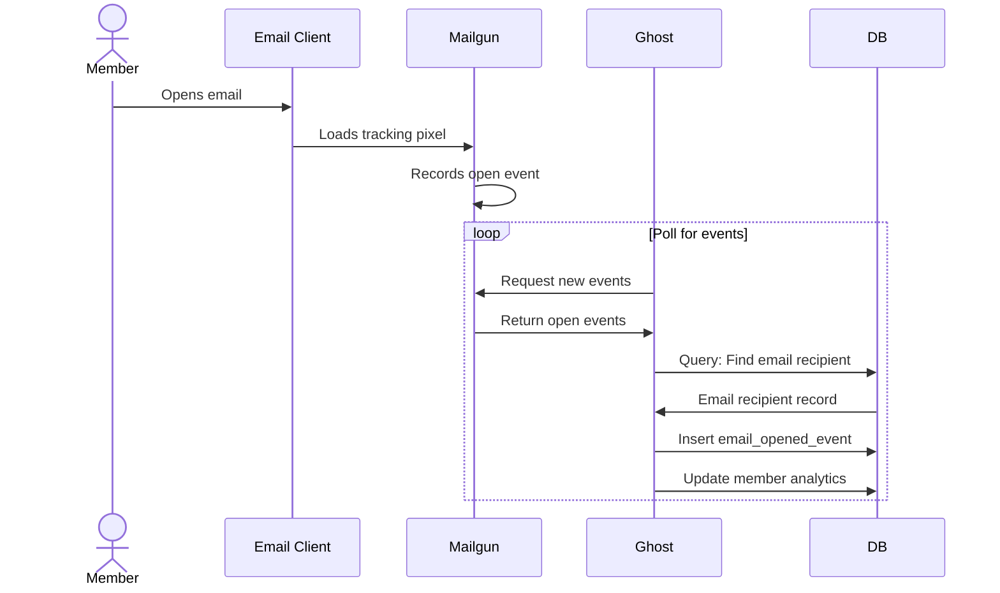

# Email Analytics Service

## Usage

The Email Analytics Service processes email events from Mailgun in Ghost, providing analytics on email engagement. The most important of these to users is open rate, while other events can be used for troubleshooting purposes.

## Develop

This is a monorepo package.

Follow the instructions for the top-level repo.
1. `git clone` this repo & `cd` into it as usual
2. Run `yarn` to install top-level dependencies.

## Test

- `yarn lint` run just eslint
- `yarn test` run lint and tests

## Overview of how Ghost handles Email Analytics

### Summary
Ghost uses Mailgun as its email service provider. The Email Analytics Service periodically polls Mailgun's Events API to fetch email events and processes them to provide engagement analytics.

There's a variety of events: `delivered` and `opened` are the most important to Ghost, though we display the others (like `complained` or `failed`) on the `/debug` page within Admin.

NOTE: Mailgun only stores event data for 72hrs.

### Tracking Details
The process works as follows:
1. Mailgun includes a tracking pixel in sent emails
2. When opened, Mailgun records the event
3. Ghost periodically polls Mailgun's Events API
4. For each new event, Ghost:
   - Records the event
   - Updates the member's email analytics

Note: Email open tracking may not be 100% accurate as some email clients:
- Block image loading by default
- Cache images
- Pre-fetch images
- Allow users to disable image loading

Additionally, Mailgun's event API may not be 100% accurate due to storage delays and the nature of the implementation (noted in the Event Polling section (here)[https://documentation.mailgun.com/docs/mailgun/user-manual/events/]). Because we can't guarantee the order of the results or the return of the API calls, we end up running a missing events job (`fetchMissing`). While it's inefficient to duplicate our checking of the vast majority of events, this is the only way to ensure we capture the missing events using event polling.

### Open Rates
Ghost's user base is most interested in open rates. In order to make the open rate be near real time, we've split the initial fetch events job into `fetchOpenedEvents` and `fetchNonOpenedEvents` jobs. This allows us to prioritize fetching opened events over all others events; note that we will always have a massive surge of delivered events after a send, which overlaps with the opened events that trickle in. 

### Analytics Data
The service maintains several analytics data points for members:
- `email_count`: Total number of emails sent to the member
- `email_opened_count`: Number of emails opened by the member  
- `email_open_rate`: Calculated percentage of emails opened

### Polling Strategy
Ghost uses several different polling jobs to ensure reliable event collection from Mailgun, executing every 5 minutes or 20,000 processed events in the following priority order:

1. **Open Events Polling (Highest Priority)**
   - Specifically fetches `opened` events
   - First in the polling sequence to ensure near real-time open rates

2. **Non-Open Events Polling**
   - Fetches all other event types (`delivered`, `failed`, `complained`, etc.)
   - Important for email debugging and delivery statistics

3. **Missing Events Check**
   - Re-checks recent time periods for any events that might have been missed; handles Mailgun's eventual consistency model
   - Runs on at least 30 minute delay from current time

4. **Scheduled Backfill Job**
   - Submitted via API, runs over a specific period of time     
   - Schedule is stored in-memory and will clear on reboot

Following a big newsletter send, it's common to see the missing or scheduled jobs not run for an extended period. They are meant to lag behind and catch up when they are able.

### Sequence Diagram for Email Opens

