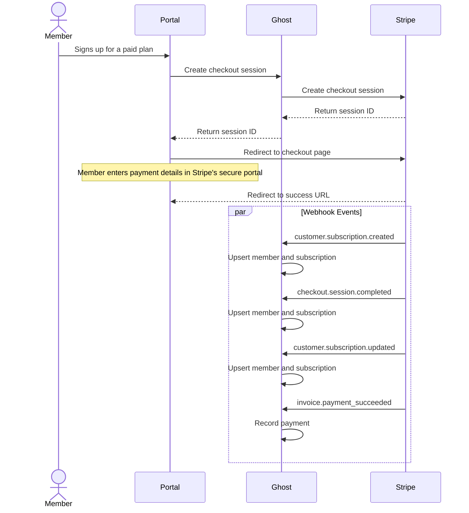

# Stripe Service
This package contains code for Ghost's Stripe integration. It interacts with Stripe's API and handles webhooks.

The main export of this package is the `StripeService` class. It includes a wrapper around the Stripe API and webhook handling logic. It is instantiated in Ghost's `core/server/services/stripe` service.

## Stripe API
The `StripeAPI` class is a wrapper around the Stripe API. It is used by the `StripeService` class to interact with Stripe's API.

## Stripe Webhooks
Ghost listens for Stripe webhooks to know when a customer has subscribed to a plan, when a subscription has been cancelled, when a payment has failed, etc.

Things to keep in mind when working with Stripe webhooks:
- Webhooks can arrive out of order. `checkout.session.completed` webhooks may arrive before or after `customer.subscription.created` webhooks.
- Webhooks can be received and processed in parallel, so you should not rely on the order of the webhooks to determine the order of operations.
- Operations in Stripe almost always produce multiple events, increasing the likelihood of race conditions.

See Stripe's [Webhooks Guide](https://docs.stripe.com/webhooks) for more information.

### Webhook Manager
This class is responsible for registering the webhook endpoints with Stripe, so Stripe knows where to send the webhooks.

### Webhook Controller
This class is responsible for handling the webhook events. It accepts the webhook event payload and delegates it to the appropriate handler based on the event type.

### Events
The Webhook Controller listens for the following events:
- `customer.subscription.deleted`
- `customer.subscription.updated`
- `customer.subscription.created`
- `invoice.payment_succeeded`
- `checkout.session.completed`

## Stripe Flows

### Checkout Session Flow: New Subscription
