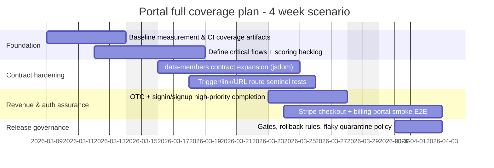
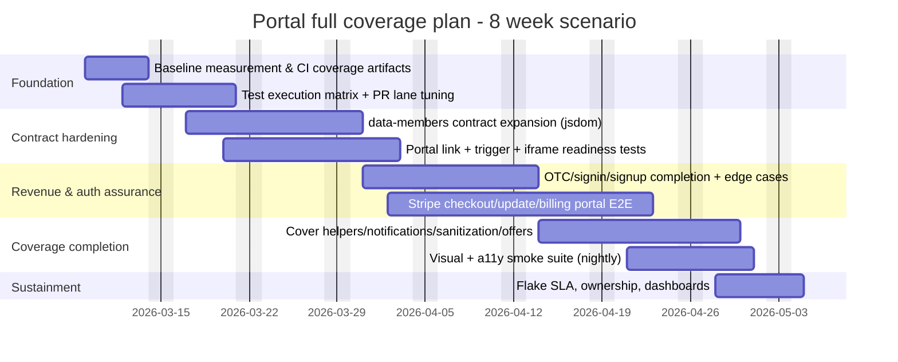
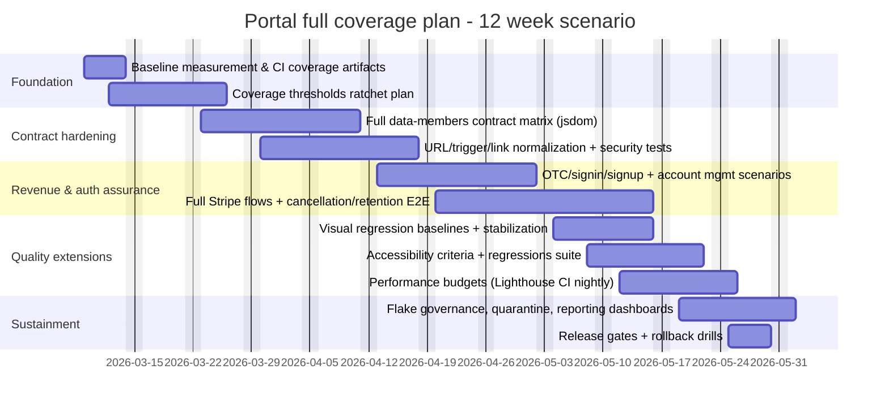

# Full Test Coverage Execution Plan for Portal in Ghost

## Executive summary

Portal is a public, embeddable membership UI shipped as a UMD bundle, loaded on visitor-facing pages via `<script>` tags and configured through data attributes and URL/hash routes. citeturn24view0turn9view1turn16view0 Achieving “full test coverage” in a meaningful, release-safe way therefore needs **two parallel coverage goals**:

1) **Code coverage (Portal app code)**: drive unit/component/DOM-contract tests (Vitest + jsdom) to high/complete coverage with enforced thresholds, using the repo’s existing coverage reporters (Cobertura + HTML + text summary). citeturn8view4turn8view6turn18search0turn18search3
2) **Feature/flow coverage (user journeys + contracts)**: guarantee that the business-critical membership flows (auth, paid conversion, billing/account management) and the theme-level “data-members” contract behave correctly under real browser conditions and Ghost core integration (Playwright browser tests, including Stripe-enabled runs). citeturn9view1turn14view0turn11view0turn12view0turn13view1turn16view0

The Ghost monorepo already has the essential building blocks to implement this without inventing a new stack:
- Portal uses **Vitest** with **jsdom**, and already outputs Cobertura coverage and has a test setup using `@testing-library/react` + `jest-dom` + a global `fetch`. citeturn8view4turn8view6turn20view0
- Ghost runs **Playwright browser tests** via `yarn test:browser`, which starts the Portal dev server and points Ghost’s `portal:url` config at it for end-to-end validation. citeturn14view0turn11view0turn12view0
- CI already runs Playwright browser tests with Stripe secrets on trusted PRs and uploads a Playwright report artifact, and explicitly skips forked PRs because secrets are unavailable. citeturn13view1turn13view0turn13view2

This report provides a phased, implementable plan from a test lead perspective: feature inventory, mapping to test types, scoring-based prioritization, detailed test cases and acceptance criteria for high-risk areas, test environments/data, CI execution matrix, timelines (4/8/12 weeks), resourcing (small/medium/large teams), tool choices, flake mitigation, coverage metrics, and release gating and rollback rules—aligned to Ghost’s primary sources and existing tooling. citeturn9view1turn24view0turn16view0turn13view1turn18search0turn17search2

## Portal scope and what “full coverage” should mean

Portal’s surface area is broader than a typical “React widget” because it is simultaneously:
- A **public UMD app** loaded into themes and configured via **data attributes**. citeturn24view0turn9view1
- A **URL/hash-driven UI** that can open specific screens via `#/portal/...` routes and can be triggered by `data-portal` on arbitrary DOM elements. citeturn16view0turn26view0turn9view1
- A **contract engine**: it binds behavior to theme markup such as `data-members-form`, `data-members-email`, `data-members-signout`, and Stripe-related attributes like `data-members-plan` and `data-members-manage-billing`. citeturn16view0turn28view2turn28view4
- A **payments integration driver** that creates Stripe checkout/update/billing-portal sessions via Ghost member APIs and then redirects via Stripe or url redirects. citeturn28view2turn28view3turn28view4turn5view5

### Practical definition of “full coverage” for Portal in Ghost

Because baseline is unknown, the plan treats “full coverage” as a target state composed of measurable controls:

**Code coverage controls (Portal workspace):**
- Vitest coverage enabled on CI (Portal already supports `yarn test:ci` → `vitest run --coverage`) and produces Cobertura XML + HTML + text-summary coverage artifacts. citeturn8view6turn8view4turn18search3
- Enforced thresholds (global and optionally per-file), ratcheting upward until the target (often 100% for lines/functions/branches) is met; Vitest supports a global “set all thresholds to 100” shortcut and standard threshold configuration. citeturn18search0turn18search4

**Feature/flow coverage controls (Ghost + Portal integration):**
- Playwright browser tests validate the end-to-end flows with real Ghost core (and Stripe-enabled environments where required); Ghost already runs these via `yarn test:browser`. citeturn14view0turn11view0turn13view0turn13view1
- Explicit coverage of the theme contract behaviors documented in Ghost’s Members theme docs, backed by DOM-level tests in jsdom and a small set of browser-level “contract sentinel” tests. citeturn16view0turn28view0

## Portal feature and user-flow inventory

This inventory is grounded in Portal’s page map, its embed bootstrap, its URL/link triggers, its “data-members” DOM contract, and its billing/auth/offer handling.

### Portal pages and in-app routes

Portal defines its available pages and a validity fallback (“unknown page → signup”) in its page registry. citeturn38view0

**Page inventory (from `apps/portal/src/pages.js`):**
- `signin`, `signup`, `magiclink`, `loading` citeturn38view0
- Account area: `accountHome`, `accountPlan`, `accountProfile`, `accountEmail` citeturn38view0
- Subscription/support flows: `offer`, `feedback`, `support`, `supportSuccess`, `supportError` citeturn38view0
- Email state flows: `signupNewsletter`, `unsubscribe`, `emailSuppressed`, `emailSuppressionFAQ`, `emailReceivingFAQ` citeturn38view0
- Recommendations: `recommendations` citeturn38view0

Portal also classifies “account pages,” “offer pages,” and “support pages” using helper predicates (`isAccountPage`, `isOfferPage`, `isSupportPage`). citeturn38view0

### Embed bootstrap and triggers

**Script injection/config**
- Portal’s README describes it as a drop-in script for Ghost membership features; it can be injected automatically by Ghost or embedded manually with a script tag carrying `data-ghost` (site URL) and related configuration. citeturn9view1
- Repo guidance describes public apps (including Portal) as UMD bundles loaded via script tags injected by `{{ghost_head}}` and configured via data attributes. citeturn24view0

**Root element and basic security hygiene**
- Portal’s bootstrap creates a root `
` with id `ghost-portal-root` and sets `data-testid="portal-root"`—useful as a stable selector for tests. citeturn7view0
- Bootstrap removes a `token` query parameter from the URL if present (important to test for auth-token leakage prevention). citeturn7view0

**Open triggers**
- URL/hash routes like `#/portal/signup` and `#/portal/signin` are part of the documented theme behavior (“Portal screens can also be accessed in your theme via URLs”). citeturn16view0turn34view1
- Custom trigger elements use `data-portal`, and Portal toggles classes `gh-portal-open` / `gh-portal-close` for styling and state signaling. citeturn16view0turn26view0turn26view1turn9view1

**Iframe readiness event**
- Portal can post a `portal-ready` message to the parent window when embedded in an iframe, indicating readiness for host integrations. citeturn26view7

image_group{"layout":"carousel","aspect_ratio":"16:9","query":["Ghost Portal signup popup","Ghost Portal account page Ghost Portal","Ghost customize Portal settings screenshot","Ghost members portal signup screen"],"num_per_query":1}

### Data-members contract and embed triggers (theme-driven flows)

Ghost’s Members theme docs define the contract and user flows for:
- Portal links (`#/portal/signup`, `#/portal/signin`) and `data-portal` triggers with `gh-portal-open/close`. citeturn16view0
- Signup/signin forms using `data-members-form` combined with `data-members-email`, and optional `data-members-name`, `data-members-error`, `data-members-newsletter`, and labels via `data-members-label`. citeturn16view0
- Sign-in one-time-code inclusion via `data-members-otc="true"` on a sign-in form, where Portal shows a code-entry modal “no custom handling necessary.” citeturn16view0turn28view0turn5view1turn5view2
- Signing out via `data-members-signout`. citeturn16view0turn2view1turn28view4
- Subscription cancel/continue links generated by helpers that use `data-members-cancel-subscription` and `data-members-continue-subscription` plus `data-members-error`. citeturn16view0turn28view5turn28view7

Portal’s implementation layer (`handleDataAttributes`) binds these attributes and executes Ghost Members API calls, including integrity-token fetch and magic link send. citeturn28view1turn2view1

### Paid conversion, billing, and offers

**Stripe checkout and billing sessions (theme-driven triggers)**
- Clicking a plan element (`[data-members-plan]`) creates a Stripe checkout session via `/members/api/create-stripe-checkout-session/` and redirects either by `responseBody.url` or Stripe `redirectToCheckout`. citeturn28view2turn5view5
- Billing update flows call `/members/api/create-stripe-update-session/` and then `redirectToCheckout`. citeturn28view3
- Billing portal flows call `/members/api/create-stripe-billing-portal-session/` and redirect to `result.url`. citeturn28view4turn5view3

**Offer links and offer page query handling**
- Portal parses offer URL patterns (`offers/<id>`) and can fetch offer data and open the offer UI. citeturn26view3turn26view4
- Retention offers are explicitly gated (not accessible via an offer link), and “active offer” logic validates offer status and whether the tier/product exists. citeturn26view4turn31view2

**Notifications from URL params**
- Portal can interpret `stripe` status values and return notification objects (e.g., `stripe:checkout`, `stripe:billing-update`), and includes a utility to clear URL params. citeturn8view0turn8view2

## Test strategy and mapping of features to test types

Portal already uses the right primitives to build a layered testing pyramid: Vitest + jsdom for fast deterministic checks, and Playwright browser tests for Ghost integration and payment-critical flows. citeturn8view4turn8view6turn14view0turn11view0turn9view1

### Test types comparison table

| Test type | Primary goal in Portal | Typical scope | Tooling aligned to Ghost/Portal sources | Strengths | Risks / gaps |
|---|---|---|---|---|---|
| Unit | Validate pure logic (helpers, parsers) | `utils/*`, small reducers/actions | Vitest (Portal scripts already use `vitest run`) citeturn8view6turn18search5 | Fast, stable, high code coverage | Can miss DOM/iframe/browser integration |
| Component / integration | Validate React UI behavior with state and mocked APIs | Page components, forms, navigation | Vitest + jsdom + Testing Library (`@testing-library/react`, `jest-dom`) citeturn8view6turn20view0 | High signal; good for accessibility roles/names | Snapshot brittleness if overused |
| DOM / contract (data-attributes) | Enforce theme contract (`data-members-*`, `data-portal`) | `handleDataAttributes`, route triggers | Vitest + jsdom; Portal already has `data-attributes.test.js` and `portal-links.test.js` citeturn20view1turn23view7turn34view1 | Best ROI for “contract correctness” | Needs careful event-loop async handling |
| E2E browser (Ghost integration) | Validate Portal + Ghost core + persistence | Full flows incl. Stripe & auth | Playwright via `yarn test:browser` (Ghost runner starts Portal dev server) citeturn14view0turn11view0turn13view0 | Catches real regressions | Slower; secrets/environment required |
| Visual regression | Catch unintended UI differences | Key screens (signup, account, billing) | Playwright `expect(page).toHaveScreenshot()` citeturn17search0turn17search4 | Strong for UI drift | Needs stable fonts/animations; baseline maintenance |
| Accessibility | Catch WCAG-related issues early | Key flows + modal/iframe UI | Playwright accessibility testing guidance citeturn17search3 | Prevents regressions in labels/contrast | Automated checks don’t cover everything |
| Performance | Prevent regressions in load/interaction | Portal open time, checkout transition | Lighthouse CI for budgets & trends citeturn35search1turn35search9 | CI budget enforcement | Noisy variance unless controlled |
| Security | Validate no token leakage, safe sanitization, no open redirects | URL handling, HTML sanitization, redirects | Portal removes `token` param; DOMPurify sanitization in code citeturn7view0turn29view0turn30view0turn32view0 | High impact | Requires threat-model-driven cases |

### Feature-to-test-type mapping

The table below is deliberately biased toward **contract and revenue flows** first, because those are both high risk and easiest to regress without immediate visibility.

| Feature area / flow | Concrete Portal surface | Recommended test types | Notes tied to sources |
|---|---|---|---|
| Bootstrap & embed | root div, `data-testid`, token removal | Unit + DOM/contract + E2E smoke | Root/testid + `token` cleanup come from bootstrap. citeturn7view0 |
| Triggers | `data-portal`, open/close classes | DOM/contract + E2E | Selector + class toggling is explicit in code and docs. citeturn26view0turn16view0turn9view1 |
| URL/hash routing | `#/portal/signup`, `#/portal/signin`, account subroutes | DOM/contract + E2E | Portal has existing `portal-links` coverage for hash paths. citeturn34view1turn16view0 |
| “data-members-form” signup | integrity-token → send-magic-link | DOM/contract + component | Docs define form states and attributes; Portal fetches integrity token and posts magic link. citeturn16view0turn28view1turn2view1 |
| Sign-in with one-time code | `data-members-otc` + OTC modal | DOM/contract + component + E2E | Docs define OTC; Portal sets `includeOTC` and action-driven OTC flow exists. citeturn16view0turn28view0turn5view1turn23view0 |
| Checkout / paid conversion | `data-members-plan` → create checkout session | DOM/contract + E2E + visual | Checkout session creation, redirect behavior must be tested; it’s implemented via Ghost members endpoints. citeturn28view2turn5view5turn13view0turn12view1 |
| Billing update & billing portal | `data-members-edit-billing`/`manage-billing` | DOM/contract + E2E | Explicit endpoints exist; existing tests cover errors for billing portal. citeturn28view3turn28view4turn23view7 |
| Account management | update profile/email/preferences | Component/integration + E2E sampling | API supports `updateEmailAddress`; actions drive profile update flow. citeturn37view0turn36view1 |
| Cancel/continue subscription | retention-offer gating, smart cancel flags | DOM/contract + E2E | Data attributes implement retention-offer “openPopup” vs direct API with `smart_cancel`. citeturn28view6turn28view7turn23view7 |
| Offers | offer link parsing & gating | Unit + component + E2E sampling | Offer query regex and retention gating live in app logic and helpers. citeturn26view3turn31view2 |
| Sanitization & safe rendering | DOMPurify allowlist; hex color validation | Unit | Security-focused unit tests should enforce allowlist and invalid inputs behavior. citeturn29view0 |
| Portal link normalization | convert same-origin portal URLs to relative | Unit + DOM/contract | `transformPortalAnchorToRelative` ignores external origins and rewrites same-origin portal links. citeturn30view0 |
| Observability hooks | portal-ready postMessage; URL notifications | Unit + DOM/contract | `portal-ready` and notification parsing are integration-sensitive. citeturn26view7turn8view2 |

## Prioritization criteria and a scoring model

Because baseline coverage, deadlines, and team size are unknown, use a scoring model to select the first 20–40 tests that unlock the biggest risk reduction and coverage gains.

### Scoring dimensions and recommended weights

| Dimension | Definition for Portal | Suggested scale | Weight |
|---|---|---:|---:|
| Risk impact | Revenue/auth/security impact if broken (checkout, login) | 1–5 | 0.30 |
| Usage | How frequently used in normal reader/member journeys | 1–5 | 0.20 |
| Recent bugs | Areas recently fixed or historically unstable | 1–5 | 0.15 |
| Complexity | Branching logic, async, third-party redirects | 1–5 | 0.15 |
| Dependencies | Reliance on Ghost core, Stripe, email, browser APIs | 1–5 | 0.10 |
| Flakiness history | Prior flaky tests or brittle selectors | 1–5 | 0.10 |

This weight set intentionally biases toward payment/auth correctness while still accounting for test stability. (Weights are a test-lead policy choice; treat as guidance.)

**Score formula**
`PriorityScore = Σ(weight_i × score_i)` (max 5.0).

### Example scoring (to seed the backlog)

| Feature / flow | Risk | Usage | Recent bugs | Complexity | Dependencies | Flakiness | PriorityScore | Rationale aligned to sources |
|---|---:|---:|---:|---:|---:|---:|---:|---|
| Stripe checkout session via `data-members-plan` | 5 | 4 | 3 | 4 | 5 | 3 | 4.25 | Checkout creation/redirect is core and depends on Stripe + Ghost APIs. citeturn28view2turn13view0turn12view1 |
| Sign-in with one-time code (`data-members-otc`) | 4 | 4 | 4 | 4 | 4 | 3 | 3.95 | OTC requires integrity token + action flow + UI modal. citeturn16view0turn28view0turn5view1turn23view0 |
| Subscription cancel with retention offer gating | 4 | 3 | 3 | 4 | 3 | 3 | 3.50 | Branch logic: openPopup vs API smart_cancel. citeturn28view6turn28view7turn23view7 |
| Token query param removal | 4 | 2 | 2 | 2 | 2 | 1 | 2.65 | Security hygiene; simple but important. citeturn7view0 |
| DOMPurify allowlist sanitization | 3 | 2 | 2 | 2 | 1 | 1 | 2.10 | Prevent XSS regressions in rendered HTML. citeturn29view0 |

## High-priority test cases and acceptance criteria

This section focuses on the highest-risk areas you explicitly requested: **auth**, **paid conversion/Stripe**, **account management**, and **data-members contract**. The intent is to provide implementable test cases that an SDET can translate directly into code in the existing test structure under `apps/portal/test/*` and Ghost Playwright browser tests. citeturn20view1turn14view0turn11view0

### Authentication tests

Portal supports magic-link flows and one-time-code flows. The contract is defined in Ghost’s theme docs and implemented via Portal actions and members API calls. citeturn16view0turn5view1turn37view2turn28view0

**Acceptance criteria (auth)**
- Sign-in submissions must request an integrity token before sending a magic link or initiating OTC. citeturn28view1turn37view3
- When OTC is enabled, the request must include the `includeOTC` intent; verification must call the verify endpoint with `{otc, otcRef, redirect, integrityToken}`. citeturn28view0turn37view1turn23view0
- URL token parameters must not persist after bootstrap. citeturn7view0

**Test case table (auth)**

| ID | Test case | Type | Test data | Steps | Expected results / assertions |
|---|---|---|---|---|---|
| AUTH-01 | `data-members-form="signin"` sends magic link | DOM/contract (jsdom) | Fake siteUrl; mock fetch; valid email | Submit form with `data-members-form="signin"` and `data-members-email` | GET integrity token then POST send-magic-link; form classes reflect loading/success/error contract. citeturn28view1turn2view1turn16view0 |
| AUTH-02 | `data-members-otc="true"` includes OTC intent | DOM/contract (jsdom) | Same as above | Submit sign-in form with `data-members-otc="true"` | Request includes OTC intent (Portal sets `includeOTC` path). citeturn16view0turn28view0 |
| AUTH-03 | OTC verify success redirects appropriately | Component/integration | Mock Ghost API verifyOTC response | Trigger OTC flow and submit code | verifyOTC called with `{otc, otcRef, redirect, integrityToken}` and redirect occurs (or state updates). Existing tests demonstrate the verifyOTC call contract. citeturn23view0turn37view1 |
| AUTH-04 | OTC verify API error shows error message | Component/integration | Mock verifyOTC to reject | Submit code | Error notification rendered; existing tests cover error messaging. citeturn23view1 |
| AUTH-05 | Bootstrap removes `token` query param | Unit | URL with `?token=...` | Load bootstrap; inspect `window.history.replaceState` | `token` param deleted from URL. citeturn7view0 |

### Paid conversion and Stripe flow tests

Stripe-enabled validation must be split into:
- Fast, deterministic jsdom contract tests (endpoint called, correct payload).
- Playwright E2E tests for actual behavior under Ghost core + Stripe CLI/webhooks, which Ghost’s test fixture already provisions. citeturn28view2turn12view1turn13view0turn11view0

**Acceptance criteria (Stripe)**
- Plan click must create a checkout session and either redirect to a returned URL or call Stripe’s `redirectToCheckout` with `{sessionId}`. citeturn28view2turn5view5
- Billing update must call `/members/api/create-stripe-update-session/` and call `redirectToCheckout`. citeturn28view3
- Manage billing must call `/members/api/create-stripe-billing-portal-session/` and redirect to `result.url`. citeturn28view4
- CI stripe-enabled tests must run only where secrets are available (or use a stub strategy); Ghost CI already skips forked PRs for this reason. citeturn13view1turn13view0

**Test case table (Stripe / paid conversion)**

| ID | Test case | Type | Environment | Steps | Expected results / assertions |
|---|---|---|---|---|---|
| PAY-01 | `data-members-plan` creates checkout session | DOM/contract (jsdom) | Mock fetch + mock `window.Stripe` | Click element with `data-members-plan` | Calls session endpoint then create-stripe-checkout-session; handles `responseBody.url` or Stripe redirect path. citeturn28view2turn5view5 |
| PAY-02 | Billing portal error surfaces correctly | DOM/contract (jsdom) | Mock fetch returns non-ok | Click `[data-members-manage-billing]` | Element toggles `loading` then `error`, error text matches thrown message; existing test shows expected behavior. citeturn23view7turn28view4 |
| PAY-03 | Billing update session created | DOM/contract (jsdom) | Mock fetch + Stripe mock | Click `[data-members-edit-billing]` | POST create-stripe-update-session; Stripe redirect called. citeturn28view3 |
| PAY-04 | Full paid signup flow in Ghost Playwright | E2E (Playwright) | Stripe-enabled job | Run E2E: create tier/offer → signup paid → confirm membership state | Ghost fixture provisions Stripe CLI/webhooks and isolates DB per worker; assert membership becomes paid. citeturn12view1turn12view0turn13view0 |
| PAY-05 | URL-based stripe status notification | Unit / component | Controlled `window.location.search` | Set `?stripe=success` etc | Parser returns correct notification type/status; clearURLParams removes query param. citeturn8view0turn8view2 |

### Account management tests

Account management spans UI updates (profile/name/email) and subscription/billing actions. Portal actions show update flows calling API methods such as `updateEmailAddress` and member updates. citeturn36view1turn37view0turn37view4

**Acceptance criteria (account management)**
- Email update must call `member/email` endpoint with identity and surface server-provided error messages. citeturn37view0
- Profile update must return to account home and show a success notification when email update succeeded (actions code ties updateProfile success to page transition). citeturn36view1turn36view2
- Subscription update must send correct payload fields for `smart_cancel`, `cancel_at_period_end`, `cancellation_reason`, and price/tier selection. citeturn37view4turn28view7

### Data-members contract tests

These tests protect Ghost theme developers and integrators: they ensure Portal honors documented attributes and documented behaviors (form states, newsletters, labels, cancel/continue links, signout). citeturn16view0turn28view0turn28view7

**Acceptance criteria (contract)**
- A `data-members-form` submission toggles `loading` and ends in either `success` or `error`, consistent with the documented form states. citeturn16view0turn2view1
- Checkable newsletter inputs with none selected must produce `newsletters: []` to avoid default newsletter subscription (Portal code explicitly implements this special-case). citeturn2view1turn28view1
- Cancel subscription must open Portal when retention offers exist; otherwise it must call the subscriptions endpoint and set `smart_cancel: true`. citeturn28view6turn28view7turn23view7
- Sign-out must delete session and redirect to site URL (or handle failure state). citeturn2view1turn16view0

## Test data, environments, CI/CD integration, and governance

### Test environments and data requirements

Portal and Ghost already separate fast tests from browser tests; this plan formalizes and scales that separation.

#### Jsdom / unit / component environment (Portal workspace)

Portal’s Vite/Vitest config explicitly sets:
- `environment: 'jsdom'`
- `setupFiles: './test/setup-tests.js'`
- coverage reporters including Cobertura, text summary, and HTML. citeturn8view4

Portal’s test setup:
- installs `@testing-library/jest-dom` matchers for Vitest,
- sets a global `fetch` implementation,
- automatically runs Testing Library cleanup after each test. citeturn20view0

**Test data approach (jsdom)**
- Use fixture site/member objects (already present in the Portal test suite) for deterministic component rendering and flow assertions. citeturn34view1turn23view0
- Mock network with `window.fetch` stubs for data-attribute binding tests (existing tests already do this for billing portal failure cases). citeturn23view7

#### Ghost Playwright fixtures and integration environment

Ghost browser tests are started via `yarn test:browser`, implemented as a runner that concurrently starts the Portal dev server (`nx run @tryghost/portal:dev`) and runs Playwright tests. citeturn14view0turn11view0

Ghost’s Playwright fixture sets:
- a per-worker SQLite DB filename in `/tmp/ghost-playwright.<workerIndex>...db` (isolation),
- Ghost’s `portal:url` to `http://127.0.0.1:4175/portal.min.js` (so browser tests use the local Portal bundle). citeturn12view0

**Stripe + email stubbing**
- Portal’s README notes that Ghost E2E browser tests require Stripe environment variables. citeturn9view1
- Ghost’s browser test fixture provisions Stripe CLI listening and validates webhook account correctness, and also stubs the entity["company","Mailgun","email api provider"] client to avoid real email sending. citeturn12view1turn12view3

### CI/CD integration strategy and test execution matrix

Ghost CI already includes:
- a “Browser tests” job,
- a skip condition for forked PRs because Stripe secrets aren’t available,
- Stripe secrets wired into the job environment,
- Playwright report artifact upload and a “how to view report” command on failures. citeturn13view1turn13view0turn13view2

Build on that structure rather than replacing it.

#### Proposed execution matrix

| Pipeline trigger | Run sets | Why | Notes tied to sources |
|---|---|---|---|
| PR (internal / same-repo) | Lint + Portal Vitest (unit/component/contract) + targeted Playwright smoke | Fast feedback + catches integration regressions | Browser tests already run with Stripe secrets on trusted PRs. citeturn13view1turn13view0turn8view6 |
| PR (fork) | Lint + Portal Vitest only (no Stripe-required Playwright) | No secrets available | Mirrors existing skip rule for browser tests on forks. citeturn13view1 |
| Nightly | Full Portal Vitest + full Playwright browser suite + visual + accessibility + perf budgets | Regression prevention | Playwright reports already artifacted; scale with additional artifacts. citeturn13view1turn17search0turn17search3turn35search1 |
| Release candidate | Full suite + stricter gates (no quarantined failures) | Release assurance | Portal release process can publish patch/minor; gating should match risk. citeturn9view1 |
| Post-release | Smoke E2E + monitoring checks | Catch CDN/config issues | Portal release documentation includes CDN cache concerns. citeturn9view1 |

### Tooling recommendations and rationale

This is intentionally aligned to what Portal and Ghost already use.

| Layer | Recommendation | Why it fits Ghost/Portal | Sources |
|---|---|---|---|
| Unit/component/contract | Vitest + jsdom + Testing Library | Portal already uses Vitest; config sets jsdom and provides setup file; dependencies include Testing Library. citeturn8view4turn8view6turn20view0 | citeturn8view4turn8view6turn20view0 |
| Coverage reporting | Cobertura XML + HTML + text-summary; enforce thresholds | Portal already configures these reporters; Vitest supports threshold enforcement including 100% shortcut. citeturn8view4turn18search0turn18search4 | citeturn8view4turn18search0turn18search4 |
| E2E integration | Ghost Playwright browser tests (`yarn test:browser`) | Repo already starts Portal + runs Playwright; fixture sets portal url and isolates DB. citeturn14view0turn11view0turn12view0 | citeturn14view0turn11view0turn12view0 |
| Visual regression | Playwright `toHaveScreenshot()` on a curated set | Native Playwright snapshot feature; supports baseline generation and comparison. citeturn17search0turn17search4 | citeturn17search0turn17search4 |
| A11y automation | Playwright-based accessibility checks on key screens | Playwright provides accessibility-testing guidance and can catch common a11y issues early. citeturn17search3 | citeturn17search3 |
| Perf budgets | Lighthouse CI (nightly + release) | Designed for CI threshold enforcement and trend tracking. citeturn35search1turn35search9 | citeturn35search1turn35search9 |

### Flaky test mitigation and maintenance plan

This plan leverages existing CI artifacts and Playwright features for debugging and introduces governance to keep the suite reliable.

**Flake prevention tactics**
- Prefer stable selectors: Portal bootstrap provides `data-testid="portal-root"` and the contract relies on stable `data-members-*` attributes; tests should prefer these or role-based locators rather than brittle CSS. citeturn7view0turn16view0turn28view4
- Treat URL-driven flows as a contract: Portal link behavior is already covered via `portal-links.test.js`; extend these patterns rather than rewriting from scratch. citeturn34view1turn20view1
- For visual tests, keep scope minimal and deterministic; Playwright screenshot assertions are explicitly supported and wait for stable consecutive screenshots, reducing transient differences when configured carefully. citeturn17search4turn17search0

**Retries and quarantine**
- Use Playwright retries sparingly and only for historically flaky suites; Playwright supports retries and configuration in its test runner. citeturn17search1
- Establish a quarantine mechanism (tag-based exclusion or separate job) with an SLA: e.g., “no test stays quarantined > 14 days without an owner + issue.” (This is a governance recommendation.)

**Diagnostics and artifacts**
- Playwright trace viewer is a first-class debugging tool; mandate trace collection on failures for browser suites. citeturn17search2
- Ghost CI uploads the Playwright report and provides a local command to download/show it; keep this and additionally preserve traces/screenshots for failed tests. citeturn13view1turn13view0

### Coverage measurement, reporting, and dashboards

**Vitest coverage**
- Portal already produces Cobertura + HTML + text-summary coverage reports; upload them as CI artifacts and parse Cobertura for PR checks. citeturn8view4turn13view1
- Enforce thresholds using Vitest coverage thresholds (including the global 100% shortcut). citeturn18search0turn18search4
- Use gradual ratcheting in early phases if baseline is low; Vitest supports threshold configuration and offers an “autoUpdate thresholds” capability (if you choose a “ratchet upward” policy). citeturn18search0

**E2E coverage**
- Treat E2E “coverage” as **flow coverage** rather than line coverage: define a “critical flow set” (auth + paid conversion + billing management + cancellation) and track pass rate and runtime per flow. Ghost’s Stripe-enabled fixture already exists for the truly critical paths. citeturn12view1turn12view0turn13view0

### Rollback and release gating rules

Portal release mechanics matter because Portal can be shipped independently as a package:
- README states patch releases can roll out instantly, while minor/major require the Ghost monorepo to be updated/released; it also notes jsDelivr cache purging considerations. citeturn9view1

**Proposed gates**
- Patch release gate (strict because it goes live quickly):
  - Portal Vitest suite pass + coverage thresholds met
  - Playwright browser tests pass in Stripe-enabled environment
  - No open “P0” defects in auth/paid flows (policy)
  citeturn9view1turn13view0turn18search0

- Minor/major release gate (strict + staged):
  - All above, plus nightly visual/a11y/perf budgets green for ≥2 consecutive runs (policy). citeturn17search0turn17search3turn35search1

**Rollback rules**
- If a regression is detected post-release: immediately ship a patch rollback (or republish prior package) and purge CDN cache if required by the distribution method described in the README. citeturn9view1
- Define an incident playbook: “Stop-the-line” on checkout/auth failures; allow soft degradation only on non-critical pages (support/faq/recommendations) (policy). citeturn38view0

## Phased roadmap and resourcing with 4/8/12-week scenarios

This roadmap assumes **unknown current coverage** but acknowledges Portal already has a meaningful test suite footprint (multiple flow tests and contract tests exist under `apps/portal/test/*`). citeturn20view1turn23view0turn23view7turn34view1

### Phase deliverables table

| Phase | Outcome | Key deliverables | Exit criteria (objective) | Primary sources grounding |
|---|---|---|---|---|
| Foundation | Make the suite measurable and CI-visible | Coverage artifacts uploaded; baseline metrics; execution matrix wired | Cobertura + HTML artifacts published; PR shows coverage delta | Portal’s coverage reporters exist; CI uploads artifacts already for Playwright reports. citeturn8view4turn13view1 |
| Contract hardening | Lock down theme contract & triggers | Expand DOM/contract tests for `data-members-*`, `data-portal`, URL routes | All documented contract attributes have tests; no open “contract gaps” | Ghost docs define contract; Portal binds attributes in code. citeturn16view0turn28view4turn26view0 |
| Revenue & auth assurance | Make checkout/auth regression-proof | E2E Stripe flows + OTC flows + billing portal tests | “Critical flow suite” green on nightly + release; flaky rate within SLA | Ghost fixture provisions Stripe; CI runs Stripe-enabled browser tests. citeturn12view1turn13view0turn13view1 |
| Coverage completion | Drive code coverage to target | Fill remaining branches (notifications, sanitization, link transforms, offer gating) | Thresholds met; no “low coverage” files; gates enforced | Vitest thresholds supported; Portal has helpers and sanitization to cover. citeturn18search0turn29view0turn30view0turn32view0 |
| Sustainment | Keep it green over time | Flake governance, dashboards, owner map, test review checklist | Flaky tests < agreed %, quarantine SLA met | Playwright retries/traces and CI report artifacts support sustainment. citeturn17search1turn17search2turn13view1 |

### Gantt-style timelines (example dates)

Assume a start date of **2026-03-09** (next Monday in Europe/Budapest), and adjust as needed.

#### Four-week scenario

#### Eight-week scenario

#### Twelve-week scenario

### Resource estimates (person-days) for small/medium/large teams

These estimates assume:
- 1 person-day = 1 full productive day
- unknown baseline; if baseline is very low, add a 20–40% contingency for refactors and testability improvements (policy guidance)
- existing Portal tests reduce ramp-up (the test directory already includes multiple flow tests). citeturn20view1turn23view0turn34view1

| Team scenario | Roles & skillsets | 4-week effort (PD) | 8-week effort (PD) | 12-week effort (PD) | Notes tied to Ghost/Portal reality |
|---|---|---:|---:|---:|---|
| Small | Test lead (part-time), 1 SDET (Vitest/jsdom), 0.5 FE engineer | 45–60 | 80–110 | 120–160 | Small team should focus on contract + critical flows first; rely on existing Vitest/Playwright infra. citeturn8view6turn11view0turn13view1 |
| Medium | Test lead, 2 SDETs, 1 FE engineer, 0.5 DevOps/CI | 70–90 | 140–180 | 210–260 | Medium can add visual + a11y and improved reporting while completing coverage thresholds. citeturn17search0turn17search3turn18search0 |
| Large | Test lead, 3 SDETs, 2 FE engineers, 1 BE engineer, DevOps, security review support | 90–120 | 200–260 | 300–380 | Large can parallelize E2E Stripe flows, coverage completion, and non-functional suites (perf/a11y). citeturn12view1turn35search1turn17search2 |

### Practical staffing guidance by phase

- **Foundation + contract hardening**: SDET-heavy (jsdom, contract matrix) with FE support for testability improvements and stable selectors. citeturn16view0turn28view4turn7view0
- **Revenue/auth assurance**: requires cross-functional execution because Stripe-enabled E2E tests depend on Ghost core fixtures and CI secrets; coordinate with maintainers of browser test fixtures and CI. citeturn12view1turn13view1turn9view1
- **Coverage completion**: mix of SDET + FE to chase branch/edge-case gaps (offers, notifications, URL parsing, sanitization allowlists). citeturn26view4turn8view0turn29view0turn32view0

### Final note on “unknown baseline” execution

Because current coverage baseline is unknown, the first deliverable must be a **baseline report**: Portal already supports coverage output and CI can upload artifacts; use that to quantify exactly what “full” means in your context (line/function/branch). citeturn8view4turn8view6turn13view1

The plan’s prioritization model then drives incremental enforcement: set an initial threshold at baseline, ratchet upward weekly, and only flip the final “100% thresholds” gate once the critical flow suite is stable and the tail coverage tasks are burned down. citeturn18search0turn17search1turn13view1
