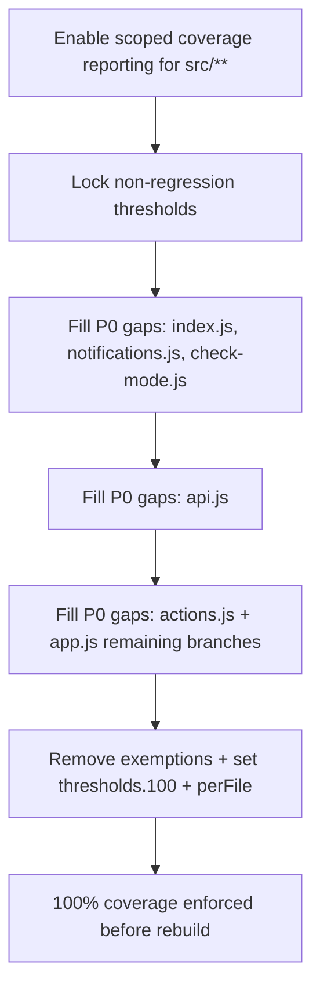

# Deep research on Portal test coverage in Ghost

## Executive summary

Portal inside entity["organization","Ghost","open source cms"]’s monorepo already has a **substantial** automated test suite—far beyond what your “prior findings” document describes. In the current `main` branch (as inspected on March 3, 2026, Europe/Budapest), `apps/portal/test/` contains **integration-style “flow” tests**, focused **unit tests** for many pages/components, **utility tests**, plus shared fixtures and a custom React Testing Library render wrapper. citeturn8view1turn9view0turn9view1turn13view0turn13view1turn15view0turn15view1

The biggest blocker to “100% coverage enforced” is not the absence of tests—it’s that **coverage is not currently enforced** (no thresholds, no `include` scoping to `src/**`, no per-file gating). The Portal Vitest setup reports coverage but does not fail builds when coverage drops or when files are uncovered. citeturn14view0turn14view1turn36search0turn36search1

To reach and **enforce 100% coverage for `apps/portal/src/**`**, the work breaks into two streams:

- **Coverage enforcement plumbing** (Vitest coverage configuration + CI/Nx wiring + incremental exemption policy).
- **Targeted gap-filling tests** focused on:
  - Core entry/bootstrap (`src/index.js`) citeturn23view0
  - API client (`src/utils/api.js`) citeturn30view3
  - Notification/query parsing (`src/utils/notifications.js`) and mode detection (`src/utils/check-mode.js`) citeturn30view2turn30view0
  - Action dispatcher completeness (`src/actions.js`) beyond what is currently exercised. citeturn25view0turn17view0
  - Remaining high-branch areas in `src/app.js` that are not hit by existing portal-links/data-attributes tests (especially error paths and side-effect integrations). citeturn23view1turn26view1turn31view0

The PRD below is written to be “boring, common, and maintainable”: Vitest + V8 coverage, React Testing Library + jest-dom, optional `@testing-library/user-event`, and (optionally) MSW for network mocking—each widely adopted in open source. citeturn14view1turn18search0turn18search1turn18search2turn36search1

## Current state of Portal testing and coverage configuration

Portal is a Vite-built UMD app with Vitest configured in `apps/portal/vite.config.mjs` to run in `jsdom` and load `test/setup-tests.js`. Coverage reporters (`cobertura`, `text-summary`, `html`) are configured, but **no thresholds are defined** and **no coverage include/exclude** is set to focus on `src/**`. citeturn14view0turn14view3turn36search0turn36search1

The Portal package scripts show that CI coverage is run via `yarn test --coverage` (through `test:ci`). citeturn14view1turn36search1

Within the monorepo, tests are orchestrated via Nx (`nx run-many -t test` / `test:unit`), which means Portal’s coverage enforcement must integrate cleanly with workspace test targets. citeturn22view0

### What exists today in `apps/portal/test/`

Your prior findings document is not aligned with the current repo. The current test inventory includes:

- Core action handling tests (`test/actions.test.ts`) citeturn8view1turn17view0
- App-level tests (`test/app.test.js`) citeturn8view1turn17view1
- Portal link routing/integration tests (`test/portal-links.test.js`) citeturn8view1turn26view1
- Data attribute behavior tests (`test/data-attributes.test.js`) and direct tests of exported handlers (`formSubmitHandler`, `planClickHandler`, `handleDataAttributes`) citeturn8view1turn31view0turn25view1
- Utility tests (e.g., `test/utils/helpers.test.js`, `is-ios`, `sanitize-html`, etc.) citeturn9view1
- Focused component/page unit tests under `test/unit/components/**` (many pages + common components). citeturn9view0turn12view1turn13view0turn13view1turn34view1

The test harness includes:

- A custom React Testing Library render wrapper that injects `AppContext.Provider` defaults and exposes a mock `doAction` (`test/utils/test-utils.js`). citeturn15view0turn15view1
- Global fetch wiring via `cross-fetch` in `test/setup-tests.js`. citeturn14view3turn14view1

### Key source modules in scope for 100% coverage

At the top of `src/`, Portal is driven by:

- `src/index.js` (bootstraps DOM, reads `script[data-ghost]`, strips `token` query param). citeturn23view0
- `src/app.js` (large stateful controller: routing, preview/query parsing, event wiring, Sentry/FirstPromoter hooks, data attributes). citeturn23view1
- `src/actions.js` (action reducer/dispatcher). citeturn25view0turn23view1
- `src/data-attributes.js` (members forms, plans, billing buttons, cancel/continue subscription handlers). citeturn25view1
- Utility modules under `src/utils/` such as `api.js`, `check-mode.js`, `notifications.js`. citeturn9view2turn30view3turn30view0turn30view2
- Page map and helpers in `src/pages.js`. citeturn30view1turn23view1

## Comparison of analyses

You asked for a rigorous comparison between:

- **The other agent’s analysis** (the earlier report in this conversation).
- **Your prior findings** (the provided Markdown document).
- **What the repo actually contains today** (primary-source inspection).

Because your prior findings document asserts facts that conflict with the current `main` branch, this comparison explicitly calls out “time drift / repo drift” as a primary explanation.

### Agreements

Both the other agent and your prior findings align on these points, and repo evidence supports them:

- Portal uses **Vitest** with a **jsdom** environment and React Testing Library; setup is in `apps/portal/vite.config.mjs` and `test/setup-tests.js`. citeturn14view0turn14view3turn14view1
- Portal has shared **fixtures** and a **custom render** helper, a mainstream recommended pattern in Testing Library docs. citeturn15view0turn15view1turn18search2
- Portal’s repository README emphasizes that Portal is heavily relied on and references broader e2e coverage in the monorepo. citeturn14view2turn22view0

### Disagreements

These are high-confidence disagreements where repo evidence contradicts one or both analyses:

- **Test inventory size**: Your prior findings state “only 6 confirmed test files.” The current repo has **many more** test files including `portal-links.test.js`, `data-attributes.test.js`, multiple flow tests, and a large unit test set under `test/unit/components/**`. citeturn8view1turn9view0turn9view1turn13view0turn34view1
- **`data-attributes.js` coverage**: Both your prior findings and the other agent describe `data-attributes.js` as largely untested. In the current repo, `test/data-attributes.test.js` directly imports and tests `formSubmitHandler`, `planClickHandler`, and `handleDataAttributes`, including OTC flows and billing portal behaviors. citeturn31view0turn25view1
- **`actions.js` coverage**: Your prior findings imply minimal action coverage; the other agent described it as thin and focused. Today, there is at least `test/actions.test.ts` (plus flows that likely exercise additional actions), though it still does not cover all branches required for 100%. citeturn17view0turn25view0turn8view1
- **Portal link routing/testing**: The earlier agent emphasized missing portal link tests; the current repo contains a comprehensive `portal-links.test.js` that validates many routes and hashchange behavior. citeturn26view1turn23view1

### Gaps in both analyses

Both the other agent and your prior findings missed or under-specified several “make-or-break” items for a 100%-coverage program:

- **No mention of coverage enforcement mechanics**: The biggest missing piece is that Portal’s Vitest config includes coverage reporters but **no thresholds** and no per-file enforcement. citeturn14view0turn36search0turn36search9
- **No explicit plan for `src/index.js`** coverage: this entrypoint is in `src/**` but is rarely exercised by component tests; it needs targeted tests with `ReactDOM.render` mocked. citeturn23view0
- **No explicit plan for `src/utils/api.js`**: this module has many branches and error paths and is a common source of uncovered lines in frontend coverage programs. citeturn30view3
- **Mocking strategy not fully integrated with current repo realities**: recommending MSW is reasonable, but Portal currently uses `vi.spyOn(window, 'fetch')` patterns extensively; moving to MSW requires a staged migration plan rather than a blanket rewrite. citeturn31view0turn26view1turn18search0

## PRD for reaching and enforcing 100% coverage for `apps/portal/src/**`

### Objectives

Achieve and continuously enforce **100% statement/branch/function/line coverage** for executable source files under:

- `apps/portal/src/**/*.{js,jsx,ts,tsx}`

…before a full Portal rebuild, ensuring that the rebuild can be validated against a comprehensive, behavior-based regression suite.

### Scope

**In scope (coverage-gated)**

- All Portal runtime code under `apps/portal/src/**` that compiles into the distributed UMD bundle:
  - `src/index.js`, `src/app.js`, `src/actions.js`, `src/data-attributes.js`, `src/pages.js`, React components, and utilities. citeturn8view0turn10view0turn11view0turn12view0turn9view2

**Out of scope (excluded from coverage gating)**

- Non-executable assets:
  - `**/*.css`, `**/*.svg`, `src/images/**` (and other static assets). citeturn8view0turn34view0
- If any file is generated (none identified in Portal `src` during inspection), it should be excluded explicitly with a comment in config.

### Success metrics

Coverage and enforcement:

- `apps/portal` CI fails if:
  - Any file in `src/**/*.{js,jsx,ts,tsx}` is < 100% statements/branches/functions/lines.
  - Any new uncovered file is introduced.
- Coverage output includes:
  - `text-summary` for quick CI feedback.
  - `html` report for local debugging.
  - `cobertura` XML for integration with CI reporting tools. citeturn14view0turn36search1

Quality and maintainability:

- Tests avoid brittle snapshots; assertions are behavior-focused.
- No test relies on real network calls; all external effects are mocked deterministically.
- Tests run in a predictable time budget suitable for CI (target: Portal test suite within a few minutes, exact number to be measured after enabling per-file thresholds).

### Mocking strategy

**Principle:** default to lightweight `vi` stubs; introduce MSW only where it reduces duplication meaningfully.

- Use `vi` stubs for:
  - `window.location.assign/replace`, `window.history.replaceState` (already done in existing tests). citeturn26view1turn31view0
  - `window.Stripe` for checkout redirects. citeturn31view0turn25view1turn30view3
  - Third-party SDKs (`@sentry/react`, FirstPromoter globals) to avoid side effects. citeturn23view1turn14view1
  - `navigator.sendBeacon` in `api.recommendations.*`. citeturn30view3turn25view0
- Use MSW **selectively** for:
  - Consolidating repeated fetch mocking in `utils/api.js` and `data-attributes.js`-like tests when you want request-level assertions and realistic response handling. MSW’s Node integration is designed for this. citeturn18search0turn18search4turn18search12

### Required dependencies

Already present:

- `vitest` and `@vitest/coverage-v8` citeturn14view1turn36search1
- `@testing-library/react` and `@testing-library/jest-dom` citeturn14view1turn14view3

Recommended additions (mainstream):

- Add `@testing-library/user-event` to improve interaction fidelity (Testing Library recommends it over raw `fireEvent` for many cases). citeturn18search1turn18search13turn18search16
- Optional: add `msw` if you adopt the MSW-based network mocking layer. citeturn18search0turn18search4

### Prioritized backlog of test work

This is written as a set of contributor-executable PRs (each small and reviewable). “Priority” is from the perspective of reaching 100% coverage quickly while preserving confidence in existing behavior.

#### Foundational coverage enforcement

- Add precise coverage scoping (`coverage.include`) to only measure `src/**/*.{js,jsx,ts,tsx}` and set `coverage.exclude` for assets.
- Turn on hard enforcement:
  - Use Vitest thresholds with `thresholds.100` and `thresholds.perFile`. citeturn36search9turn36search0turn36search21
- Add a temporary “incremental adoption” policy (below) so you can land coverage plumbing before the entire suite is at 100%.

#### Highest-value missing unit/integration tests

- `src/index.js`: bootstrapping tests (script tag parsing + DOM insertion + token stripping + ReactDOM.render call). citeturn23view0
- `src/utils/api.js`: deep unit tests for API request/response handling, JSON-vs-text branches, and error handling. citeturn30view3
- `src/utils/notifications.js`: stripe/auth parsing and `clearURLParams` behavior. citeturn30view2
- `src/utils/check-mode.js`: preview mode routing detection. citeturn30view0
- `src/actions.js`: fill remaining uncovered action branches (success/failure cases, localStorage edge cases, oneClickSubscribe behavior). citeturn25view0turn17view0

#### Remaining gaps to clean up to reach 100%

- `src/app.js`: cover unhit branches:
  - `fetchQueryStrData` keys not yet exercised (e.g., checkbox required, portalProducts vs portalPrices, transistor settings).
  - `fetchNotificationData` billing-only behavior and message creation.
  - Error paths in `initSetup`/`fetchApiData` (non-dev/test failure) and scroll handling `try/catch`.
  - Recommendation click tracking warnings. citeturn23view1turn30view2turn30view3turn25view0
- Any component modules not loaded by existing tests (identify via coverage report once enforcement is wired).

### Detailed test case matrix

The table below is intentionally “coverage-driven”: each row names the file and the **behaviors/branches** most likely to be uncovered even with the current suite. Items marked “verify via coverage report” should be confirmed immediately after enabling per-file coverage reporting.

| File (apps/portal/src/**) | Missing behaviors / branches to cover | Test type | Complexity | Priority |
|---|---|---:|---|---:|
| `src/index.js` citeturn23view0 | `getSiteData`: script tag missing vs present; dataset parsing (`data-i18n`, `data-api`, `data-key`, `data-locale`); `handleTokenUrl` removes `token`; `addRootDiv` id + `data-testid`; `init` calls `ReactDOM.render` with expected props | Unit | Med | P0 |
| `src/app-context.js` citeturn8view0 | Import coverage (context creation); verify provider wiring used by `test/utils/test-utils.js` | Unit | Low | P2 |
| `src/pages.js` citeturn30view1 | `getActivePage` valid/invalid; `isAccountPage`/`isOfferPage`/`isSupportPage` string matching edge cases | Unit | Low | P1 |
| `src/utils/check-mode.js` citeturn30view0 | `isNormalPreviewMode` vs `isOfferPreviewMode` hash parsing; `hasMode` multi-mode selection; (verify dev/test mode behavior under Vite define) | Unit | Low | P1 |
| `src/utils/notifications.js` citeturn30view2 | `NotificationParser`: no querystring returns null; stripe checkout success; billing-only statuses; auth actions success/failure; `clearURLParams` deletes + rewrites URL | Unit | Low | P0 |
| `src/utils/api.js` citeturn30view3 | (Verify via coverage report) `contentEndpointFor` empty string when `apiUrl/apiKey` missing; `sendMagicLink` JSON vs non-JSON response; JSON parse failure fallback; `getIntegrityToken` HumanReadableError branch; `checkoutPlan` cancelUrl generation; Stripe redirect path; `feedback.add` uuid/key query branch; `navigator.sendBeacon` calls | Unit | High | P0 |
| `src/actions.js` citeturn25view0 | (Verify via coverage report) `closePopup` magiclink branch; `back` lastPage branch; `signin` success/failure; `signup` paid path (tierId/cadence missing vs provided); `updateNewsletterPreference` early-return; `trackRecommendationClicked` duplicate + localStorage error branches; `oneClickSubscribe` outbound_link_tagging urlHistory branch | Unit | High | P0 |
| `src/data-attributes.js` citeturn25view1 | Already heavily tested; likely remaining: wantsOTC response JSON parse failure; unchecked checkbox newsletter inputs set `newsletters=[]`; `planClickHandler` responseBody.url branch; Stripe redirect error branch; `handleDataAttributes` no `siteUrl` early return | Unit/Integration | Med | P1 |
| `src/app.js` citeturn23view1 | Already partially covered; likely remaining: `fetchQueryStrData` many keys; `fetchNotificationData` billing update success branch; `initSetup` catch; `fetchApiData` non-test error throws; scroll handling else-branches; `setupRecommendationButtons` invalid dataset warning path | Unit/Integration | High | P0 |
| `src/utils/contrast-color.js` citeturn9view2 | (Verify via coverage report) Pure function branches for luminance/contrast; boundary cases | Unit | Low | P2 |
| `src/utils/copy-to-clipboard.js` citeturn9view2 | success vs failure path (Clipboard API missing); fallback behavior | Unit | Med | P2 |
| `src/utils/date-time.js` citeturn9view2 | Formatting/edge cases (timezone-independent) | Unit | Low | P2 |
| `src/utils/discount.js` citeturn9view2 | discount parsing branches | Unit | Low | P2 |
| `src/utils/form.js` citeturn9view2 | validation branches | Unit | Low | P2 |
| `src/utils/i18n.js` citeturn9view2 | `t` behavior + language switching (note: mocked in some tests) | Unit | Med | P2 |
| `src/utils/links.js` citeturn9view2 | URL building branches | Unit | Low | P2 |
| `src/utils/validator.js` citeturn9view2 | validation branches | Unit | Low | P2 |
| `src/components/frame.js` citeturn10view0 | Ensure frame render path executed; `describe.skip` in `app-frames.test.js` suggests coverage risk; confirm via coverage report | Integration | Med | P1 |
| `src/components/popup-modal.js` citeturn10view0 | Open/close behaviors; focus trap if any; ensure rendered by existing integration tests | Integration | Med | P1 |
| `src/components/trigger-button.js` citeturn10view0 | Covered by unit test; confirm remaining branches (e.g., accessibility labels, disabled states) | Unit | Low | P2 |
| `src/components/common/products-section.js` citeturn11view0 | Large file; ensure all tier rendering branches covered (free/paid, multiple products, trial messaging) | Unit/Integration | High | P1 |
| `src/components/common/newsletter-management.js` citeturn11view0 | newsletter lists, preference save branches, error display | Unit/Integration | Med | P1 |
| `src/components/pages/AccountHomePage/**` citeturn34view0turn35view0 | Many unit tests exist; verify any uncovered subcomponents (`use-integrations.js`, etc.) via per-file coverage | Unit | Med | P2 |

## Test-writing plan for contributors

### Test harness patterns to standardize on

Use (and extend) the harness that already exists:

- Prefer `render` from `apps/portal/test/utils/test-utils.js` for components needing `AppContext` injection; it matches Testing Library’s recommended “custom render wrapper” approach. citeturn15view0turn18search2
- Use `appRender` from the same file for tests that need to render the full `App` without custom context injection. citeturn15view0turn26view1
- For iframe-based Portal UI tests:
  - `const popupFrame = await screen.findByTitle(/portal-popup/i)`
  - `within(popupFrame.contentDocument)` for queries (as in existing `portal-links.test.js`). citeturn26view1
- For action handler tests:
  - Call `ActionHandler({ action, data, state, api })` directly with a stubbed `api` object (existing pattern). citeturn17view0turn25view0

Recommended improvement: adopt `@testing-library/user-event` for new interaction tests (leave existing `fireEvent` tests alone initially to avoid churn). citeturn18search1turn18search13

### Folder and naming conventions

Stay consistent with the repo’s current structure:

- **Unit tests for small modules and pure utilities**:
  `apps/portal/test/utils/<module>.test.js` (existing pattern). citeturn9view1
- **Unit tests for components/pages** mirror `src/` layout:
  `apps/portal/test/unit/components/.../*.test.js` (existing pattern). citeturn13view0turn13view1turn34view1
- **Integration-style tests** that render `App` and assert flows:
  `apps/portal/test/<topic>-flow.test.js` and `apps/portal/test/portal-links.test.js` (existing pattern). citeturn8view1turn26view1turn31view0

### Five high-impact test skeletons

These are designed to close the most likely uncovered files/branches when you turn on per-file 100% thresholds.

#### Add bootstrap coverage for `src/index.js`

```js
// apps/portal/test/index.test.js
import {describe, it, expect, vi, beforeEach, afterEach} from 'vitest';

// Mock ReactDOM.render so the test doesn't actually mount a full app
vi.mock('react-dom', () => ({
  default: { render: vi.fn() },
  render: vi.fn()
}));

// Mock App component import (we only care it was passed to render)
vi.mock('../src/app', () => ({ default: function App() { return null; } }));

describe('Portal bootstrap (src/index.js)', () => {
  beforeEach(() => {
    document.body.innerHTML = '';
    // Ensure deterministic URL
    window.history.replaceState({}, '', 'https://example.com/?token=abc123');
  });

  afterEach(() => {
    vi.clearAllMocks();
  });

  it('adds root element, strips token param, and calls ReactDOM.render with parsed script[data-ghost] props', async () => {
    const script = document.createElement('script');
    script.dataset.ghost = 'https://mysite.example';
    script.dataset.key = 'content_api_key';
    script.dataset.api = 'https://mysite.example/ghost/api/content';
    script.dataset.i18n = 'true';
    script.dataset.locale = 'de';
    script.setAttribute('data-ghost', '');
    document.body.appendChild(script);

    // Import runs init() immediately
    await import('../src/index.js');

    const root = document.getElementById('ghost-portal-root');
    expect(root).toBeTruthy();
    expect(root.getAttribute('data-testid')).toBe('portal-root');

    expect(window.location.search.includes('token=')).toBe(false);

    const {render} = await import('react-dom');
    expect(render).toHaveBeenCalledTimes(1);

    // Optionally assert render target is the root div
    expect(render.mock.calls[0][1]).toBe(root);
  });

  it('falls back gracefully when script[data-ghost] is missing', async () => {
    await import('../src/index.js');
    const root = document.getElementById('ghost-portal-root');
    expect(root).toBeTruthy();
  });
});
```

#### Add focused unit coverage for `src/utils/notifications.js`

```js
// apps/portal/test/utils/notifications.test.js
import {describe, it, expect, beforeEach, vi} from 'vitest';
import NotificationParser, {clearURLParams, handleAuthActions} from '../../src/utils/notifications';

describe('utils/notifications', () => {
  beforeEach(() => {
    window.history.replaceState({}, '', 'https://example.com/?');
  });

  it('returns null when there is no querystring', () => {
    window.history.replaceState({}, '', 'https://example.com/');
    expect(NotificationParser()).toBeNull();
  });

  it('parses stripe billing update statuses when billingOnly=true', () => {
    window.history.replaceState({}, '', 'https://example.com/?stripe=billing-update-success');
    expect(NotificationParser({billingOnly: true})).toMatchObject({
      type: 'stripe:billing-update',
      status: 'success',
      autoHide: true,
      closeable: true
    });
  });

  it('parses auth action success/failure', () => {
    expect(handleAuthActions({action: 'signin', status: 'true'})).toMatchObject({type: 'signin', status: 'success'});
    expect(handleAuthActions({action: 'signin', status: 'false'})).toMatchObject({type: 'signin', status: 'error'});
  });

  it('clears URL params', () => {
    window.history.replaceState({}, '', 'https://example.com/?a=1&stripe=cancel&b=2');
    const replaceSpy = vi.spyOn(window.history, 'replaceState');
    clearURLParams(['stripe']);
    expect(replaceSpy).toHaveBeenCalled();
    expect(window.location.search.includes('stripe=')).toBe(false);
  });
});
```

#### Add mode parsing tests for `src/utils/check-mode.js`

```js
// apps/portal/test/utils/check-mode.test.js
import {describe, it, expect, beforeEach} from 'vitest';
import {isPreviewMode, isNormalPreviewMode, isOfferPreviewMode, hasMode} from '../../src/utils/check-mode';

describe('utils/check-mode', () => {
  beforeEach(() => {
    window.location.hash = '';
  });

  it('detects normal preview mode', () => {
    window.location.hash = '#/portal/preview?x=1';
    expect(isNormalPreviewMode()).toBe(true);
    expect(isOfferPreviewMode()).toBe(false);
    expect(isPreviewMode()).toBe(true);
  });

  it('detects offer preview mode', () => {
    window.location.hash = '#/portal/preview/offer?x=1';
    expect(isOfferPreviewMode()).toBe(true);
    expect(isPreviewMode()).toBe(true);
  });

  it('hasMode returns true when any mode matches', () => {
    window.location.hash = '#/portal/preview';
    expect(hasMode(['preview', 'offerPreview'])).toBe(true);
  });
});
```

#### Add API client branch coverage for `src/utils/api.js`

```js
// apps/portal/test/utils/api.test.js
import {describe, it, expect, beforeEach, vi} from 'vitest';
import setupGhostApi from '../../src/utils/api';

describe('utils/api', () => {
  beforeEach(() => {
    vi.restoreAllMocks();
  });

  it('sendMagicLink returns JSON when content-type is json and body parses', async () => {
    const fetchMock = vi.spyOn(window, 'fetch').mockResolvedValue({
      ok: true,
      headers: { get: () => 'application/json' },
      json: async () => ({otc_ref: 'ref123'}),
      text: async () => ''
    });

    const api = setupGhostApi({siteUrl: 'https://site.example'});
    const res = await api.member.sendMagicLink({email: 'a@b.com', emailType: 'signin', integrityToken: 't'});
    expect(res).toMatchObject({otc_ref: 'ref123'});
    expect(fetchMock).toHaveBeenCalled();
  });

  it('sendMagicLink falls back to {} when JSON parsing fails', async () => {
    vi.spyOn(window, 'fetch').mockResolvedValue({
      ok: true,
      headers: { get: () => 'application/json' },
      json: async () => { throw new Error('bad json'); },
      text: async () => ''
    });

    const api = setupGhostApi({siteUrl: 'https://site.example'});
    const res = await api.member.sendMagicLink({email: 'a@b.com', emailType: 'signup', integrityToken: 't'});
    expect(res).toEqual({});
  });

  it('contentEndpointFor returns empty string when apiUrl/apiKey are not provided', async () => {
    const api = setupGhostApi({siteUrl: 'https://site.example'});
    await expect(api.site.newsletters()).rejects.toThrow(); // should call fetch with empty URL -> decide desired behavior
  });
});
```

#### Expand action coverage for `src/actions.js` (edge branches)

```js
// apps/portal/test/actions.more-coverage.test.ts
import {describe, it, expect, vi} from 'vitest';
import ActionHandler from '../src/actions';

describe('actions additional coverage', () => {
  it('closePopup keeps page empty when current page is magiclink', async () => {
    const res = await ActionHandler({
      action: 'closePopup',
      data: {},
      state: {showPopup: true, page: 'magiclink', lastPage: null},
      api: {}
    });

    expect(res.showPopup).toBe(false);
    expect(res.page).toBe(''); // special-case branch
  });

  it('trackRecommendationClicked does not double-track and tolerates localStorage errors', async () => {
    const api = {recommendations: {trackClicked: vi.fn()}};
    vi.stubGlobal('localStorage', {
      getItem: () => { throw new Error('no storage'); },
      setItem: () => { throw new Error('no storage'); }
    });

    const res = await ActionHandler({
      action: 'trackRecommendationClicked',
      data: {recommendationId: 'rec_1'},
      state: {},
      api
    });

    expect(res).toEqual({});
    expect(api.recommendations.trackClicked).toHaveBeenCalledWith({recommendationId: 'rec_1'});
  });
});
```

## Coverage enforcement and CI integration

### Vitest configuration changes

Portal currently runs `vitest run` and reports coverage, but does not enforce thresholds. citeturn14view0turn14view1turn36search0turn36search9

Update `apps/portal/vite.config.mjs` `test.coverage` to:

- Scope the report to `src/**/*.{js,jsx,ts,tsx}`
- Exclude assets
- Enforce 100% thresholds (global + per file)

Vitest supports both global “100” and per-file enforcement. citeturn36search9turn36search21turn36search0

```js
// apps/portal/vite.config.mjs (snippet inside test: { coverage: { ... } })
coverage: {
  provider: 'v8',
  reporter: ['cobertura', 'text-summary', 'html'],
  include: ['src/**/*.{js,jsx,ts,tsx}'],
  exclude: [
    '**/*.css',
    '**/*.svg',
    'src/images/**'
  ],
  thresholds: {
    100: true,
    perFile: true
  }
}
```

### CI job steps

At the monorepo level, tests are executed via Nx `run-many`; Portal already has a `test:ci` script that runs Vitest with coverage. citeturn14view1turn22view0

Recommended CI behavior:

- Ensure Portal’s `test:ci` is executed in the unit test job (or at least on changes to `apps/portal/**`).
- Publish `apps/portal/coverage/` (or wherever Vite outputs HTML) as an artifact for PR debugging.
- Keep `cobertura` output for integration with coverage report tooling. citeturn14view0turn36search1

### Incremental adoption policy and rollback plan

Because enabling `thresholds: {100: true, perFile: true}` will likely fail immediately (until every file is covered), adopt a **two-phase enforcement**:

- Phase A (non-regression):
  Set thresholds to current values (autofill once), and enforce `perFile: true` only for files already at 100. Vitest supports threshold configuration and auto-update mechanics. citeturn36search0turn36search9turn36search21
- Phase B (full enforcement):
  Once all gaps are closed, flip the global shortcut `thresholds.100=true` and require 100% per file.

Temporary exemptions:

- Allowed only with explicit justification in:
  - `vite.config.mjs` thresholds by glob pattern (short-lived), or
  - A coverage-ignore comment for truly unreachable branches.
- Any exemption must have:
  - A tracking issue reference
  - A removal criteria (“delete after rebuild” is not sufficient; require a test plan or a rationale that it’s unreachable in production)

Rollback:

- If a threshold change inadvertently blocks unrelated urgent fixes, allow a temporary PR that:
  - Adds the smallest possible exemption,
  - Includes a follow-up issue, and
  - Is time-boxed (e.g. “must be removed within N PRs”).

## Prioritized contributor checklist and workflow

### Actionable PR checklist

**PR A: Baseline and scope coverage**
- Add `coverage.include/exclude` to Portal Vitest config to measure only `src/**/*.{js,jsx,ts,tsx}`. citeturn14view0turn36search0turn36search11
- Ensure `html` + `text-summary` reporters remain enabled for local debugging. citeturn14view0turn36search1

**PR B: Add non-regression thresholds**
- Capture baseline coverage and lock thresholds (temporary) to prevent regression.
- Add per-file reporting but do not yet require 100 globally.

**PR C: Cover `src/index.js`**
- Add bootstrap unit tests (mock `ReactDOM.render`, verify root insertion and token stripping). citeturn23view0

**PR D: Cover `src/utils/notifications.js` and `src/utils/check-mode.js`**
- Add direct unit tests for query parsing + URL rewriting + preview detection. citeturn30view2turn30view0

**PR E: Cover `src/utils/api.js`**
- Add tests for the highest-branch methods: `sendMagicLink`, `getIntegrityToken`, `checkoutPlan`, `feedback.add`, beacon tracking. citeturn30view3

**PR F: Close remaining `src/actions.js` gaps**
- Cover unhit action branches and error paths; keep API stubs minimal and local. citeturn25view0turn17view0

**PR G: Close remaining `src/app.js` gaps**
- Add targeted method-level tests (instantiate `App`, call helper methods directly).
- Add integration tests only where method-level tests can’t cover side-effect wiring. citeturn23view1turn26view1turn31view0

**PR H: Flip final enforcement to 100%**
- Set `coverage.thresholds.100=true` and `coverage.thresholds.perFile=true`.
- Remove temporary exemptions.

### Workflow diagram



### Notes on maintainability and community adoption

- Keep the stack aligned with what’s already in use: Vitest + RTL + jest-dom. citeturn14view0turn14view1turn14view3
- Add `@testing-library/user-event` as the “preferred” interaction tool for new tests (gradual migration). citeturn18search1turn18search13
- Introduce MSW only if it measurably reduces duplication in network-heavy modules (`api.js`, `data-attributes.js`). MSW is mainstream, supports Vitest, and has strong Node integration. citeturn18search0turn18search4turn18search12
- Keep tests close to behavior, not implementation details, to minimize churn during the rebuild—i.e., assert observable outcomes: DOM changes, API calls, state transitions, routing results.

